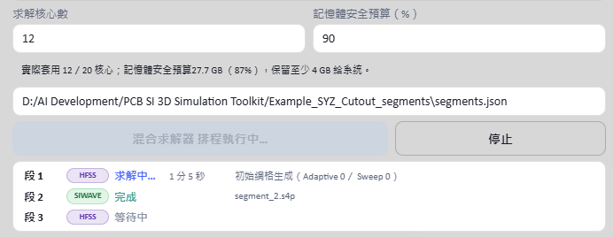
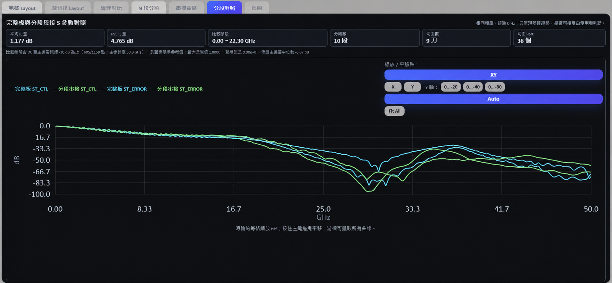
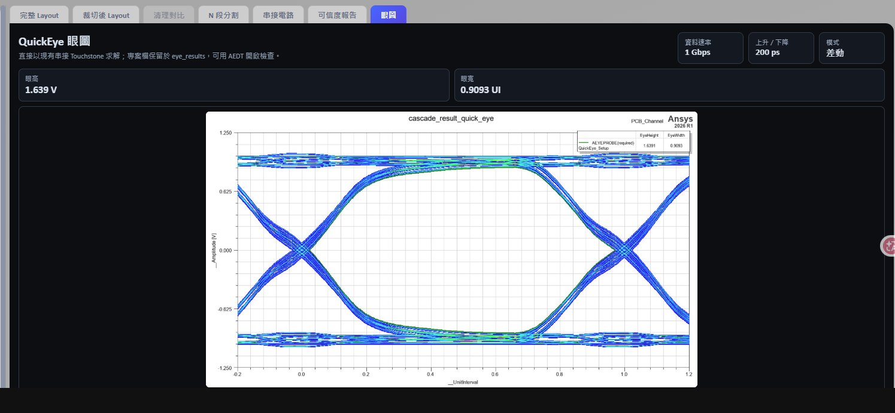

# PCB SI 3D Simulation Toolkit

[繁體中文](README.zh-TW.md) ｜ English

> This repository is the public showcase of a personal technical portfolio. It is not an official account of Taiwan Auto-Design Co. (TADC) and is not officially affiliated with Ansys, Inc. Ansys is a trademark of Ansys, Inc.

## 1. Positioning

**Jeff Hong**
CAE, Senior Technical Engineer
Taiwan Auto-Design Co. (TADC)

Contact: [jeff.hong@cadmen.com](mailto:jeff.hong@cadmen.com)　Company: [https://www.cadmen.com/](https://www.cadmen.com/)

Focus: High-Frequency Electromagnetic Simulation & Engineering Automation

Core technologies: Ansys HFSS 3D Layout, PyEDB, PyAEDT, PCB Signal Integrity, S-parameter Analysis, Eye Diagram Analysis, Engineering GUI Automation.

> Reduce repetitive PCB signal-integrity preparation work and make high-frequency simulation workflows more visible, repeatable, and easier to operate.

## 2. Hero View

The toolkit uses Ansys HFSS 3D Layout and SIwave, with PyEDB operating on the EDB, to unify PCB/package channel import, net selection, cutout, port creation, risk-aware segmentation, per-segment solving, and S-parameter cascading in one interface.

## 3. Engineering Problem

High-frequency PCB signal-integrity analysis usually requires engineers to repeat the same manual preparation: selecting the signal channel from a full board, building a cutout region around the selected nets, placing ports by hand at component ends, splitting long channels into segments when a single mesh would be too large to solve in reasonable time, and manually cascading the resulting S-parameters back into a full-channel response. These steps are slow and error-prone, especially for long channels. This toolkit automates that preparation and post-processing pipeline, then presents the cascaded result beside a full-board SIwave baseline so the segmentation strategy can be judged directly from the S-parameter differences.

## 4. Feature Showcase

| Feature | Description | Status |
|---|---|---|
| Cutout & port creation | Auto region selection (ConvexHull / Bounding) by signal net, with Coax/Circuit port creation at component ends | ✅ Done |
| Layout cleanup | Removes copper, traces, and vias outside the channel's EM-relevant region, with preview before commit | ✅ Done |
| N-segment splitting | Searches cut planes along the channel's main axis and outputs N independent segment EDBs with stitching info | ✅ Done |
| Cut-safety visualization | Color-codes hard obstacles, risky traces, candidate cuts, and per-segment solver regions | ✅ Done |
| Mixed HFSS / SIwave solving | Recommends a solver from each segment's 3D EM complexity while allowing manual override | ✅ Done |
| Scheduled solving | Starts an isolated solver process for each segment and exports Touchstone | ✅ Done |
| Automatic S-parameter cascading | Cascades segments using the stitching info to reconstruct the full-channel S-parameters | ✅ Done |
| Full-board / segmented comparison | In all-SIwave mode, compares S-parameters, mean IL delta, and P95 IL delta | ✅ Done |
| QuickEye diagram | Solves eye height/width directly from the cascaded Touchstone | ✅ Done |
| External Touchstone cascading | Loads existing `.sNp` files with auto-suggested or manual port stitching | ✅ Done |

### Segmentation Color Language

The segmentation view overlays the engineering decision directly on the complete layout. Safety and solver-region overlays can be disabled independently whenever the underlying routing needs to remain unobstructed.

| Color / line style | Meaning |
|---|---|
| Glowing orange trace | Angled routing or corner-risk corridor that a cut should avoid. |
| Translucent red area / faint red dashed line | Hard keep-out obstacle or rejected cut candidate. |
| Solid cyan line | Selected cut plane that passed the checks. |
| Gray dashed line | Ideal equal-division location before obstacle checks. |
| Green region / label | Segment assigned to SIwave. |
| Purple region / label | Segment assigned to HFSS 3D Layout. |

## 5. Workflow

Import → Select Nets → Cutout → Port → Segment → Solve → Analyze

## 6. Technical Architecture

- Frontend: React, TypeScript, Vite — 2D PCB layout viewer with zoom/pan, layer toggles, and port markers
- Backend: FastAPI + WebSocket for live system logs
- Geometry/data layer: PyEDB (EDB read/write, cutout, ports, cleanup, segmentation)
- Solve layer: PyAEDT driving Ansys HFSS 3D Layout / SIwave for meshing and EM solving
- Post-processing: scikit-rf for Touchstone I/O, cascading, and S-parameter math

## 7. Windows Usage

This public repository contains only the frontend source and the prebuilt `web_app/frontend/dist`, so you can inspect the interface and the workflow screenshots directly. The **full runnable version** (FastAPI backend, PyEDB/PyAEDT integration, and a one-click `start.bat` launcher) is maintained in a private repository, made available through TADC technical engagements. The public repo exists to demonstrate the workflow and results, not to provide a standalone solve environment.

## 8. Ansys License & Environment Requirements

Running the full version requires 64-bit Windows 10/11, Ansys Electronics Desktop (currently pinned to 2026.1), valid AEDT/HFSS 3D Layout/SIwave licenses, and a tested 64-bit Python 3.10 or 3.12 runtime. Scheduled solving cannot start without a valid license.

## 9. Public Showcase Scope

- Only the frontend UI and generated workflow/result screenshots are included; backend source and the solve environment are not.
- Screenshots use demo/anonymized data; local and solver-output absolute paths have been removed.
- Net names (e.g. `ST_CTL` / `ST_ERROR`) and component references are demonstration naming, not identifying information from a specific customer project.
- The scope of the full source and feature set follows the private repository's collaboration terms.

## 10. Collaboration

Formal technical collaboration and services are conducted through Taiwan Auto-Design Co. (TADC) using company-provided Ansys resources and licenses. For the full toolkit, technical collaboration, or a customized deployment, contact jeff.hong@cadmen.com or visit https://www.cadmen.com/.

## 11. Copyright & Trademark Notice

This repository is Jeff Hong's personal technical portfolio and showcase content. It is not an official account of Taiwan Auto-Design Co. (TADC), nor an official Ansys, Inc. collaboration showcase. Ansys, HFSS, and SIwave are trademarks of Ansys, Inc. Unless otherwise noted, content here is for technical demonstration only and does not constitute a direct commercial license.
