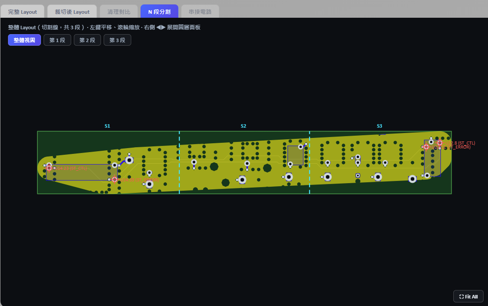
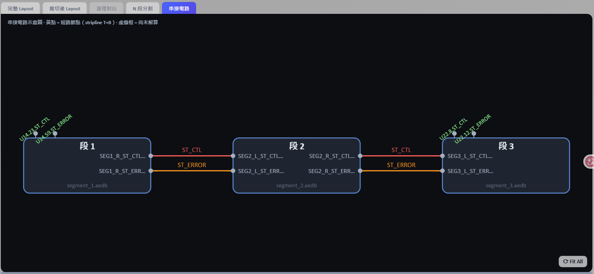
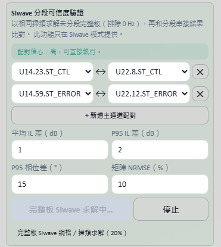

# PCB SI 3D Simulation Toolkit

## High-Frequency PCB Simulation Workflow Automation

PCB SI 3D Simulation Toolkit is a visual engineering showcase for PCB layout inspection, 3D visualization, signal-net selection, port preparation, and S-parameter analysis workflows.

> This public repository is a demonstration edition. Private solver integration and company-specific implementation details are intentionally excluded.

## Why this project exists

PCB signal-integrity analysis often involves repetitive layout inspection, net selection, geometry preparation, port definition, simulation setup, and result interpretation. This project explores how those steps can be organized into a more visible and repeatable engineering workflow.

## Highlights

- 2D PCB layout and layer visualization
- 3D board preview
- Signal and reference-net selection
- Port marker visualization
- S-parameter analysis interface
- Engineering-oriented dark UI

## Workflow preview

### Segmenting a high-speed channel

### Automated cascade connection

### SIwave fidelity verification

## Technology

- React / TypeScript / Vite
- FastAPI showcase integration
- Ansys HFSS 3D Layout concepts
- PyAEDT / EDB workflow concepts

## Public demonstration scope

The public edition focuses on the front-end experience, workflow visualization, and documentation. Company-specific back-end implementations, private solver orchestration, customer data, internal file paths, and licensed Ansys execution environments are not included.

## Getting started

See [操作說明.md](操作說明.md) for the current demonstration workflow and supported capabilities.

## Collaboration and services

For custom PCB signal-integrity or HFSS/SIwave automation projects, contact Jeff Hong through [Taiwan Auto-Design Co. (TADC)](https://www.cadmen.com/) at [jeff.hong@cadmen.com](mailto:jeff.hong@cadmen.com).

## Ownership and trademarks

Source code and visual assets are provided for demonstration purposes only. Commercial use, redistribution, and derivative works require permission.

Ansys is a trademark of Ansys, Inc. This project is an independent technical portfolio and is not officially affiliated with Ansys, Inc.
