# PCB SI 3D Simulation Toolkit

[English](README.en.md) ｜ 繁體中文

> 個人技術作品集之公開展示版本，非 Ansys 或虎門科技（TADC）官方帳號。Ansys 為 Ansys, Inc. 之商標。

**Jeff Hong 洪敬傑**｜CAE 技術部資深技術工程師｜Taiwan Auto-Design Co. (TADC)
[jeff.hong@cadmen.com](mailto:jeff.hong@cadmen.com)　[cadmen.com](https://www.cadmen.com/)

把 PCB／封裝通道的匯入、裁切、Port 建立、分段求解與 S 參數串接整合成單一流程。求解環境為 Ansys HFSS 3D Layout 與 SIwave，以 PyEDB／PyAEDT 驅動。

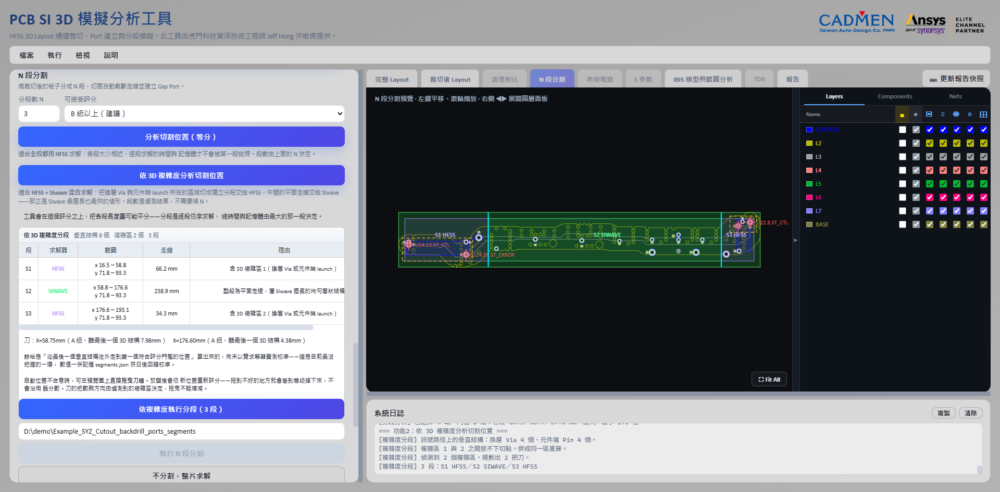

## 功能與對應的驗證

加速手法都會**改動求解對象本身**，所以每一項都得先回答：這樣做出來的結果，跟整片解一次差多少？

| 功能 | 為什麼需要驗證 | 實驗與結果 |
|---|---|---|
| **通道裁切** | 只取通道會不會改變結果？ | **0.03 dB 內**；但縫合 Via 被切掉會變 1.644 dB（**42 倍**）。[報告](./validation/cutout/通道裁切等效性驗證報告.md) |
| **Layout 清理** | 移除其他網路銅箔有影響嗎？ | 四種保護距離皆 **0.021 dB 內且無趨勢**。[報告](./validation/cleanup/Layout清理等效性驗證報告.md) |
| **N 段分割**＋串接 | 切開再拼回去會失真嗎？ | 縫合足夠 **0.1 dB 內**；缺縫合則 **14.4 dB** 假諧振。[報告](./validation/segmentation/分段切板方法驗證報告.md) |
| **切面品質判定** | 門檻原本憑工程判斷訂定 | 舊規則會放行**誤差 21.9 dB** 的切面 → 改用「間距→可信頻率上限」。[報告](./validation/stitch_density/切面縫合密度驗證報告.md) |
| **混合求解指派** | 哪些結構 SIwave 算得準？ | 直線與轉彎**全頻可信且快 120×**；**開路殘段只到 7.1 GHz**。[報告](./validation/solver_map/SIwave適用性地圖.md) |
| **求解設定預設值** | 預設自適應在掃頻上限可信嗎？ | 舊預設**少算 3.2 dB**，已改為涵蓋整個掃頻。[報告](./validation/solver_mix/自適應範圍驗證報告.md) |
| **TDR 阻抗定位** | 時間換算距離準不準？ | 平均誤差 **0.66 mm**、最大 **1.71 mm**。[報告](./validation/tdr/TDR_群延遲定位驗證報告.md) |
| **截面阻抗（Q2D）** | 理想截面與實際幾何差多少？ | 從 EDB 還原該處**實際存在**的截面；沿同一條線取六個位置與 SIwave→TDR 對照，中位數 48.617 Ω 對 48.625 Ω，**中位差 −0.015%**。[報告](./validation/cross_section/Q2D截面與TDR對照驗證報告.md) |
| **IBIS／AMI 眼圖** | — | 受管模型與 SHA-256 信任；QuickEye／Transient、AMI Statistical／GetWave；S4P 可設為差動或兩條保留串擾的單端 Lane |
| **多埠通道串擾** | 隨機碼型要跑多久才碰得到最差對齊？ | 決定性最差碼型 **128 UI／3.1 s**，對照隨機碼型 20,000 UI／116.6 s；前者每條道**必然**發生一次，後者只是期望 1.22 次 |
| **匯流排方向** | 方向接反的眼圖看起來完全正常 | 由 IBIS `Model_type` 逐道推導；兩側都能驅動時要求使用者指定，不給預設值 |
| **疊構更換** | 換疊構會不會靜默刪層？ | 先比對差異並標示將被刪除的層，確認後才另存；`load()` 丟掉的 EtchFactor 會自行補回 |
| **背鑽** | 殘樁長度算得對不對？ | 以連通性判斷訊號實際進出層；兩條獨立訊號各自從實測陷波反推的疊構平均 Dk 只差 **1.0%** |
| 其他 | — | 切面安全視覺化、排程求解、外部 Touchstone 串接、整片求解對照、遠端求解包、通道模型預檢、一鍵 HTML 報告 |

多項獨立驗證指向**同一個根因**：決定準確度的是切面／裁切邊界處**參考平面的接地縫合**，而非擴張距離或切面角度。此條件已寫成工具的自動檢查。

驗證也用來**找出自己的問題**——上表後三列就是這樣改出來的。負控制組、失敗的試片版本與推翻自己先前結論的過程全部公開；尚未驗證與尚未校正的項目也在報告中標明。

[四項研究總覽](./validation/分段與求解器研究總覽.md)｜[English](./validation/solver_and_segmentation_studies.md)

## 工作流程

Import → Select Nets → Cutout → Port → Segment → Solve → Analyze

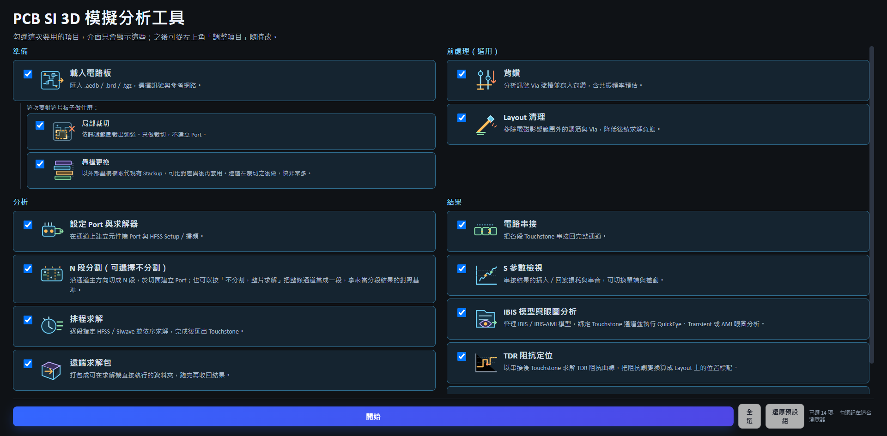

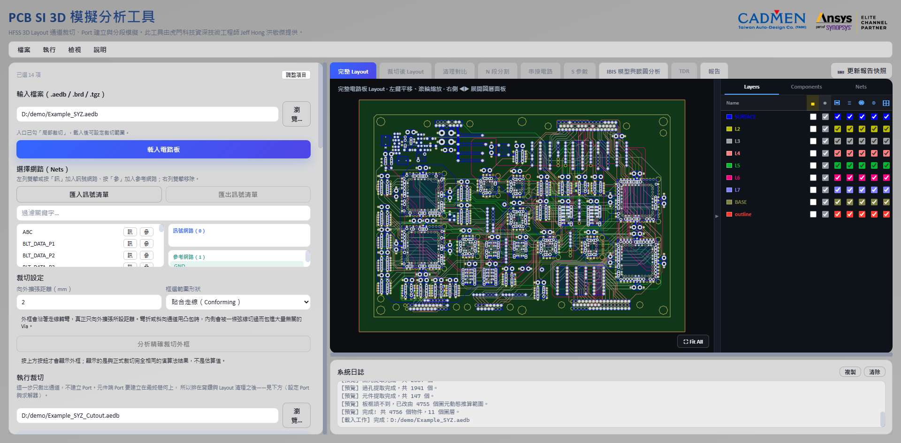

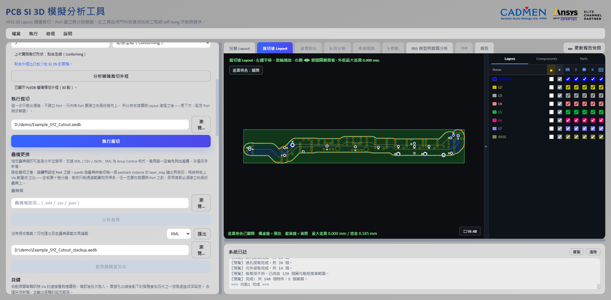

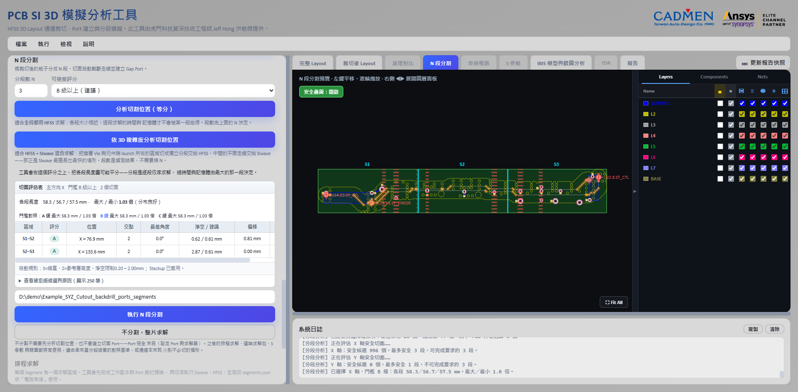

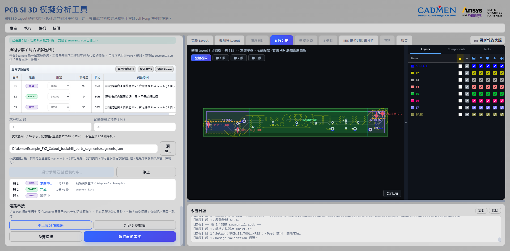

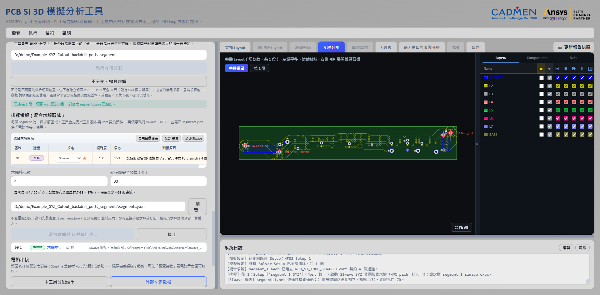

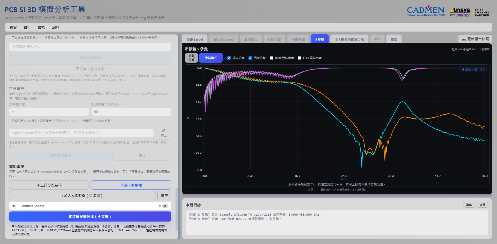

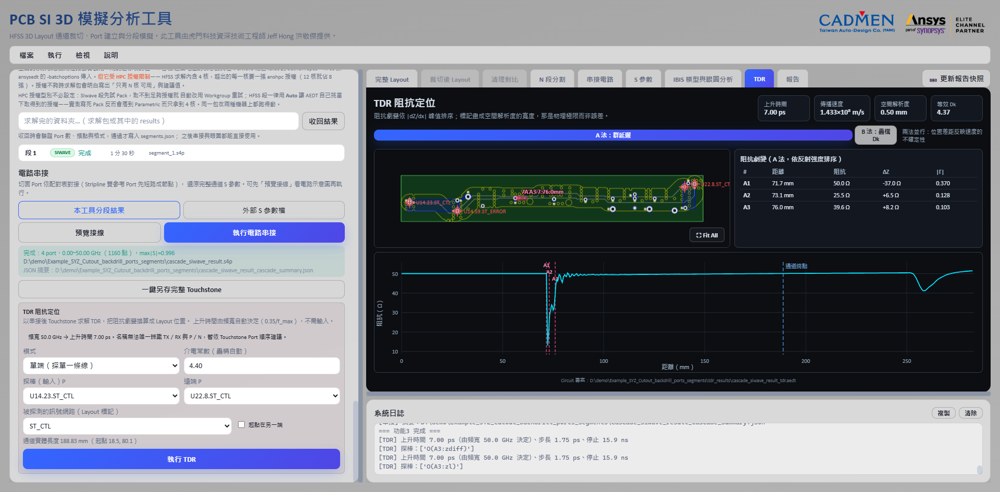

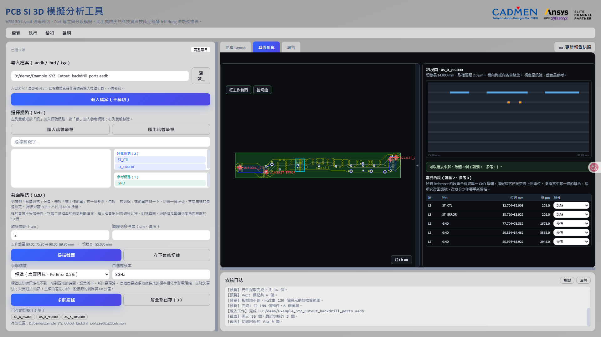

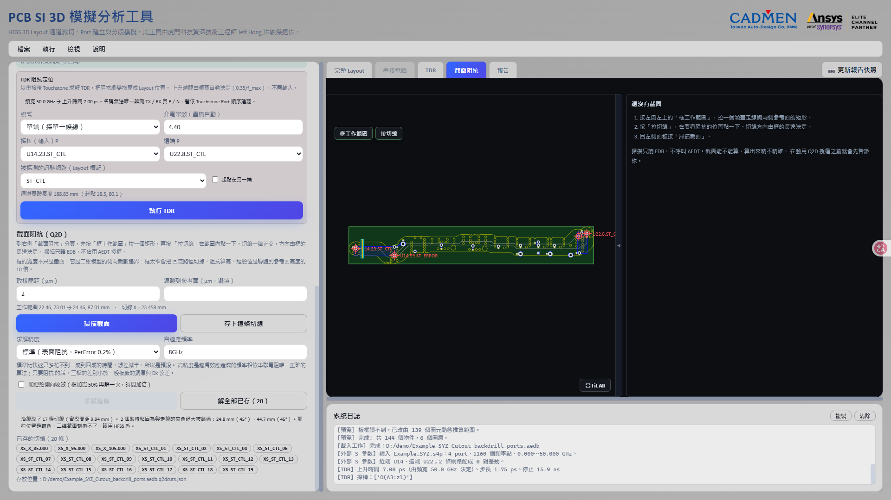

側向範圍夠不夠可以按一個鍵驗證：同一條切線用加寬 50% 的框再解一次，比較阻抗變化。TDR 標出劇變之後，劇變表逐列可直接「取此處截面」，或沿整條走線按間距鋪一排切線做出 Z₀(x) 剖面——與走線夾角過大的位置會被擋下並說明理由，不會給出一條虛胖的截面。

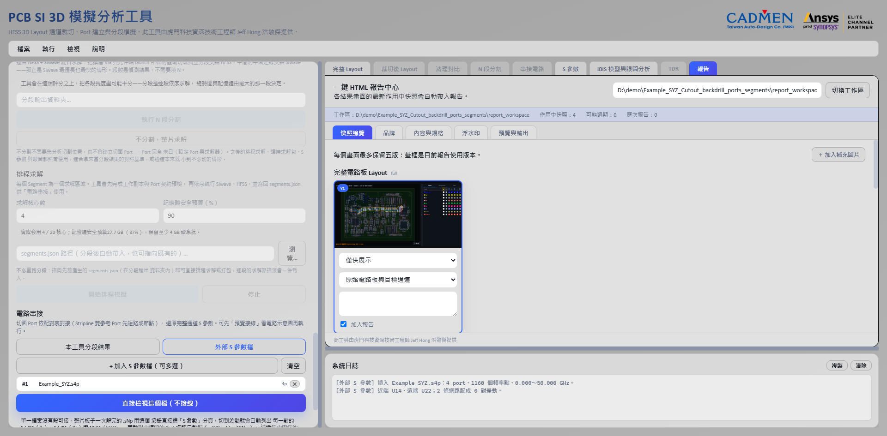

分段畫面把安全判斷疊在 Layout 上：橘色為風險走線、紅色為硬性禁切、青色為採用的切面、綠色與紫色分別是 SIwave 與 HFSS 區段。

逐步操作請見 [操作說明](./操作說明.md)（十一章，含裁切、Port、分段、排程、IBIS 眼圖、TDR、截面阻抗與疑難排解）。

## 技術架構

React／TypeScript／Vite 前端、FastAPI＋WebSocket 後端、PyEDB 幾何層、PyAEDT 驅動 HFSS 3D Layout／SIwave、scikit-rf 後處理。

## 環境需求與公開版限制

完整版需 64 位元 Windows 10／11、Ansys Electronics Desktop 2026.1、可用 License 與 Python 3.10／3.12。

本 Repository 僅含前端原始碼與已建置的 `dist`，**不包含後端原始碼與求解環境**。圖片為 Demo／匿名化資料，淨名與元件編號為示範用命名。

## 技術合作與聲明

正式技術合作透過 Taiwan Auto-Design Co.（TADC）進行：[jeff.hong@cadmen.com](mailto:jeff.hong@cadmen.com)｜[cadmen.com](https://www.cadmen.com/)

本 Repository 為 Jeff Hong 個人技術作品集之展示內容，非 TADC 官方帳號，亦非 Ansys, Inc. 官方合作展示。Ansys、HFSS、SIwave 為 Ansys, Inc. 之商標。
