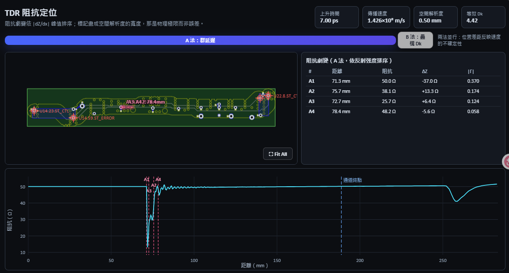
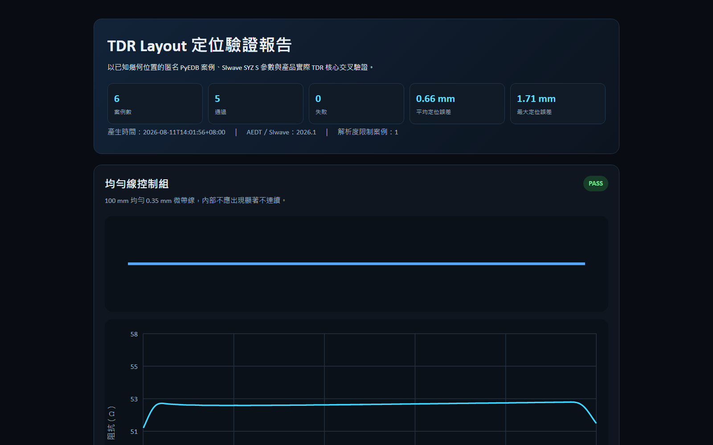
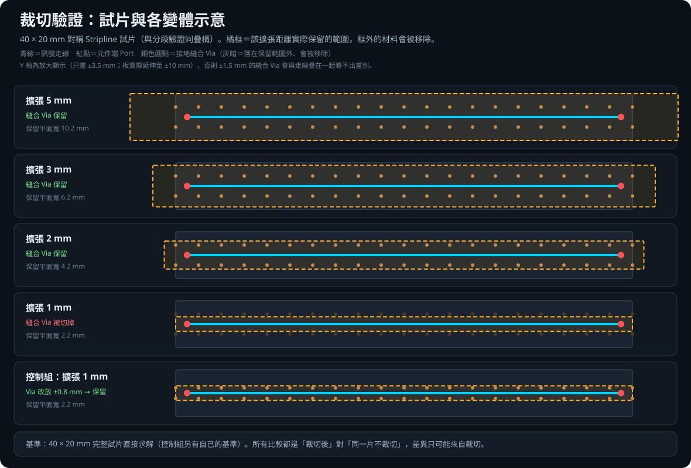
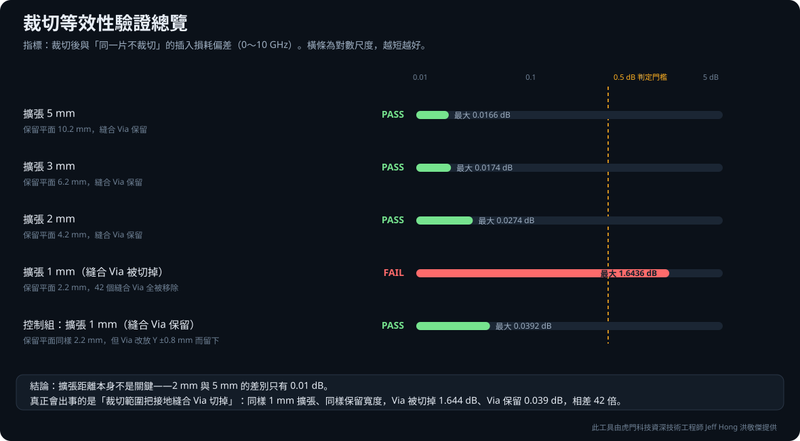

# PCB SI 3D Simulation Toolkit

[English](README.en.md) ｜ 繁體中文

> 此 Repository 為個人技術作品集之公開展示版本，非 Ansys 或虎門科技（TADC）官方帳號。Ansys 為 Ansys, Inc. 之商標。

## 1. 專案定位

**Jeff Hong 洪敬傑**
CAE, Senior Technical Engineer｜CAE 技術部資深技術工程師
Taiwan Auto-Design Co. (TADC)｜虎門科技股份有限公司

聯絡信箱：[jeff.hong@cadmen.com](mailto:jeff.hong@cadmen.com)　官方網站：[https://www.cadmen.com/](https://www.cadmen.com/)

核心定位：High-Frequency Electromagnetic Simulation & Engineering Automation｜高頻電磁模擬與工程自動化

主要技術：Ansys HFSS 3D Layout、PyEDB、PyAEDT、PCB Signal Integrity、S-parameter Analysis、Eye Diagram Analysis、Engineering GUI Automation。

> 減少 PCB 訊號完整性分析中的重複準備工作，讓高頻模擬流程更直觀、更可重複，也更容易操作。

## 2. 主視覺圖

工具以 Ansys HFSS 3D Layout 與 SIwave 為求解環境，透過 PyEDB 操作 EDB，將 PCB／封裝通道的匯入、訊號選取、裁切、Port 建立、風險感知分段、逐段求解與 S 參數串接整合在單一操作介面中。

## 3. 解決的工程問題

高頻 PCB 訊號完整性分析中，工程師經常需要手動重複執行：從完整板中框選訊號通道、依 Net 建立裁切範圍、於元件端手動放置 Port、視需要拆解成多段分別求解、再手動串接還原完整通道 S 參數。這些步驟耗時且容易出錯，尤其在通道過長導致單次網格規模過大、無法在合理時間內求解時更為明顯。本工具將這一整套準備與後處理流程自動化，並將分段串接結果與完整板 SIwave 基準並列比較，讓使用者直接依 S 參數差異判讀分段策略。

### 加速手法必須先證明不犧牲精度

本工具的加速做法——只取通道、把長通道分段求解、逐段挑成本較低的求解器——**都會改動求解對象本身**。因此每一項都必須先回答同一個問題：這樣做出來的結果，跟老老實實整片解一次差多少？

已完成量化驗證的四項，原始數據與失敗案例全部公開：

| 驗證項目 | 對照基準 | 結果 |
|---|---|---|
| [通道裁切](./validation/cutout/通道裁切等效性驗證報告.md) | 同一片試片不裁切、直接求解 | 插入損耗偏差 **0.03 dB 以內**（擴張 2～5 mm） |
| [Layout 清理](./validation/cleanup/Layout清理等效性驗證報告.md) | 同一片試片不清理、干擾物全部保留 | 插入損耗偏差 **0.021 dB 以內**（四種保護距離） |
| [分段切割 + 電路串接](./validation/segmentation/分段切板方法驗證報告.md) | 同一片試片不切割、單體全波求解 | 插入損耗偏差 **0.1 dB 以內（0～10 GHz）**，全頻無一點超過 0.5 dB |
| [TDR 群延遲定位](./validation/tdr/TDR_群延遲定位驗證報告.md) | 建模時已知的幾何邊界位置 | 平均定位誤差 **0.66 mm**、最大 **1.71 mm** |

分段切割是本工具最主要的加速手段，也是**最可能傷害精度**的一個——它把一條完整通道切開再拼回去。驗證以自建的 38 mm、50 Ω 對稱 Stripline 試片，對照同一片不切割的單體全波求解，證明在正確條件下兩者幾乎重合。

三份驗證都刻意包含**負控制組**，呈現方法失效時的樣子。更值得注意的是，裁切與分段兩項驗證**各自獨立地指向同一個根因**：決定準確度的是切面／裁切邊界處**參考平面的接地縫合狀況**，而不是擴張距離或切面角度。缺少縫合時，分段產生 **14 dB** 的假諧振、裁切產生 **1.6 dB** 的偏差；這個條件已成為工具的自動檢查並擋在使用者前面。

裁切驗證另含一組把「保留平面變窄」與「縫合 Via 被切掉」拆開的控制實驗——同樣擴張、同樣保留寬度，Via 被切掉 1.644 dB、Via 保留 0.039 dB，相差 42 倍。

驗證的價值不在背書，而在找出方法的邊界，再把邊界寫回工具裡。

三項會改動求解對象的加速手法——裁切、清理、分段——現在都有量化數據，且結論一致：**唯一需要小心的是切面／裁切邊界處的接地縫合狀況**，其餘都在 0.03 dB 以內。仍未單獨驗證的是「逐段挑求解器」，那是求解器等價性問題、性質與前三項不同，列為後續工作。

## 4. 功能展示

| 功能 | 說明 | 狀態 |
|---|---|---|
| 通道裁切與 Port 建立 | 依訊號 Net 自動框選（ConvexHull／Bounding）並於元件端建立 Coax／Circuit Port | ✅ 已完成 |
| Layout 清理 | 移除通道電磁影響範圍外的銅箔、走線與 Via，求解前先預覽再確認 | ✅ 已完成 |
| N 段分割 | 沿通道主軸搜尋切面，輸出 N 個獨立分段 EDB 及對接資訊 | ✅ 已完成 |
| 切面安全視覺化 | 以顏色區分禁切障礙、風險走線、候選切面與每段求解器區域 | ✅ 已完成 |
| HFSS／SIwave 混合求解 | 依每段 3D 電磁複雜度提出建議，並允許使用者逐段覆寫 | ✅ 已完成 |
| 排程模擬 | 逐段啟動獨立求解程序並匯出 Touchstone | ✅ 已完成 |
| S 參數自動串接 | 依分段對接資訊自動串接，還原完整通道 S 參數 | ✅ 已完成 |
| QuickEye 眼圖 | 以串接後 Touchstone 直接背景求解眼高、眼寬 | ✅ 已完成 |
| TDR 阻抗定位 | 求解 TDR 阻抗曲線，把劇變位置換算成 Layout 走線上的標記 | ✅ 已完成 |
| 外部 Touchstone 串接 | 載入既有 `.sNp` 檔案，自動建議或手動指定接線 | ✅ 已完成 |
| 不分割整片求解 | 通道不切割、整片當成一段求解，可作為分段結果的對照基準 | ✅ 已完成 |
| 遠端求解包 | 打包成資料夾送到求解機執行，求解機不需安裝 Python | ✅ 已完成 |
| 一鍵 HTML 報告 | 保存各結果畫面的快照，加入品牌、圖說與驗收規格後產生單一自包含 HTML | ✅ 已完成 |

### 切板顏色設計

分段畫面把「可以切、為何不該切、每段用哪個求解器」直接疊加在完整 Layout 上，並可個別關閉安全疊圖或求解區域色塊，避免遮住原始走線。

| 顏色／線型 | 意義 |
|---|---|
| 橘色發光走線 | 斜向走線或轉角風險帶，切面應盡量避開。 |
| 紅色半透明區／淡紅虛線 | 硬性禁切障礙與被拒絕的候選位置。 |
| 青色實線 | 工具最後採用且通過檢查的切面。 |
| 灰色虛線 | 尚未考慮障礙物時的理想等分位置。 |
| 綠色區域／標籤 | 指定使用 SIwave 的 Segment。 |
| 紫色區域／標籤 | 指定使用 HFSS 3D Layout 的 Segment。 |

## 5. 工作流程

Import → Select Nets → Cutout → Port → Segment → Solve → Analyze

### TDR 群延遲定位的量化驗證

工具以 S21 群延遲反推有效傳播速度，再把 TDR 往返時間換算成沿走線距離。六組匿名 SIwave 案例包含均勻線、加寬、縮窄、多重不連續、45° 彎折與解析度極限；5 組可解析案例全部通過，平均定位誤差 **0.66 mm**、最大誤差 **1.71 mm**。

[查看完整繁體中文驗證報告、HTML 圖表、JSON 與匿名 Touchstone](./validation/tdr/TDR_群延遲定位驗證報告.md)

### 分段切板方法的量化驗證

工具的核心方法是把長通道切成數段、各段獨立求解、再以電路串接還原。以自建的 38 mm、50 Ω 對稱 Stripline 試片對照同一片不切割的單體全波求解：切面處的參考平面**有接地縫合**時，串接可重現單體求解至 **0.1 dB 以內（0～10 GHz）**；**缺少縫合**時同一切點的偏差達 **14.4 dB**。驗證同時包含呈現方法失效樣貌的負控制組。

[查看完整繁體中文驗證報告、變體示意圖、JSON 與匿名 Touchstone](./validation/segmentation/分段切板方法驗證報告.md)

### 通道裁切等效性的量化驗證

從完整板只取出訊號通道求解，是本工具的第一項加速手法。以 40 × 20 mm Stripline 試片對照同一片不裁切的基準：**擴張距離本身幾乎不影響結果**（5 mm、3 mm、2 mm 的偏差分別為 0.017、0.017、0.027 dB）；真正會出事的是裁切範圍**把接地縫合 Via 切掉**——同樣擴張、同樣保留寬度，Via 被切掉 **1.644 dB**、Via 保留 **0.039 dB**，相差 **42 倍**。

[查看完整繁體中文驗證報告、變體示意圖、JSON 與匿名 Touchstone](./validation/cutout/通道裁切等效性驗證報告.md)

### Layout 清理等效性的量化驗證

清理是移除通道電磁影響範圍外的其他網路銅箔。以 40 × 20 mm Stripline 試片、通道兩側四對浮接干擾走線（距通道 ±0.5～±8.0 mm）對照未清理的基準：**四種保護距離的插入損耗偏差都在 0.021 dB 以內且無趨勢**——連距通道僅 0.5 mm 的干擾走線移除掉也一樣。清理功能保護訊號與參考網路，回流路徑從頭到尾沒被動過。

[查看完整繁體中文驗證報告、變體示意圖、JSON 與匿名 Touchstone](./validation/cleanup/Layout清理等效性驗證報告.md)

## 6. 技術架構

- 前端：React、TypeScript、Vite，提供 2D PCB Layout 檢視（縮放、平移、圖層與 Port 標記切換）
- 後端：FastAPI＋WebSocket（即時系統日誌）
- 幾何與資料層：PyEDB（EDB 讀寫、裁切、Port、清理、分段）
- 求解層：PyAEDT 驅動 Ansys HFSS 3D Layout／SIwave 進行網格與電磁求解
- 後處理：scikit-rf 進行 Touchstone 讀取、電路串接與 S 參數計算

## 7. Windows 使用方式

本 Repository（公開展示版）僅包含前端原始碼與已建置的 `web_app/frontend/dist`，可直接檢視介面與功能展示畫面。**完整可執行版本**（含 FastAPI 後端、PyEDB／PyAEDT 整合與 `start.bat` 一鍵啟動）目前收錄於私人 Repository，透過 TADC 技術合作提供；公開版之目的在於呈現工作流程與成果，而非提供可獨立運作的求解環境。

## 8. Ansys License 與環境需求

完整版本執行時需要：64 位元 Windows 10／11、Ansys Electronics Desktop（目前固定使用 2026.1）、可用的 AEDT／HFSS 3D Layout／SIwave License，以及已驗證的 64 位元 Python 3.10 或 3.12。沒有可用 License 時無法執行排程求解。

## 9. 公開展示版限制

- 僅提供前端 UI 與已產生的示意圖／結果截圖，不包含後端原始碼與求解環境。
- 圖片使用 Demo／匿名化資料，已移除本機與求解輸出檔案的絕對路徑。
- 淨名（如 `ST_CTL`／`ST_ERROR`）與元件編號為示範用命名，非特定客戶專案資訊。
- 完整功能與原始碼開放範圍以私人 Repository 之合作條款為準。

## 10. 技術合作方式

正式技術合作與服務透過 Taiwan Auto-Design Co.（TADC）進行，並使用公司提供的 Ansys 資源與 License。如需完整功能、技術合作或客製化導入，請透過 jeff.hong@cadmen.com 或 https://www.cadmen.com/ 聯絡。

## 11. 著作權與商標聲明

本 Repository 為 Jeff Hong 個人技術作品集之展示內容，非 Taiwan Auto-Design Co.（TADC）官方帳號，亦非 Ansys, Inc. 官方合作展示。Ansys、HFSS、SIwave 為 Ansys, Inc. 之商標。除另有標示外，本頁面內容僅供技術展示，不代表可直接商用授權。
