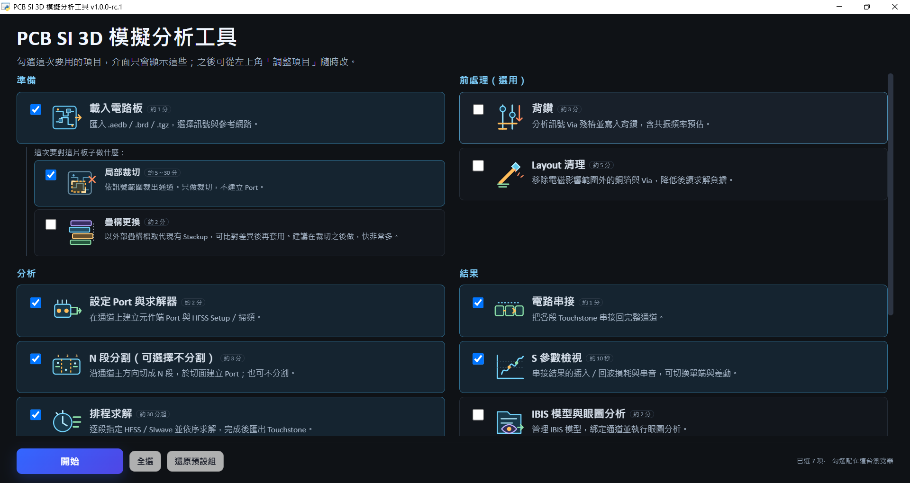

# PCB SI 3D 模擬分析工具

將 PCB 訊號通道裁切、分段求解，再串回完整通道；依需求做眼圖、TDR 與截面阻抗分析。

**公開 Repo 只提供前端、文件與展示資料，沒有後端、啟動器或 Ansys 授權。** Source ZIP 無法執行完整流程。完整工具與商用支援請洽 [TADC](https://www.cadmen.com/)／[jeff.hong@cadmen.com](mailto:jeff.hong@cadmen.com)。

## 功能與入口

| 你要做什麼 | 操作章節 |
|---|---|
| 選網路、裁切、疊構、背鑽、Layout 清理 | [02 載入與裁切](docs/manual/02-載入與裁切.md) |
| 建端點 Port、套用規格與掃頻 | [03 Port 與求解設定](docs/manual/03-Port與求解設定.md) |
| 選整片或分段、逐段指定 HFSS／SIwave | [04 分段與混合求解](docs/manual/04-分段與混合求解.md) |
| 排程、停止、重試匯出、Touchstone 串接 | [05 排程與串接](docs/manual/05-排程與串接.md) |
| 模型匯入、IBIS 多埠、AMI 與眼圖 | [06 IBIS 與眼圖](docs/manual/06-IBIS與眼圖.md) |
| 模擬／量測 TDR 回標 Layout | [07 TDR 定位](docs/manual/07-TDR定位.md) |
| 二維截面阻抗、側向收斂 | [08 截面阻抗](docs/manual/08-截面阻抗.md) |
| 更新快照、浮水印、單檔 HTML | [09 報告與輸出](docs/manual/09-報告與輸出.md) |
| 外部通道、遠端求解包、S 參數工具箱、COM | [10 其他工作模式](docs/manual/10-其他工作模式.md) |

## 完整工具前置需求

| 元件 | 用途／安裝方式 |
|---|---|
| Windows 10／11 x64 | 執行完整工具 |
| Ansys Electronics Desktop 2026 R1（2026.1）與相應授權 | EDB 與所選求解功能；須自行安裝與取得授權 |
| Python 3.12 x64 | 原生出貨包必要；原始碼包也接受 3.10；首次啟動依啟動器提示安裝，離線環境先安裝 |
| Microsoft Edge WebView2 Runtime | 預設工具視窗；缺少時退回瀏覽器 |
| 工具包鎖定的後端相依與 pywebview | `start.bat` 安裝至各自環境；不要自行升級套件 |
| IBIS／AMI 模型或量測資料（選用） | 眼圖與量測分析；需確認使用與再散布權限 |

一般使用者不需 Node.js。修改前端原始碼才需要 Node.js／npm，依工具包的 `package.json` 與鎖檔安裝。

## 第一份結果

取得完整工具包 → 執行 `web_app/start.bat` → 選任務 → 載入示範板 → 選訊號與參考 → 裁切與前處理 → 建 Port → 整片或分段 → 求解與檢查 Touchstone → 串接 → 更新報告快照。

逐步操作見 [00 第一次跑](docs/manual/00-第一次跑.md)。眼圖另走 [06 章](docs/manual/06-IBIS與眼圖.md)，不承諾固定完成時間。

## 使用邊界

| 項目 | 必須確認 |
|---|---|
| Port／結果 | 求解完成不等於 Touchstone 有效；檢查埠數、埠序、頻率與來源 |
| 停止 SIwave | 等目前段解完，該段結果不採用；停止中不能重開排程 |
| 模型 DLL | 會在本機執行；掃描、SHA-256 與信任紀錄不是安全保證。模型由使用者提供，受管副本仍受供應商授權約束 |
| 修復與推測 | 材料補建、Model Selector 補建等推測須讀警告，不能當作量測事實 |
| 報告／支援包 | 送出前檢查路徑、模型、日誌與識別資料；浮水印不是 DRM |
| 二維 Q2D | 不涵蓋 Via、轉角與參考層破口的完整三維效應 |

文件草稿適用 `1.0.0-rc.1`／功能基準 `a19eda7`。35 張主圖狀態已盤點，仍有 3 項缺圖；新增 SerDes 面板圖、5 張條件圖與工具包驗收尚未完成。[版本說明](CHANGELOG.md)｜[圖片帳冊](docs/visual-assets.md)｜[驗證資料](validation/README.md)｜[疑難排解](docs/manual/11-疑難排解.md)。歷史驗證只支持其記錄的版本、資料與條件。

商用授權與技術支援由虎門科技股份有限公司（Taiwan Auto-Design Co., Ltd.，TADC）提供。此為獨立公開展示，與 Ansys, Inc. 無隸屬或背書關係；相關商標屬原權利人，工具不含、不提供亦不繞過 Ansys 授權。
