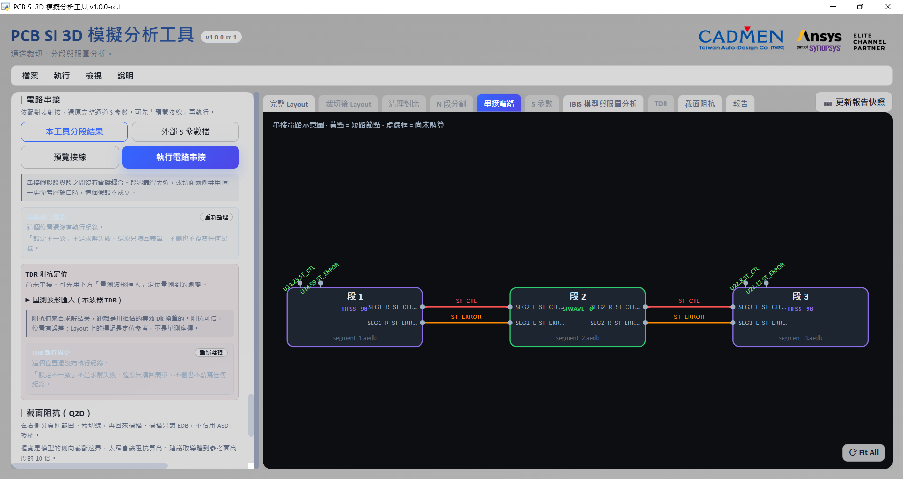
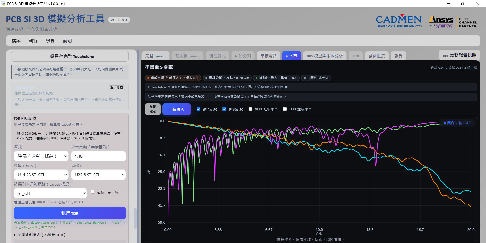

# 第一次跑：取得通道 S 參數

[回操作說明索引](../../操作說明.md)

先拿到完整工具包，再照下列流程取得通道 Touchstone 與報告。公開展示 repo 沒有後端，下載其 Source ZIP 無法完成本章。耗時依板子、求解器與授權而變，不保證固定時間。

## 開始之前

環境與自動安裝元件見 [01 前置需求](01-開始使用.md#需要先裝什麼)。準備可使用的示範板複本，工作目錄與所有 Ansys 輸出檔名使用 ASCII。完整工具包若附 `Example_SYZ.aedb`，可選訊號 `ST_CTL`、`ST_ERROR` 與參考 `GND`；這是單端通道練習，不當作 DDR 或 AMI 示範。

## 1　啟動

進完整工具包的 `web_app`，雙擊 `start.bat`。第一次需連網下載鎖定套件；等工具視窗與任務入口出現後，保留預設勾選並按「開始」。再用「調整項目」加選「一鍵 HTML 報告」。

## 2　載入板子

「輸入檔案」按「瀏覽…」選示範板複本，按「載入電路板」。等網路、元件清單與 Layout 預覽出現，核對載入的是本次要用的板子。

## 3　選訊號與參考

把目標 Net 加入訊號清單，把 `GND` 加入參考清單。**確認兩種清單都有正確網路**，即使工具自動選了參考也要檢查。

## 4　裁切

在「裁切設定」先分析精確外框，確認訊號、端點與必要參考平面都在範圍內。指定新的 `.aedb` 輸出路徑，按「執行裁切」。完成後看「裁切後 Layout」，確認實際裁出的板子；裁切尚未建立 Port。

## 5　建 Port 與求解設定

Port 類型保留「自動（建議）」，按「建議端點（最多 2 個）」後核對兩端元件。掃頻上限用 `20GHz`：0／1 Hz、1 Hz～100 MHz 每 decade 20 點、100 MHz～20 GHz 每 50 MHz。HFSS 網格保留 `Phi`。按「建立 Port 並套用求解器設定」，確認 Port 數與參考正確。

## 6　求解

在「N 段分割」按「不分割，整片求解」，把通道登記為一段。確認求解器與可用授權，核心數保留 12，按「開始排程模擬」。各段要顯示「完成」並有有效 `.sNp`；「待匯出」還不是完成。停止與重試方式見 [05 排程](05-排程與串接.md)。

## 7　串接與看結果

按「預覽接線」，核對外部 Port，再按「執行電路串接」。單段模式直接沿用該段結果。到「S 參數」看單端曲線，核對埠數、頻率上限與來源，再用「一鍵另存完整 Touchstone」存檔。

## 8　保存報告與後續分析

在要納入的結果頁按「更新報告快照」，到報告中心確認快照未過期，完成預覽再產生 HTML。方法見 [09 報告與輸出](09-報告與輸出.md)。眼圖另需合法 IBIS／AMI 模型與正確綁定，接 [06 IBIS 與眼圖](06-IBIS與眼圖.md)。

## 完成判據

保留本次幾何、`segments.json`、有效完整通道 `.sNp` 與已檢查的報告。只有曲線畫出來，還不能證明幾何、Port 與設定正確。關閉方式見 [01](01-開始使用.md#操作步驟)；卡住時見 [11](11-疑難排解.md)。

[開始使用](01-開始使用.md) →
