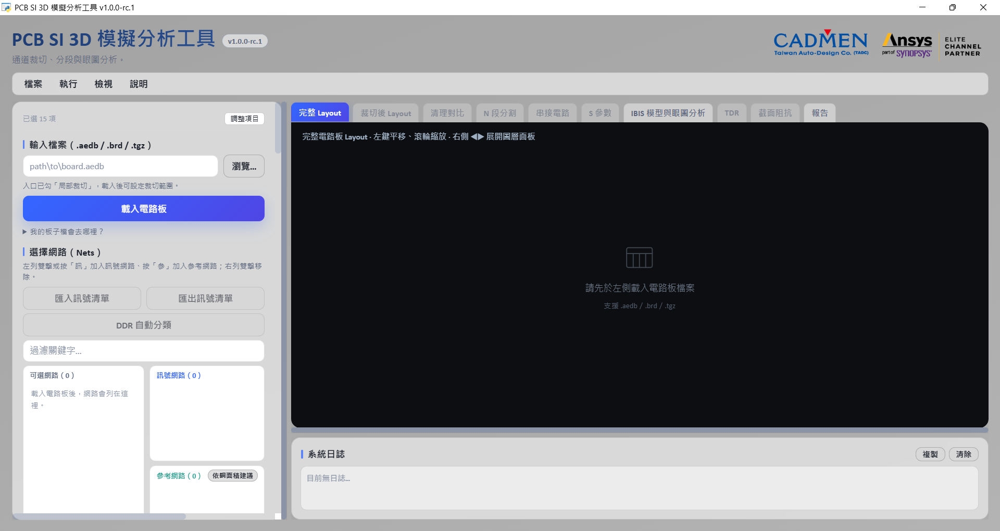
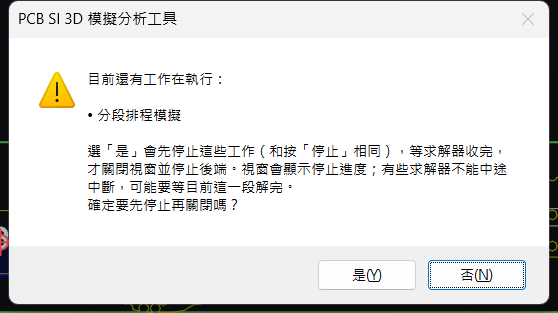
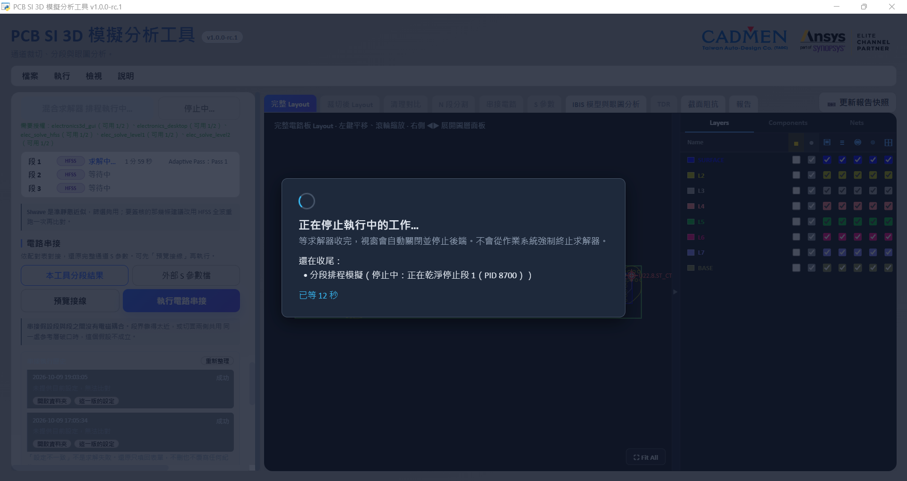
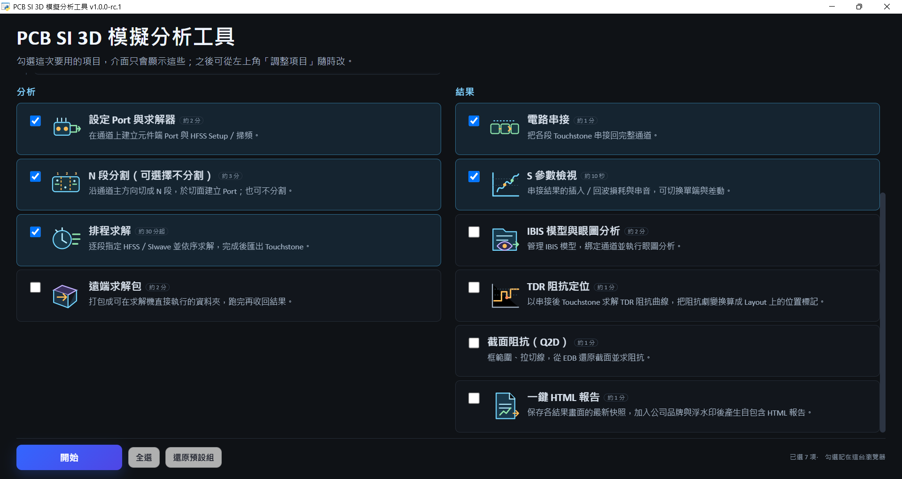

# 開始使用

[回操作說明索引](../../操作說明.md)

完整工具包才可載入電路板與求解。公開 repo 是展示與文件入口，沒有完整後端；第一次操作走 [00 第一次跑](00-第一次跑.md)。

## 需要先裝什麼

| 元件 | 用途與需求 |
|---|---|
| Windows 10／11 x64 | 執行完整工具 |
| Ansys Electronics Desktop 2026 R1（2026.1） | 現行支援版本；EDB 與求解機版本也要相符 |
| Ansys 授權 | HFSS 3D Layout、SIwave、Circuit／Q2D 等，依功能確認 |
| Python x64 | 原生出貨包限 3.12；原始碼包接受 3.10／3.12。離線啟動前先安裝 |
| Microsoft Edge WebView2 Runtime | 預設工具視窗使用；缺少時啟動器退回瀏覽器 |
| fastapi、pyedb、pyaedt、scikit-rf 等後端套件 | 首次啟動按包內鎖檔自動安裝到後端專用環境 |
| pywebview 與桌面相依 | 首次啟動安裝到獨立桌面環境，供工具視窗使用 |
| 瀏覽器 | 瀏覽器模式或視窗回退時使用 |

一般操作不需 Node.js；修改前端才需要開發環境。首次下載需網路，不要自行用未鎖定版本替換相依。

## 啟動與關閉

1. 在完整工具包的 `web_app` 雙擊 `start.bat`，等工具視窗開啟。
2. 任務入口保留本次需要的功能，按「開始」。預設組已足夠走到通道 S 參數。
3. 想用瀏覽器時執行 `start.bat -Browser`。依啟動器顯示的本機網址進入；埠號不一定固定為 8020。
4. 工具視窗按關閉會收尾後端。有工作執行時先確認停止，再等待收尾畫面結束。
5. 瀏覽器模式只關分頁不會停止服務；先停止工作並等排程結束，再在啟動器終端按 `Ctrl+C`。

**「停止中…」不是停止完成，也不代表授權立刻歸還。** SIwave 的當前段可能需要解完才收尾；不要強制砍 AEDT 或求解程序。詳見 [05 停止](05-排程與串接.md#執行中與異常處理)。

## 任務入口

| 預設開啟 | 選用功能 |
|---|---|
| 載入電路板、局部裁切 | 疊構更換、背鑽、Layout 清理 |
| 設定 Port 與求解器、N 段分割（可選擇不分割）、排程求解 | 遠端求解包 |
| 電路串接、S 參數檢視 | IBIS 模型與眼圖分析、TDR 阻抗定位、截面阻抗（Q2D）、一鍵 HTML 報告 |

「調整項目」可重新勾選。勾選控制面板顯示，**不代表前置工作已完成**；前置提示也不取代工程核對。順序是載入 → 裁切 → 選用幾何前處理 → Port → 整片／分段 → 求解 → 串接。

下方的截面阻抗與報告需在任務清單向下捲動。

## 選單與工作狀態

「說明」提供授權對照與可用數量、支援包、日誌資料夾；工具視窗也可「在瀏覽器開啟」。灰色按鈕先看前置條件與授權提示，錯誤先看日誌，不要一直重按。

啟動器會留下啟動記錄；求解面板另列各段狀態與經過時間。需要協助時產生支援包，先檢查內容再交指定支援人員；不要直接上傳公開 issue。見 [11 疑難排解](11-疑難排解.md)。

## 名詞

| 名詞 | 這裡指什麼 |
|---|---|
| EDB／`.aedb` | 電路板資料庫；它是資料夾，選取時不要只找單一檔案 |
| Port | 訊號進出模型的端點，必須有參考回流 |
| Touchstone／`.sNp` | N 個 Port 的 S 參數；檔名的埠數應與檔內資料一致 |

各功能操作依 [索引](../../操作說明.md) 查章節，不另複製流程。

← [第一次跑](00-第一次跑.md)　[載入與裁切](02-載入與裁切.md) →
