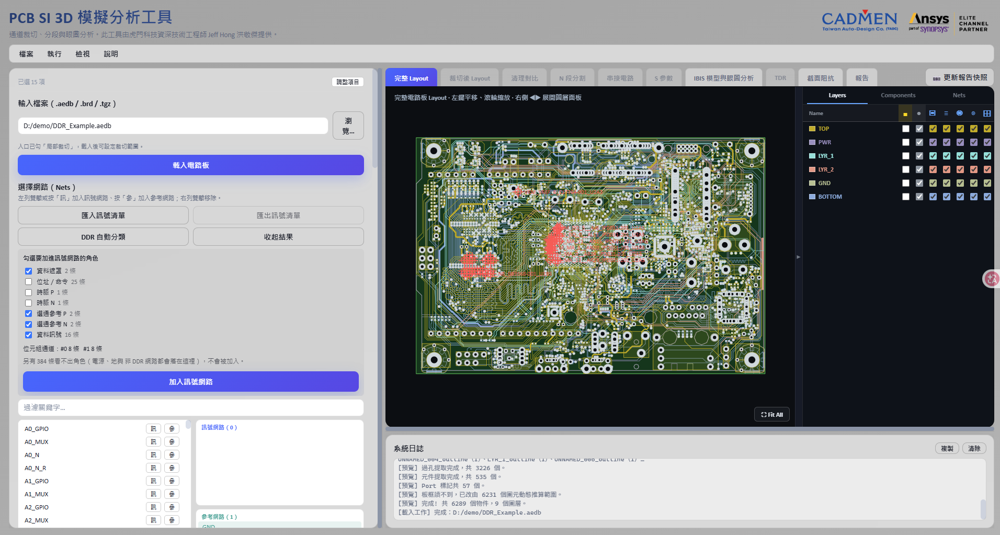
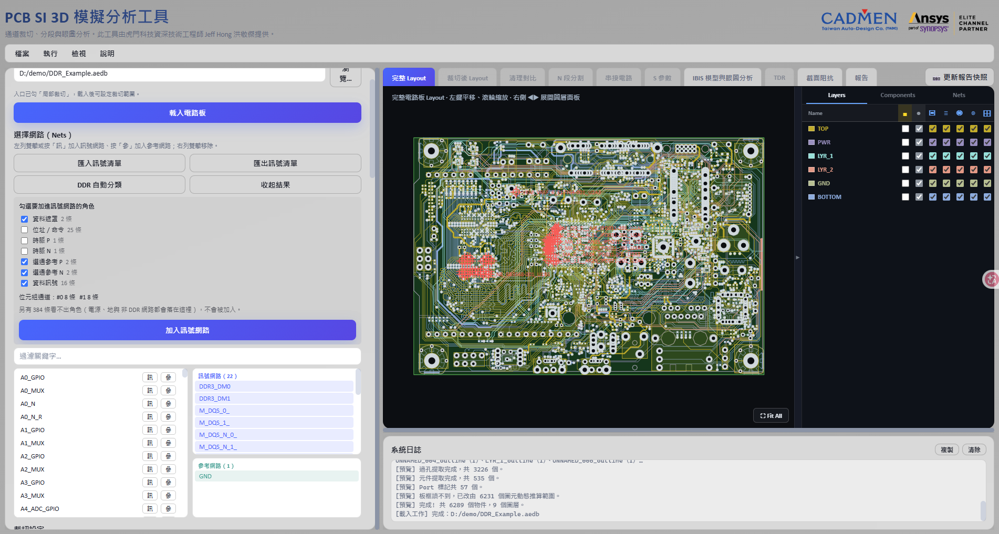
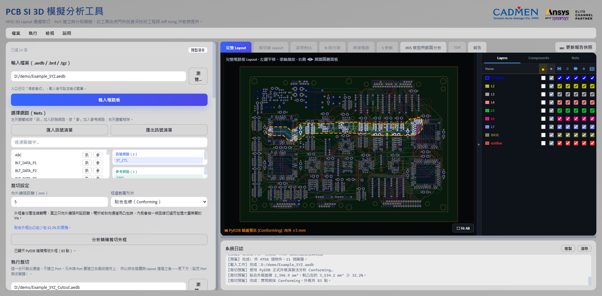
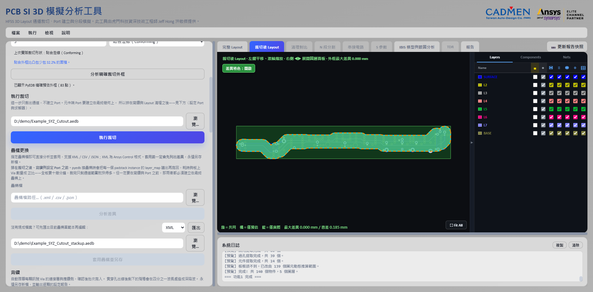
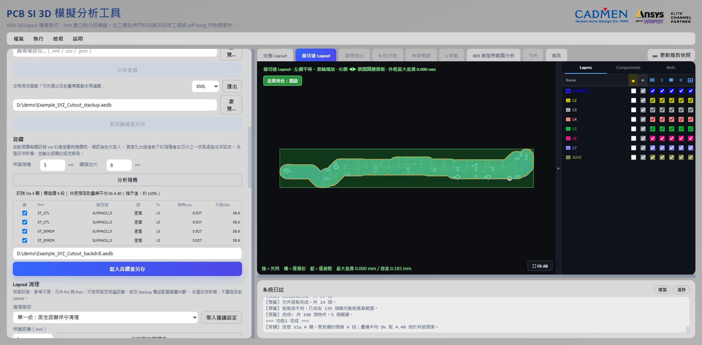

# 載入電路板與裁切通道

[回操作說明索引](../../操作說明.md)

## 載入電路板

**丟檔案進去，等 Net 和預覽出現，就可以開始選訊號了。**

支援三種輸入：

- EDB 資料夾：`.aedb`
- Cadence Allegro：`.brd`
- ODB++ 壓縮檔：`.tgz`

1. 在「輸入檔案」輸入路徑，或按「瀏覽…」選檔案。
2. 按「載入電路板」。
3. 等 Net、元件與 2D Layout 預覽擷取完成。

大型板會用快速預覽模式降低瀏覽器負擔。**畫面被簡化了，實際的 EDB 沒有。**
求解時用的仍然是完整幾何。

右側面板有 Layers、Components、Nets 三個分頁，每一層可以個別控制顯示、填色與線框。
左鍵拖曳平移，滾輪縮放，右下角「Fit All」還原完整範圍。

## 選擇訊號與參考網路

**訊號網路是你要分析的那幾條線，參考網路是它們的回流路徑（通常是 GND）。**

兩種都要選。只選訊號不選參考，等於只給了去程沒給回程，算出來的阻抗不會對。

1. 左側清單雙擊 Net，或按「訊」，加入訊號網路。
2. 按「參」，把 GND／VSS 這些加入參考網路。
3. 右側已選清單雙擊可移除。
4. 過濾欄輸入關鍵字可以縮小清單。

### 訊號清單可以存起來重複用

**同一個專案不要每次重選，選一次匯出成檔案，下次匯入。**

- 「匯出訊號清單」會下載 `selected_signal_nets.txt`，每行一個 Net。
- 「匯入訊號清單」吃 UTF-8 文字檔。空白行和 `#` 開頭的註解會忽略。
- 匯入比對**不分大小寫**，但成功後會改用目前 EDB 裡的正式 Net 名稱。

## DDR 自動分類

**DDR 一組 8～16 條 Net，手動一條一條選很痛，而且選錯只有等眼圖出來才知道。**
按「DDR 自動分類」讓工具依名稱分好，你確認之後一次加進訊號網路。

**這一步不開 AEDT、不花授權**，純粹是字串處理，載入板子之後按下去就回來。

上圖是一片 433 條網路的實測板。工具分出 49 條 DDR 角色，其餘 384 條
（電源、地與各種不相干的網路）落在「看不出角色」，**不會被加入**。

### 分成哪些角色

| 角色 | 是什麼 |
|---|---|
| 資料訊號 | DQ，實際承載資料的線 |
| 資料遮罩 | DM／DQM |
| 選通參考 P／N | DQS 差動對。**組內資料訊號的眼圖是相對它量的** |
| 時脈 P／N | CK 差動對 |
| 位址／命令 | A、MA、BA、BG、BS、RAS、CAS、WE、CS、CKE、ODT |
| 其他 | 認不出來的都放這裡 |

### 位元組通道

**8 條資料配一組選通**：`DQ0`–`DQ7` ＋ `DQS0` ＋ `DM0` 是第 0 個位元組通道。

畫面上會列出每個通道分到幾條資料。

**某一組配不到成對的選通參考時會明講。** 那一組不能當位元組通道分析 ——
組內資料訊號的眼圖沒有共同的時間基準（見 [第 06 章](06-IBIS與眼圖.md)）。

### 三條規則

**`?` 代表 1～2 位數字。** 你寫 `DQ_?`、`DQS?_N`，不必碰正規表示式。

**順序即優先權。** 資料遮罩與選通排在資料前面，否則 `DQS0_P` 會被當成資料訊號。

**先過一次忽略清單。** `U12.DDR4_DQ5` 裡的 `DDR4` 會先被拿掉，
不然那個 `4` 會干擾數字比對。

### 兩種情況會被標出來，不會安靜地跳過

**同時符合多個角色**的網路會列出來要你自己確認。
挑錯的代價是整組眼圖的時間基準是錯的，**而畫面上看不出來**。

**看不出角色**的會報出數量。真實板上本來就有不是 DDR 的網路，
但靜靜地分完會讓人以為工具看懂了整片板子。

### 認不出來的時候

**單字母的位址樣式（`A0`、`A15`）只有在整個名稱就是它的時候才算。**

原因是實測踩到的：那片板有 `A0_GPIO`、`ANALOG_A3`、`SEL_A0`、`A4_ADC_GPIO`
這類 Arduino 風格的網路，**當成子字串比對時 22 條全部被誤判成位址訊號**。
同樣的道理，`PD_CLK14` 是一顆 14 MHz 的時脈，不是 DDR 的。

所以如果你的板子把位址線命名成 `MEM_ADDR_5` 這種樣式而工具沒認出來，
那是刻意的保守。手動補選即可。

### 只加訊號，不動參考

勾好角色按「加入訊號網路」，上圖那次把 16 條資料、2 對選通與 2 條遮罩
共 22 條加了進去。

**參考網路不會被自動決定。** 那是另一個判斷 ——
替你決定 GND／電源會讓人以為工具確認過回流路徑，而它並沒有。

## 疊構更換

**用外部的疊構檔換掉板子現有的 Stackup，用來做「同一塊 Layout 換板材」的對照。**

換銅厚、換介電層厚度也是同樣用法。程式在 `stackup_change.py`。

支援三種格式：

| 格式 | 說明 |
|---|---|
| `.xml` | Ansys Control XML，就是 AEDT 的疊構匯出格式。 |
| `.csv` | 逐層的層名、類型、厚度與材料。 |
| `.json` | 本工具「匯出目前疊構」產生的疊構快照。 |

1. 按 **「匯出目前疊構」** 拿一份可以編輯的基準檔（選用）。
2. 指定疊構檔路徑。
3. 按 **「分析差異」**。工具會列出：
   - **新增**、**移除**、**變更**的層，以及厚度的前後值（帶單位的厚度寫法會自動換算）。
   - **材料變更**：介電常數與損耗角正切的前後值。
4. 確認輸出到新的 `.aedb` 路徑。
5. 按 **「套用疊構並另存」**。

### 順序：裁切之後、背鑽與設定 Port 之前

**裁完再換疊構會快很多。** pyedb 換疊構時要把板上**每一個** padstack instance 的
層對應讀出來再寫回去（每個兩趟 gRPC），花的時間跟板上 Via 數量成正比。整片板子
要十幾分鐘，裁完只剩通道範圍就快得多。

但一定要在**背鑽與設定 Port 之前**：那兩件事都必須建立在最終的疊構上。

### 這一步不會弄壞你的原始檔

- 差異分析是**唯讀**的，不會改到來源 EDB。
- **新疊構會刪掉現有層時，介面用紅字標示，而且要你明確確認才能套用。**
  刪層會連帶讓那一層上的走線與參考平面一起消失，這是回不去的。
- 完成後輸出 `*_stackup_change_report.json`。

## 設定裁切範圍

**先決定「往外留多少」，再決定「外框長什麼形狀」。**

1. 設定「向外擴張距離（mm）」。
2. 選裁切形狀：

   | 形狀 | 外框怎麼來 | 什麼時候用 |
   |---|---|---|
   | **貼合走線（Conforming）（預設）** | 每個訊號 primitive 各自向外擴張所設距離，再聯集起來 | 外框沿著走線轉彎，**真的只向外擴張所設距離**。斜向、L 形、彎折通道用這個 |
   | 凸包（ConvexHull） | 取訊號幾何的凸包再向外擴張 | 通道接近直線時，跟貼合外框差不多 |
   | 矩形（Bounding Box） | 訊號的外接矩形再向外擴張 | 最保守，範圍最大 |

3. 按「分析精確裁切外框」。工具會唯讀呼叫**與正式裁切完全相同**的 PyEDB 演算法，
   完成後在完整 Layout 上畫出橘色虛線外框，標示「PyEDB 精確預估」。
4. 檢查外框有沒有包住訊號通道、端點元件與必要的參考平面，再執行正式裁切。

> **早期版本會先畫一個「快速估算」外框，已經移除了。**
> 那個估算跟 PyEDB 實際採用的外框可能差很多，看起來像預覽卻不能當判斷依據。
> 現在只有按下分析之後才會出現外框，而畫面上顯示的就是真正會裁的範圍。

### 為什麼預設不是凸包

**凸包依定義是凸的，所以通道只要一轉彎，內角就會被整片包進來。**

想像拿一條橡皮筋套住整條通道。**橡皮筋不會凹進去。** 通道是 L 形的話，
橡皮筋會從轉角外側直接拉一條斜線過去，那個三角形空白區裡的 Via 與銅箔
就全部被帶進裁切範圍了。

這不是擴張距離設太大，**是這個形狀本身做不到貼合**。改用貼合外框就好，
擴張距離不用動。

### 貼合外框的代價：各段必須連得起來

貼合外框的做法是各段走線先各自向外長出所設距離，再把重疊的部分聯集成一塊。

**所以通道各段必須連得起來。** 擴張之後如果還是分離的好幾塊，
PyEDB 會逐步加大擴張量試著合併，最後仍然失敗時**只會回傳面積最大的那一塊**。
等於安靜地把通道的一部分排除掉。

工具會在預檢時逐點確認外框真的包住全部訊號幾何。發現漏掉就自動改用凸包，
並在介面說明原因。這時候如果你還是想要貼合外框，把擴張距離加大到讓各段連成一片就行。

預檢成功時介面會顯示「貼合外框比凸包少包 N% 的面積」，可以拿來判斷這次值不值得換。

三種形狀都會先跑唯讀預檢。**只有預檢明確失敗或外框無效時才會回退**（貼合→凸包→矩形），
系統日誌與介面會顯示實際採用的形狀。

裁切完成後工具會比較預估與正式外框：綠色是共同區域、橘色是只有預估有的區域、
藍色是實際多保留的區域。容差由工具依外框尺寸自動決定。

## 執行裁切

**這一步只裁出通道，不建立 Port。**

1. 指定新的 `.aedb` 輸出路徑。
2. 按「執行裁切」。
3. 工具依序做：裁切 → 重新開啟輸出 EDB → 完整性檢查 → 擷取預覽。
4. 完成後切到「裁切後 Layout」確認結果。

> **輸出的通道還沒有元件端 Port 與 Setup。**
> 背鑽與 Layout 清理都排在這之後，而且都會改動幾何。
> 所以 Port 要等它們做完，再用〈設定 Port 與求解器〉建立。

左上角的「差異填色」可以切換。開啟時會標示裁切前後的差異區域，
方便確認有沒有把該留的銅箔一起切掉。

### 這一步不會弄壞你的原始檔

- **原始 EDB 不會被覆寫。**
- 裁切結果如果缺少訊號幾何或參考平面，會被判定為失敗。
- 原有的 Simulation Setup 會從輸出副本移除，再建立 `HFSS_Setup_1` 與 `Sweep_1`。
- 按「停止裁切工作」後，工具會在 PyEDB 回到安全檢查點時停止，並嘗試重新載入原始 EDB。
  **不是所有 PyEDB 呼叫都能立刻中斷**，所以按了之後可能還要等一下。

## 背鑽

**把訊號 Via 上用不到的那一段孔銅鑽掉。**

那一段叫殘樁。它是一條沒接東西的岔路：訊號跑進去、撞到底、再彈回來。
彈回來的訊號在某個特定頻率會剛好跟原訊號抵消，那個頻率上就出現一個深陷波。

**陷波的頻率由殘樁長度決定**，剛好是四分之一波長對應的頻率。
殘樁越短，陷波的頻率越高。把它縮短，就是把陷波推到你的工作頻寬以外。

1. 設定 **保留殘樁**（預設 5 mil）與 **鑽頭加大**（預設 8 mil，鑽頭 = 原孔徑 + 8 mil）。
2. 按 **「分析殘樁」**。
3. 檢查表格：每顆訊號 Via 的**連接層**、背鑽側、鑽到哪一層、殘樁長度、**預測共振頻率**。
4. 勾選要背鑽的 Via（預設全選）。
5. 指定輸出 `.aedb`，按 **「寫入背鑽並另存」**。

### 連接層怎麼判定

**殘樁長度取決於訊號實際從哪一層進、哪一層出，不是 Via 的定義起訖層。**

所以工具不看 Via 的定義層，而是逐層檢查那一層有沒有真的接上這顆 Via。
兩種情況都算連接：

- 該層有屬於同一 Net 的**走線**通過孔壁附近，或
- 該層有屬於同一 Net 的**元件焊墊**落在同一範圍內。

**這兩條缺一不可。** 兩種都實測過，少一條就會算出假殘樁：

- **只看走線會漏掉 BGA 焊墊。** 某片板的訊號從元件腳位在 TOP 進入貫穿孔，
  只比對走線時 TOP 被誤判成殘樁起點，多算了一整段。
- **只比對走線的頂點會漏掉真正連通的層。** 實測有一層的最近頂點距孔中心 251 µm，
  但走線的最近**邊**只有 4.9 µm。只看頂點會漏掉 3 個連通層，
  算出 2.353 mm 的假底部殘樁，照著鑽會**把訊號切斷**。

所以工具比對的是點到線段的距離，不是點到點。

判定結果顯示在表格的「連接層」欄。**背鑽之前請先確認它跟你預期的一樣。**

### 共振頻率是估計值，不是規格

以背鑽後的殘樁長度與疊構平均 Dk 推算四分之一波長共振點。

介面顯示的 Dk 是指示值，誤差約 ±10%，所以共振頻率同樣是估計值。
它的用途是判斷「陷波有沒有被推出工作頻寬」，**不能當規格依據**。

### 寫入之後工具會自己驗一次

寫入背鑽後，工具會**逐顆讀回**實際的背鑽側與深度確認寫入成功，
並輸出 `*_backdrill_report.json` 記錄每顆 Via 的結果，可以拿來核對。

## Layout 清理

**把離通道太遠、不影響結果的銅箔、走線與 Via 刪掉，讓後續分段與求解快一點。**

訊號 Net、參考 Net、元件 Pin、Port 與 Stackup 都會保留。

### 兩種清理方式

**第一級：固定距離。** 以所選訊號幾何為中心，用一個固定的保護距離。
適合你想用一個容易理解的幾何距離來保守清理的時候。

**第二級：依電磁影響範圍。** 依訊號層到最近參考層的高度 `h` 與目標隔離度，
**逐層**計算保護半徑。訊號離參考面越遠，電磁場散得越開，要留的範圍就越大。
參考 Net 一樣完整保留。

Stackup 或參考層資訊不足時，第二級會自動退回第一級。

### 沒特別想法就按「帶入建議設定」

它會設成：

- 第二級（依電磁影響範圍）
- 最小保護距離：0.2 mm
- 目標隔離度：40 dB

### 建議流程

1. 按「分析與紅框預覽」。
2. 檢查候選移除的數量與紅框位置。
3. 確認輸出到新的 `.aedb` 路徑。
4. 按「另存並執行…清理」。
5. 在「清理對比」頁籤用「差異高亮」、「並排」、「清理前」或「清理後」檢視。
6. 差異高亮裡，**紅色是被移除的銅箔／走線，橘色是被移除的 Via**。
   可以依種類、Layer 及差異密集區過濾。

清理完成後輸出 JSON 報告，並顯示清理前後的 Primitive、Padstack 與 EDB 容量。

---

← [開始使用](01-開始使用.md)　[回索引](../../操作說明.md)　[Port 建立與求解設定](03-Port與求解設定.md) →

