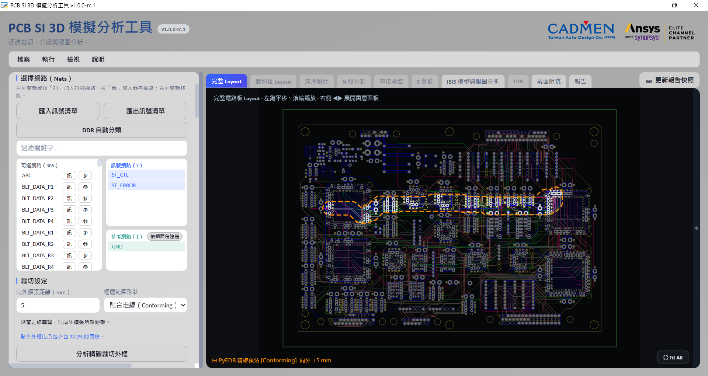
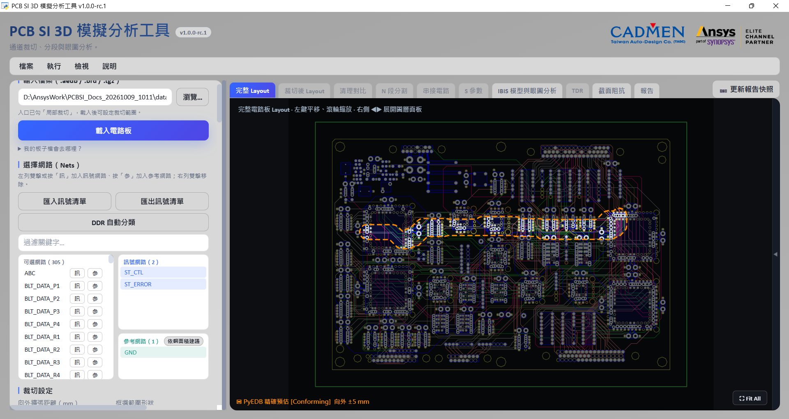
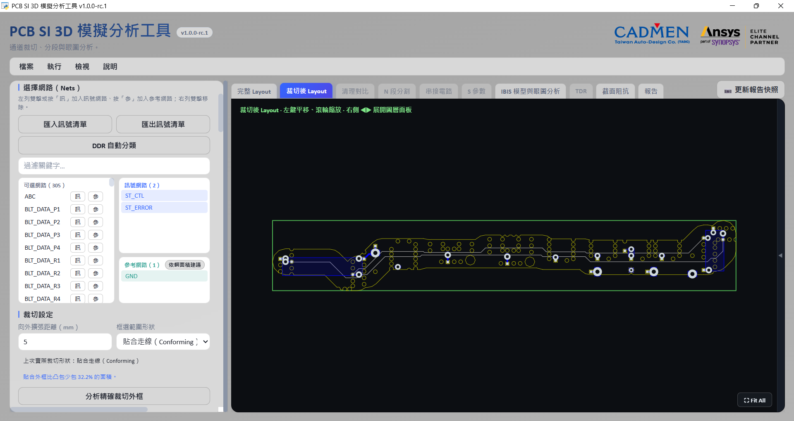
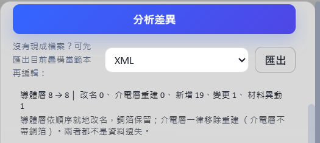
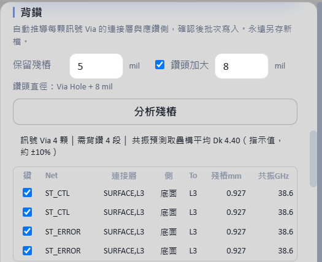
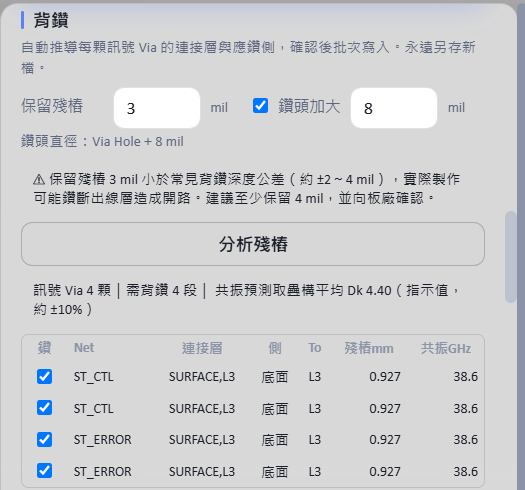
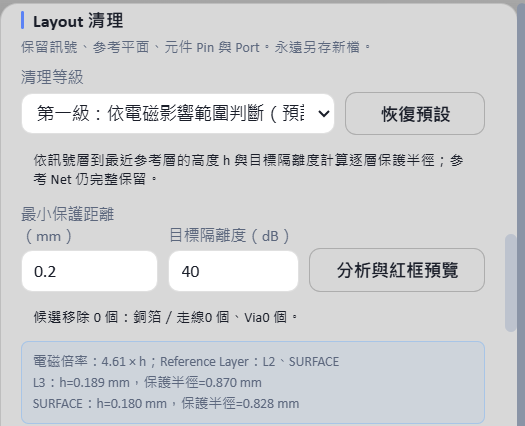

# 載入電路板與裁切通道

[回操作說明索引](../../操作說明.md)

先選訊號與參考網路，再裁出通道。疊構、背鑽、清理都是選用步驟，完成後才 [建立 Port](03-Port與求解設定.md)。所有輸入複本、工作目錄與輸出使用 ASCII 完整路徑；保留原始資料。

## 載入電路板

1. 「輸入檔案」按「瀏覽…」，選 `.aedb`、`.brd` 或 `.tgz`；`.aedb` 是資料夾。
2. 按「載入電路板」，等 Net、元件與 Layout 預覽出現。
3. 用 Layers／Components／Nets 切換檢視，滾輪縮放、拖曳平移，必要時用「Fit All」還原。

**完成判據：板子、網路名稱與圖層符合來源。** 快速預覽可能簡化畫面，不能只憑預覽判斷原始幾何少了物件。

## 選訊號與參考

用過濾欄找到目標 Net，雙擊或按「訊」加入訊號，按「參」加入 `GND`／`VSS` 等參考。從已選清單雙擊可移除。至少有一條訊號與正確參考，且應保留這次要分析的耦合通道。

可匯出 `selected_signal_nets.txt`，每行一個 Net，下次匯入重用；匯入後仍要確認這版板子有相同網路。

### DDR 自動分類

按「DDR 自動分類」，檢查 DQ、DM／DQM、DQS P／N、CK P／N、位址／命令與其他角色。用位元組通道按鈕加入整組，確認配對的 DQS、模糊分類與未辨識項。名稱分類不證明實際拓撲，**參考網路仍須自己選**。

<!-- 待拍：gui-05-net-selection.png；gui-36-ddr-classification.png 需合法 DDR 示例。 -->

## 裁切

1. 設向外擴張距離與形狀：彎折通道優先「貼合走線」，凸包會包入內角區域，矩形範圍較大。
2. 按「分析精確裁切外框」，檢查外框包住訊號、端點與必要回流平面。
3. 指定新的 `.aedb`，按「執行裁切」。
4. 到「裁切後 Layout」看真正裁切結果，核對訊號連續與端點保留。

預檢失敗可能改採其他外框，依介面與日誌確認實際形狀；範圍不足先調距離再分析。**裁切沒有建 Port**，不要在這一步直接當作可求解模型。

## 疊構更換（選用）

瀏覽選 `.xml`（Ansys Control）、`.csv` 或 `.json`，按「分析差異」。核對層名、材料、厚度及新增／移除項，再指定新輸出，按「套用疊構並另存」。刪層會刪掉該層走線與平面，必須確認；換完看差異報告與新疊構。建議裁切後做，排在背鑽與 Port 前。

## 背鑽（選用）

設保留殘樁，按「分析殘樁」，逐顆核對連接層、背鑽側、殘樁及估計共振；勾選要處理的 Via，指定新輸出，按「寫入背鑽並另存」。鑽頭預設與 Via Hole 相同，要加大才勾選增量。

保留殘樁 0 會照值處理，不會自動改成 5 mil。**低於 4 mil 的警告表示鑽深公差可能切斷出線層**，先向板廠確認能力。共振是估計，不作規格判定；連接層不符預期就先停下核對，不照表盲鑽。

## Layout 清理（選用）

預設第一級電磁範圍、最小距離 0.2 mm、隔離 40 dB；固定距離為另一選項。裁切後即可分析，不必先建 Port。裁切只保留選定網路時，候選常是 0，「另存並執行」會停用，屬正常。已建 Port 的檔案清理後要重新建一次 Port（面板會提醒）。按「分析與紅框預覽」，核對移除候選，再另存執行。到「清理對比」看紅色銅箔／走線與橘色 Via，確認必要回流沒有被移除。疊構不足時查看日誌採用的實際保護距離。

<!-- 待拍：gui-12-cleanup-comparison.png。 -->

**完成判據：每一步有新 EDB 與對應報告，下一步使用最新幾何。** 幾何改動後須重新建立／核對 Port，不能繼續沿用舊求解結果。

← [開始使用](01-開始使用.md)　[Port 與求解設定](03-Port與求解設定.md) →
