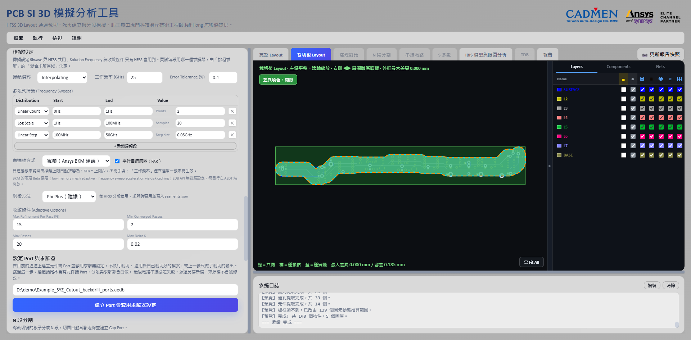

# Port 建立與求解設定

> 此工具由虎門科技資深技術工程師 Jeff Hong 洪敬傑提供

[回操作說明索引](../../操作說明.md)

## 設定元件端 Port

**Port 是訊號進出模型的接點。通道兩端各一個，不要多勾。**

1. 選 Port 類型：
   - **Coax**：建議用這個。適合元件 Pin 到參考導體的同軸型 Port。
   - **Circuit**：建立電路埠。
2. 工具會列出跟你所選訊號 Net 相連的候選元件。
3. 按「建議端點（最多 2 個）」自動選出通道兩端的元件，再自己確認一次。
4. **不要把所有候選元件全部勾選。** 大型 BGA 選錯元件的話，會建出一大堆不必要的 Port。

### 每個 Port 都要有參考

**沒有 Reference 的 Port 不該進入後續的分段與求解。**

Port 有正端也有負端。負端就是 Reference，也就是回流路徑。少了它，
求解器不知道電流要從哪裡回去，算出來的東西沒有意義。

元件端是 Solder Ball／BGA 時，工具會依訊號 Pin 所在的層去找適合的參考層。

### 負端落點修正：為什麼 Port 會少掉幾個

**負端落在參考銅箔的空曠處時，SIwave 可能整個把那個節點當成無效，直接排除。**

症狀很好認：**輸出的 Touchstone Port 數比你預期的少。**
沒有錯誤訊息，就是少了幾個。

工具的做法是把負端**吸附到 1 mm 內最近的參考 Via 中心**，讓負端落在一個
明確的導通結構上，而不是一片銅箔的中間。

這個修正做過 A／B 實測：同一片板，未修正時輸出 `s8p`，修正後輸出 `s12p`。
**少掉的 4 個 Port 就是這樣不見的。**

## 設定求解條件（HFSS 3D Layout）

**掃頻設定 SIwave 也會用，其他設定只有 HFSS 會用。**

Solution Frequency、自適應方式、網格方法與收斂條件都只適用 HFSS。
每一段實際用哪一種求解器，是在「排程求解」的「混合求解區域」決定的。

可以設定：

- Sweep Type：`Interpolating`、`Discrete` 或 `Fast`。
- 多段式 Frequency Sweep。
- Interpolating Sweep 的 Error Tolerance。
- **自適應方式**與**平行自適應區（PAR）**。
- **網格方法**：`Phi Plus`、`Phi` 或 `Classic`。
- Max Refinement Per Pass、Min Converged Passes、Max Passes、Max Delta S。

其中兩個名詞先解釋，後面會一直看到：

**網格**是求解器把你的模型切成的一堆小四面體。切得越細算得越準，也越慢。

**Max Delta S** 是收斂的門檻。求解器每細化一次網格就重算一次 S 參數，
兩次之間的變化小於這個值，就當作收斂了、可以停。

### 自適應方式：為什麼預設是寬頻

**網格是照著某一個頻率去切的。用低頻切出來的網格拿去算高頻，會算出假的反射。**

頻率越高，波長越短，需要的格子就要越細。
自適應頻率如果遠低於掃頻上限，高頻段的網格就相對太粗，
曲線看起來像有嚴重反射，**但那是網格不足造成的假象，不是板子的行為**。

這是實測追出來的。段 2 用 `Frequency='10GHz'` 單點自適應、掃頻到 50 GHz，
拿去跟 SIwave 逐點比對（同一份幾何、同樣 16 個 Port、同樣頻率格點）：

| 頻率 | HFSS 反射 | SIwave 反射 | HFSS 耗損 | SIwave 耗損 |
|---|---|---|---|---|
| 1 GHz | 0.0062 | 0.0060 | 0.028 | 0.043 |
| 25 GHz | 0.4214 | 0.0058 | 0.269 | 0.271 |
| 50 GHz | 0.5965 | 0.0172 | 0.305 | 0.357 |

**兩邊的耗損幾乎一樣，差異全部在反射。** 而且分歧的起點正好落在自適應頻率上。

HFSS 本身收斂是正常的：14 passes、Delta S 從 0.0195 降到 0.0151、目標 0.02、
262k 個四面體（AEDT 上寫 tets），用的也是 Direct Solver。
**所以這不是求解器的問題，也不是沒收斂。**

因此工具依 Ansys 原廠 BKM（*BKM for PCB/PKG/3DIC in HFSS 3D Layout*）提供三種模式：

| 模式 | 行為 |
|---|---|
| **寬頻（Ansys BKM 建議）** | **預設值**。自適應頻率範圍自動推導成 `1 GHz ～ 掃頻上限／2`，不用手填。 |
| 多頻（3 點） | 在同一範圍內取 3 個頻率同時自適應（BKM 的 Maximum number frequencies = 3）。 |
| 單一頻率 | 只在「工作頻率」自適應。這時候才需要填工作頻率。 |

其他照 BKM 套用的設定：

- **平行自適應區（PAR）**：預設啟用。
- **Airbox padding**：裁切件採 XY `0`、上下 `0.5` 倍（BKM 的 Cutout case）。
- **Max Refinement Per Pass 15%** 與 **Phi／Phi Plus 網格**本來就是預設。

**不管 Setup 是在裁切時建立，還是在混合求解建工作副本時建立，套用的都是同一組設定**，
不會因為入口不同而有差異。

任一模式設定失敗都會退回單一頻率，並在日誌記錄原因。**不會靜默沿用預設值。**

> BKM 有兩項 Beta 選項（low memory mesh adaptive、frequency sweep acceleration via
> disk caching）在 EDB 的 setup API 裡沒有對應欄位，屬於 AEDT 端的旗標。
> 需要的話請自己在 AEDT 介面開啟。

### 介面預設值

| 設定 | 預設值 |
|---|---|
| Sweep Type | `Interpolating` |
| Sweep 1 | `0 Hz～1 Hz`，Linear Count，2 Points |
| Sweep 2 | `1 Hz～100 MHz`，Log Scale，20 Samples |
| Sweep 3 | `100 MHz～50 GHz`，Linear Step，0.05 GHz |
| 自適應方式 | 寬頻（`1 GHz～25 GHz`，由掃頻上限 50 GHz 推導） |
| 平行自適應區（PAR） | 啟用 |
| 網格方法 | `Phi Plus` |
| Solution Frequency | 25 GHz（只有單一頻率模式會用） |
| Error Tolerance | 0.1% |
| Max Refinement Per Pass | 15% |
| Min Converged Passes | 2 |
| Max Passes | 20 |
| Max Delta S | 0.02 |

**這些是工具的預設值，不代表適合所有板材、線寬、頻寬與精度需求。**
正式模擬前請照專案規格確認一次。

## 設定 Port 與求解器（不重跑裁切）

**在目前的通道上建立元件端 Port 並套用求解器設定，不執行裁切。**

1. 載入通道 `.aedb`。可以是別人裁切好的檔案，也可以是上一步只做了裁切的輸出。
2. 選好訊號 Net 與參考 Net。
3. 在「設定元件端 Port」選 Port 類型並勾端點元件，在「設定求解條件」設好掃頻與自適應方式。
4. 按 **「建立 Port 與求解器設定」**。

後端走 `main._apply_ports_and_solver_setup`，跟裁切流程的 Port／Setup 建立
**共用同一段程式碼**，差別只是不做裁切。

什麼時候用得到：

- 通道是別人切好的，或由其他流程產生。
- 上一步只勾了「局部裁切」，現在要補建 Port。
- 只是想換掃頻範圍、自適應方式或網格方法，重設一次 Setup。
- 前一次的裁切結果要沿用，但 Port 想重選。

> **沒有元件端 Port 的通道無法進入排程求解**，串接時也會因為找不到外部 Port 而失敗
> （見〈電路串接失敗，訊息提到索引型別〉）。
> 載入已裁切的檔案後想直接分段時，記得先在這裡建立 Port。

---

← [載入電路板與裁切通道](02-載入與裁切.md)　[回索引](../../操作說明.md)　[N 段分割與混合求解](04-分段與混合求解.md) →

> 此工具由虎門科技資深技術工程師 Jeff Hong 洪敬傑提供
