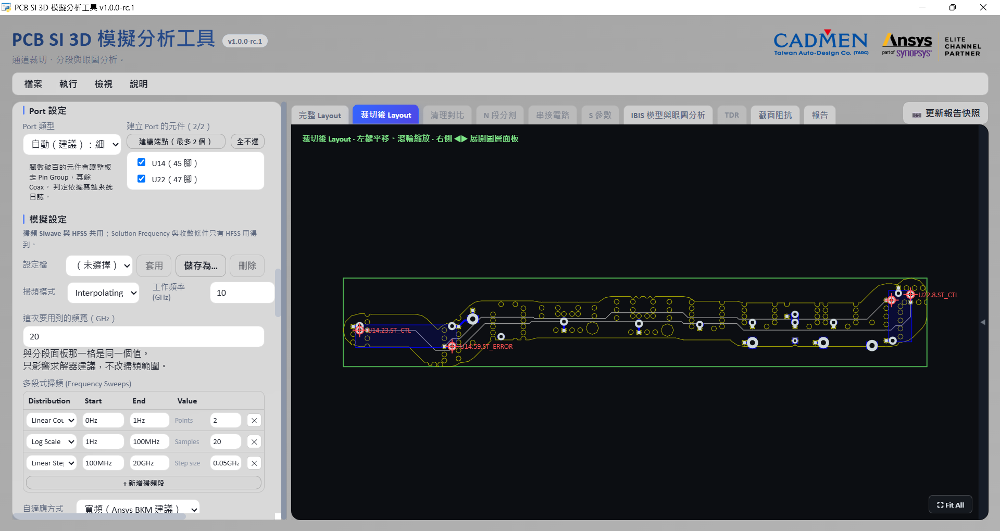
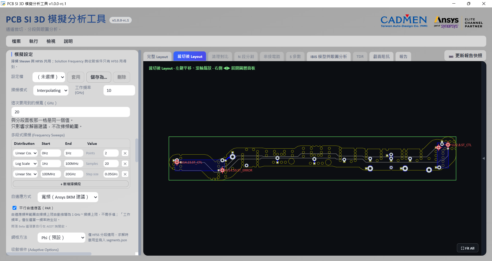

# Port 建立與求解設定

[回操作說明索引](../../操作說明.md)

在最終幾何上建立通道端點，再核對掃頻與收斂。裁切、疊構、背鑽或清理還沒做完，就先完成 [02 前處理](02-載入與裁切.md)。

## 建立 Port

1. 載入本次最終 `.aedb`，確認訊號與參考網路。
2. Port 類型保留「自動（建議）」；必要時依下表指定。
3. 按「建議端點（最多 2 個）」，核對通道兩端元件與訊號腳。不要全選所有候選元件。
4. 選設定檔或調整掃頻、網格與收斂，按「建立 Port 並套用求解器設定」。
5. 核對建立摘要：端點、Port 數、參考網路／層與預期一致。

| 類型 | 用法 |
|---|---|
| 自動（預設） | 腳數破百的元件使整板採 Pin Group，其餘 Coax；判斷寫入日誌 |
| Coax | 元件腳與參考導體的同軸型 Port |
| Circuit | 明確需要電路埠時指定 |
| Pin Group | 細間距 BGA 等；負端用該元件參考腳，整組一致，不與 Coax 混用 |

## 每個 Port 都要有參考

參考端是回流，不能只核對正端。細間距球陣列的座標負端可能落在 antipad，SIwave 可能排除該 Port；**求解成功不代表輸出埠數正確**。建 Port 後、匯出後都比較預期數量。數量不符先查參考與類型，不靠重新串接補回。

## 掃頻與 HFSS 預設

| 設定 | 現行初始值 |
|---|---|
| 掃頻 | `Interpolating` |
| 第一段 | `Linear Count`：0 Hz～1 Hz，2 點 |
| 第二段 | `Log Scale`：1 Hz～100 MHz，每 decade 20 點 |
| 第三段 | `Linear Step`：100 MHz～50 GHz，每 50 MHz |
| HFSS 自適應／網格 | 寬頻／`Phi`，PAR 啟用 |
| Error Tolerance／Max Refinement | 0.1%／15% |
| Min Converged／Max Passes／Max Delta S | 2／20／0.02 |

第三段上限依工作頻寬調整。上限 ≥20 GHz 用 50 MHz；低於 20 GHz 分段縮小低頻步距，不把初始 50 MHz 一律套用。交付結果需記下實際頻段與步距。特定求解設定不接受 0 Hz 時，記錄錯誤再處理，不能默默刪掉。

寬頻自適應範圍隨掃頻上限推導；也可選多頻或單頻。**收斂不代表高頻反射一定正確**，自適應範圍需覆蓋本次分析需求。套用後查看日誌，若方式回退，先核對實際值再求解。掃頻給 HFSS／SIwave 使用，其餘 HFSS 設定不等於 SIwave 設定。

## 設定檔

在「設定檔」選「內建規格（唯讀）」並套用，檢查掃頻上限與自適應值。內建規格不能覆寫／刪除；要調整就另存個人設定檔。內建檔不包含裁切外擴與形狀。

| 內建規格 | 掃頻上限 |
|---|---|
| DDR4-3200／DDR5-6400 | 16／32 GHz |
| LPDDR4X-4266／LPDDR5X-8533 | 22／43 GHz |
| PCIe Gen3／Gen4／Gen5 | 20／40／50 GHz |

這些是分析起點，不能取代專案規格。個人檔套用後也要看頻率單位與步距，避免把前一案的設定帶入。

## 核心與授權

排程預設 12 cores；先用「說明」查所需授權與可用數量。只有 HPC 授權／核心錯誤時改 4 cores，記錄錯誤與降核心原因，不低於 4。資源預算見 [05](05-排程與串接.md#排程求解)。

**完成判據：EDB 有正確元件端 Port 與求解設定，建立數量與預期相符。** 接 [04 整片或分段](04-分段與混合求解.md)，結果匯出後再核對一次埠數。

← [載入與裁切](02-載入與裁切.md)　[分段與混合求解](04-分段與混合求解.md) →
