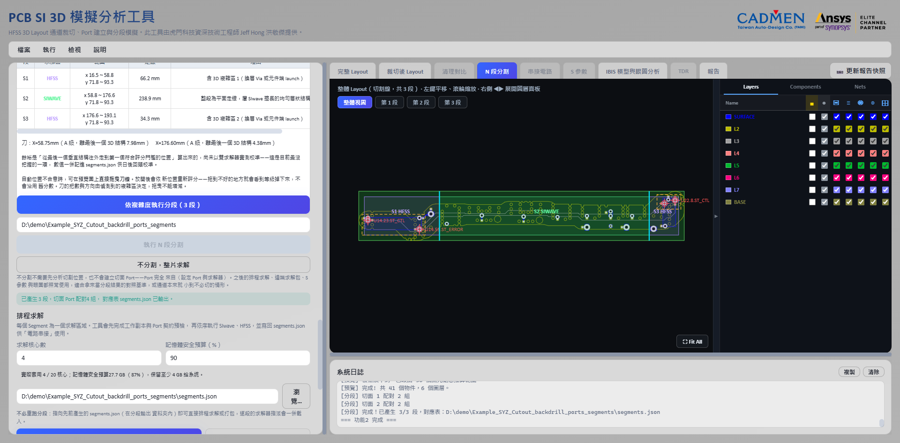

# N 段分割與混合求解

[回操作說明索引](../../操作說明.md)

## 這一章做什麼

把整片解不動的長通道切成 2～10 段分別求解，並逐段挑 HFSS 或 SIwave。

**通道解得動就不要切**——少切一刀就少一分誤差。分段是為了解得動，不是為了快。

## 操作步驟

兩個入口，差別在後面打算用什麼求解器：

| 入口 | 什麼時候用 | 段數 |
|---|---|---|
| 分析切割位置（等分） | **全段都用 HFSS**，各段大小相近 | 由 `N` 決定 |
| 依 3D 複雜度分析切割位置 | **HFSS＋SIwave 混合**，Via 與 launch 給 HFSS、平面走線給 SIwave | 自動偵測 |

1. 填「這次要用到的頻寬（GHz）」。不知道就填資料率按「由資料率導出」（用拐點 `0.5/Tr` 換算）。
   **只影響求解器建議，不改掃頻範圍。**
2. 設分段數 `N`（2～10）。
3. 選「可接受評分」：

   | 門檻 | 條件 |
   |---|---|
   | A 級以上 | 角度 ≤15° 且局部淨空 100% |
   | **B 級以上（預設）** | 角度 ≤30° 且局部淨空 75%——不需人工複核的底線 |
   | C 級以上 | 角度 ≤45° 且局部淨空 50%，**建議人工複核** |

4. 按「分析切割位置」。工具取通道較長的軸向當主方向，在達標的切點裡**把最大段壓到最小**。
5. 檢查各段長度、最大／最小倍數、各切面的交點數與最近障礙距離。
6. 指定輸出資料夾，按 **「執行 N 段分割」**（每段都要重新裁切一次，通常幾分鐘）。

**門檻無解時不會自動降級**，而是告訴你「B 級找不到可行組合；放寬到 C 級可行，
最大段 30.9 mm」，由你決定。最大段超過最小段 3 倍會警示。

### 混合求解與刀線微調

「依 3D 複雜度分析切割位置」跑完後，**刀線可以直接在預覽圖上拖**——按住拖到新位置
放開，整份重新評分（各段範圍、求解器、切面等級跟著更新）。把數與方向不能改。
按「↺ 回到自動刀線」還原。

兩個檢視開關：**安全疊圖**（禁切區、風險走線、遭拒候選、理想等分位置）與
**求解區域**（各段求解器與複雜度色塊）。顏色語言：

| 顏色／線型 | 意義 |
|---|---|
| 橘色發光走線 | 斜向或轉角風險帶 |
| 紅色半透明區 | 硬性禁切障礙（Via、Pad、元件、訊號銅箔） |
| 淡紅虛線 | 遭拒絕的候選切面 |
| 青色實線 | 最後採用且通過檢查的切面 |
| 灰色虛線 | 理想等分位置（看工具移動了多少） |
| 綠色／紫色區塊 | 該段指定 SIwave／HFSS |

## 切面品質分級

| 等級 | 意義 |
|---|---|
| A／B／C | 依上表的角度與淨空門檻，**可用** |
| D | 角度或淨空偏低，或**切面處參考平面未縫合**，不列入可選門檻 |
| F | 穿過訊號銅箔、交點不唯一或進入禁切外框，**硬性阻擋** |

### 參考平面縫合檢查（比角度與淨空更重要）

Stripline 的切面會建兩個 Gap Port、串接時短路成同一節點。**那個地方板上沒有接地縫合
Via 的話，這個短路就是人為連通兩個原本不相連的參考平面**，會冒出原本不存在的假諧振。

工具以每個訊號交點為中心、半徑 3 mm 內統計參考網路的**跨層** Via，
**少於 2 個就降為 D 級**。實測：缺縫合時插入損耗偏差 **14.4 dB**，補上後 **0.07 dB**。

**切在哪裡沒那麼要緊，那個地方有沒有縫合才要緊**——有縫合之後，切點離不連續點
19 mm 或 1.5 mm 只差 0.11 dB。
（[驗證報告](../../validation/segmentation/分段切板方法驗證報告.md)）

### 微帶線不一樣：問題不在縫合，在刀數

微帶線只有一個參考面，不會發生人為短路。**縫合從 14 顆掃到 0 顆，偏差散布只有
0.001 dB**；但**切開本身有代價**，隨頻率與刀數累加（15～20 GHz：一刀 2.1 dB、
兩刀 4.9 dB）。

所以微帶線切面缺縫合**只提示、不擋**，而該做的是**減少刀數或改整片求解——
補 Via 沒有用**。
（[微帶線驗證](../../validation/stitch_density_microstrip/微帶線縫合密度驗證報告.md)、
[真實板全頻對照](../../validation/segmentation/真實板全頻對照_20260817.md)）

## 不分割，整片求解

拿來當分段結果的對照基準，或通道本來就小到不必切。在「N 段分割」面板按
**「不分割，整片求解」**：

- 整條通道當成「第 1 段」寫進 `segments.json`，**不建立任何切面 Port**。
- Port 完全來自第 03 章建立的元件端 Port，**沒有 Port 會直接擋下**。
- 串接階段是直通，該段 Touchstone 就是完整通道結果。

> 要比較「分段串接」與「整片求解」時，**兩邊必須用同一組求解設定與同一個求解器**，
> 否則分不清差異來自切板還是換求解器。

## 輸出結果

- N 個分段 `.aedb`（中間段兩側都有切面 Port `SEG2_L_*`／`SEG2_R_*`，
  頭尾段一側切面、一側元件端）。
- `segments.json`：各段範圍、切面 Port 對應、Stripline 的短路關係——**第 05 章串接靠它**。
- 任一段的安全檢查失敗（切面沒穿過訊號、Port 缺 Reference、Port 數不一致、
  訊號幾何越界）**就拒絕輸出那一段**。

---

← [03 Port 與求解設定](03-Port與求解設定.md)　[回索引](../../操作說明.md)　[05 排程與串接](05-排程與串接.md) →
