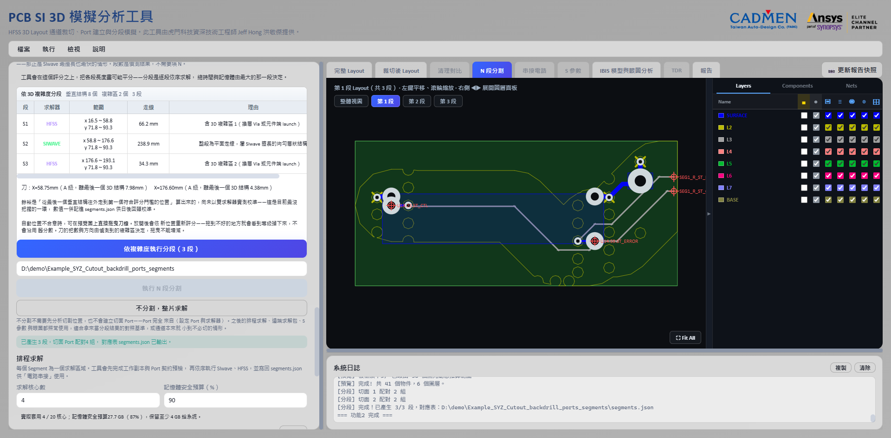
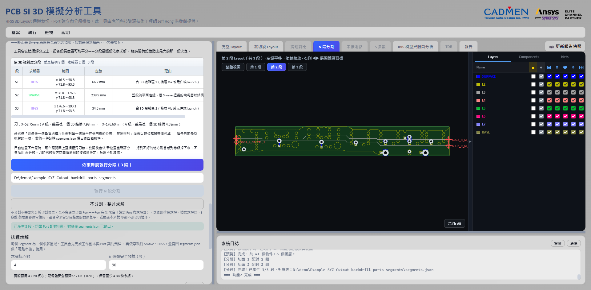
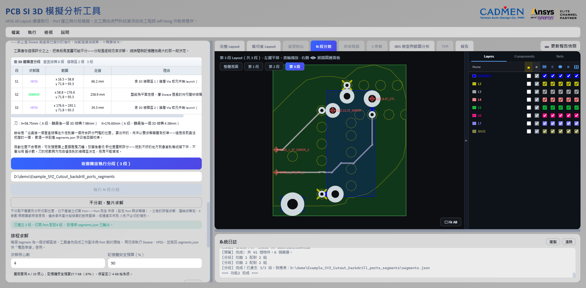

# N 段分割與混合求解

[回操作說明索引](../../操作說明.md)

## N 段分割

**通道太長一次解不動時，切成幾段分別解，再把結果接回去。**

分析切割位置有兩個入口，差別在**後面打算用什麼求解器**：

| 入口 | 什麼時候用 | 段數 |
|---|---|---|
| 分析切割位置（等分） | **全段都用 HFSS**。各段大小相近，逐段求解的時間與記憶體才不會被某一段拖垮 | 由 `N` 決定 |
| 依 3D 複雜度分析切割位置 | **HFSS＋SIwave 混合求解**。換層 Via 與元件端 launch 各自成段交給 HFSS，中間的平面走線交給 SIwave | 偵測結果，不用填 `N` |

等分的操作：

1. 填**「這次要用到的頻寬（GHz）」**。不知道的話，右邊填資料率（Gbps 或 MT/s）再按**「由資料率導出」**，工具用拐點 `0.5/Tr` 換算。
   這一格**只影響求解器建議，不改掃頻範圍**；它跟「模擬設定」那一格是同一個值。
   留空的話後面的求解器建議就只是純幾何判斷。
2. 設定分段數 `N`，介面允許 2～10 段。
3. 選「可接受評分」：`A 級以上`、`B 級以上`（預設）或 `C 級以上`。
4. 按「分析切割位置（等分）」。
5. 工具取訊號通道**比較長的那個軸向**（X 或 Y）當主方向，只採用達到該評分的切點，
   並在這些切點裡**把最大的那一段壓到最小**。
6. 檢查各段長度、最大／最小倍數，以及每個切面的交點數、最差角度、最近障礙距離。
7. 指定分段輸出資料夾。
8. 所有切面都確認過之後，按「執行 N 段分割」。

### 為什麼只讓你選評分，不讓你填角度與淨空

**因為要填那兩個欄位，你得先知道這片板的線寬與疊構，實務上根本無從判斷。**

切面的垂直度與淨空**本來就寫在評級的定義裡**了：

| 門檻 | 條件 | 什麼時候用 |
|---|---|---|
| A 級以上 | 角度 ≤15° 且局部淨空達 100% | 要求最嚴，可用的切點最少 |
| **B 級以上（預設）** | 角度 ≤30° 且局部淨空達 75% | 不需要人工複核的底線 |
| C 級以上 | 角度 ≤45° 且局部淨空達 50% | 最容易平分，但**切點建議人工複核** |

所以介面改成直接選「這次可以接受到哪一級」。

局部淨空依 3 倍線寬與 2 倍參考層高度計算，下限固定 0.2 mm。
Stackup 資料不足時自動退回用線寬與最低值。D、F 級不開放批次放行。

### 為什麼要盡量平分

**分段是一段一段依序解的，總時間由最大的那一段決定。**

像一列人排隊過一道窄門，隊伍走完的時間看最慢的那個人。
切出「一段極小、一段極大」的話，總時間跟沒切幾乎一樣，**加速效果等於零**。

所以挑選規則是：**先用評分門檻篩掉不能用的切點，再在可用的切點裡最小化最大段。**
評級只在幾乎不影響平衡的範圍內（最大段 5% 以內）用來決定同水準時挑哪一個。

分析完成後會顯示各段長度與「最大／最小」倍數，並附上 A／B／C 三個門檻的對照，
讓「放寬一級值不值得」一眼就能判斷：

- **門檻無解時不會自動降級。** 它會明確告訴你「以 B 級為門檻找不到可行的切點組合；
  放寬到 C 級可行，最大段 30.9 mm」，由你決定要不要放寬。
  求解動輒數十分鐘，**靜默降級等你發現時已經跑完了**。
- **最大段超過最小段 3 倍**時會警示，並附上放寬一級能改善到多少倍。
- 連 C 級都無解時，切面會放在理想等分位置並標記為不合法，
  只用來判斷問題出在哪一刀，**不可執行**。

執行期間會顯示進度。**每一段都要重新裁切一次，通常要幾分鐘**，
分段數越多總時間越長（上限 10 段）。

### 分段時工具會處理的幾件事

- 依主方向的軸向位置決定各段範圍，避免相鄰分段互相重疊。
- **走線重建成一段一個「兩點 Path」。** 多頂點 Path 會讓 SIwave 在轉角產生
  原板上不存在的弦線元件；兩條訊號的斜段如果靠得近，那條弦線會跨接兩個網路
  **造成短路**。
- **展開圓弧走線。** EDB 把圓弧記成「起點、終點加一個弧高」，中間沒有實際座標。
  直接照頂點重建會得到退化的中心線，症狀是產生零長度或自我重疊的走線。
  工具會先把圓弧段細分成多個點再重建。
- 清除繼承而來但不屬於該段的 Port。
- 在切面的訊號端點建立 Gap Port。
- Stripline 同時建立上、下參考 Port，並把短路關係寫進 `segments.json`。
- 檢查切面有沒有完整穿過每條訊號、Port 有沒有 Reference、Port 數量一不一致，
  以及訊號幾何有沒有越界。
- **任一安全檢查失敗就拒絕輸出那一段。**

### 切面品質分級

每個切面會拿到 A～F 分級，A～C 算可用：

| 等級 | 意義 |
|---|---|
| A | 角度 ≤15° 且局部淨空達 100%。 |
| B | 角度 ≤30° 且局部淨空達 75%。 |
| C | 角度 ≤45° 且局部淨空達 50%，或鄰近走線轉角，建議人工複核。 |
| D | 角度或淨空偏低，或**切面處參考平面未縫合**，執行前需確認；不列入可選門檻。 |
| F | 切面穿過訊號銅箔、目標訊號交點不唯一，或進入禁切外框，**硬性阻擋**。 |

被硬性阻擋的位置不會被採用。分析結果會另外列出遭否決的候選位置與原因，
方便回頭判斷是分段數不合適，還是那個地方本來就不能切。

### 參考平面縫合檢查（比角度與淨空更重要）

**Stripline 的切面會建兩個 Gap Port，串接時短路成同一節點。
如果那個地方板上沒有接地縫合 Via，這個短路就是人為連通兩個原本不相連的參考平面。**

整片求解時根本沒有這條路徑，所以串接結果會冒出原本不存在的窄帶假諧振。

工具的做法：以每個訊號交點為中心、半徑 3 mm 內，統計參考網路的**跨層** Via。
單層焊墊不算，因為它連不起上下平面。**少於 2 個就降為 D 級**，
並在原因欄直接寫該怎麼處理。

單參考（非 stripline）的切面只建一個 Gap Port，不會短路上下平面，所以不做這個檢查。

**這條規則的優先度高於角度與淨空，因為實測顯示它才是主要變因。**

自建 stripline 試片在同一個切點、同一組求解設定下：

| 情況 | 插入損耗最大偏差 |
|---|---|
| 缺少縫合 Via | **14.4 dB**（1.37 GHz 出現 −13.8 dB 假凹陷） |
| 補上縫合 Via | **0.07 dB**，全頻沒有任何一點超過 0.5 dB |

**差了 200 倍。** 同一批試驗還顯示，有縫合之後，切點離不連續點 1.5 mm 或 19 mm
的差別只有 0.02～0.1 dB，已經在數值雜訊的等級了。

換句話說：**切在哪裡沒那麼要緊，那個地方有沒有縫合才要緊。**

完整的驗證方法、試片規格與量化結果見
[切板方法驗證報告.md](../../validation/segmentation/分段切板方法驗證報告.md)。

### 微帶線不一樣：問題不在縫合，在刀數

**上面那組 14.4 dB 是 stripline 的數字**，機制是「人為短路兩個原本不相連的參考面」。
微帶線只有一個參考面，不會發生那件事。

**那微帶線需要縫合嗎？不需要。** 自建試片把切面附近的縫合從半徑 3 mm 內 14 顆
掃到 0 顆，六條偏差曲線的最大散布只有 **0.001 dB**。理由很直接：微帶線的回流電流
全部在它自己那一個參考面裡，**從來不需要更深層的 GND 平面**。

**但切開本身有代價**，而且隨頻率上升、隨刀數累加。同一片試片、參考面完美連續：

| 頻段 | 切一刀 | 切兩刀 |
|---|---|---|
| 0～1 GHz | **0.016 dB** | 0.033 dB |
| 5～10 GHz | 0.636 dB | 0.907 dB |
| 15～20 GHz | 2.077 dB | **4.926 dB** |

真實板上那條微帶線切兩刀，量到 0.040～2.650 dB，落在同樣的量級。

所以兩種切面的處理不同：

| 切面 | 缺縫合時 | 該怎麼辦 |
|---|---|---|
| 雙參考（stripline） | **判 D 級**，硬性擋下 | 改切在有接地 Via 的位置 |
| 單參考（微帶線） | **出風險提示，不影響評級** | **減少刀數或改整片求解；補 Via 沒有用** |

微帶線只提示不擋，是因為量級小一個數量級。**低頻不受影響**——要解到數 GHz 以上
才要在意，而那時候該做的是少切幾刀，不是去補 Via。

> **這一節在 2026-08-18 改過。** 初版說微帶線的機制也是「回流電流要跨過切面，
> 所以需要縫合」，並建議改切在有 Via 的位置。試片證明那個建議沒有用。

完整數據見[微帶線縫合密度驗證報告](../../validation/stitch_density_microstrip/微帶線縫合密度驗證報告.md)
與[真實板全頻對照](../../validation/segmentation/真實板全頻對照_20260817.md)。

### 切面是整組一起決定的

**不是一刀一刀往下切。**

一刀一刀切的問題是前面的刀會把後面的空間佔光，導致後段無解。

工具的做法是先用二分搜尋找出「最大段長」的最小可行值，再在這個上限之內配置每一刀。
每一段也有最小長度限制，隨板長與分段數自動調整，範圍 1～5 mm。

### 刀線可以自己拖（只有依複雜度那條路）

**「依 3D 複雜度分析切割位置」跑完之後，刀線可以直接在預覽圖上拖。**
等分那條路徑不行，執行完分段之後也不行。

游標靠近刀線時會變成拖曳游標，按住拖到新位置放開，整份**重新評分**——
各段範圍、每段的求解器與切面等級都跟著更新。面板上的刀線清單會在拖過的那一把
前面標一個 ✋。**把數與方向不能改**，只能沿著主方向前後移。

拖到不能切的位置時，理由是用面板上的紅字寫出來，不跳視窗。
每拖一次跳一個對話框的話，就沒辦法連續微調。

按 **「↺ 回到自動刀線」** 回到工具自己算的位置。這顆按鈕只在有刀被手動移過時才出現。

### 檢視輔助圖層

「N 段分割」分頁有兩個切換開關：

- **安全疊圖**：顯示硬性禁切區、風險走線、遭拒絕的候選及理想等分位置。
  關掉之後可以清楚看原始 Layout。
- **求解區域**：用色塊標示每段的求解器與複雜度，例如 `S1 SIWAVE · 22`。可以獨立關掉。

安全疊圖只在**板框範圍內**繪製。參考 Via 的紅色障礙區最多顯示 200 個，
超過時只保留最靠近候選切面的那些，避免密集的 GND Via 把整片板蓋成紅色，
反而看不出真正的風險點。

**顏色與線型不是裝飾，是切板決策的視覺語言：**

| 顏色／線型 | 意義與操作判斷 |
|---|---|
| 橘色發光走線 | 斜向走線或轉角風險帶；工具會降低鄰近候選的評級並優先移開切面。 |
| 紅色半透明區 | Via、Pad、元件或訊號銅箔等硬性禁切障礙。 |
| 淡紅虛線 | 已分析但遭拒絕的候選切面。 |
| 青色實線 | 最後採用且通過完整檢查的切面。 |
| 紅色虛線 | 被標記為不合法的選定切面；執行前必須人工確認。 |
| 灰色虛線 | 未考慮障礙物時的理想等分位置，用來看出工具實際移動了多少。 |
| 綠色半透明區／綠色標籤 | 指定使用 SIwave 的 Segment。 |
| 紫色半透明區／紫色標籤 | 指定使用 HFSS 3D Layout 的 Segment。 |

分段完成後可以保留整體切割視圖，也可以切換檢查每一段的實際 Layout。
左上角的「整體視圖／第 1 段／第 2 段／…」按鈕就是切換入口：

整體視圖上的青色直線是切割位置，各段標籤直接寫出那一段要用的求解器，
不用回到混合求解面板對照。

**中間段的左右兩側都有切面 Port**（`SEG2_L_*` 與 `SEG2_R_*`），
頭尾兩段則是一側切面 Port、一側元件端 Port。串接時就是靠這組命名自動對接。

## 不分割，整片求解

**有兩種情況會想整片解：拿來當分段結果的對照基準，或通道本來就小到不必切。**

在「N 段分割」面板按 **「不分割，整片求解」** 就好，不需要先分析切割位置。

- 整條通道當成「第 1 段」寫進 `segments.json`，並複製一份 `segment_1.aedb`。
- **不會建立任何切面 Port。** Port 完全來自〈設定 Port 與求解器〉建立的元件端 Port，
  所以執行前必須已經有 Port，否則會直接擋下。
- 之後的排程求解、遠端求解包、S 參數與眼圖都照常用。
  下游看到的就是一份只有一段的正常 `segments.json`。
- 串接階段是直通：只有一段就沒有切面、也沒有接線，那一段的 Touchstone 本身
  就是完整通道的結果。仍然會走完整的驗證與匯出流程，讓單段與多段的輸出格式一致。

> **想比較「分段串接」與「整片求解」的差異時，兩邊要用同一組求解設定與同一個求解器。**
> 否則差異會混入求解器本身的落差，你會分不清那是切板造成的還是換求解器造成的。

---

← [Port 建立與求解設定](03-Port與求解設定.md)　[回索引](../../操作說明.md)　[排程求解、串接與 S 參數檢視](05-排程與串接.md) →

