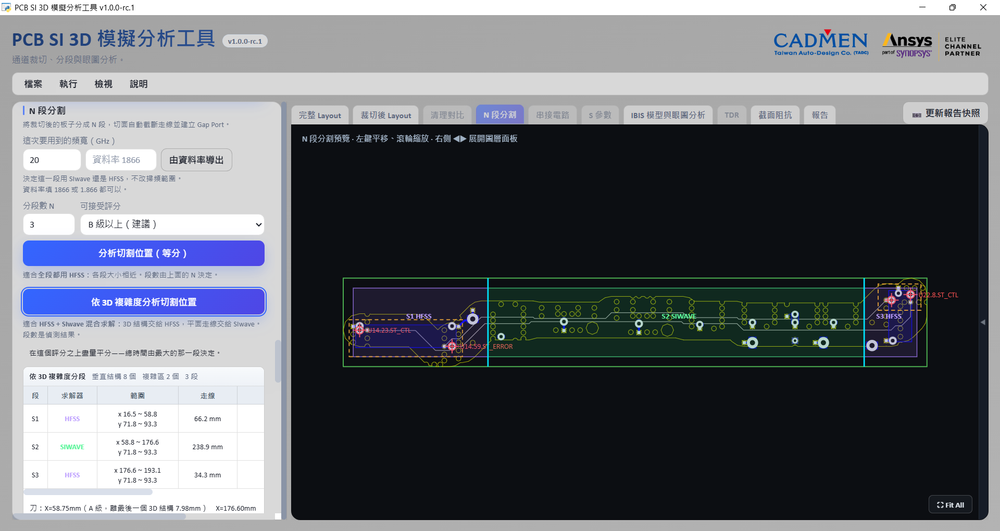
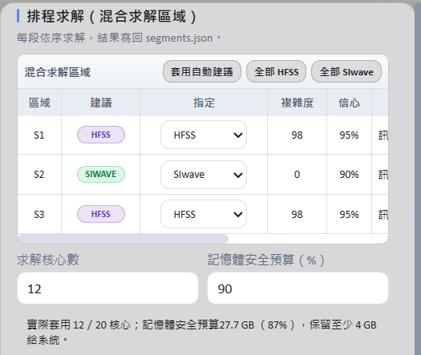
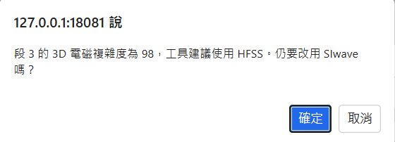
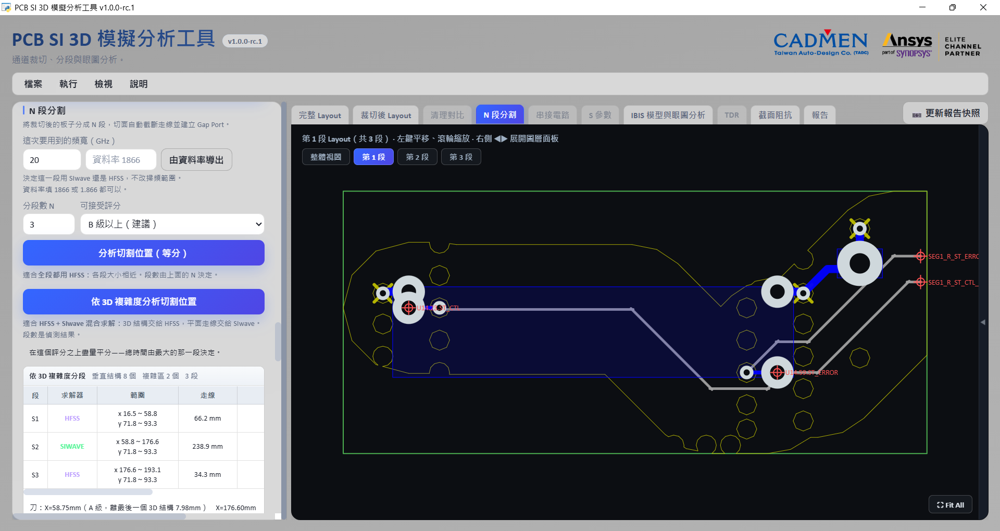

# N 段分割與混合求解

[回操作說明索引](../../操作說明.md)

通道能整片求解時優先不分割。分段讓大模型可執行，切面也會引入近似；先完成 [03 元件端 Port](03-Port與求解設定.md)。

## 不分割，整片求解

在「N 段分割」按「不分割，整片求解」，通道登記為第 1 段並輸出 `segments.json`，不建立切面 Port。後續串接直通；沒有元件端 Port 不能完成這條流程。

比較整片與分段時，用相同幾何、求解器、掃頻與收斂設定，才能判斷差異是否來自分段。

## 分段操作

1. 填工作頻寬；「由資料率導出」供估算建議，**不等於已確認掃頻設定**。
2. 選主方向等分分析或「依 3D 複雜度分析切割位置」。前者依設定的 N 搜尋切點，後者依路徑不連續分配區域。
3. 選可接受評級，執行分析。
4. 檢查段長、切面交點、障礙淨空與參考縫合。門檻不可行就重新調整，不把遭拒候選當切點。
5. 指定新的輸出資料夾，執行分段；確認每段成功及 `segments.json` 已產生。

### 評級

| 等級 | 檢查重點 |
|---|---|
| A | 角度 ≤15°、局部淨空 100% |
| B（預設門檻） | 角度 ≤30°、局部淨空 75% |
| C | 角度 ≤45°、局部淨空 50%；需人工複核 |
| D | 角度／淨空不足，或 Stripline 切面缺參考縫合；不作可選門檻 |
| F | 訊號交點不唯一或進入禁切障礙等，阻擋分段 |

工具不會因找不到 B 級就自行降成 C 級。段長差異過大時先看警示，調切線／段數或改整片。

## 切線與求解器

複雜度分析後可在預覽拖曳切線，放開會重新評分；需要還原按「回到自動刀線」。看「安全疊圖」核對障礙、遭拒候選與採用切面，看「求解區域」核對各段範圍。切面離 3D 結構的餘裕尚未以實測校準，不能只靠距離數字放行。

在「混合求解區域」逐段選 HFSS／SIwave，或按「套用自動建議」、「全部 HFSS」、「全部 SIwave」。看判斷原因：Via、換層、元件端 launch 與參考不連續需要特別注意。**自動建議與信心值不代表結果已驗證**；覆寫建議後記下理由。

把高複雜度段改成 SIwave 時，工具會先跳出確認框，說明複雜度與建議求解器；按「取消」維持建議。

## Stripline：確認參考縫合

雙參考平面的切面 Port 串接會帶入短路關係。切面附近沒有實際跨層參考 Via，可能人為連通原本不同的參考面，產生假共振。工具在訊號交點附近 3 mm 檢查跨層參考 Via，少於 2 個降為 D；別為了切得過而忽略這個警示。

## 微帶線：減少切面

微帶只有一個參考面，缺縫合只提示；切開本身仍有頻率相關誤差。優先減少刀數或整片求解，補 Via 不能消除切面近似。切面附近的場用 Gap Port 近似，**緊貼切面的單點值不可靠**，需要讀該處時移開切面。

既有工程驗證見 [分段方法驗證](../../validation/segmentation/分段切板方法驗證報告.md)與 [微帶線縫合密度驗證](../../validation/stitch_density_microstrip/微帶線縫合密度驗證報告.md)；個案數值不保證其他板子相同。

## 完成判據

在整體／各段切換列逐段看 Layout，確認訊號、端點與切面 Port。保留全部分段 `.aedb` 與 `segments.json`，後者存串接映射與參考短路關係。任一段安全檢查失敗就先修正，不能用缺段輸出繼續當完整通道。

← [Port 與求解設定](03-Port與求解設定.md)　[排程與串接](05-排程與串接.md) →
