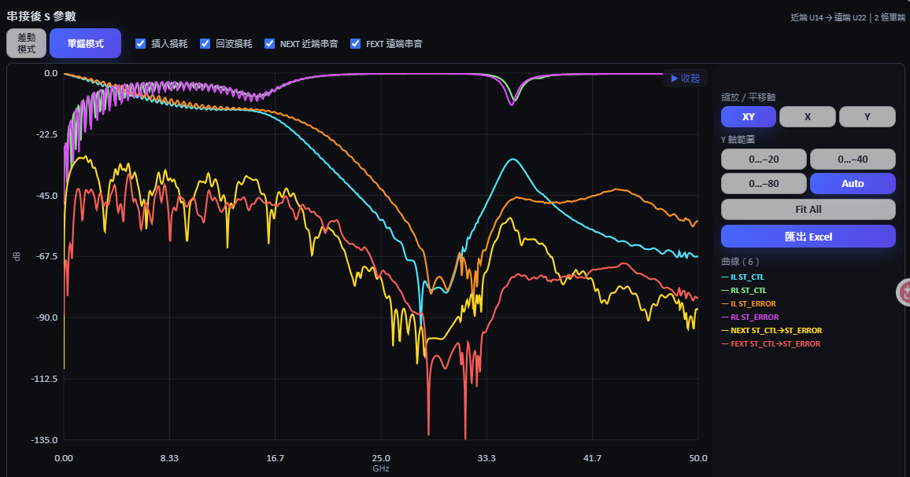

# 排程求解、串接與 S 參數檢視

> 此工具由虎門科技資深技術工程師 Jeff Hong 洪敬傑提供

[回操作說明索引](../../操作說明.md)

## 排程求解與 Touchstone 匯出

分段完成後，`segments.json` 路徑會自動帶入。

1. 確認每一段 Layout 及切面 Port。
2. 選擇求解方式：整批使用 HFSS 3D Layout 或 SIwave SYZ，或使用「混合求解區域」逐段指定（見下）。
3. 按「開始排程模擬」。工具依序為每一段啟動獨立的非圖形化求解程序。
4. 每段先執行 AEDT Design Validation；通過後才開始求解。
5. 完成後立即匯出 Touchstone，並將檔案路徑寫回 `segments.json`。
6. 介面會顯示各段「等待中、求解中、待匯出、完成、失敗、已停止、已跳過」狀態及耗時。

### 混合求解區域（逐段指定求解器）

每個 Segment 就是一個求解區域，可各自使用不同求解器：結構單純的段用 SIwave 快速求解，訊號路徑上有真正三維不連續的段改用 HFSS，以兼顧精度與時間。


### 求解器建議的評分依據

判斷該用 HFSS 還是 SIwave，取決於**訊號路徑上有沒有真正的三維不連續**，而不是板子有幾層、有幾顆 GND 縫合 Via。評分項目：

- **段內換層**：同一條訊號在本段兩個切面落在不同層 → 中間必有換層過孔。有沒有換層是關鍵，換幾條只是程度差別，因此以「存在」為主、條數為輔。
- **訊號 Via**：即使兩端同層，路徑上若有訊號 Via 仍視為真三維不連續，避免把蛇形換層誤判成均勻傳輸線。
- **元件端 Port launch**：端點元件的 launch 結構。
- 訊號自身的幾何複雜度與參考不連續。

**不列入評分**的項目：板子總層數、GND 縫合 Via 密度、與通道無關的元件數量。這些不在訊號路徑上，SIwave 處理得很好，計入只會把幾乎每一段都推向 HFSS。

建議門檻：

| 複雜度 | 建議 |
|---|---|
| ≥ 55 | HFSS |
| 30～54 | SIwave（信心較低） |
| < 30 | SIwave（高信心） |

中間帶仍建議 SIwave，只是信心較低。

指定結果會直接疊在「N 段分割」的 Layout 上，綠色為 SIwave、紫色為 HFSS，標籤同時顯示複雜度分數（見「N 段分割」 的〈檢視輔助圖層〉附圖）。

操作方式：

1. 用「套用自動建議」「全部 HFSS」「全部 SIwave」快速套用，或在「指定」欄逐段調整。
2. 若把某段從建議改成另一個求解器，介面會顯示該段的複雜度與警示，但**不會阻擋**——是否接受該段的近似誤差由使用者決定。
3. 排程開始前，工具會先建立**工作副本**並完成 **Port 契約預檢**，不直接改動分段原檔。
4. 求解結果會記錄來源求解器與指紋；分段檔案或設定變更後，對應結果會被標記為過期，避免誤用舊資料串接。

各段狀態與耗時會在執行期間持續更新，不必等整批跑完：


完成的段會直接列出產出的 `.sNp` 檔名，求解中的段顯示目前階段與已耗時間。

每段使用獨立 AEDT，可避免長時間共用同一 Desktop 所造成的記憶體累積與後續分段崩潰。單一分段失敗時，排程會釋放該 AEDT，記錄錯誤後繼續下一段。

**網表連通性閘門（SIwave 模式）**：SIwave 會在求解前先寫出 `.net` 網表。工具一偵測到該檔穩定就檢查連通性——若不同訊號網路落在同一導通區塊（代表被短路），會立刻終止該段，不必等整段掃頻跑完才發現 S 參數不可信。日誌會列出最短導通路徑與可疑的長距離元件；採用 Touchstone 前還有一次後備檢查。

排程卡片會顯示目前階段（初始網格、Adaptive Pass、Frequency Sweep 或
Touchstone 匯出）；當 AEDT 有提供 Monitor Data 時，也會顯示 Pass、Delta S、
目前頻率與 Basis 數。若連續 15 分鐘未偵測到 Monitor Data 或結果檔更新，工具只會
顯示「沒有可觀測活動」警告，不會自行停止求解。

按「停止」會終止目前分段對應的 AEDT PID，尚未開始的分段標記為已跳過。

若 HFSS 求解已完成但 Touchstone 匯出失敗，該段會標示為「待匯出」，既有
`.aedt`／`.aedtresults` 會保留。可按該段的「重新匯出」，或按
「檢查並重試待匯出的 Touchstone（不重新求解）」批次處理。工具會先隔離同名舊檔，
再驗證新檔的時間、大小、格式、Port 數與頻率資料；請勿為單純匯出失敗重新執行長時間求解。

「求解核心數」預設為 4；HFSS 與 SIwave 都會套用此值，但若超過本機核心數，
工具會自動下修。「記憶體安全預算」預設為 90%；工具會換算實體 GB 並至少保留
4 GB 給 Windows。此值目前用於安全提示與紀錄，不是 Windows 層級的硬性記憶體封頂。

求解中的卡片會依 AEDT／SIwave 可驗證狀態顯示 Design Validation、初始網格、
Adaptive Pass、Frequency Sweep 或 Touchstone 匯出等階段；無可靠總工作量時，
只顯示「活動中」與實際資料計數，不提供虛假的完成百分比。

排程會拒絕下列資料：

- 找不到 `segments.json` 或分段 EDB。
- 舊版 `segments.json` 缺少 Port／幾何安全驗證欄位。
- 分段存在無 Reference Port、幾何違規或 Port 數量不一致。


## 遠端求解包（求解機不需安裝 Python）

本機跑不動、或想把長時間求解丟到工作站時，在入口勾選 **☐ 遠端求解包**，
就能把整批分段打包成一個資料夾，複製到求解機雙擊執行。

**求解機只需要裝 Ansys Electronics Desktop**（任何版本皆可，腳本會自行尋找），
不需要 Python，也不需要跟來源電腦同版本。

1. 完成 N 段分割（或指向既有的 `segments.json`）。
2. 在「遠端求解包」欄位指定一個**新的空資料夾**，按「匯出求解包」。
3. 把整個資料夾複製到求解機——**等複製完全結束再執行**，包內的 `ready.flag`
   就是給你確認用的。
4. 在求解機雙擊 `run_all.bat`。
5. 跑完把 `results` 資料夾複製回來，在「求解完的資料夾」欄位指定它，按「收回結果」。

收回時會驗證 Port 數、頻點與格式，通過才寫入 `segments.json`；之後串接與眼圖
都能直接使用。

**核心數**：用你在求解設定填的值，**不會被本機核心數夾住**——包是要拿去別台跑的。
SIwave 段寫進 `.exec` 的 `SetNumCpus`，HFSS 段以 `ansysedt` 的 `-batchoptions` 傳入。

**HPC 授權不必事先設定**。SIwave 段先試 Pack，取不到足夠授權會自動改用
Workgroup 重試；HFSS 段一律用 `HPCLicenseType=Auto`，讓 AEDT 自己挑當下拿得到的
授權。同一包在兩種機器上都跑得完，不必為此重新打包。

> 實測寫死 `Pack` 反而會讓 AEDT 落到 Parametric（訊息寫「the 4 cores included
> with HPC Parametric context」）而只拿到 4 核，所以這個值不開放選擇。

**怎麼確認真的拿到你要的核心數**：核心數不會出現在 AEDT 訊息裡。要看授權——
HFSS 求解本身內含 4 核，超出的每一核吃一張 `anshpc`：

```
12 核  →  8 張 anshpc          36 核  →  32 張 anshpc
```

用 Ansys License Management Center 看 `anshpc` 的用量最準；求解跑完後，Profile
也會記下 `HPC Type` 與 `Cores`。**打包前先確認求解機的授權池夠大**，否則 AEDT 會
默默降級成拿得到的核心數。

**HFSS 段有兩個同名的 log，別看錯**：

| 位置 | 內容 |
|---|---|
| 包**根目錄**的 `segment_N_hfss.log` | AEDT 自己的訊息：版本、警告、授權不足、網格階段耗時。 |
| `logs\segment_N_hfss.log` | 本工具寫的進度：開到哪個 design、Port 數對不對。 |

授權不足時 `run_all.ps1` 會直接寫出「這台機器只有 N 核可用，但要求了 M 核」與
建議值，不會只丟一句「找不到 Touchstone」讓人對著幾何和 Port 找一個不在那裡的
問題。

> **HFSS 段的網格階段幾乎是單執行緒的**，實測有效核心數約 1。這段期間 log 不會
> 增長、CPU 也只吃一顆，看起來像當掉——那是正常的，核心數要進到矩陣求解才展開。
> 大型分段停在這裡數十分鐘並不罕見，先別急著中斷。


## 電路串接

在「本工具分段結果」模式：

1. N 段分割完成後，即可按「預覽接線」；此時不需要等待求解或 Touchstone。
2. 檢查各分段方塊、切面連線及 Stripline 短路節點。
3. 所有分段求解完成後，按「執行電路串接」。
4. 工具依 `segments.json` 記錄的切面配對關係對接相鄰分段。
5. Stripline 上、下參考 Port 先短路成同一節點，再進行跨段連接。
6. 完成後輸出串接後 Touchstone；曲線請切到「S 參數」分頁檢視
   （IL／RL／NEXT／FEXT 自動產生，單端／差動可切換）。

串接電路頁面支援滾輪縮放、左鍵拖曳平移及右下角「Fit All」。
若要另存完整通道結果，按「一鍵另存完整 Touchstone」，在 Windows 對話框指定
檔名；工具會依最終 Port 數自動修正為正確的 `.sNp` 副檔名。

> 面板內原有的「Port A／Port B 手動加曲線」小圖已移除——「S 參數」分頁的
> 自動曲線已完整取代它。

每次串接也會在 Touchstone 旁輸出
`<檔名>_cascade_summary.json`，記錄來源 Touchstone、短路群組、接線關係、最終
Port 順序、頻率範圍及輸出時間，方便後續稽核與重現。


圖中的虛線框代表尚未解算的分段；黃色節點代表需要短路的 Stripline 上、下參考 Port。
每個分段方塊上會標出該段實際使用的求解器與 Port 數（例如 `SIWAVE · 98`），
方塊底下是來源 `.aedb` 檔名；段與段之間的連線標的是對接的網路名稱。
頭尾兩段向外伸出的節點就是最終通道的外部 Port，標籤即元件端 Port 名稱。

**外部 Port 預檢**：串接前會先確認頭尾兩段有可對外的元件端 Port。若通道沒有經過裁切流程（或〈設定 Port 與求解器〉）建立元件端 Port，所有 Port 都會在串接時被內部對接掉，最終網路一個對外 Port 都不剩。這種情況工具會在串接前就擋下並說明缺少元件端 Port，不會讓它走到後段才拋出看不出原因的錯誤。


## S 參數檢視

串接完成後切到「S 參數」分頁，直接看串接後通道的頻率響應。工具由 **Port 名稱**自動判斷哪些是近端、哪些是遠端，以及哪些 Port 構成差動對，不需要手動指定配對。

- **模式**：可切換**單端模式**與**差動模式**。
  - 單端：IL 為近端至遠端，RL 為近端反射。
  - 差動：先做單端到混合模式的轉換，`Sdd21` 為差模插入損耗、`Sdd11` 為差模回波損耗。
- **曲線**：可分別開關**插入損耗**、**回波損耗**、**NEXT 近端串音**、**FEXT 遠端串音**。串音曲線只在辨識出兩組以上獨立通道時才會有內容。



右上角顯示目前的通道方向與 Port 組成（例如「近端 U14 → 遠端 U22｜2 條單端」），
圖下方會標出資料來源的 Touchstone 路徑，方便回溯是哪一次串接的結果。

**游標讀值**：在圖上點一下開啟，該頻率的每一條曲線數值會一併列出；再連按兩下
關閉。預設關閉是刻意的——一直開著的話，游標移過去就跳出一大塊數值蓋住曲線。

**圖例／軸抽屜**：右上角的把手可展開縮放軸模式、Y 軸範圍預設、Fit All、匯出
Excel 與曲線清單。**展開時繪圖區會往內收，不是被抽屜蓋住**——被蓋住的永遠是
最右邊也就是最高頻那一段，而那正是最常要看的地方。收起後圖就吃滿整格。

> 上圖勾了全部六條曲線（含 NEXT／FEXT），這也是為什麼要把圖例收進抽屜：
> 串音打開後最多會有 28 條曲線，圖例攤在圖上方會把整張圖擠出畫面。

---

← [N 段分割與混合求解](04-分段與混合求解.md)　[回索引](../../操作說明.md)　[IBIS 模型與眼圖分析](06-IBIS與眼圖.md) →

> 此工具由虎門科技資深技術工程師 Jeff Hong 洪敬傑提供
