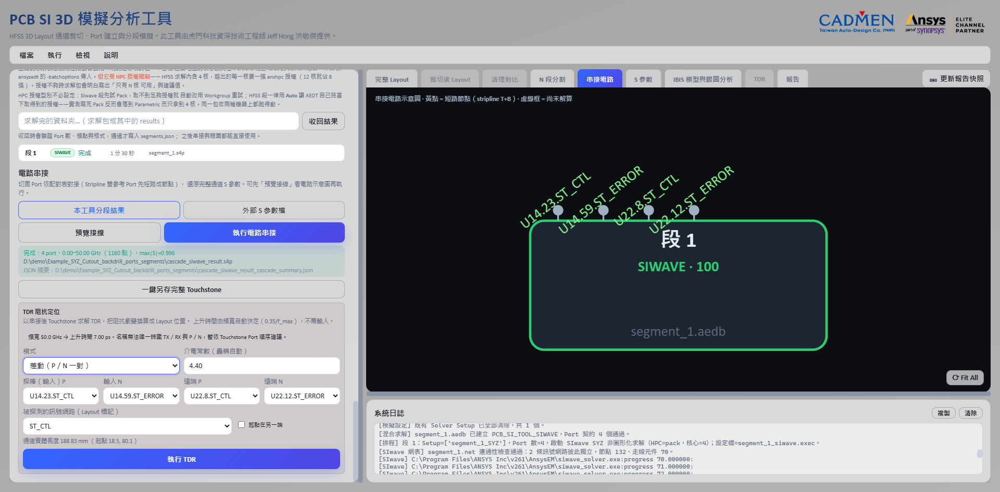

# 排程求解、串接與 S 參數檢視

[回操作說明索引](../../操作說明.md)

## 這一章做什麼

一段一段排隊求解、匯出 Touchstone、串接回完整通道、看 S 參數曲線。
另含「遠端求解包」——把長時間求解丟到別台工作站跑。

**產出的 `.sNp` 是眼圖（第 06 章）與 TDR（第 07 章）的輸入。**

## 排程求解

1. 確認各段 Layout 與切面 Port（`segments.json` 分段完成後自動帶入）。
2. 選求解方式：在「混合求解區域」表逐段指定，或用「套用自動建議」／「全部 HFSS」／
   「全部 SIwave」一次套用。也可以直接點 Layout 上的求解區域色塊切換。
3. 按 **「開始排程模擬」**（有求解計畫時寫「開始混合求解排程模擬」）。
4. 每段先跑 Design Validation，通過才求解；解完立刻匯出 Touchstone 並寫回 `segments.json`。

**每段用獨立的 AEDT 程序**，避免長時間共用同一個 Desktop 造成記憶體累積。
單段失敗會記錄錯誤後繼續下一段。

### 求解器建議怎麼評分

看的是**訊號路徑上有沒有真正的三維不連續**：段內換層、訊號 Via、元件端 launch、
訊號幾何複雜度與參考不連續。

**不列入評分**：板子總層數、GND 縫合 Via 密度、與通道無關的元件——
那些不在訊號路徑上，SIwave 處理得很好，算進去只會把每一段都推向 HFSS。

| 複雜度 | 建議 |
|---|---|
| ≥ 55 | HFSS |
| 30～54 | SIwave（信心較低） |
| < 30 | SIwave（高信心） |

改成非建議的求解器時會顯示警示，**但不會擋你**。

### 執行中與異常處理

- 卡片顯示目前階段（初始網格、Adaptive Pass、Frequency Sweep、Touchstone 匯出），
  有 Monitor Data 時另顯示 Pass、Delta S、目前頻率。
- **連續 15 分鐘沒有可觀測活動只會警告，不會自己停掉求解**——沒動靜不等於壞掉。
- 無法可靠估算工作量時只顯示「活動中」，**不給假的完成百分比**。
- 按「停止」終止目前分段的 AEDT，未開始的段標記為已跳過。
- **網表連通性閘門（SIwave）**：求解一開始就檢查 `.net`，不同訊號落在同一導通區塊
  （被短路）立刻終止那一段，不讓你等整段掃頻跑完。
- **求解完成但匯出失敗**時該段標為「待匯出」，按「重新匯出」或
  「檢查並重試待匯出的 Touchstone（不重新求解）」，**不必重跑求解**。

「求解核心數」預設 4（超過本機核心數自動下修）；「記憶體安全預算」預設 90%，
目前只用於提示與紀錄，不是硬性封頂。

## 遠端求解包（選用）

把求解丟到工作站跑。**求解機只需要裝 AEDT，不需要 Python**。

1. 完成分段後，在「遠端求解包」指定一個**新的空資料夾**，按「匯出求解包」。
2. 整個資料夾複製到求解機，**等複製完全結束**（包內 `ready.flag` 供確認）。
3. 在求解機雙擊 `run_all.bat`。
4. 把 `results` 複製回來，在「求解完的資料夾」指定它，按「收回結果」——
   驗證 Port 數、頻點與格式**通過才寫入** `segments.json`。

核心數用你在求解設定填的值，**不受本機核心數限制**。HPC 授權不用事先設定
（SIwave 先試 Pack 再退 Workgroup，HFSS 用 `Auto`）。

> **HFSS 段的網格階段幾乎是單執行緒**，log 不會增長、CPU 只吃一顆，**看起來很像當掉**。
> 大型分段停在這裡數十分鐘並不罕見，先別中斷。

確認實際拿到的核心數要看授權：HFSS 內含 4 核，超出的每一核吃一張 `anshpc`
（12 核→8 張、36 核→32 張），用 Ansys License Management Center 看最準。

## 電路串接

1. 分段完成後就可以按「預覽接線」（**這時還不需要求解結果**）。
2. 檢查各分段方塊、切面連線與 Stripline 短路節點。
3. 全部求解完成後按 **「執行電路串接」**。
4. 切到「S 參數」分頁看曲線；要另存按「一鍵另存完整 Touchstone」
   （自動修正成正確的 `.sNp` 副檔名）。

看圖：**虛線框**＝還沒解算的分段、**黃色節點**＝需要短路的 Stripline 上下參考 Port、
方塊上標求解器與 Port 數、**頭尾向外伸出的節點就是最終通道的外部 Port**。

**外部 Port 預檢**：沒有元件端 Port 的話，所有 Port 會在串接時被內部對接掉、
最終一個對外 Port 都不剩——工具會在串接前擋下並說明原因。

## S 參數檢視

曲線由 **Port 名稱**自動配對，不用手動指定。

- **模式**：單端（IL＝近端到遠端、RL＝近端反射）或差動（`Sdd21`／`Sdd11`）。
- **曲線**：插入損耗、回波損耗、NEXT、FEXT 可分別開關（串音需辨識出兩組以上通道）。
- **游標讀值**：圖上連按兩下開啟／關閉（預設關閉，避免數值蓋住曲線）。
- **圖例／軸抽屜**：右上角把手展開，含縮放軸模式、Y 軸範圍、Fit All、匯出 Excel。

## 輸出結果

| 產出 | 內容 |
|---|---|
| 各段 `.sNp` | 逐段求解結果，路徑寫回 `segments.json` |
| 串接後 `.sNp` | 完整通道 S 參數——**第 06、07 章的輸入** |
| `*_cascade_summary.json` | 來源 Touchstone、短路群組、接線關係、Port 順序、頻率範圍 |

求解結果記錄來源求解器與指紋，**分段檔案或設定變更後對應結果會標記為過期**，
避免拿舊資料串接。

---

← [04 分段與混合求解](04-分段與混合求解.md)　[回索引](../../操作說明.md)　[06 IBIS 與眼圖](06-IBIS與眼圖.md) →
