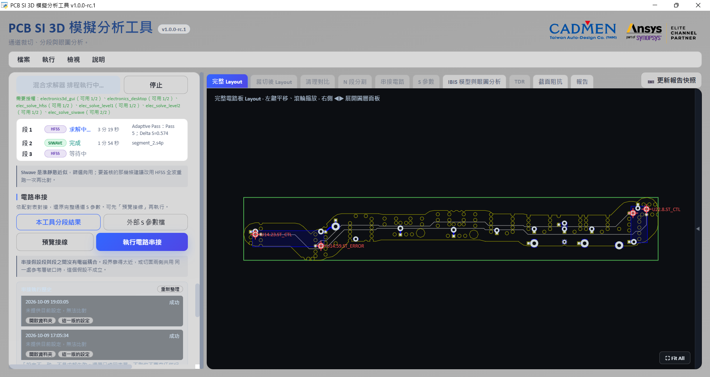

# 排程求解、串接與 S 參數檢視

[回操作說明索引](../../操作說明.md)

每段先取得有效 Touchstone，再串回完整通道。開始前準備 [04](04-分段與混合求解.md) 的 `segments.json`，確認幾何、Port、設定與授權。

## 排程求解

1. 載入本次 `segments.json`，逐段核對 Layout 與指定求解器。
2. 核心數保留 12，記憶體安全預算預設 90%。資源預檢是提示與記錄，不是記憶體硬性封頂。
3. 按「開始排程模擬」或「開始混合求解排程模擬」。各段依序驗證、求解與匯出。
4. 查看段落狀態、求解器、經過時間與進度文字；全部必要段完成並有 `.sNp` 才進串接。

有 HPC 授權／核心錯誤才改 4 cores，保留錯誤原因；不要低於 4。可用授權從「說明」查詢，詳見 [11](11-疑難排解.md)。

求解器建議看訊號路徑的三維不連續與參考狀態，確認方式見 [04](04-分段與混合求解.md#混合求解與刀線微調)。不要把建議分數當成通過精度驗收。

## 狀態、停止與重試

| 畫面狀態 | 代表什麼／下一步 |
|---|---|
| 等待中 | 尚未開始 |
| 求解中 | 看目前階段與進度；無百分比時不自行推算完成度 |
| 待匯出 | 求解結果已保留，Touchstone 尚未成功匯出 |
| 完成 | 已完成匯出；仍須核對埠數與來源 |
| 失敗 | 查看錯誤，修正該段；不可忽略後繼續當完整通道 |
| 已停止／已跳過 | 本次未取得可用結果 |

按「停止」是提出停止要求。**SIwave 會等待當前段解完，該段結果不採用，其餘段跳過**；畫面顯示「停止中…」時不要開新排程。HFSS 依停止流程收尾，也要等排程不再執行。關工具視窗會進停止確認與等待畫面，不能把關窗當作立即釋放授權。

沒有可觀測活動的警告不表示求解失敗；工具不會因此自動停止。先看階段與記錄，別用工作管理員強制砍程序。

「待匯出」時，等排程停止運行，按「重新匯出」或「檢查並重試待匯出的 Touchstone（不重新求解）」。這條路只重試匯出，可能仍需要匯出所需授權；成功後才當作可串接結果。

<!-- 條件待拍：gui-37-pending-export.png；未出現此狀態時不製造示意圖。 -->

遠端打包、求解機執行與結果回收見 [10 其他工作模式](10-其他工作模式.md)，不要手動把未驗證檔名填入本次結果。

## 電路串接

1. 分段後按「預覽接線」，尚未求解也能查映射。
2. 核對切面連線、Stripline 參考短路節點與頭尾外部 Port。預覽中的未求解段不代表已完成。
3. 確認所有必要結果有效後按「執行電路串接」。一段模式直通。
4. 用「一鍵另存完整 Touchstone」另存；副檔名應反映實際埠數。

沒有元件端外部 Port 時，內部對接可能吃掉全部 Port，串接會被阻擋。先回 [03](03-Port與求解設定.md) 修正端點，不刪除檢查。

## S 參數檢視

到「S 參數」核對通道與 Port 配對，再選單端或差動。沒有真實差動對就用單端，四埠檔也不必然是差動通道。IL／RL 與 NEXT／FEXT 可切換；串音需有可辨識的多組通道。

圖上雙擊開關游標讀值，圖例／軸抽屜調範圍、Fit All 與匯出 Excel。檢查頻率上限、曲線圖例與結果來源，不能僅憑曲線平滑判定通道通過。

## 完成判據

保留各段 `.sNp`、更新的 `segments.json`、完整通道 `.sNp` 與 `*_cascade_summary.json`。比對埠數、埠序、頻率範圍、求解器與來源證據；幾何或設定改動後的過期結果須重算／確認，不沿用舊檔冒充本次結果。

接 [06 眼圖](06-IBIS與眼圖.md) 或 [07 TDR](07-TDR定位.md)，報告見 [09](09-報告與輸出.md)。

← [分段與混合求解](04-分段與混合求解.md)　[IBIS 與眼圖](06-IBIS與眼圖.md) →
