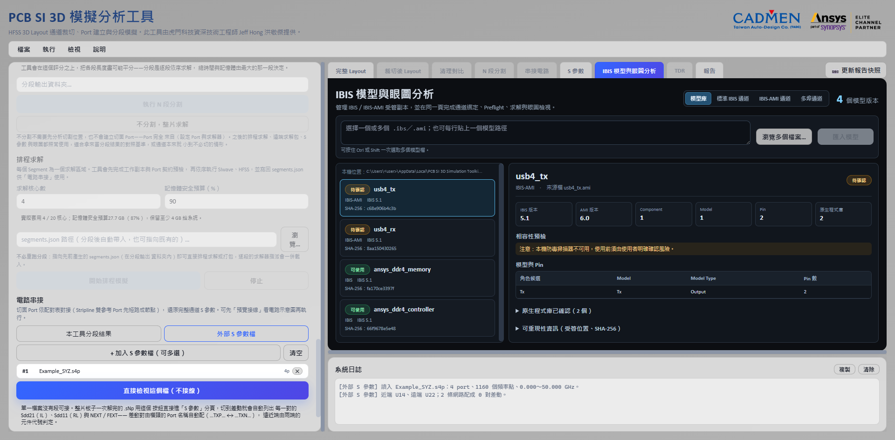
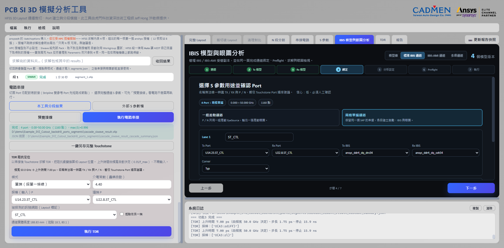
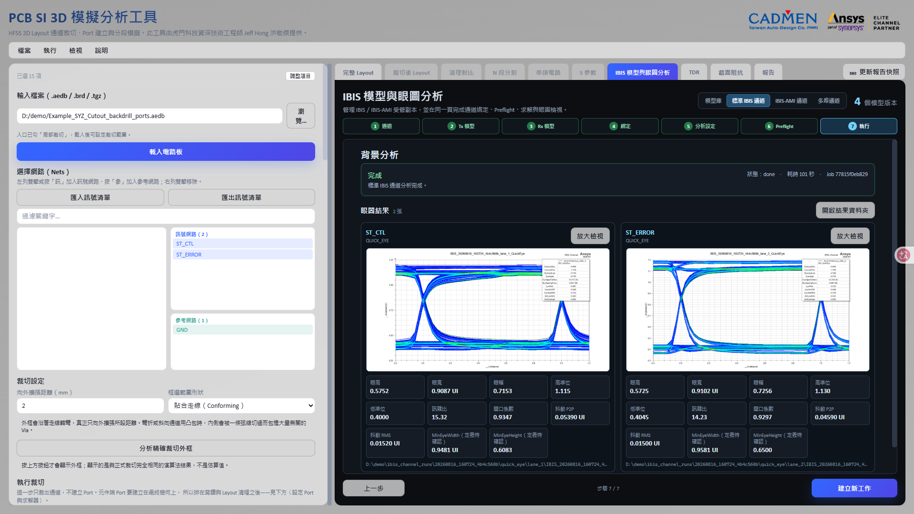

# IBIS 模型與眼圖分析

> 此工具由虎門科技資深技術工程師 Jeff Hong 洪敬傑提供

[回操作說明索引](../../操作說明.md)

## 這個功能在做什麼

**把「晶片送出訊號 → 走過你剛才算完的通道 → 到達另一顆晶片」整條路跑一次，畫出眼圖。**

眼圖是把很多個位元的波形疊在一起看。中間那個張開的洞越大，訊號品質越好。
洞被擠扁了，接收端就有可能判錯。

**IBIS 模型**是晶片廠商提供的緩衝器行為模型，描述那顆晶片推訊號的能力與輸入特性。
沒有它，你只知道通道的損耗，不知道實際訊號長什麼樣。

這個流程本來要在 Circuit 裡手動接，現在放回工具內，
並用受管模型、明確路由與可重現的執行紀錄避免模型或設定被悄悄換掉。

入口畫面只要勾選「IBIS 模型與眼圖分析」。進入之後，模型匯入、通道綁定、分析設定、
Preflight、求解與眼圖結果都集中在右側同名頁籤，左側串接工作列不再顯示眼圖設定。

入口同時勾了「一鍵 HTML 報告」的話，右側頁籤上方會出現「更新報告快照」。
快照會保存當下正在看的模型庫、標準 IBIS／IBIS-AMI 設定或眼圖結果。

標準 IBIS 工作若產生一張以上眼圖，保存快照時除了目前畫面的總覽，
**每張眼圖卡還會各自輸出成獨立的高解析度快照**，包含 Lane 名稱、
QuickEye／Transient 類型、眼高／眼寬與完整眼圖，不會被畫面捲軸裁掉。

## 先匯入模型

**工具會把模型複製一份到自己的資料夾管理，並記下指紋。來源檔保持唯讀。**

1. 開啟右側「IBIS 模型與眼圖分析」頁籤中的「模型庫」。
2. 按「瀏覽多個檔案…」，用 Ctrl／Shift 一次選多個 `.ibs` 或 `.ami`，
   也可以在路徑欄每行貼一個檔案路徑。
   `.ami` 同層只有一個 `.ibs` 引用它時，工具會自動組成完整套件；
   同批檔案指向相同套件時只建立一個受管模型版本。
3. 批次匯入會逐檔回報結果。**單一檔案解析失敗不會取消其他成功的項目**，
   失敗的路徑會留在輸入欄，修正後可以重試。
4. 工具把文字模型、DLL／SO 與相依檔複製到本機受管資料夾，
   保存每個檔案與整個套件的 SHA-256。
5. AMI 套件要先掃描原生程式庫。Windows Defender 不可用時會顯示原因，
   但**使用者仍然必須對完全相同的 SHA-256 明確建立信任**。
6. 第一版正式執行只接受 Windows x64 DLL。Linux SO 會保存在套件裡，
   但不會在 Windows Worker 載入。

### 為什麼要記 SHA-256

**SHA-256 是檔案內容的指紋。內容改一個字，指紋就完全不同。**

`.ibs` 是可以編輯的文字檔，所以內容一變、指紋就變，工具會把它當成**新版本**。

DLL／SO 的信任**不會自動延伸到另一個 Hash**。
**工具也不會因為檔名相同就沿用舊的信任。** 檔名可以一樣，內容可以完全不同。

## 一般 IBIS 通道

「標準 IBIS 通道」用七步向導選 Touchstone、Tx、Rx、Port、Corner 與分析設定。

支援三種拓撲：2-Port 單端、4-Port 差動，
以及**把同一個 S4P 設成兩條彼此耦合的單端 Lane**。

- S4P 的設定位置在第 4 步「綁定」。選「兩條單端通道」後，
  Lane 1／Lane 2 可以分別指定 Tx Port、Rx Port、Tx／Rx IBIS 模型與 Corner。
  **四個 Port 不可重複。**
- 分析完成後，第 7 步直接顯示每條 Lane 的眼圖、眼高與眼寬。
  點圖片或「放大檢視」可以全畫面看；「開啟結果資料夾」會開啟那次 Run 的
  AEDT 專案、圖片與執行紀錄位置。
- **QuickEye 適合快速評估**；**Transient 適合只有 Premium／SIwave 授權，
  或需要時域波形的環境**。
- Auto **只有在 AEDT 明確回報 QuickEye 授權 checkout 失敗時**才改跑 Transient。
  模型、Port 或求解錯誤不會被掩蓋成「自動切換」。
- 一般 IBIS 固定用 NRZ。Tx／Rx Model、Corner、Port 方向及差動 P／N 極性
  **都必須人工確認**。

### 第 6 步 Preflight：警告，但不擋你

**門檻沒過不會阻止分析，只會要求你勾確認框。**

因為擋住的話連結果都出不來，那反而更糟 —— 你連「差多少」都不知道。

Preflight 會列出被動性、因果性、DC 外插、頻寬涵蓋與頻率解析度的逐項判定，
結果會一併寫進報告。

**真正擋下來的只有結構性錯誤**：檔案讀不到、Touchstone 解不開、埠數不符、
含 NaN、只有一個頻點。那些是「這份資料根本不能算」，不是「品質可能不夠好」。

### 雙單端模式：為什麼不拆成兩個 S2P

**拆開來各自跑，兩張眼圖都會偏樂觀。**

因為拆開之後，另一條線的干擾就不見了。實際板子上那條線一直都在那裡。

上圖是同一個 S4P 設成兩條耦合單端 Lane 的結果，整趟 101 秒。

| Lane | 眼高 | 眼寬 | 訊雜比 |
|---|---|---|---|
| Lane 1（ST_CTL） | 0.5752 | 0.9087 UI | 15.32 |
| Lane 2（ST_ERROR） | 0.5725 | 0.9102 UI | 14.23 |

**數字接近是合理的**：兩條走線在同一片板上，長度與疊構都相同。
差異來自各自承受的串擾不同。

雙單端模式的用意就在這裡：**S4P 沒有被拆開**，所以另一條 Lane 的激勵
仍然以串擾源的身分留在模型裡。QuickEye 會逐 Lane 建立目標 Probe 工作並輸出兩張眼圖。

### `MinEyeWidth` 與 `MinEyeHeight` 為什麼標著「定義待確認」

**因為「最小」的那個反而比較大，字面上說不通。**

上圖裡就看得到：

以 ST_CTL 為例：

| | 量到的值 | Min 開頭的那個 |
|---|---|---|
| 眼寬 | 0.9087 UI | `MinEyeWidth` **0.9481 UI** |
| 眼高 | 0.5752 | `MinEyeHeight` **0.6083** |

工具照樣把它取出來給你看，但標示清楚。
**查清楚之前不要拿它做規格判定。** 眼高與眼寬才是定義明確的那兩個。

## IBIS-AMI 通道

**AMI 是晶片廠商附的演算法模型，裡面有等化器這類會主動處理訊號的東西。**

一般 IBIS 只描述緩衝器的電氣行為；AMI 還會告訴你晶片內部怎麼補償通道的損耗。

「IBIS-AMI 通道」也是七步向導，但分析路由改為：

| 路由 | 用途 | 工具行為 |
|---|---|---|
| Auto | 不確定模型該走哪一種方法 | 有 DFE／CDR 等逐位元證據且雙方支援 GetWave 時選 GetWave；其餘優先 Statistical。 |
| Statistical | Init／VerifEye 快速統計眼圖 | 要求 Tx／Rx 都宣告 `Init_Returns_Impulse=True`。 |
| GetWave | 逐位元時域演算法模型 | 要求 Tx／Rx 都宣告 `GetWave_Exists=True`；**失敗時不會靜默改跑 Statistical**。 |
| Statistical＋GetWave | 比較兩種模型行為 | 依序執行兩次並分別保存結果；兩端必須同時支援兩種方法。 |

S4P 的拓撲選擇跟一般 IBIS 一樣，在第 4 步「綁定」：可以設成**一組差動**，
或設成**兩條彼此耦合的單端 Lane**，各自指定 Tx Port、Rx Port 與 Tx／Rx AMI 模型。
四個 Port 不可重複。雙單端同樣不會把 S4P 拆成兩個 S2P，所以保留兩條 Lane 的串擾。

**雙單端的 AMI 會逐條 Lane 各求解一次，時間大約是單條的兩倍。**
原因是 AEDT 對同一個 Setup 只保存第一顆 Probe 的量測資料。

兩次都保留完整的 S4P 與兩組激勵，另一條 Lane 仍然是串擾源。
**兩條 Lane 的碼型 Seed 會自動錯開**，避免兩條完全同步而低估串擾。

### AMI 參數是動態產生的

**不是固定表單。** 工具從 `.ami` 解析 `Usage In／InOut`，
依 Boolean、Integer、Float、List 或 Range 動態產生欄位。

Info／Out 這類唯讀值只用來做能力判斷，**不能由 API 覆寫**。
每次執行會把實際的參數值寫進 `run_manifest.json`。

### PAM4 要有證據才開放

**只有在 Tx 與 Rx 都以模型參數明確宣告相容時，PAM4 才會出現在調變選單。**

不算證據的：檔名含 `PAM4`、使用者手動輸入、只有一端支援。
不符合條件時只提供 NRZ。

## 多埠通道（8 埠以上）

**「多埠通道」處理 8 埠以上的完整通道模型，一次把整組道建成同一個電路，保留道間耦合。**

工具會先看組內有沒有選通參考，據此判定是哪一種分析：

| 有沒有選通參考 | 判定 | 這個數字的意義 |
|---|---|---|
| 有 | 位元組通道 | 相對選通的時序裕度 |
| 沒有 | 多道串擾分析 | 串擾造成的眼圖劣化 |

**兩者的數值不可互相比較。** 多道串擾分析中，每條道是以自己的位元時脈折疊眼圖，
量的不是同一件事。

各道有獨立的 EyeSource、Tx、Rx 與**錯開的亂數 Seed**。
Seed 錯開是為了避免各道完全同步而低估串擾。

**這條路徑用 Transient，所以八條道只需要求解一次就能拿到全部八張眼圖。**
QuickEye 和 AMI 有「一個 Setup 只有第一顆 Probe 有數值」的限制，Transient 沒有。

AEDT 會在建立繪圖時用自己的自動名稱覆蓋指定的名稱，
所以匯出後工具會依道名改檔名，**否則八張眼圖分不出誰是誰**。

### 匯流排方向

**驅動方向由 IBIS 的 `Model_type` 逐道推導，不看 Touchstone 的埠順序。**

推導結果分三種：

| 情況 | 工具行為 |
|---|---|
| 只有一個方向可行 | 方向由 `Model_type` 定死，不必問。使用者指定另一側時回報衝突，不會照做，也不會默默改回正確那側。 |
| 兩側都能驅動 | 這是雙向匯流排，讀與寫的眼圖不同，由哪一側驅動屬於設計條件，**必須由使用者指定**。 |
| 兩個方向都不可行 | 擋下來，並列出哪幾條道擋住了哪個方向、它們兩側各自是什麼 `Model_type`、排除這些道之後可行的方向是什麼。 |

**方向不只是標籤，它決定電路怎麼接。** 驅動側接不含 ODT 的緩衝器變體，
接收側接開了 ODT 的那一顆。

**接反之後電路照樣解得動、眼圖照樣畫得出來**，只是量到的是反方向的通道，
而且**沒有任何自動跡象**。所以送解之前會依指定的驅動側重算一次每條道的輸入與輸出，
不沿用前端送來的埠順序。

分側本身也可能有歧義。多組共同字都能把埠二分成兩堆時
（例如 `u14`／`u22` 與 `ctl`／`error` 同時成立），工具無法判斷哪一組代表兩側，
會要求先解決再繼續。

### 決定性最差碼型

**隨機碼型幾乎必然錯過真正的最差串擾，而眼圖看起來完全正常。**

最差的情況是：所有干擾線在同一個位元時間一起往反方向切換。
隨機碼型要湊到這個組合，機率很低。

所以預設不用隨機碼型，改用時間多工的決定性碼型：
第 k 段讓第 k 條道當受害者，其餘各道同步反向切換。
受害者翻轉前先保持相反位準 4 個 UI，把最大的 ISI 疊上去。

單一碼型無法讓所有道同時處於最差態，但**每條道只要在自己那一段遇到最差態就夠了**，
八張眼圖仍然出自同一次求解。

實測對照（同一電路，只換碼型）：

| 碼型 | UI 數 | 耗時 | 涵蓋 |
| --- | ---: | ---: | --- |
| 隨機（PRBS） | 20,000 | 116.6 s | 最差對齊期望出現 1.22 次 |
| 決定性最差 | 128 | 3.1 s | 每條道各**必然**發生一次 |

**156 分之一的 UI 數，換到確定的涵蓋。**

耗時會隨機器負載變動，同一組設定的 20,000 UI 在兩次量測分別是 250.9 s 與 116.6 s，
**比值才是重點，絕對秒數不是。**

位元組通道的選通對不套用最差碼型，改用互補時脈驅動，
否則差動選通不會過零。

> **決定性碼型下的眼圖是 128 個 UI 的疊加，不是統計眼圖，軌跡種類本來就少。**
> 它回答的是最差那一條軌跡走到哪裡，不是 BER 曲線長什麼樣。
> 所以眼高眼寬一律標為不可用，保留 AEDT 原生的眼圖與波形，
> 不把工具自行推導的數字冒充成求解器量測。

## 輸出與安全邊界

- 每次工作建立**不可變**的 Run 資料夾，保存 Touchstone、Tx／Rx 模型快照、
  SHA-256、Port 綁定、激勵、路由決策、AEDT／PyAEDT／PyEDB 版本與結果路徑。
- AMI DLL 只在獨立的非圖形化 AEDT Worker 載入。
  首次成功最小分析之後，三階段驗證狀態才會從「尚未實際驗證」改成通過。
- Statistical／GetWave 會輸出 impulse 與 Statistical Eye 高解析圖片。
  一維 impulse 可輸出 CSV；**二維 Eye histogram 不直接匯成巨大的 CSV**，
  以免 AEDT 長時間卡在後處理。

> **這個階段的結果只證明流程可以建立與求解。**
> 正式產品簽核仍然應該用固定模型、通道與原生 Circuit Golden Baseline
> 比對眼高、眼寬、BER／Bathtub 或 histogram，**不是只看「求解成功」**。

---

← [排程求解、串接與 S 參數檢視](05-排程與串接.md)　[回索引](../../操作說明.md)　[TDR 阻抗定位](07-TDR定位.md) →

> 此工具由虎門科技資深技術工程師 Jeff Hong 洪敬傑提供
