# IBIS 模型與眼圖分析

[回操作說明索引](../../操作說明.md)

## 這一章做什麼

把「晶片送出訊號 → 走過你算完的通道 → 到達另一顆晶片」跑一次，畫出眼圖。

**需要**：兩側的 `.ibs`，以及第 05 章串接後的 Touchstone
（只看模型本身的話，「快速檢驗」不需要 Touchstone）。

右側四個分頁：**模型庫**、**多埠通道**（一般 IBIS，含 DDR）、
**AMI 通道**（IBIS-AMI，SerDes 類）、**S 參數工具箱**。

**標準流程都是同一條**：

> 匯入（工具自動修）→ 快速檢驗（先看基準眼）→ 接上真實通道 → 出眼圖（跟基準比）

| 你想做什麼 | 跳到 |
|---|---|
| 匯入模型、看模型有沒有問題 | [先匯入模型](#先匯入模型)、[錯誤不擋路](#錯誤不擋路帶錯誤放行) |
| 沒有模型，只有量測 | [從量測建模](#從量測建模只有示波器量測也能生出-ibis) |
| 確認一顆模型解得動 | [用參考通道健檢](#用參考通道健檢一顆模型) |
| DDR：一整組通道的眼圖與時序裕度 | [多埠通道](#多埠通道8-埠以上) |
| SerDes：AMI、等化掃描 | [AMI 通道](#ami-通道ibis-amiserdes-類) |
| 看不懂結果裡的數字 | [眼圖的那些數字](#眼圖的那些數字怎麼判讀) |

## 先匯入模型

1. 開「模型庫」分頁，按「瀏覽多個檔案…」（Ctrl／Shift 可多選 `.ibs` 或 `.ami`），
   或在路徑欄每行貼一個路徑。
2. 逐檔回報結果；**單一檔案失敗不會取消其他成功的項目**。
3. AMI 套件要先掃描原生程式庫，**使用者必須對完全相同的 SHA-256 明確建立信任**。

模型複製到受管資料夾並記下每檔與整包的 SHA-256，**來源檔保持唯讀**。內容改一個字
指紋就變，會被當成新版本；DLL 的信任**不因檔名相同而沿用**。正式執行只接受
Windows x64 DLL，Linux `.so` 保存但不載入。

### 匯入時工具會自動修掉的東西

實測 158 份流通中的客戶模型，**每兩份就有一份檔名不合規**，其中幾類 AEDT 直接拒收。
規格寫死唯一答案的缺陷匯入時自動修：UTF-8 BOM、檔名與 `[File_name]` 對齊、
I-V 表超過 100 點時重取樣、補上漏寫的 `[Model Selector]`（檔內有同前綴家族當證據時）。

**修的是受管副本，來源檔一個位元都不動**；逐筆可查；**沒有證據就不亂修**。

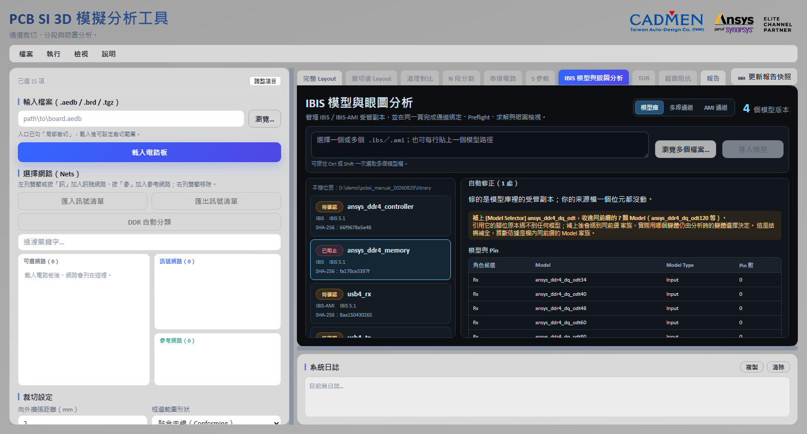

### 錯誤不擋路：帶錯誤放行

修不掉的錯誤照原話列在「相容性預檢」，**但分析照樣可以跑**——ibischk 判 ERROR 的
「檔名不一致」AEDT 照樣解得動，擋在門口的話這些模型連「AEDT 收不收」都無從得知。
錯誤原話會跟著結果一起顯示。

真正會擋下來的只有兩種：**這一側連一顆候選模型都沒有**、**AMI 的 DLL 還沒信任**。

## 從量測建模：只有示波器量測也能生出 IBIS

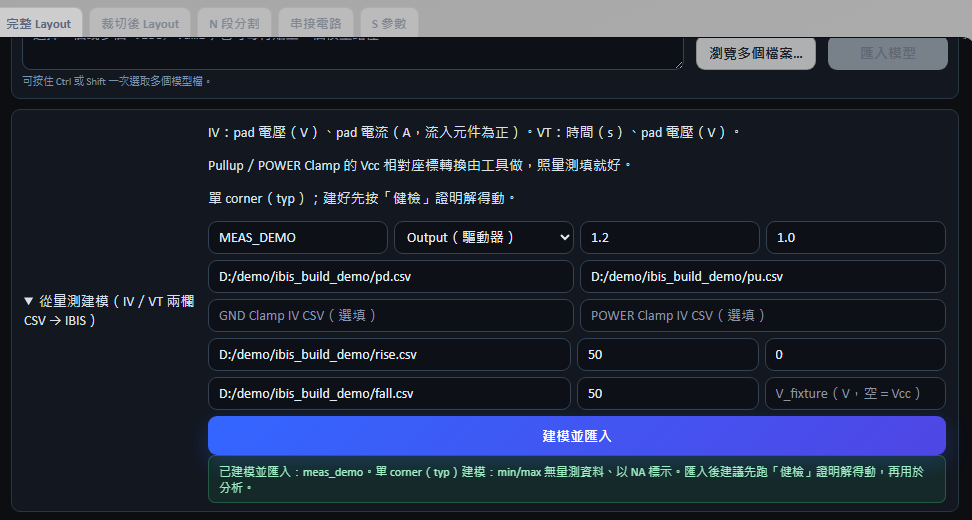

輸入是兩欄 CSV（表頭自動跳過）：

- **IV 曲線**：pad 電壓（V）、pad 電流（A，**流入元件為正**）。Pulldown／Pullup 必填。
- **VT 波形**：時間（s）、pad 電壓（V），並填該波形的 fixture（R_fixture／V_fixture）。

三件工具代勞的事：**Pullup／POWER Clamp 的 Vcc 相對座標轉換**（量測轉 IBIS 最常見的錯誤）、
**[Ramp] 由 VT 波形 20–80% 自動導出**、**量測整形**（重複點取平均、時間軸歸零、
超規範上限抽點——每一項更動都列在完成訊息裡）。

**單 corner（typ）**：min／max 沒有量測資料就標 `NA`，不假造。
Input／I/O 要求明填 Vinl／Vinh——門檻猜錯會讓時序量測整批偏移**而且看起來完全正常**。

建好之後就是模型庫裡的正常套件。**第一件事是按健檢**證明它解得動。

## 用參考通道健檢一顆模型

每份模型有一顆「用參考通道健檢」：拿自產的無損 50Ω 傳輸線實際開 AEDT 解一次。
掃描 209 份客戶模型發現，有兩類失敗（`AMI_Init()` 拒絕初始化、算不出步階響應）
**只有真的求解才會現形**。買到的是歸因：**健檢過、真通道失敗＝通道問題；
健檢不過＝模型問題。** 結果以 SHA-256 快取。

**秒測**（AMI 套件限定）用 SPISim 引擎直接驅動 DLL（免授權），一秒回等化前後波形
與生效的 preset。**健檢問「AEDT 解不解得動」，秒測問「等化真的有沒有動作」。**

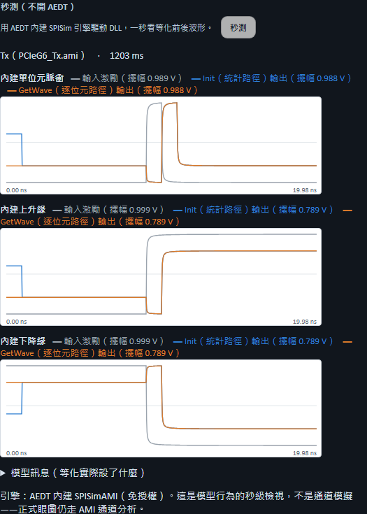

## 多埠通道（8 埠以上）

一次把整組道建成同一個電路，保留道間耦合。

### 操作步驟

1. 選兩側模型：**「IBIS 模型套件（驅動側）」**與**「另一側的模型套件」**
   （留空＝兩側同料號），各有一顆匯入按鈕。
2. 按 **「快速檢驗（不需 Touchstone）」** 看基準眼。
3. 填 Touchstone、資料率，確認方向與分側。
4. 需要時展開「以選通為時間基準量 Setup／Hold」或 Corner 掃描。
5. 執行分析。

> **兩顆匯入按鈕寫明側別，按錯不會有任何錯誤訊息**——訊號名兩側相同，
> 綁定證據照樣 high、眼圖照畫。選完請核對「群組判定」的「模型套件：第 N 側 ＝ …」。

### 快速檢驗：先看基準眼

兩側模型背對背接上自產的無損 50Ω 參考線跑一次——這張眼回答
「**這對模型在這個資料率下，眼睛本來張多開**」。

| 基準眼 | 結論 |
|---|---|
| 張得開 | 模型與資料率沒問題，往下接真實通道 |
| 就很差或閉合 | 別去查板子——是模型選錯變體、資料率超出能力、或模型本身的問題 |
| AEDT 拒收 | 拒收原話就是結果，拿去換模型或找原廠 |

勾**「用有損參考通道」**改用 Nyquist 處 −10 dB 的因果趨膚模型，
兩張基準眼一比就是最快的損耗敏感度檢查。

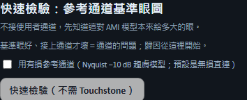

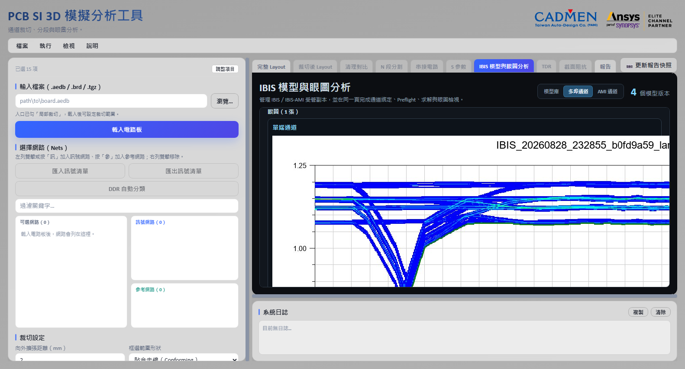

### 位元組通道與多道串擾

工具先看組內有沒有選通參考：

| 有沒有選通 | 判定 | 數字的意義 |
|---|---|---|
| 有 | 位元組通道 | 相對選通的時序裕度 |
| 沒有 | 多道串擾分析 | 串擾造成的眼圖劣化 |

**兩者的數值不可互相比較**——多道串擾中每條道以自己的位元時脈折疊，量的不是同一件事。

各道有獨立的 EyeSource、Tx、Rx 與**錯開的亂數 Seed**（避免各道同步而低估串擾）。
這條路徑用 Transient，**八條道只需要求解一次**就拿到全部八張眼圖。

### 決定性最差碼型

最差情況是所有干擾線在同一位元時間一起反向切換，**隨機碼型幾乎必然錯過，
而眼圖看起來完全正常**。預設改用時間多工的決定性碼型：第 k 段讓第 k 條道當受害者、
其餘同步反向切換，**128 UI／3.1 秒讓每條道各必然發生一次最差對齊**
（隨機碼型跑 20,000 UI／116.6 秒也只期望出現 1.22 次）。

> 決定性碼型下的眼圖是 128 個 UI 的疊加，**不是統計眼圖**。眼高眼寬一律標為不可用，
> 只保留 AEDT 原生的眼圖與波形。

### 匯流排方向

方向由 IBIS 的 `Model_type` 逐道推導，**不看 Touchstone 的埠順序**：

| 情況 | 工具行為 |
|---|---|
| 只有一個方向可行 | 定死不問；指定另一側時回報衝突，不照做也不默默改回 |
| 兩側都能驅動 | 雙向匯流排，讀寫眼圖不同，**必須由使用者指定** |
| 兩個方向都不可行 | 擋下並列出哪幾條道擋住哪個方向 |

**方向決定電路怎麼接**（驅動側接不含 ODT 的變體、接收側接開了 ODT 的）。
**接反之後電路照樣解得動、眼圖照樣畫得出來，而且沒有任何自動跡象。**

### 位址命令群（fly-by）

展開「位址命令群」填驅動端元件與接收顆粒，工具把埠名攤成「網路@顆粒」的道清單，
電路一對多接，逐顆粒啟動分析。結果另附 **CK 邊緣單調性**（AC 區間內回頭＝double
clocking 風險，眼圖看不出來）與 **JEDEC slew 極值**（derating 查表用）。

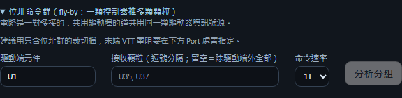

### DDR 時序裕度

勾「以選通為時間基準量 Setup／Hold」才會量；不勾只出眼圖（那是串擾劣化，不是裕度）。

- **方向決定選通相位**：寫入時 DQS 已對齊眼中央，讀取是邊緣對齊、量測端要補回 0.5 UI。
  **方向填錯，Setup 與 Hold 會全部趨近於零**，看起來像通道爛掉。
- **判讀準位**用 VDDQ、AC 偏移、DC 偏移導出四個門檻。**AC 嚴、DC 鬆不是筆誤**：
  Setup 看資料最後一次到達 AC 準位、Hold 看它離開 DC 準位，填成一樣會讓 Hold 系統性偏小。
- **裕度 ＝ 量到的時間 − 規格要求 − derating**。tDS／tDH 都留空就只出時間、
  不判 Pass／Fail——**工具不內建任何 JEDEC 數值**。
- **Derating 表**選填（斜率→加的 ps），有表時**逐個選通邊各自查表再取最差**。
- **Rx 遮罩**（寬 UI、高 mV）是 DDR4 以後資料群的判準，與 setup／hold 是兩套。

> **遮罩「通過」只是必要條件**——JEDEC 遮罩是給 BER 1e-16 的統計眼圖用的，
> 暫態眼圖跑不到那個位元數。

### Corner 掃描

可勾 Typical／Slow／Fast，另有「同時跑讀取與寫入」。**只有 IBIS Corner 不同，
其餘設定完全相同**；跑完依結果排序，**最差條件由量測排出來，不預設 Slow 最差**——
快邊緣的反射與串擾更大，實測就有 Fast 最差的案例。

## AMI 通道（IBIS-AMI，SerDes 類）

PCIe、USB4 這類帶等化演算法（DLL）的模型走這裡。流程同一條，只多一個安全步驟：
**DLL 要先在模型庫掃描並建立信任**。

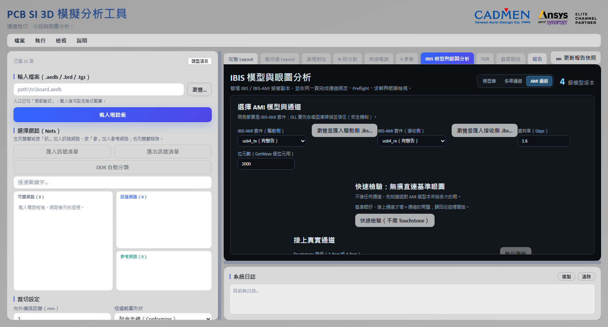

- **分析路由預設「自動」**：模型宣告支援什麼就用什麼，可手動指定或兩種都跑。
  **GetWave 失敗不會靜默改跑 Statistical**——那是兩種不同的計算。
- **調變預設 NRZ**；PAM4 只在兩側都明確宣告時開放。
- **AMI 參數採 `.ami` 內建預設**。你親手設的參數若寫不進 AEDT 會擋下來；
  預設參數寫不進去則略過並記錄——**不做無聲的事**。
- 接真實通道支援 2-Port 單端、4-Port 差動、4-Port 雙單端；預檢帶好建議值供核對。

### 秒級預覽與統計眼（不開 AEDT）

把 2 埠 Touchstone 換算成單位元脈衝響應，餵 Tx 再串給 Rx（兩段 SPISim 引擎），
幾秒回三樣：等化後波形、隨機位元疊圖、**最壞情況統計眼**（peak distortion）。

**這是保守預估，不是簽核**：走 Init（LTI）路徑，未含 CDR 抖動、雜訊與逐位元非線性。
價值在方向——最壞情況都張得開，正式分析大概率更好；全閉就先調等化，別急著開 AEDT。

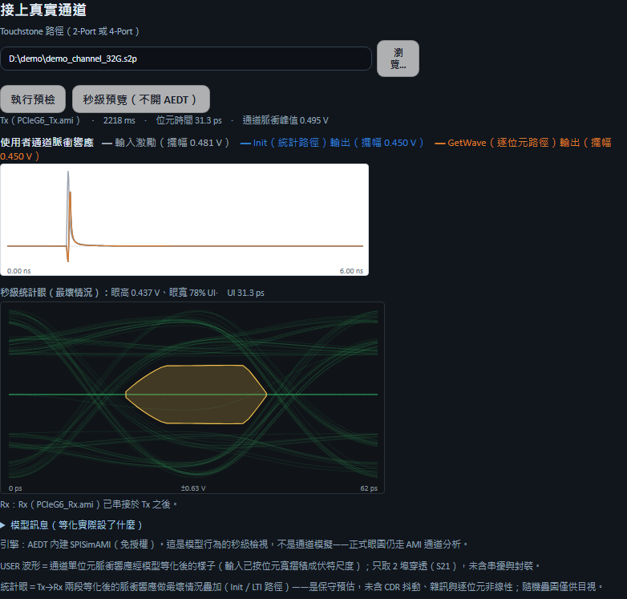

眼圖下方固定附 **BER 1e-12 外插**（σ 是假設值、原樣標明）。展開「DDR4 Rx 遮罩統計簽核」
填遮罩尺寸，下次預覽多一行 **BER 1e-16 的遮罩簽核**。

### 等化掃描：哪一組等化在我的通道上眼最大

把模型的等化選項（PCIe 的 PRESET、CTLE 檔位…）逐組掃過，依統計眼高排名。
PCIe G6 的 P0–P9 約二十秒掃完；點任一列可把該組套進進階 AMI 參數。

實例：USB3.2 Gen2 對接在 −10 dB 通道上預設檔位全閉，掃 Rx 的 ADC 檔位後
−5 檔眼開 0.307 V——**「模型壞了」與「等化沒調」是兩回事**。

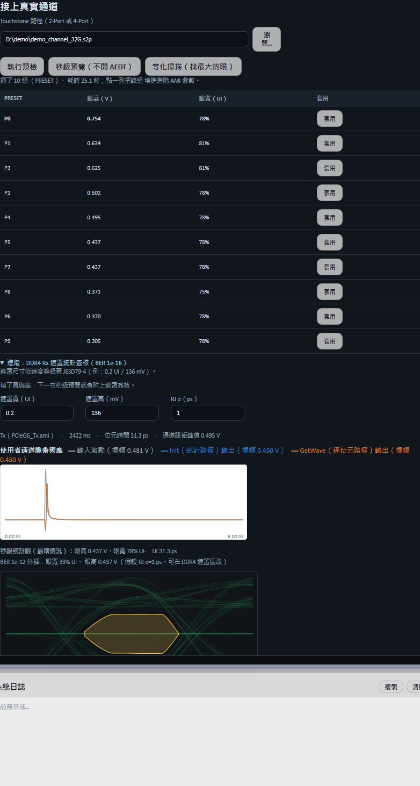

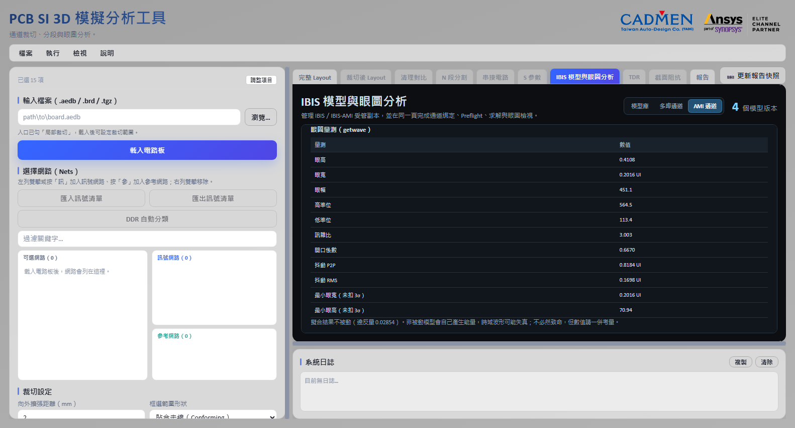

## S 參數工具箱與 IEEE COM 簽核

**免授權的 S 參數處理**（skrf 實作）：重正規化、換埠序、重取樣、DC 外插、
2 埠去嵌入、翻面。輸出寫進 `sparam_processed/`，**絕不動來源檔**。

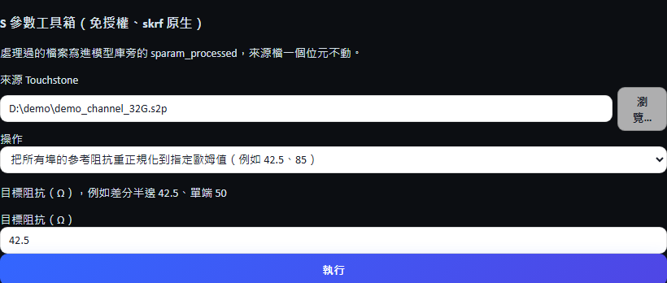

**IEEE COM 簽核**：對串接後通道算 Channel Operating Margin，內建 26 份標準組態
（100GBASE-CR4／KR4／KP4 到 CEI-112G 與 1.2T），不必自己填門檻。背景執行、可取消，
報告與 IL／RL／ILD 曲線落在 `com_reports/`。

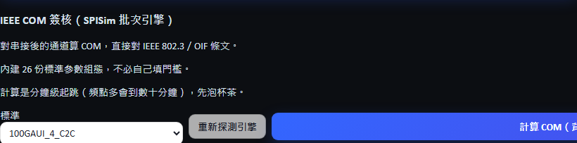

> 時域 COM 的頻譜外插**以小時計**（通道要 4 埠差分，2 埠只出頻域曲線）。
> 勾「夜間掛機」把逾時放寬到 12 小時，產物隔天都在 `com_reports/`。

## 眼圖的那些數字怎麼判讀

`EyeHeight = (高準位 − 3σ₁) − (低準位 + 3σ₀)`，上下共扣 6σ，
所以**本來就比圖上看起來的小**——它答的是扣掉抖動還剩多少裕度，**規格判定用它**。

`MinEyeWidth`／`MinEyeHeight` **不扣 3σ**，量的是最窄／最矮的那條軌跡。
**Min 系列比統計值大是預期行為**，兩者不能互相比較。

交越振幅與眼睛量測點預設由求解器算，**兩者都可手動指定**，指定後在你給的位置重算。

## 輸出結果

- **不可變的 Run 資料夾**：Touchstone、Tx／Rx 模型快照、SHA-256、Port 綁定、激勵、
  路由決策、AEDT／PyAEDT／PyEDB 版本與結果路徑。
- 眼圖（每張眼圖卡另出獨立高解析快照）、11 項眼圖量測、DDR 時序裕度表、
  AMI 的等化掃描排名與統計眼。
- 匯出後**拿產出去對請求**：波形時間夠不夠、圖檔是不是空的、Touchstone 埠數對不對——
  這幾件事出錯時都不會有錯誤訊息。
- **每個 Corner 各自一個輸出目錄**：共用目錄會讓求解器帶著上一個 Corner 的狀態，
  實測共用 32.5 ps、分開 15.7 ps，兩次都「成功」。

> **目前所有結果都是理想電源**：驅動器直接接 IBIS 宣告的電壓，未經板子的 PDN，
> 不含同時切換雜訊，**裕度是樂觀值**。DesignCon 的 DDR3／DDR4 實測：
> 理想 0.058 UI、含串擾與 SSN 0.31 UI，**五倍**。

> **求解成功不等於簽核。** 正式簽核仍應用固定模型、通道與原生 Circuit Golden
> Baseline 比對。

---

← [05 排程與串接](05-排程與串接.md)　[回索引](../../操作說明.md)　[07 TDR 定位](07-TDR定位.md) →
