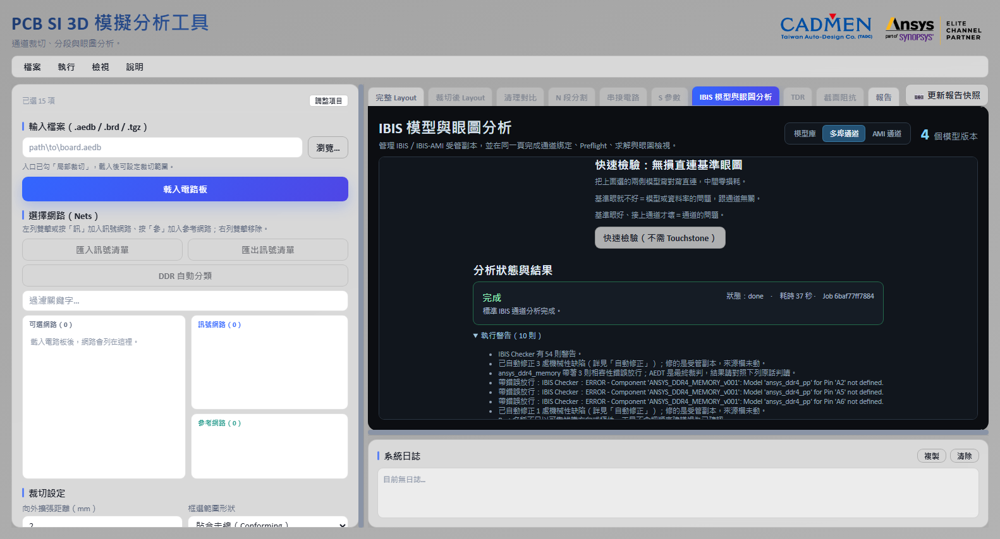

# IBIS 模型與眼圖分析

[回操作說明索引](../../操作說明.md)

## 這個功能在做什麼

**把「晶片送出訊號 → 走過你剛才算完的通道 → 到達另一顆晶片」整條路跑一次，畫出眼圖。**

眼圖是把很多個位元的波形疊在一起看。中間那個張開的洞越大，訊號品質越好。
洞被擠扁了，接收端就有可能判錯。

**IBIS 模型**是晶片廠商提供的緩衝器行為模型，描述那顆晶片推訊號的能力與輸入特性。
沒有它，你只知道通道的損耗，不知道實際訊號長什麼樣。

這個流程本來要在 Circuit 裡手動接，現在放回工具內，
並用受管模型、明確路由與可重現的執行紀錄避免模型或設定被悄悄換掉。

入口畫面只要勾選「IBIS 模型與眼圖分析」。進入之後右側同名頁籤有三個分頁：
**「模型庫」**管模型，**「多埠通道」**分析一般 IBIS（含 DDR），
**「AMI 通道」**分析 IBIS-AMI（SerDes 類，如 PCIe／USB）。
左側串接工作列不再顯示眼圖設定。

> 2026-08-19 曾把點對點與 AMI 的介面收掉（ADR-0055）；**AMI 分析
> 2026-08-28 以「AMI 通道」分頁重建回來了**，單端、差動與雙單端三種
> 接法都走得通，見本章後段。本章早期版本描述的七步向導已不存在。

不管拿到什麼模型，標準流程都是同一條：

> **匯入（工具自動修）→ 快速檢驗（先看基準眼）→ 接上真實通道 → 出眼圖（跟基準比）**

快速檢驗那一步是整條流程的保險：先知道這對模型**本來**給多大的眼，
之後接上真實通道，看到的劣化才指得出方向。

入口同時勾了「一鍵 HTML 報告」的話，右側頁籤上方會出現「更新報告快照」。
快照會保存當下正在看的模型庫或分析結果；產生一張以上眼圖時，除了畫面總覽，
**每張眼圖卡還會各自輸出成獨立的高解析度快照**，包含道名、眼高眼寬與完整眼圖，
不會被畫面捲軸裁掉。

## 先匯入模型

**工具會把模型複製一份到自己的資料夾管理，並記下指紋。來源檔保持唯讀。**

1. 開啟右側「IBIS 模型與眼圖分析」頁籤中的「模型庫」。
2. 按「瀏覽多個檔案…」，用 Ctrl／Shift 一次選多個 `.ibs` 或 `.ami`，
   也可以在路徑欄每行貼一個檔案路徑。
   `.ami` 同層只有一個 `.ibs` 引用它時，工具會自動組成完整套件；
   同批檔案指向相同套件時只建立一個受管模型版本。
3. 批次匯入會逐檔回報結果。**單一檔案解析失敗不會取消其他成功的項目**，
   失敗的路徑會留在輸入欄，修正後可以重試。
4. 工具把文字模型、DLL／SO 與相依檔複製到本機受管資料夾，
   保存每個檔案與整個套件的 SHA-256。
5. AMI 套件要先掃描原生程式庫。Windows Defender 不可用時會顯示原因，
   但**使用者仍然必須對完全相同的 SHA-256 明確建立信任**。
6. 第一版正式執行只接受 Windows x64 DLL。Linux SO 會保存在套件裡，
   但不會在 Windows Worker 載入。

### 為什麼要記 SHA-256

**SHA-256 是檔案內容的指紋。內容改一個字，指紋就完全不同。**

`.ibs` 是可以編輯的文字檔，所以內容一變、指紋就變，工具會把它當成**新版本**。

DLL／SO 的信任**不會自動延伸到另一個 Hash**。
**工具也不會因為檔名相同就沿用舊的信任。** 檔名可以一樣，內容可以完全不同。


## 匯入時工具會自動修掉的東西

**真實世界的模型檔很少是乾淨的。** 拿 158 份實際流通的客戶模型實測，
每兩份就有一份檔名不合規、四分之一的 I-V 表超過規格上限——而其中幾類
會讓 AEDT 直接拒收，不修就完全沒有結果。

規格寫死了唯一答案的缺陷，工具在匯入時自動修：

| 修什麼 | 為什麼 | 對結果的影響 |
|---|---|---|
| 移除檔案開頭的 UTF-8 BOM | IBIS 要求 7-bit ASCII，檢查器對 BOM 直接報錯 | 零 |
| 檔名與 `[File_name]` 對齊（不一致／含大寫／超過 24 字元） | 後兩類實測 AEDT 直接拒收 | 零（改檔名或一行標頭） |
| I-V 表超過 100 點時均勻重取樣到 100 點 | 超限的模型 AEDT 一律拒收 | 曲線重取樣，對平滑的 I-V 影響極小 |
| 補上漏寫的 `[Model Selector]`（檔內有同前綴的 Model 家族當證據時） | 引用它的腳位原本綁不到任何模型 | 腳位從綁不到變綁得到 |

三件事讓這個機制可以放心用：

1. **修的是模型庫裡的受管副本，你的來源檔一個位元都不動。**
2. 每一筆修了什麼、依據為何、對結果可能的影響，都記錄在該模型的
   「自動修正」區，逐筆可查。
3. 沒有證據就不亂修——例如懸空引用找不到同前綴家族時，錯誤留在原地。


## 錯誤不擋路：帶錯誤放行

**相容性檢查的職責是告知，不是門禁；AEDT 才是最終裁判。**

修不掉的錯誤（例如引用了檔案裡真的不存在的模型）會照原話列在
「相容性預檢」，選單上也標著「有錯誤」——**但分析照樣可以跑**。
理由是量測出來的：ibischk 判 ERROR 的「檔名與 File_name 不一致」，
AEDT 照樣解成功；套件多帶一顆 32 位元 DLL 被記錯誤，AEDT 用的其實是
旁邊那顆 64 位元的。擋在門口的話，這些模型連「AEDT 收不收」都無從得知。

放行不等於沒講：

- 原話全數轉成警告，跟著執行紀錄與結果一起顯示——你看眼圖時
  看得到「這是帶著哪幾則錯誤跑出來的」。
- AEDT 真的拒收時，它自己的錯誤訊息會如實回報。那個拒收訊息本身
  就是結果，可以拿去跟模型原廠談。

真正會擋下來的只剩兩種：這一側連一顆候選模型都沒有（電路組不起來），
以及 AMI 的 DLL 還沒掃描與信任（安全機制，不是相容性判斷）。

## 從量測建模：只有示波器量測也能生出 IBIS

原廠不給模型、手上只有 SMU 掃的 IV 曲線與示波器量的轉換波形——模型庫
的「從量測建模」把它們變成一份合規的 `.ibs` 並直接匯入：


輸入都是兩欄 CSV（表頭自動跳過）：

- **IV 曲線**：pad 電壓（V）、pad 電流（A，**流入元件為正**）。
  Pulldown／Pullup 必填（驅動器類），兩個 Clamp 選填。
- **VT 波形**：時間（s）、pad 電壓（V），並填該波形的 fixture
  （R_fixture／V_fixture——量測時掛的負載，照實填）。

三件工具代勞、不必自己算的事：

1. **Pullup／POWER Clamp 的座標轉換。** IBIS 規定這兩張表用「相對 Vcc」
   座標（表格電壓＝Vcc − pad 電壓）——這是量測轉 IBIS 最常見的錯誤，
   工具照量測的 pad 座標收、自己轉。
2. **[Ramp] 自動導出**：取 VT 波形的 20–80% 區間（IBIS 的定義），
   不讓人填——填錯的 Ramp 會讓眼圖失真得很合理。
3. **量測整形**：重複電壓點取平均、時間軸平移到 0 起算、超過規範
   上限的點數等距抽點——每一項更動都列在完成訊息裡，不做無聲修改。

誠實邊界，寫在產出檔案裡：**單 corner（typ）**。min／max 需要另外
兩組量測，沒有就標 `NA`，不假造。Input／I/O 類型要求明填
Vinl／Vinh（資料手冊或量測值）——門檻猜錯的話時序量測會整批偏移，
而且看起來完全正常，所以工具不猜。

建好之後它就是模型庫裡的一份正常套件：受管副本、SHA-256、配對
相容性都照舊。**第一件事是按「健檢」**（下一節）證明它真的解得動。

## 用參考通道健檢一顆模型

模型庫每份模型有一顆**「用參考通道健檢」**按鈕：拿工具自產的無損 50Ω
傳輸線實際開 AEDT 解一次。掃描 209 份客戶模型的結論是，有兩類失敗
（AMI 的 `AMI_Init()` 拒絕初始化、求解器算不出步階響應）**只有真的
求解才會現形**，任何靜態檢查都抓不到。

健檢買到的是歸因：**健檢過、真通道失敗＝通道問題；健檢不過＝模型問題。**
結果以套件內容的 SHA-256 快取，同一份內容不用重測。

## 秒測：一秒看等化有沒有動作（不開 AEDT）

健檢要開 AEDT 跑約一分鐘；IBIS-AMI 套件還有一顆更快的**「秒測」**——
用 AEDT 內建的 SPISim AMI 引擎直接驅動模型 DLL（免授權），一秒回
等化前後的波形，以及等化實際生效的參數（例如用了 .ens 等化表的哪一列
preset）。兩者互補：**健檢問「AEDT 解不解得動」，秒測問「等化真的有
沒有動作」**。

秒測與正式分析走同一條安全規則：DLL 未完成掃描與信任前按鈕是停用的。


## 多埠通道（8 埠以上）

**「多埠通道」處理 8 埠以上的完整通道模型，一次把整組道建成同一個電路，保留道間耦合。**

### 先選兩側的 IBIS

**DDR 的兩端永遠是兩家料號，所以第一區有兩個下拉、兩顆按鈕。**

| 欄位 | 意思 |
|---|---|
| 「IBIS 模型套件（驅動側）」 | 推訊號那一側的模型 |
| 「另一側的模型套件」 | 對側的模型。留空代表**兩側同一料號** |

各自配一顆按鈕：**「瀏覽並匯入驅動側 .ibs…」**與**「瀏覽並匯入另一側 .ibs…」**，
可以在這一頁直接匯入，不必先跑去「模型庫」分頁。

**兩顆按鈕的文字刻意寫明側別。** 它們寫的是不同的欄位，按錯就把控制器的模型
選進顆粒那一側——而訊號名兩側相同，綁定證據照樣是 high，眼圖照畫、預檢照過，
**沒有任何錯誤訊息**。選完請自己核對「群組判定」區的「模型套件：第 N 側 ＝ …」。

只給一份 `.ibs` 不會「綁不上」，會**兩側綁到同一顆模型**，等於用控制器的緩衝器
去模擬顆粒。

工具會先看組內有沒有選通參考，據此判定是哪一種分析：

| 有沒有選通參考 | 判定 | 這個數字的意義 |
|---|---|---|
| 有 | 位元組通道 | 相對選通的時序裕度 |
| 沒有 | 多道串擾分析 | 串擾造成的眼圖劣化 |

**兩者的數值不可互相比較。** 多道串擾分析中，每條道是以自己的位元時脈折疊眼圖，
量的不是同一件事。

各道有獨立的 EyeSource、Tx、Rx 與**錯開的亂數 Seed**。
Seed 錯開是為了避免各道完全同步而低估串擾。

**這條路徑用 Transient，所以八條道只需要求解一次就能拿到全部八張眼圖。**
AEDT 的 QuickEye 與 AMI 求解模式有「一個 Setup 只有第一顆 Probe 有數值」的限制，
Transient 沒有——這是多道走 Transient 的原因（ADR-0045）。

AEDT 會在建立繪圖時用自己的自動名稱覆蓋指定的名稱，
所以匯出後工具會依道名改檔名，**否則八張眼圖分不出誰是誰**。

### 快速檢驗：先看基準眼，再接通道

**選好兩側模型之後，先按「快速檢驗（不需 Touchstone）」。**

工具把兩側模型背對背接上自產的無損 50Ω 參考線跑一次眼圖——中間刻意
零損耗，所以這張眼回答的是「**這對模型在這個資料率下，眼睛本來張多開**」。
約半分鐘到幾分鐘出結果：一張基準眼圖加眼高、眼寬、抖動等 11 項量測。

它值錢的地方是歸因：

| 基準眼 | 結論 |
|---|---|
| 張得開 | 模型與資料率沒問題，往下接真實通道 |
| 就很差或閉合 | 別去查板子——是模型選錯變體、資料率超出模型能力、或模型本身的問題 |
| AEDT 拒收 | 拒收原話就是結果，拿去換模型或找原廠 |

之後接上真實通道，**眼圖跟基準一比**：基準好、真通道壞＝通道的問題，
去看損耗、反射與串擾。第二步花的一分鐘，讓後面的失敗永遠指得出方向。

參考線的頻寬會依資料率自動加寬（涵蓋 5 次諧波），不必設定。
模型帶著修不掉的錯誤也照跑（帶錯誤放行），警告跟著結果一起顯示。

參考通道有兩個檔位（多埠與 AMI 兩個分頁都有）：預設**無損直連**看模型
本來的眼；勾選**「用有損參考通道」**改用 Nyquist 處固定 −10 dB 的因果
趨膚模型——兩張基準眼一比，就是最快的損耗敏感度檢查。





### 位址命令群（fly-by：一顆控制器推多顆顆粒）

DDR 的位址／命令線是 fly-by：控制器推一條線，線上掛著多顆顆粒。
展開**「位址命令群」**，填驅動端元件與接收顆粒，工具把埠名攤成
「網路@顆粒」的道清單——電路是**一對多**接的（共用驅動埠的道共用
同一顆驅動器與訊號源），每一輪保留全部接收端（fly-by 的負載就是那
幾顆），只換時間基準的 CK 對，逐顆粒啟動分析。

結果區另外附兩樣位址群特有的量測：**CK 邊緣單調性**（AC 區間內回頭
＝double clocking 風險——眼圖看不出來，必須用單一波形檢查）與
**JEDEC slew 極值**（全週期 DC→AC 段斜率最慢值，derating 查表用）。


### 匯流排方向

**驅動方向由 IBIS 的 `Model_type` 逐道推導，不看 Touchstone 的埠順序。**

推導結果分三種：

| 情況 | 工具行為 |
|---|---|
| 只有一個方向可行 | 方向由 `Model_type` 定死，不必問。使用者指定另一側時回報衝突，不會照做，也不會默默改回正確那側。 |
| 兩側都能驅動 | 這是雙向匯流排，讀與寫的眼圖不同，由哪一側驅動屬於設計條件，**必須由使用者指定**。 |
| 兩個方向都不可行 | 擋下來，並列出哪幾條道擋住了哪個方向、它們兩側各自是什麼 `Model_type`、排除這些道之後可行的方向是什麼。 |

**方向不只是標籤，它決定電路怎麼接。** 驅動側接不含 ODT 的緩衝器變體，
接收側接開了 ODT 的那一顆。

**接反之後電路照樣解得動、眼圖照樣畫得出來**，只是量到的是反方向的通道，
而且**沒有任何自動跡象**。所以送解之前會依指定的驅動側重算一次每條道的輸入與輸出，
不沿用前端送來的埠順序。

分側本身也可能有歧義。多組共同字都能把埠二分成兩堆時
（例如 `u14`／`u22` 與 `ctl`／`error` 同時成立），工具無法判斷哪一組代表兩側，
會要求先解決再繼續。

### 決定性最差碼型

**隨機碼型幾乎必然錯過真正的最差串擾，而眼圖看起來完全正常。**

最差的情況是：所有干擾線在同一個位元時間一起往反方向切換。
隨機碼型要湊到這個組合，機率很低。

所以預設不用隨機碼型，改用時間多工的決定性碼型：
第 k 段讓第 k 條道當受害者，其餘各道同步反向切換。
受害者翻轉前先保持相反位準 4 個 UI，把最大的 ISI 疊上去。

單一碼型無法讓所有道同時處於最差態，但**每條道只要在自己那一段遇到最差態就夠了**，
八張眼圖仍然出自同一次求解。

實測對照（同一電路，只換碼型）：

| 碼型 | UI 數 | 耗時 | 涵蓋 |
| --- | ---: | ---: | --- |
| 隨機（PRBS） | 20,000 | 116.6 s | 最差對齊期望出現 1.22 次 |
| 決定性最差 | 128 | 3.1 s | 每條道各**必然**發生一次 |

**156 分之一的 UI 數，換到確定的涵蓋。**

耗時會隨機器負載變動，同一組設定的 20,000 UI 在兩次量測分別是 250.9 s 與 116.6 s，
**比值才是重點，絕對秒數不是。**

位元組通道的選通對不套用最差碼型，改用互補時脈驅動，
否則差動選通不會過零。

> **決定性碼型下的眼圖是 128 個 UI 的疊加，不是統計眼圖，軌跡種類本來就少。**
> 它回答的是最差那一條軌跡走到哪裡，不是 BER 曲線長什麼樣。
> 所以眼高眼寬一律標為不可用，保留 AEDT 原生的眼圖與波形，
> 不把工具自行推導的數字冒充成求解器量測。

### DDR 時序裕度

偵測到選通對之後會多出一整段設定，勾**「以選通為時間基準量 Setup／Hold」**才會量。
不勾只出眼圖，那時候量到的是串擾劣化，不是裕度。

**方向**（寫入＝控制器→顆粒／讀取＝顆粒→控制器）不只是標籤，它決定選通相位：
寫入時 DQS 已經對齊在資料眼中央，讀取是邊緣對齊、那 90° 由控制器內部補，
所以量測端要自己補回 0.5 UI。**方向填錯，Setup 與 Hold 會全部趨近於零**，
看起來像通道爛掉，其實只是沒對齊。

**判讀準位**用 JEDEC 的講法輸入：VDDQ、AC 偏移、DC 偏移三個值導出四個門檻。

> **AC 嚴、DC 鬆，兩組門檻不同不是筆誤。** Setup 看資料最後一次「到達」AC 準位，
> Hold 看它「離開」DC 準位。兩邊填成一樣會讓 Hold 系統性偏小——你要求訊號維持在
> 比較嚴的準位，它就會比較早被判定為離開。

**規格要求**填 tDS 與 tDH（ps）。裕度的定義是：

```
裕度 ＝ 量到的時間 − 規格要求 − derating
```

**兩個都留空就只出時間、不判 Pass／Fail。** 工具不內建任何 JEDEC 數值（ADR-0015），
那些屬於標準組織、隨版本與速率等級更動，必須自己填。

**Derating 表**是選填，貼一段 JSON（斜率 → 要加的 ps）。JEDEC 的 base 值假設某個
邊緣斜率，**邊緣比較慢、要求就變嚴**。沒有表就是用 base 值，可能高估裕度。
有表的話會**逐個選通邊各自查表再取最差的那一個**——先取最小時間再套一個
derating 值會漏掉真正的最差邊：200 ps 配 1 V/ns 比 190 ps 配 4 V/ns 更難通過。

**Rx 遮罩**（寬 UI、高 mV）是 DDR4 以後資料群的判準，與 setup／hold 是兩套。
位址命令群沒有跟著改，仍然是 setup／hold。

> **遮罩「通過」只是必要條件。** JEDEC 的遮罩是給 BER 1e-16 的統計眼圖用的，
> 暫態眼圖跑不到那個位元數。這句話會跟著結果一起出現在報告上。

### Corner 掃描

「或一次跑多個 Corner」可以勾 **Typical／Slow／Fast**，另有一個
**「同時跑讀取與寫入」**——兩張眼圖都真實存在而且不同。按鈕會顯示這次要跑幾組。

**只有 IBIS Corner 不同，其餘設定完全相同。** 跑完依結果排序，
**最差條件由量測排出來，不預先假設 Slow 最差**（ADR-0011）——
快邊緣的反射與串擾更大，實測就有 Fast 才是最差的案例。

勾了雙向而某一側沒有驅動器時，反方向會自動少跑那幾條道並在畫面上列出來
（例如讀取時 DRAM 端沒有 DM 的驅動器，那不是錯誤，DDR 本來就這樣）。

## AMI 通道（IBIS-AMI，SerDes 類）

**「AMI 通道」分頁是 IBIS-AMI 模型的完整分析路徑**——PCIe、USB4 這類
帶等化演算法（DLL）的高速 SerDes 模型走這裡；多埠通道只吃一般 IBIS。

流程與一般 IBIS 完全同一條：**匯入 → 快速檢驗 → 接真實通道 → 眼圖**，
只多一個安全步驟：**DLL 要先在模型庫掃描並建立信任**（那是要在你電腦上
執行的機器碼，工具不會替你按下同意）。


設定面刻意極簡：

- **分析路由預設「自動」**：模型宣告支援什麼（Statistical／GetWave）
  就用什麼，也可以手動指定或兩種都跑並列比較。GetWave 失敗**不會**
  靜默改跑 Statistical——那是兩種不同的計算，不可互相冒充。
- **調變預設 NRZ**；PAM4 只在兩側模型都明確宣告相容時開放。
- **AMI 參數採 `.ami` 檔內建預設**。你親手設定的參數若寫不進 AEDT，
  工具會擋下來（結果會跟你以為的不同）；預設參數寫不進去則略過並
  記錄「AEDT 用了 .ami 內建預設值」——不做無聲的事。

接真實通道時支援三種接法：2-Port 單端、4-Port 差動、4-Port 雙單端。
預檢會把拓撲與 Port 對應都帶好建議值，你只需要核對——4-Port 究竟是
一對差動還是兩條單端，名稱看不出來時工具不會替你猜死。

### 秒級預覽與統計眼（不開 AEDT）

接真實通道之前還有一顆**「秒級預覽」**：把 2 埠 Touchstone 換算成單位元
脈衝響應，餵給 Tx 模型、再把 Tx 的輸出串給 Rx 模型（兩段 SPISim 引擎），
幾秒內回三樣東西——等化後的波形、隨機位元疊圖、以及**最壞情況統計眼**
（peak distortion：主游標減去所有 ISI 游標的絕對值總和）。

這是**保守的預估，不是簽核**：走 Init（LTI）路徑，未含 CDR 抖動、雜訊
與逐位元非線性。它的價值是方向——最壞情況都張得開，正式分析大概率更好；
最壞情況全閉，先調等化或通道再花那一分鐘開 AEDT。


眼圖下方固定附一行 **BER 1e-12 外插**（最壞情況眼再扣掉高斯隨機抖動；
σ 是假設值、原樣標明）。展開「DDR4 Rx 遮罩統計簽核」填入遮罩尺寸
（依速度等級查 JESD79-4），下一次預覽就會多一行 **BER 1e-16 的遮罩
簽核**——暫態位元數到不了的地方，統計外插到得了。

### 等化掃描：哪一組等化在我的通道上眼最大

**「等化掃描」**把模型的等化選項（PCIe 的 PRESET、CTLE 檔位…）逐組
掃過：每組改寫暫存副本的 .ami 預設值、跑兩段引擎、算最壞情況統計眼，
依眼高排名。PCIe G6 的 P0–P9 約二十秒掃完；點結果表任一列可把該組
**套進進階 AMI 參數**，下一次正式分析就用它。

實例：USB3.2 Gen2 對接在 Nyquist −10 dB 的通道上預設檔位全閉，
掃 Rx 的 ADC 檔位後 −5 檔眼開 0.307 V——「模型壞了」與「等化沒調」
是兩回事，這顆按鈕幫你分辨。


結果區出眼圖與量測表，並附上求解器把 Touchstone 擬合成時域模型的
品質指標（例如被動性違反量）——那些數字一直都算得出來，只是以前
埋在暫存檔沒人看。


## S 參數工具箱與 IEEE COM 簽核

第四個分頁**「S 參數工具箱」**收兩組能力：

**免授權的 S 參數處理**（skrf 原生實作）：重正規化參考阻抗、換埠序、
重取樣、DC 外插、2 埠去嵌入（左右治具）、翻面。處理結果寫進模型庫旁的
`sparam_processed/`，**絕不動來源檔**；輸出路徑可以直接貼回串接或
通道分析。


**IEEE COM 簽核**（SPISim 批次引擎）：對串接後的通道算 Channel
Operating Margin，直接對 IEEE 802.3／OIF 條文——內建 26 份標準參數
組態（100GBASE-CR4／KR4／KP4 一路到 CEI-112G 與 1.2T），不必自己
填門檻。計算在背景執行（時域 COM 是分鐘級起跳、頻點多會到數十分鐘），
可隨時取消；報告與 IL／RL／ILD 曲線落在 `com_reports/`。


時域 COM 的頻譜外插以小時計（引擎實作使然；通道要 4 埠差分，2 埠只
會出頻域曲線）。勾**「夜間掛機」**把逾時放寬到 12 小時——下班前按一
顆鈕，報告、IL／RL／ILD 曲線與 `com_result.json` 摘要隔天都在
`com_reports/` 裡，後端重啟也不會丟。


## 眼圖的那些數字是怎麼算出來的

**每一個都是從長條圖（histogram）算出來的，不是量圖上的某兩個點。**

求解器把所有位元的波形疊起來之後，在幾個位置切長條圖：

- **垂直長條圖**切在眼睛中央（兩個交越點之間的 40～60% 區域），
  分別統計高準位與低準位的分布。
- **水平長條圖**切在**交越點**上，統計交越發生的時間分布 —— 那就是抖動。

於是有這些量：

| 名稱 | 是什麼 |
|---|---|
| `EyeLevelZero`／`EyeLevelOne` | 低準位與高準位垂直長條圖的**平均值** |
| `EyeAmplitude` | 兩者之差，也就是眼睛的總高度 |
| `EyeJitterP2P` | 交越點水平長條圖的**寬度**（峰對峰抖動） |
| `EyeJitterRMS` | 同一個長條圖的**標準差**（RMS 抖動，記作 σ） |
| `EyeRiseTime`／`EyeFallTime` | 20% 與 80% 兩個門檻上的水平長條圖平均值之差 |

### 眼高與眼寬扣掉了抖動

**這兩個不是「量到的最大開口」，是扣掉統計裕度之後的開口。**

```
眼高 EyeHeight = (高準位 − 3σ₁) − (低準位 + 3σ₀)
眼寬 EyeWidth  = (t₂ − 3σ) − (t₁ + 3σ)
```

`σ₁`、`σ₀` 是高低準位垂直長條圖的標準差，`σ` 是交越點水平長條圖的標準差，
`t₁`、`t₂` 是兩個交越點的時間。

**上下（或左右）各扣 3σ，一共扣掉 6σ。** 所以眼高眼寬本來就比圖上看起來的開口小，
那是刻意的 —— 它們回答的是「扣掉抖動之後還剩多少裕度」。

另外兩個同一族的量：

```
訊雜比   EyeSignalToNoise = (高準位 − 低準位) ÷ (σ₁ + σ₀)
開口係數 EyeOpeningFactor = (眼睛總高度 − σ₁ − σ₀) ÷ 眼睛總高度
```

### `MinEyeWidth` 不是「比較小的眼寬」

**路牌上的限高，跟你拿尺去量到的最矮處，本來就不一樣。**

想像一座橋。你開車過去，實際量到最矮的地方是 **3.2 公尺**；
但路牌上寫 **限高 3.0 公尺**。

限高牌比實測矮，因為它要涵蓋卡車彈跳、路面積水、量測誤差。
**沒有人會說「限高 3.0 比實測 3.2 小，所以牌子印錯了」。**

眼圖是一模一樣的兩個數字：

| | 意思 |
|---|---|
| `MinEyeWidth` | **實際量到最窄的開口**，尺量的那個 3.2 公尺 |
| `EyeWidth` | **扣掉裕度之後保證還有的開口**，路牌的那個 3.0 公尺 |

所以它們是完全不同的量測，**兩者不能互相比較**：

| | 怎麼量 | 有沒有扣 3σ |
|---|---|---|
| `EyeWidth`／`EyeHeight` | 統計值，由長條圖算出 | **有**，兩側各扣 3σ |
| `MinEyeWidth` | 在**交越振幅那個電壓**上，量所有軌跡裡最窄的水平開口 | 沒有 |
| `MinEyeHeight` | 在**眼睛量測點那個時間**上，量所有軌跡裡最矮的垂直開口 | 沒有 |

**名字會騙人**：「Min」講的是「在所有軌跡裡挑最小的那一條」，
不是「比較保守的那個數字」。中文叫「最小眼寬」，
很容易被讀成「眼寬的下限」，但它一點裕度都沒扣。

換個說法，兩者回答的是不同的問題：

- `MinEyeWidth` ——「**這批訊號裡，最糟的那一次長什麼樣**」
- `EyeWidth` ——「**扣掉統計上的壞運氣，我還有多少本錢**」

所以下面這組數字是**預期行為，不是矛盾**：

| | 統計值（扣 3σ） | Min（不扣） |
|---|---|---|
| 眼寬 | `EyeWidth` 0.9087 UI | `MinEyeWidth` **0.9481 UI** |
| 眼高 | `EyeHeight` 0.5752 | `MinEyeHeight` **0.6083** |

**Min 的比較大，正是因為它沒有扣掉那 6σ。**

**該用哪一個：做規格判定用 `EyeWidth`**，它已經替你扣好裕度了。
`MinEyeWidth` 拿來看實際最糟的那條軌跡走到哪裡 —— 它是「現況」，不是「保證」。

> 早期版本把這兩個標成「定義待確認」，因為當時看到「最小」的反而比較大，
> 判斷不出是工具取錯值還是本來就這樣。查過 Ansys Circuit 說明文件
> （Post Processing and Generating Reports 的 Eye Measurements 一節，
> 以及 Circuit Time Domain Analyses 的 Set Eye Measurement Functions）之後確認
> **是本來就這樣**，標記已經拿掉。

### 交越振幅與量測點可以自己指定

`MinEyeWidth` 是「在某一個電壓上量」，那個電壓叫**交越振幅**；
`MinEyeHeight` 是「在某一個時間上量」，那個時間叫**眼睛量測點**。

預設兩個都由求解器自己算：交越振幅取垂直長條圖兩個峰的平均，
量測點取兩個交越點時間的平均。

**兩者都可以手動指定**，指定之後統計值與 Min 值都會在你給的那個位置重算。
交越點明顯不在預設位置時（例如工作週期嚴重不對稱），手動給會比較準。

> 以上定義整理自 Ansys Circuit 的說明文件，用我們自己的話重寫。
> 要查原文與示意圖，見 AEDT 安裝目錄下的 `Help\Circuit\Circuit.pdf`。

## 輸出與安全邊界

- 每次工作建立**不可變**的 Run 資料夾，保存 Touchstone、Tx／Rx 模型快照、
  SHA-256、Port 綁定、激勵、路由決策、AEDT／PyAEDT／PyEDB 版本與結果路徑。
- 匯出之後會**拿產出去對請求**：波形涵蓋的時間夠不夠、圖檔是不是空的、
  Touchstone 的埠數對不對。這幾件事出錯時都不會有錯誤訊息，只能自己驗。
- 每個 Corner 各自一個輸出目錄。共用目錄會讓求解器帶著上一個 Corner 的狀態，
  排出來的最差是錯的——實測共用 32.5 ps、分開 15.7 ps，兩次都「成功」。

> **目前所有結果都是理想電源。** 驅動器直接接 IBIS 宣告的電壓，未經板子的 PDN，
> 不含同時切換雜訊，所以**裕度是樂觀值**。預檢的警告一定帶這句話。
> DesignCon 的 DDR3／DDR4 實測：理想 0.058 UI、含串擾與 SSN 0.31 UI，**五倍**。

> **求解成功不等於簽核。** 正式簽核仍然應該用固定模型、通道與原生 Circuit
> Golden Baseline 比對，**不是只看「求解成功」**。

---

← [排程求解、串接與 S 參數檢視](05-排程與串接.md)　[回索引](../../操作說明.md)　[TDR 阻抗定位](07-TDR定位.md) →

