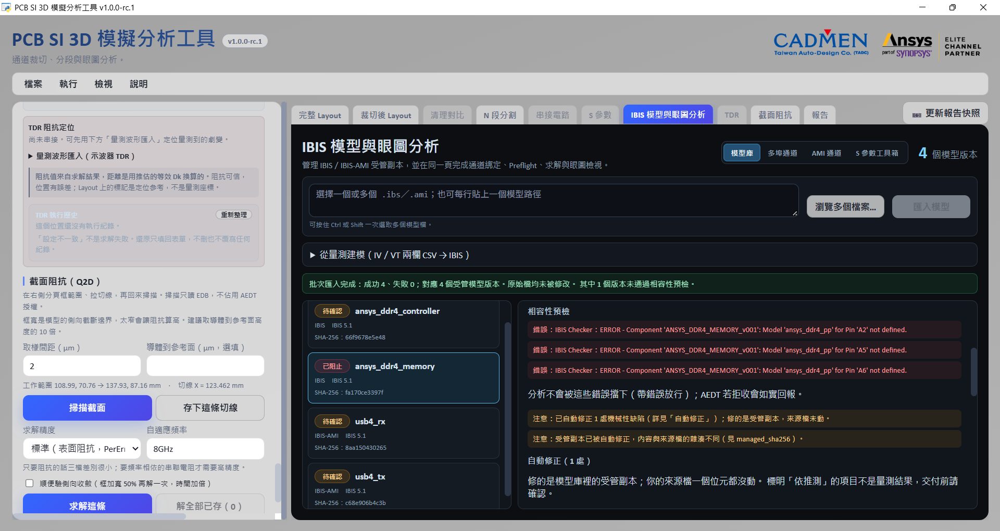
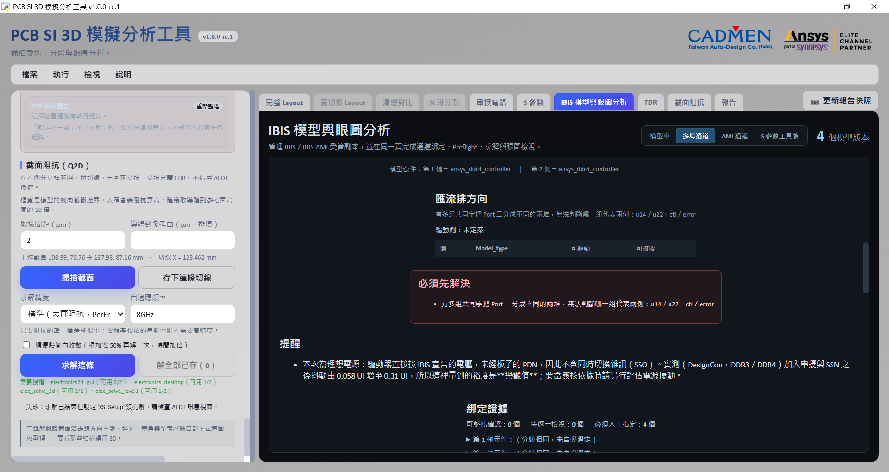
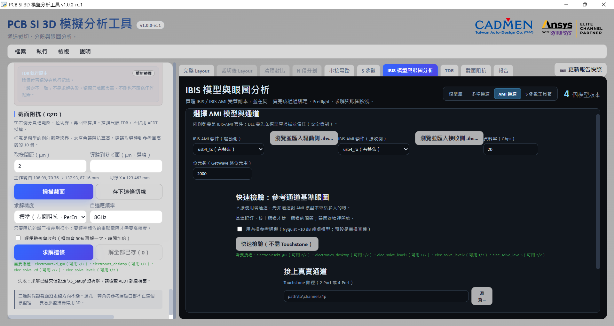
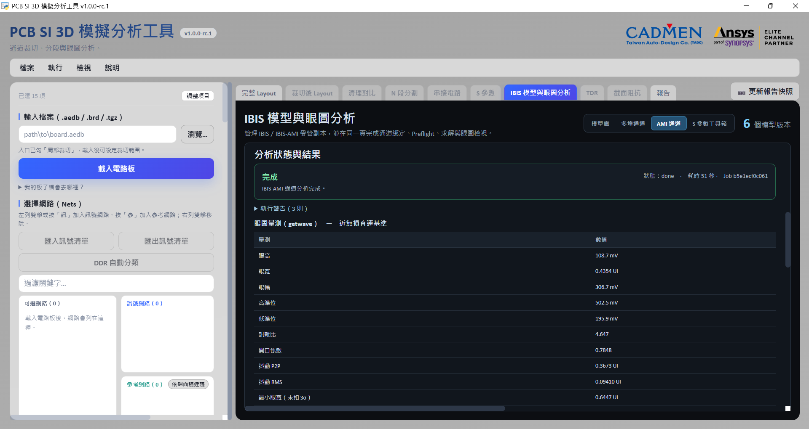
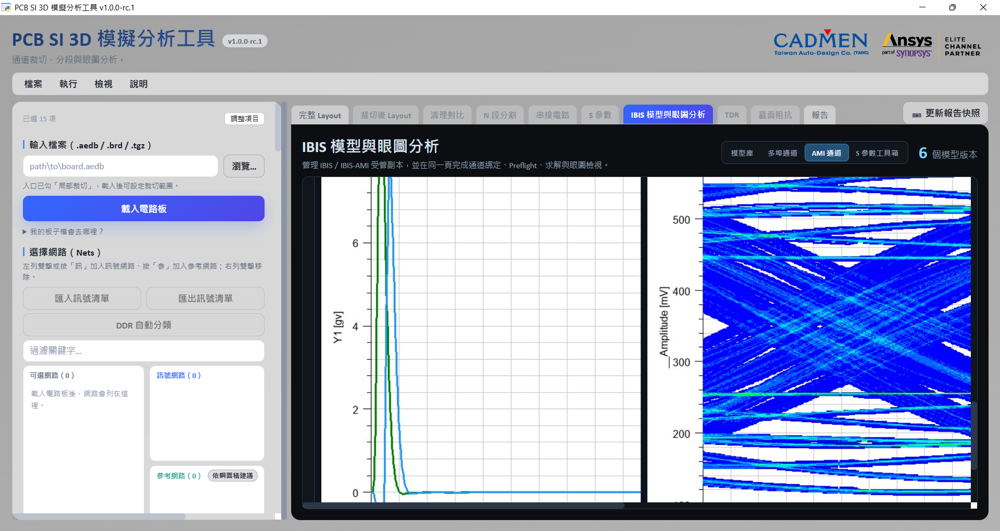

# IBIS 模型與眼圖分析

[回索引](../../操作說明.md)　[上一章](05-排程與串接.md)　[下一章](07-TDR定位.md)

先確認模型能執行，再核對通道的 Tx／Rx 與埠綁定。基準眼只用參考通道，不能代替真實板子的結果。

| 前置項目 | 用途 |
|---|---|
| 完整工具包與已安裝相依套件 | 安裝見 [01 開始使用](01-開始使用.md) |
| 合法取得的 `.ibs`；AMI 另需 `.ami` 與 Windows x64 DLL | 緩衝器與等化模型 |
| 有效 Touchstone | 真實通道，可用[串接結果](05-排程與串接.md)或外部檔 |
| AEDT 2026.1 與對應求解授權 | 參考通道健檢及正式眼圖分析 |

## 模型庫與 DLL 信任

1. 勾選「IBIS 模型與眼圖分析」，開右側「模型庫」。按「瀏覽多個檔案…」選模型。
2. 核對每個套件的匯入結果、候選模型與相容性預檢。單檔失敗不會取消其他成功項目。
3. 展開自動修正，確認修了什麼；「依推測」及待處理事項需另核對來源。
4. AMI 按「掃描全部 DLL／SO」，檢查掃描結果、架構與 SHA-256，再逐個「確認信任」。

完成判據：兩側都能選到預期模型；原生模型的掃描／信任狀態已核對。修正作用於模型庫受管副本，來源檔保留。DLL 改變後須重新信任；掃描不能保證第三方程式安全，受管副本仍受原廠授權限制。

## 先測模型，再接通道

| 操作 | 能確認什麼 | 限制 |
|---|---|---|
| 模型庫「用參考通道健檢」 | 用自產的近無損 50 Ω 參考通道實際求解一次，看 AEDT 能否接受並分析模型 | 會用求解授權 |
| 「快速檢驗（不需 Touchstone）」 | 兩側模型背對背接上近無損 50 Ω 參考通道（Nyquist 處約 −0.5 dB），在指定資料率的基準眼 | 不是實際通道 |
| AMI 模型庫「秒測」 | DLL 能否執行、等化波形是否改變 | 先掃描／信任；仍會執行 DLL |

健檢通過後真通道仍可能失敗，需查埠綁定、拓撲及設定；不能直接認定板子有問題。健檢出現黃字「結果無效，不是模型問題」＝模型跑完了，但通道的時域響應不可用（例如 impulse 發散），不算模型不過。

## 多埠通道與 DDR

1. 開「多埠通道」，選「IBIS 模型套件（驅動側）」及「另一側的模型套件」。留空代表兩側用相同套件，控制器與記憶體料號不同時要分別選。
2. 瀏覽 Touchstone 或「帶入串接結果」，填資料率並執行預檢。
3. 核對群組判定、每側元件、每道 Tx／Rx 及埠模型；雙向匯流排指定讀／寫方向。
4. 需要 DDR 時序時展開「以選通為時間基準量 Setup／Hold」，填實際準位、規格與 derating；DDR4 資料群另核對 Rx 遮罩，位址命令群依相應時序設定。
5. 執行分析，確認眼圖、所選方向與模型證據一致。Corner 掃描逐組核對，不預設 Slow 最差。

有 DQS 的時序裕度與各道自行折疊的串擾眼，不能直接比較。決定性最差碼型用來看串擾，不當統計眼；規格未填時不把時間量測當 Pass／Fail。模型側別接反仍可能出圖，必須人工確認。

<!-- 待拍：gui-25-multilane-eye.png。 -->

## AMI 通道與等化

開「AMI 通道」，選 Tx／Rx 套件與模型，帶入真實通道；核對拓撲、P／N 埠、資料率、路由、調變及 AMI 參數後確認再執行。PAM4 需模型支援；不能把 GetWave 失敗當作 Statistical 已成功。

秒級預覽與等化掃描適合選參數；核對實際通道、模型與生效值，再將候選設定帶入正式分析。預覽的 LTI、雜訊／抖動假設不能當量測或完整簽核證據。

**結果出現紅框「結果無效，以下數值不可採用」時，不要採用任何數值。** 代表通道的時域響應或量到的波形超出物理範圍（例如 impulse 發散、波形峰值超過 10 V），不是眼圖閉合。因應：勾「用有損參考通道」再跑一次，或直接接上真實通道 Touchstone；仍判無效就回模型庫做健檢、向模型供應商確認。眼很小但結果有效（例如範例 USB4 套件在 20 Gbps）通常是模型本身的振鈴與預設等化，和參考通道無關。

<!-- 條件待拍：gui-40-equalization-scan.png。 -->

## SerDes 合規判定

在「模型庫」的「S 參數工具箱」分頁開啟「SerDes 合規判定」，用自己的規格設定檔比較通道結果；工具不內建標準限值，判定不等同正式認證。

1. 用「瀏覽…」選通道 Touchstone 與規格 JSON，核對設定檔名稱、版本、限值出處與適用範圍。
2. 填埠序（從 1 起算）：近端 P、近端 N、遠端 P、遠端 N；判 NEXT／FEXT 時再接攻擊對的 4 個埠。工具不從埠名猜，填錯可能仍出圖。
3. 需要 TDR 判定時勾「使用最近一次 TDR 結果」，確認是同一份 Touchstone。需要 ERL 才勾「執行 ERL」；SPISim CalcERL 會占用 Electronics 授權。
4. 按「開始判定」，核對各列最差值、限值、裕度、位置與判定。缺資料／未完整不算通過；TDR 違規位置可到 TDR 分頁標回 Layout。
5. 產生 HTML 報告時指定相同通道檔，報告才會自動附上「SerDes 合規總表」。

<!-- 待實拍：gui-41-serdes-compliance.png；目前僅依 a19eda7 程式查核，未完成本輪 AEDT／ERL 實機驗證。 -->

## 從量測建模

模型庫展開「從量測建模」，瀏覽 IV／VT 兩欄 CSV，核對工具自動帶入的檔案、單位、電流方向、電源電壓、C_comp 及治具。Input／I/O 的 Vinl／Vinh 需有資料依據。產生 `.ibs` 後先健檢；只有 typ 量測時，不把缺少的 min／max 當已驗證 Corner。

[S 參數處理與 COM 操作](10-其他工作模式.md#s-參數工具箱與-com)。

## 完成與限制

確認結果圖非空、波形長度符合設定，並保存通道、模型雜湊、埠綁定與 Run 結果。不可用的量測不填成零；不同眼圖量測定義不可混比。現行眼圖使用理想電源，未包含板上 PDN 與同時切換雜訊；暫態遮罩通過也不能代表極低 BER 已驗證。交付快照見 [09 報告](09-報告與輸出.md)。
