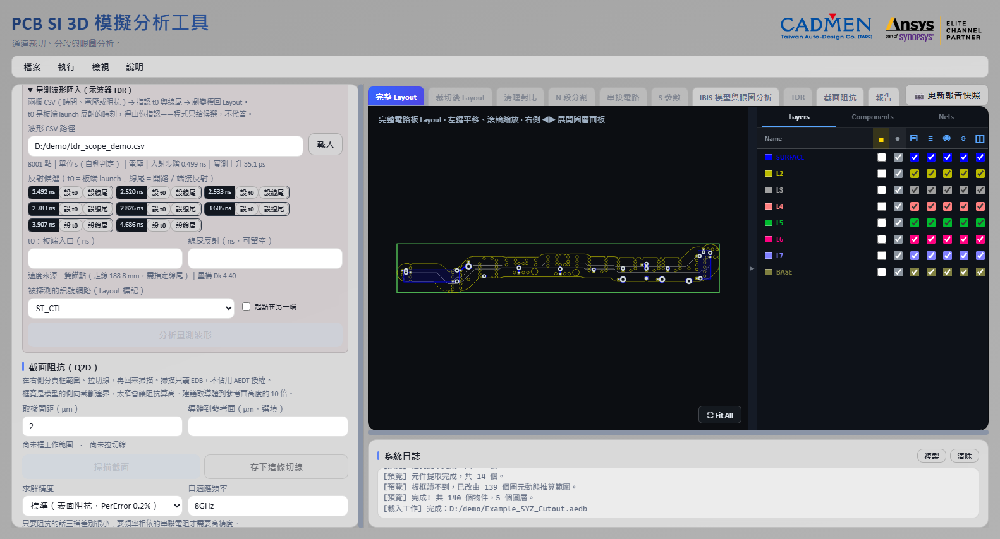
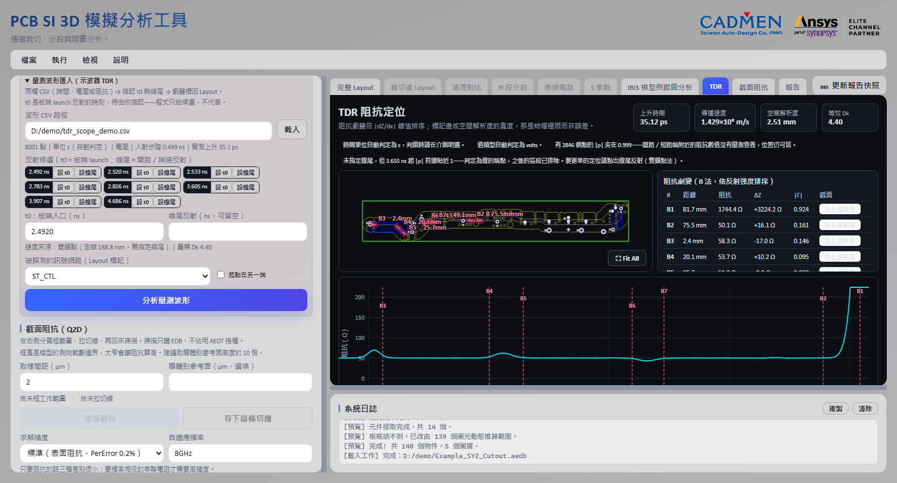

# TDR 阻抗定位

[回操作說明索引](../../操作說明.md)

## 這一章做什麼

**把阻抗變化的位置標回 Layout 走線上，直接指出「問題在板上這一段」。**

一般 TDR 只給「阻抗對距離」的曲線，這裡再往前一步，把劇變位置換算成板上座標
畫在走線上，並可直接接續取 Q2D 截面。

**需要**：串接後的 Touchstone（第 05 章）**加上載入中的電路板**——沒有走線幾何
就換算不出 Layout 位置。手上是示波器量的波形也可以，見
[量測波形匯入](#量測波形匯入示波器-tdr)。

## 操作步驟

1. 完成電路串接，取得 2-Port 單端或 4-Port 差動的完整通道 Touchstone。
2. 確認模式與探棒 Port。**探棒接在「輸入」端，距離從這一端起算**，其餘 Port 自動 50Ω 端接。
3. 按 **「執行 TDR」** 並確認條件。求解在背景進行，完成後自動切到「TDR」分頁。

單端模式**不限於 2 埠檔**（4 埠也能只探一條線）；差動模式需要至少 4 個 Port。

**上升時間與速度都不用填**：
上升時間 `Tr = 0.35 / f_max` 由這份 Touchstone 的頻寬決定——填更快只會產生假精度、
填更慢則浪費頻寬。速度主要依 **S21 群延遲**反推，避免直接套材料 Dk 造成系統性位置偏差。

## 看結果

**Layout 標記**畫成有寬度的亮帶而不是點，寬度＝空間解析度（`v·Tr/2`）。
**那是物理極限，不是誤差**；畫成點會暗示不存在的精度。

**劇變表**依反射強度（`|Γ| ≈ ΔZ/2Z`）排序。判定用的是**阻抗對距離的變化率峰值**
（`|dZ/dx|`），**不是偏離 50Ω 多少**——造成反射的是阻抗的階梯，不是絕對值。

**阻抗曲線**上「通道終點」藍線的右側是遠端反射的鏡像，**不是板上真的有東西**。

### A 法與 B 法：兩種速度來源

| | 速度怎麼來 | 需要什麼 |
|---|---|---|
| **A 法：群延遲** | 由 S21 相位反推 | 走線幾何（要先載入電路板） |
| **B 法：疊構 Dk** | 介電層厚度加權平均 | 已載入的疊構 |

兩法都算，結果頁可切換。**兩者的差距本身就是資訊**：標到同一位置就可以放心；
差很多代表疊構 Dk 與求解結果的相位延遲對不上，**該懷疑的是 Dk 假設，不是 TDR**。

驗證結果：A 法平均誤差 **0.66 mm**、最大 1.71 mm
（[報告](../../validation/tdr/TDR_群延遲定位驗證報告.md)——該數字涵蓋的是距離換算與
劇變定位，不是整條 AEDT 求解鏈）。獨立的 Q2D 截面萃取交叉驗證同一條線，
兩種方法中位阻抗**完全相同**。

## 分段切面的排除區

通道是 N 段分割串接回來的話，切面接縫附近的小反射多半是分段假象。
落在排除區（切點 ± 解析度）的標記以**灰色虛線**顯示並標注「切面接縫」，表格以 ⚠ 提示。

**不隱藏，但明確降級**——隱藏你不會知道那裡有東西，不降級你會追著假象跑。

## 起點在哪一端

距離從探棒端起算。標記位置看起來像從另一端量的時候，
**勾「起點在另一端」翻轉即可，不需要重新求解**。

## 從這一頁直接取截面

入口同時勾選「截面阻抗（Q2D）」後多出兩個入口：

- **劇變表每列的「取此處截面」**：在該距離算出走線方向、生一條垂直切線並切到
  截面阻抗分頁。**角度過不了的位置不會給切線**，只告訴你原因（那裡是轉角）。
- **「沿線取樣」**：填間距（mm）與側向半寬（µm），沿走線鋪一排切線存進切線集，
  整批求解得到 Z₀(x) 剖面。轉角會跳過並回報跳了幾條。側向半寬預設 7000
  （**它是二維模型的物理邊界，直接決定算出來的阻抗**，見
  [第 08 章](08-截面阻抗.md#工作範圍不只是畫面上的框)）。

## 量測波形匯入（示波器 TDR）

**手上有實測波形時不必先跑任何模擬。** 業界慣行做法是拿距離讀數回去人工對圖，
這一步工具直接代勞。

1. **載入 CSV**（兩欄：時間、電壓或阻抗）。分隔符與表頭自動處理；時間單位與值類型
   自動判定並顯示，判錯可明選。電壓波形從入射步階**實測**上升時間；
   阻抗／反射係數波形量不到入射邊緣，要填儀器規格值。
2. **指認 t0 與線尾**。t0 是板端 launch 反射的時刻——探頭與板端之間總有一段線纜，
   時間零點不在板端，**程式只列出反射候選、不代答**。線尾可留空。
3. **分析**。結果進同一個 TDR 分頁，劇變表、曲線、Layout 標記與「取此處截面」全照舊。

**速度來源**：**雙錨點法（建議）**——指認 t0 與線尾配上走線長度，兩端依定義精確，
**Dk 公差的累積誤差被歸零**；錨點點錯時推得的等效 Dk 不在 1～30 就拒絕並說明。
沒指認線尾則用疊構 Dk 法。

工具自己會處理的三件事：

- **線尾之後不報劇變**（那是夾持與再反射）。沒指認線尾時，|ρ| 持續貼近 1 的區段
  **自動判定為線的端點**並裁掉，警語講明裁在哪個時刻。
- **端點附近的阻抗數值沒有量測意義**（|ρ|→1 發散），但**位置仍可信**。
- **比解析度近的兩個峰不分開列**——那是同一個物理特徵（35 ps 在 FR4 上約 2.6 mm）。

## 輸出結果

- Layout 走線上的劇變標記（寬度＝空間解析度）與依反射強度排序的劇變表。
- Z(距離) 曲線，可切換 A／B 兩種速度來源。
- 可直接接續的 Q2D 切線（單點或沿線整排）。
- Circuit 專案保留在 Touchstone 同層的 `tdr_results` 資料夾。

## 已知限制

- 只支援 2-Port 單端或 4-Port 差動。**差動 TDR 量的是差模阻抗，是單端的 2 倍。**
- **掃頻太疏會讓 S21 相位混疊、群延遲失效**（症狀是負延遲）。錯誤訊息會附上
  需要的頻率間隔（`Δf < 1/(2τ)`），加密掃頻後重新求解即可。
- 外部 S 參數檔模式（沒載入電路板）**沒有走線幾何**，不能做 Layout 定位。
- 量測波形：大劇變之後的阻抗讀值受再反射污染（本版不做剝離），
  **峰的位置**受影響輕得多，但引用絕對阻抗值要保守。
- **TDR 求解與排程、眼圖互斥**，一次只有一個 AEDT 工作。

---

← [06 IBIS 與眼圖](06-IBIS與眼圖.md)　[回索引](../../操作說明.md)　[08 截面阻抗](08-截面阻抗.md) →
