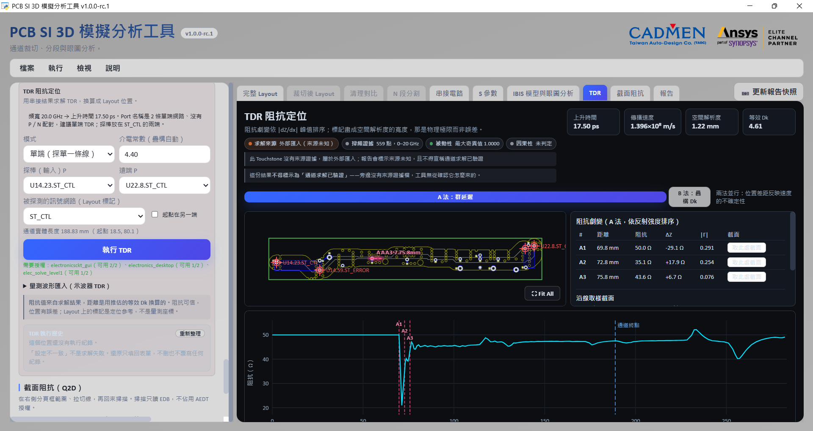

# TDR 阻抗定位

[回索引](../../操作說明.md)　[上一章](06-IBIS與眼圖.md)　[下一章](08-截面阻抗.md)

選對探棒端與走線，再把阻抗變化標回 Layout。模擬 Touchstone 與量測 CSV 是兩種來源，結果與報告必須標明。

| 前置項目 | 用途 |
|---|---|
| 完整工具包與相依套件 | 安裝見 [01 開始使用](01-開始使用.md) |
| 有效通道 Touchstone | 模擬 TDR；來源見 [05 排程與串接](05-排程與串接.md) |
| AEDT 2026.1 與 Circuit 求解授權 | 執行模擬 TDR |
| 對應電路板與訊號走線 | 把距離映射回 Layout |
| 示波器兩欄 CSV | 量測路徑，可不先跑模擬 |

## 模擬 TDR

1. 勾選「TDR 阻抗定位」，完成串接或帶入可用通道。
2. 選單端／差動；單端可在多埠檔探一條線，差動需至少四埠且 P／N 定義正確。
3. 核對探棒輸入與遠端埠，再選「被探測的訊號網路（Layout 標記）」。
4. 核對通道實體長度；若有走線未串入路徑，先查幾何與網路，不直接採信定位。
5. 按「執行 TDR」，完成後看右側「TDR」結果。

完成判據：結果標示模擬來源，阻抗曲線、通道長度、探棒方向與 Layout 標記相符。只顯示工作完成而沒有有效波形，不算分析完成。

## 方法、速度與距離

| 顯示 | 如何判讀 |
|---|---|
| 頻寬與上升時間 | 工具依 Touchstone 頻寬估算；不能以更快輸入製造額外解析度 |
| A 法：群延遲 | 以通道相位延遲推距離；頻率太疏或路徑不完整會影響結果 |
| B 法：疊構 Dk | 依已載入疊構推速度；材料假設須正確 |
| 標記亮帶 | 顯示有限空間解析度，不是精確單點 |
| 通道終點之後 | 可能是遠端再反射，不解讀成板上額外結構 |

兩法差距大時核對 S 參數、疊構、長度與埠定義；不要只選較符合預期的方法。

距離從探棒端起算；確認走線方向後，可勾「起點在另一端」翻轉定位，不需重解。此選項不能補救選錯通道或埠。

串接通道的接縫附近會標示切面影響。先查接線與切面，再判斷是真實不連續或分段假象；標記仍存在不代表可直接歸因。

## 量測 CSV 匯入

1. 展開「量測波形匯入（示波器 TDR）」，瀏覽兩欄 CSV。
2. 檢查時間單位與值類型（電壓、阻抗或反射係數）；自動判定錯誤時手動改正。
3. 核對上升時間。非電壓步階資料需提供儀器規格，不能把缺值當量測值。
4. 指認板端 t0；線纜延遲不等於板上走線。可另指認線尾，以兩錨點及走線長度推速度；未指定線尾時核對疊構 Dk。
5. 按「分析量測波形」，確認來源、錨點與 Layout 定位。

完成判據：時間單位、板端起點、線尾與實體長度一致。工具的反射候選只供指認，不會代替使用者決定 t0。大反射之後的絕對阻抗可能受再反射污染，不能只憑曲線數字判定局部阻抗。

<!-- 待拍：gui-29-measured-tdr.png，顯示單位、錨點與量測來源。 -->

## 定位後取截面

同時啟用「截面阻抗（Q2D）」後，劇變表可按「取此處截面」，或「沿線取樣」建立切線集。核對間距與側向半寬；轉角等不適用位置會跳過並回報原因。切到截面頁後仍需掃描、確認訊號／參考及可解性，見 [08 截面阻抗](08-截面阻抗.md)。

## 完成後保留

保存曲線、劇變表、來源與速度方法；模擬 Circuit 專案位於 `tdr_results/`。外部 S 參數沒有對應板幾何時，不能據此聲稱已定位到 Layout。負群延遲、過疏頻點或不完整路徑先修正，再分析。更新報告快照時保留「模擬／量測」標示，見 [09 報告](09-報告與輸出.md)。
