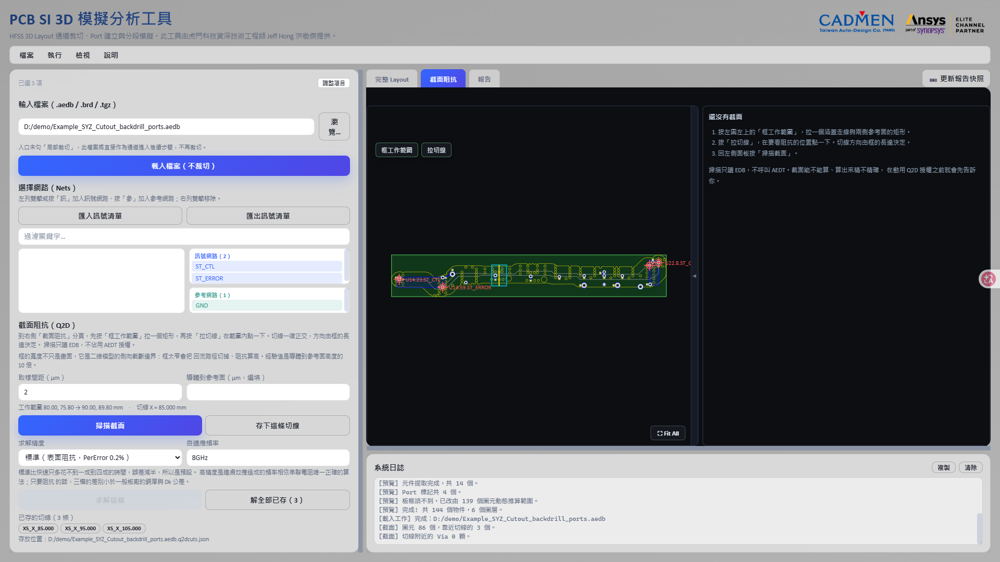
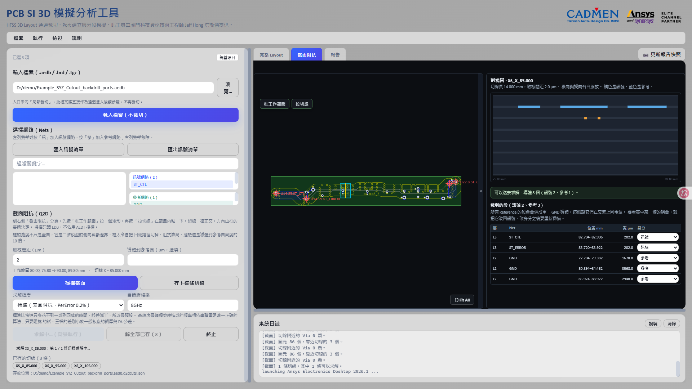
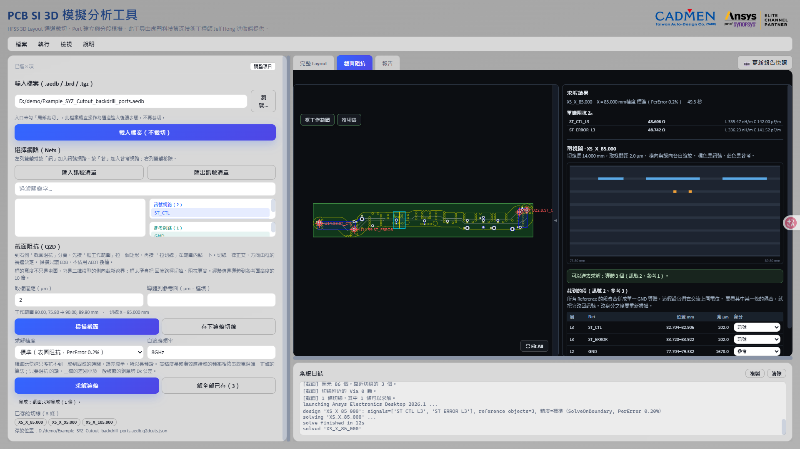

# 截面阻抗（Q2D）

> 此工具由虎門科技資深技術工程師 Jeff Hong 洪敬傑提供

[回操作說明索引](../../操作說明.md)

## 這個功能回答什麼問題

TDR 告訴你「71.7 mm 附近阻抗有變化」。截面阻抗告訴你「那裡是 56.8 Ω，因為 0.44 mm 外一顆 Via 在參考層開了洞」。

作法是在 Layout 上指定一個位置，把該處**實際存在**的層截面從 EDB 讀出來，逐層重建成 Q2D 二維模型求解特徵阻抗。重點在「實際存在」：SIwave 的「Export to 2D Extractor」以疊構為基礎產生**理想**截面，只吃線寬、間距與上下參考層，表達不了平面局部挖空、訊號層上的同層接地銅、只以窄帶存在的參考面，或穿過切面的 Via 焊墊。同一條線，假設 pad 下方有完整參考面（而那層平面根本不在那裡）算出 57 Ω，忠實還原幾何算出 61 Ω。

入口介面勾選「截面阻抗（Q2D）」（在「結果」群組，TDR 之下）。前置條件只有**載入電路板**——它算的是幾何，不是 S 參數，不需要先跑完整條通道。

## 執行步驟

1. 到右側「截面阻抗」分頁，按左圖左上角的「框工作範圍」，拖出一個涵蓋走線與兩側參考面的矩形。
2. 按「拉切線」，在要看阻抗的位置點一下。切線方向由框的長邊決定，只能正交。
3. 回左側「截面阻抗（Q2D）」面板按「掃描截面」。這一步只讀 EDB，不開 AEDT、不佔授權。
4. 看剖視圖與「可以送去求解」的判定，確認無誤再按「求解這條」。



「存下這條切線」把標註寫在 `.aedb` 旁邊，重開工具還在，把 `.aedb` 複製給同事時一起過去。存了多條之後按「解全部已存」整批送出，結果面板會列出沿線剖面。已存的切線會列成一排按鈕，點一下就把工作範圍與切線位置還原到當時的樣子（不會自動掃描——掃描要讀 EDB，不該在只是切換切線時偷跑）。

## 工作範圍不只是畫面上的框

框的寬度是**二維模型的側向截斷邊界**：它決定回流路徑有多少空間。

- 框太窄 → 回流路徑被切掉 → **阻抗偏高**
- 框太寬 → 模型變大、求解變慢

判斷夠不夠的唯一方法是加大寬度直到數值不再變化。經驗起點是導體到參考面高度的 10 倍；面板上的「導體到參考面（µm）」填了之後，工具會用這個倍率判定並在不足時提出警告。沒填就不判定——判不出來時不假裝知道。

## 剖視圖：求解前最後一次便宜地發現錯誤

剖視圖畫的是**掃描實際得到的那些段**，不是理想疊構的示意圖。橘色是訊號、藍色是參考，橫向照真實座標、縱向照真實高程（兩軸各自縮放，否則一段 5 mm 寬的截面配上 1 mm 的疊構會畫成一條線）。


上圖是 `Example_SYZ` 在 X = 85 mm 的截面：L3 上兩條 202 µm 的訊號線，L2 的參考面在這個座標上被切成 1678、3568、2948 µm 三塊。理想截面模型會把 L2 當成一整片完整的參考面，而這裡它並不是——兩道斷口就落在兩條訊號線的外側。斷口有多寬、離訊號多遠，直接決定回流路徑，也就直接決定阻抗。

（這次的斷口不是 Via 造成的：日誌寫著「切線附近的 Via 0 顆」，沒有任何 Via 焊墊穿過這條切線。工具只報它量到的東西，不替它編一個來源。）

下方「截到的段」逐段列出層、Net、位置與寬度，每一段都可以改身分：

- **所有 Reference 的段會合併成單一 GND 導體**，這假設它們在交流上同電位。要看其中某一條的耦合，就把它改回訊號。
- **同一條 Net 被切到兩次是線上兩個不同的位置，不是同一個節點。** 工具讓它們各自成為獨立導體；合併會無聲地把模型短路，沒有任何錯誤訊息，只會得到一個偏低的阻抗。

改身分之後會自動重新掃描，因為 Role 會改變導體的組成。

## 求解之前就知道能不能算

花掉一份 Q2D 授權才發現截面不能用，是最貴的學法。所以掃描完成時就會給出判定：

| 判定 | 意思 |
|---|---|
| **不能算**（hard） | 結果一定錯，求解按鈕不會亮。例如截面裡沒有參考導體——沒有參考平面，特徵阻抗沒有定義。 |
| **要判斷**（risk） | 算得出來，但可能失真，由你決定要不要信。 |

切線放在哪裡也在這一層檢查。走線與切線法線的夾角造成的寬度虛胖是 `1 / cos θ`：

| 夾角 | 虛胖 | 判定 |
|---|---|---|
| ≤5° | +0.4% | 放行 |
| 5°～20° | 至多 +6% | 放行，標「要判斷」 |
| >20° | +6% 以上 | **拒絕** |
| 穿過被量測訊號的 Via 焊墊 | — | **拒絕** |
| 穿過反焊盤範圍 | — | 放行，標「要判斷」 |
| 穿過 GND 縫合 Via | — | 放行，併入參考導體 |

虛胖的寬度會讓阻抗偏低，而畫面上看不出任何異狀——這是它必須被擋下來的理由。

## 求解精度：三檔的差別不是快慢

差別是**在導體內部解場，還是用表面阻抗**：

| 檔位 | 求解方式 | PerError | 對高精度的偏差 |
|---|---|---|---|
| 快速 | 表面阻抗 | 1.0% | −0.38% |
| **標準（預設）** | 表面阻抗 | 0.2% | −0.20% |
| 高精度 | 導體內部解場 | 0.2% | 基準 |

偏差落在同一個窄帶內、**與結構無關**，而且比一般板廠的銅厚與 Dk 公差小一個數量級。標準只比快速多花不到一成到四成的時間，誤差減半，所以是預設。

高精度是趨膚效應造成的頻率相依串聯電阻唯一正確的算法。若只要阻抗，多花三倍時間換一個會被公差蓋過的 0.2% 並不划算。

「自適應頻率」是網格自適應用的頻率，預設 8 GHz；要看哪個頻段的阻抗就填哪個頻率。

求解在背景進行，過程中可以隨時終止：



## 看結果



單端阻抗 `Z₀ = √(L/C)` 逐導體列出，並附上該導體的 L 與 C，方便判斷數字合不合理。上圖這一條切線 ST_CTL 得到 48.606 Ω、ST_ERROR 得到 48.742 Ω，整條含 AEDT 啟動共 49.3 秒，其中實際求解 12 秒。

差分阻抗由已求解的 RLGC 矩陣算出：

```
Z_odd  = √((L11 − L12) / (C11 − C12))
Zdiff  = 2 × Z_odd
```

截面上**剛好兩個導體**時這是精確的，標示「精確」；三個以上時取該對的 2×2 子區塊，隱含「其餘導體位於參考電位」的假設，標示「近似」。這個假設會跟著數字一起顯示，不會只寫在文件裡。

> Q2D 原生的 DiffPair 縮減矩陣可以消除這個假設，而且它確實算得出來——但 pyaedt 讀不回來（建得出矩陣、列得出它的量，就是取不到值，四種文件記載的 context 形式全試過）。用一個行為無法預測的 API 產生阻抗數字，比給出一個標示清楚的近似更糟。

多條切線解完之後，「沿線剖面」把同一軸上的結果依座標排好。每個值只在該座標成立，並假設結構沿線均勻；切線之間發生的事這裡看不到。

## 與 TDR 的關係

兩者互為對照，量的是同一件事的不同面向：

| | 給你什麼 | 代價 |
|---|---|---|
| **TDR** | 整條線的阻抗剖面 | 受限於空間解析度 `v·Tr/2`，比它小的結構會被平滑掉 |
| **截面阻抗** | 選定位置的精確阻抗，含遠小於 TDR 解析度的細節 | 只在你切的那個座標成立 |

本工具在 `Example_SYZ` 上實跑過一次對照：沿 ST_CTL 取六條截面，Q2D 中位數 48.617 Ω、SIwave 求解轉 TDR 中位數 48.625 Ω，**中位差 −0.0071 Ω（−0.015%）**，六條有五條落在 ±0.8% 內。

唯一分歧的那條（x = 155 mm，Q2D 低 1.31 Ω）追出來的原因是 Q2D 看得到而 TDR 看不到的東西：四顆 GND 縫合 Via 距切線 0.060 mm，把 L2 平面切成 9 塊，並在訊號層 L3 上帶進 1722 µm 與 1060 µm 的同層接地銅，後者離 ST_CTL 邊緣只有 0.512 mm。TDR 在該頻寬下的空間解析度是 0.502 mm，把它平滑掉了。

完整數據見 [`validation/cross_section/`](../../validation/cross_section/Q2D截面與TDR對照驗證報告.md)。另一個獨立專案在不同測試件上得到相同方向的結論（中位差 −0.000%），見 [Q2D 截面與 TDR 的交叉驗證](https://github.com/ovo0615/edb-q2d-cross-section-toolkit/blob/main/docs/cross-validation-tdr.md)。

> 兩份驗證用的是不同的測試件，數字不能互相套用。

## 已知限制

- 切線只能正交（X 或 Y），斜向會被擋下。
- 求解與排程、眼圖、TDR 互斥，一次只有一個 AEDT 工作；多條切線排隊連續解，不並行。
- 不輸出串聯電阻 R。`SolveInside` 確實是趨膚效應串聯電阻唯一正確的算法，但 R 要有意義得配上頻率掃描，那是另一個題目。
- 求解結果放在板檔旁的 `q2d_runs` 資料夾；切線標註存在 `.aedb` 旁的 `.q2dcuts.json`，板檔目錄不可寫時會退到使用者目錄並在日誌明講。

---

← [TDR 阻抗定位](07-TDR定位.md)　[回索引](../../操作說明.md)　[一鍵 HTML 報告與輸出檔案](09-報告與輸出.md) →

> 此工具由虎門科技資深技術工程師 Jeff Hong 洪敬傑提供
