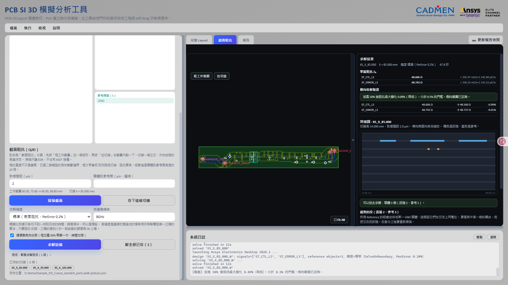
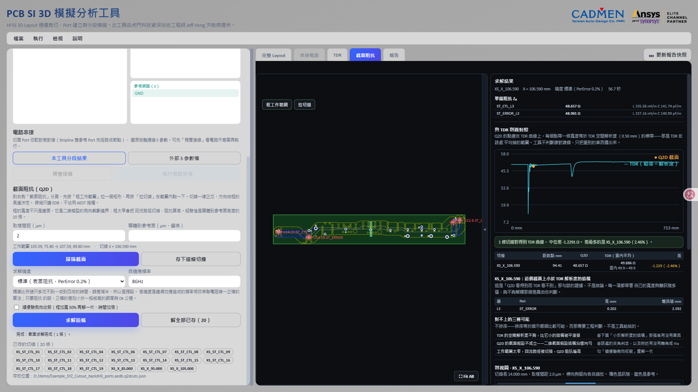

# 截面阻抗（Q2D）

[回操作說明索引](../../操作說明.md)

## 這一章做什麼

**TDR 告訴你「71.7 mm 附近阻抗有變化」；截面阻抗告訴你「那裡是 56.8 Ω，
因為 0.44 mm 外一顆 Via 在參考層開了洞」。**

在 Layout 上指定位置，把該處**實際存在**的層截面從 EDB 讀出來，逐層重建成
Q2D 二維模型求特徵阻抗。

**「實際存在」是重點**：SIwave 的「Export to 2D Extractor」給的是理想截面，
表達不了平面局部挖空、訊號層上的同層接地銅、只以窄帶存在的參考面、
穿過切面的 Via 焊墊。差多少？同一條線，假設 pad 下方有完整參考面算出 **57 Ω**，
忠實還原幾何算出 **61 Ω**。

**前置條件只有載入電路板**——它算的是幾何，不需要先跑完整條通道。

## 操作步驟

1. 到右側「截面阻抗」分頁，按「框工作範圍」，拖出涵蓋走線與兩側參考面的矩形。
2. 按「拉切線」，在要看阻抗的位置點一下（方向由框的長邊決定，只能正交）。
3. 回左側面板按 **「掃描截面」**——**這一步只讀 EDB，不開 AEDT、不佔授權**。
4. 看剖視圖與可解性判定，確認無誤再按 **「求解這條」**。

**「存下這條切線」** 把標註寫在 `.aedb` 旁邊，重開工具還在，複製給同事也會跟著過去。
存多條後按「解全部已存」整批送出；已存切線列成一排按鈕，點一下還原當時的範圍與位置
（**不會自動掃描**）。

### 工作範圍不只是畫面上的框

**框的寬度是二維模型的物理邊界**：太窄會把回流切掉、**阻抗偏高**，太寬則求解變慢。
經驗起點是導體到參考面高度的 10 倍。填了「導體到參考面（µm）」工具才判定，
**沒填就不判定**。真正的答案是下面的側向收斂驗證。

### 剖視圖：求解前最後一次便宜地發現錯誤

畫的是掃描實際得到的那些段，不是理想疊構的示意圖。橘色訊號、藍色參考。

上圖 `Example_SYZ` 在 X = 85 mm：L3 上兩條 202 µm 訊號線，**L2 的參考面在這個座標
被切成三塊**，兩道斷口就落在訊號線外側，直接決定阻抗。

下方「截到的段」可**逐段改身分**：所有 Reference 段合併成單一 GND 導體（假設交流上
同電位，要看其中一條的耦合就改回訊號）；**同一條 Net 被切到兩次是線上兩個位置，
不是同一個節點**，各自成為獨立導體——合併會無聲地短路模型，只得到偏低的阻抗。

### 求解之前就知道能不能算

| 判定 | 意思 |
|---|---|
| **不能算**（hard） | 結果一定錯，求解按鈕不會亮（例如截面裡沒有參考導體） |
| **要判斷**（risk） | 算得出來但可能失真，由你決定 |

**切線斜掉會讓阻抗偏低**——寬度虛胖 `1 / cos θ` 倍，而畫面上看不出異狀：

| 夾角／情況 | 判定 |
|---|---|
| ≤5°（+0.4%） | 放行 |
| 5°～20°（至多 +6%） | 放行，標「要判斷」 |
| >20° | **拒絕** |
| 穿過被量測訊號的 Via 焊墊 | **拒絕** |
| 穿過反焊盤範圍 | 放行，標「要判斷」 |
| 穿過 GND 縫合 Via | 放行，併入參考導體 |

### 求解精度：三檔的差別不是快慢

差別是「在導體內部解場」（高精度）還是「用表面阻抗」（快速／標準）。**標準是預設**：
對高精度的偏差只有 −0.20%、**與結構無關**，比板廠的銅厚與 Dk 公差小一個數量級
（快速檔 −0.38%）。**只有要算串聯電阻時才需要高精度。**

「自適應頻率」預設 8 GHz，**要看哪個頻段的阻抗就填哪個頻率**。

## 側向收斂驗證

勾「順便驗側向收斂」，同一條切線用**加寬 50%** 的框再解一次並列對照。
**求解時間加倍，所以預設關閉。**

| 判定 | 意思 |
|---|---|
| **已收斂** | 加寬後最大變化 < 0.5%，側向範圍夠了 |
| **未收斂** | 超過 0.5%，原本的框可能把回流切掉了 |

- **取最差的導體，不取平均**——一條收斂、另一條沒有，整體就是沒收斂。
- **變化方向一起回報**：加寬通常會讓阻抗**降**，**升高**代表加寬把框外的東西
  （例如一塊接地銅）帶了進來，那是另一回事。
- 0.5% 是約定不是物理，實際百分比一起列出。
- 加寬後算不出來（框到板外）只略過驗證，**不讓整條切線失敗**。

## 從 TDR 直接取截面

手拉切線準不準看手感，**斜個 20° 阻抗就偏低而畫面上看不出來**，所以工具把這步算出來。

**「取此處截面」**：在該距離算出走線方向、生一條垂直切線並切到本分頁，範圍與切線
都定位好。**角度過不了的位置不會給切線，只告訴你原因**——生一條自己都知道不能用的
切線更糟。

**「沿線取樣」**：填間距與側向半寬，沿整條走線鋪一排切線存進切線集。端點各內縮半個
間距（貼著端點會切在元件端 launch 上）；**轉角會跳過並回報跳了幾條、在哪、夾角多少**；
間距太小時放寬到上限並講明。

走線方向取**前後各 100 µm 的兩點連線**量出來（走線常由許多短段組成、單段方向會抖）。
越靠近轉角量到的方向越斜、判定自然越嚴，比「距離轉角 X mm 內一律拒絕」精準。

## 看結果

單端阻抗逐導體列出（`Z₀ = √(L/C)`），並附該導體的 L 與 C。
上圖 ST_CTL 48.606 Ω、ST_ERROR 48.742 Ω，含 AEDT 啟動共 49.3 秒（實際求解 12 秒）。

**差分阻抗**由已求解的 RLGC 矩陣算出（`Z_odd = √((L11−L12)/(C11−C12))`、`Zdiff = 2·Z_odd`）。
截面上剛好兩個導體時**精確**；三個以上取 2×2 子區塊，隱含「其餘導體位於參考電位」，
標示**近似**——**這個假設跟著數字一起顯示，不會只寫在文件裡**。

多條切線解完後「沿線剖面」依座標排好。**每個值只在該座標成立，並假設結構沿線均勻。**

### 與 TDR 對照

兩邊都有結果時，分頁上方自動出現對照圖：TDR 是連續曲線、Q2D 是離散點，
每個 Q2D 點帶一條**寬度等於 TDR 空間解析度**的橫帶。實測沿一條走線取六條截面，
**中位差 −0.015%**（[報告](../../validation/cross_section/Q2D截面與TDR對照驗證報告.md)）。

**工具不判斷誰對誰錯**，只給可查證的東西：兩者的值與差異、TDR 在該處平均掉多寬、
該截面上小於那個寬度的結構，以及**不排序**的三種可能（TDR 解析度不夠／Q2D 的截面
假設不成立／工作範圍太窄——第三項按一鍵就能排除，通常先做它）。

對照取**窗內平均**而非單一點（陡變處取單點會拿到極端值），窗內變化超過 10% 的
標成**「不適合比較」**並排除在統計外。

## 輸出結果

- 逐導體的單端阻抗與 L、C；差分阻抗（附精確／近似標示）；沿線剖面。
- 側向收斂判定與變化百分比。
- 與 TDR 的對照圖、逐條差異與證據表。
- 按「更新報告快照」後，HTML 報告會多一個「截面阻抗（Q2D）」章節，
  **數字另外以文字帶進去**（圖上的字縮小後未必讀得出來），可直接複製。
- 求解結果放在板檔旁的 `q2d_runs`；切線標註存在 `.aedb` 旁的 `.q2dcuts.json`。

## 已知限制

- 切線只能正交（X 或 Y），斜向會被擋下。
- 求解與排程、眼圖、TDR 互斥，多條切線排隊連續解、不並行。
- **不輸出串聯電阻 R**——R 要有意義得配上頻率掃描，那是另一個題目。
- **沿線取樣只在它取的那些座標成立**，轉角若落在兩個取樣點之間工具不會察覺。
  要看轉角就用 HFSS。
- **求解層級授權被占滿時 AEDT 不會報「沒有授權」**：它照樣接受要求、照樣結束，
  只是什麼都沒算。工具判定成「求解已結束但設定沒有解」——**遇到這個訊息先查授權**。

---

← [07 TDR 定位](07-TDR定位.md)　[回索引](../../操作說明.md)　[09 報告與輸出](09-報告與輸出.md) →
