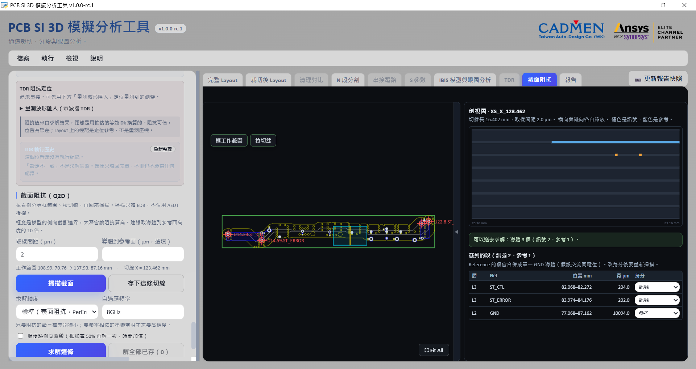
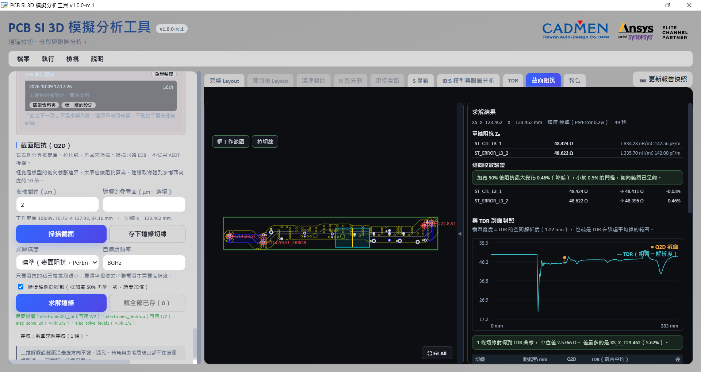

# 截面阻抗（Q2D）

[回索引](../../操作說明.md)　[上一章](07-TDR定位.md)　[下一章](09-報告與輸出.md)

框選走線與參考結構，掃描實際截面，再用 Q2D 求局部阻抗。不需先完成整條通道求解；二維截面不能代替 Via、轉角或參考結構沿線變化的三維分析。

| 前置項目 | 用途 |
|---|---|
| 完整工具包與已安裝相依套件 | 安裝見 [01 開始使用](01-開始使用.md) |
| 已載入的電路板與正確疊構／網路 | 從 EDB 讀取截面 |
| AEDT 2026.1 與 Q2D 求解授權 | 求截面阻抗；掃描與求解是不同步驟 |

## 框範圍、拉切線、掃描

1. 勾選「截面阻抗（Q2D）」，到右側截面頁按「框工作範圍」，框住訊號及兩側參考結構。
2. 按「拉切線」指定位置，核對切線軸向與座標。
3. 回左側設定取樣間距；知道導體到參考面的高度時填入，未知時留空。
4. 按「掃描截面」，看剖視圖、截到的導體與可解性判定。
5. 要保留位置時按「存下這條切線」。重新叫回已存切線後需再掃描，不能沿用另一個位置的預檢。

完成判據：訊號、參考銅與介電層位於預期位置，切線沒有切到不適合二維分析的訊號 Via 或斜向走線。若「不能算」須修正範圍／切線；「要判斷」仍需工程確認。

## 範圍與導體角色

| 核對項目 | 判斷 |
|---|---|
| 框的側向寬度 | 是模型邊界；過窄可能截掉回流，不能當純粹顯示範圍 |
| 取樣間距 | 足以辨識細線與間隙；過粗可能漏掉小結構 |
| Reference 角色 | 合併為共同參考的假設需符合分析目的 |
| 同一 Net 多次被切到 | 各截段不一定是同一局部導體，不能只憑名字任意合併 |
| 切線與走線方向 | 須接近垂直；斜切會把線寬放大，阻抗可能失真 |

填導體到參考面高度只提供範圍建議；是否夠寬仍以側向收斂檢查確認。

## 求解

選快速／標準／高精度，設定要分析的自適應頻率，按「求解這條」。快速與標準使用表面阻抗，高精度在導體內部解場；不要用舊案例的固定耗時或偏差當保證。多位置可按「解全部已存」，先檢查整份切線集。

完成判據：每條切線有實際阻抗與導體結果，失敗／略過項目有原因；不能把「工作結束」視為所有切線都成功。

## 側向收斂

勾「順便驗側向收斂」，工具加寬範圍再解一次。看逐導體的變化與最差判定；未收斂就擴大範圍或檢查帶入的新銅結構再解。加寬驗證若被略過，不代表已收斂。

## 從 TDR 接續

在 [TDR 劇變表](07-TDR定位.md#從這一頁直接取截面)按「取此處截面」，或用「沿線取樣」建立多條切線；核對跳過的轉角與取樣間距。自動帶入位置仍要掃描並查角色與可解性。

## 結果與 TDR 對照

讀逐導體單端阻抗、L／C 與差分結果；多導體時注意差分值的近似假設。沿線剖面只代表各取樣座標，不能保證點與點之間沒有轉角或缺口。

兩邊都有結果時看 TDR 與 Q2D 對照。TDR 有有限空間解析度，Q2D 是特定截面的均勻延伸模型；劇變區被標為「不適合比較」時，不把該點納入一致性結論。差異大先查側向範圍、截面假設及 TDR 來源。

## 保留與限制

保留 `q2d_runs/` 結果與板旁 `.q2dcuts.json` 切線集，更新[報告快照](09-報告與輸出.md)。本功能不輸出可作頻率相依分析的串聯電阻 R。二維結果不能證明 Via 或轉角的三維效應；沒有有效求解數值時先查錯誤與授權。
