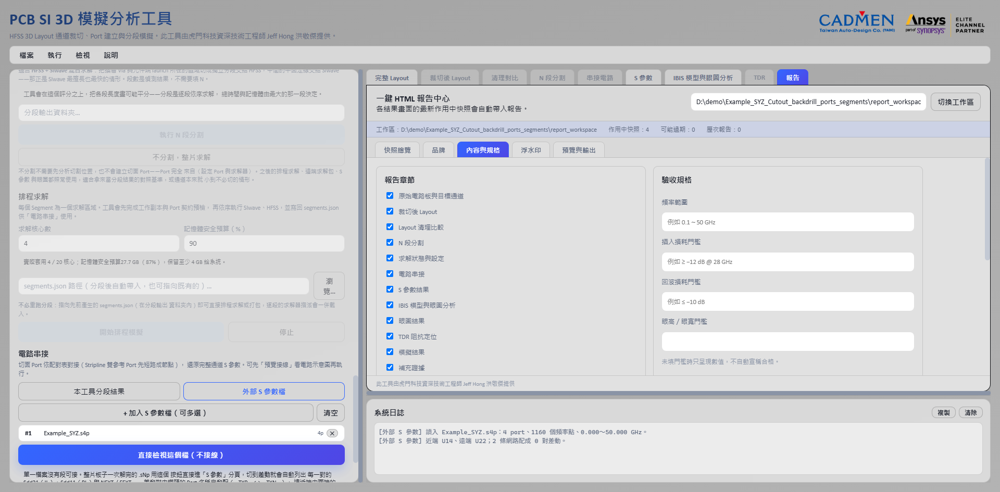
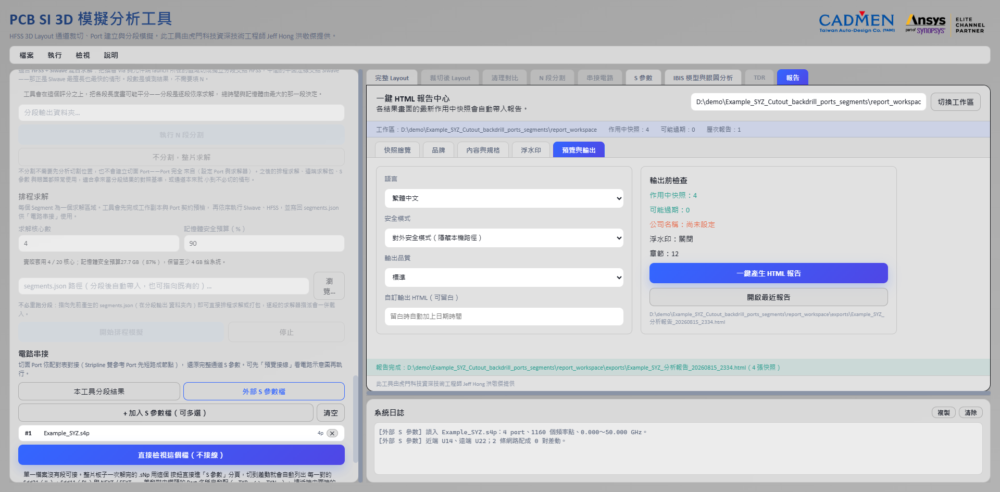

# 一鍵 HTML 報告與輸出檔案

[回操作說明索引](../../操作說明.md)

## 一鍵 HTML 報告

**把分析過程各個結果畫面存成快照，加上公司品牌與結論，輸出成單一 HTML 檔。**

圖片全部以 data URI 內嵌，所以**寄出去只有一個檔**。
對方不必解壓縮、不必連網、不必安裝任何東西就能開。

在入口畫面的「結果」組勾選 **☐ 一鍵 HTML 報告**（預設不勾）就會啟用。


封面帶公司名稱、部門與 Logo，並列出客戶、報告編號、產生時間與安全模式。
下方接著是你在報告中心填的分析目的與結果摘要。

## 保存快照

**快照擷取的是「目前這個分頁的畫面」，包含你現在的縮放、平移、圖層開關與曲線選擇。**

所以**先把畫面調成想呈現的樣子，再按快照**。

勾選之後，各結果分頁的分頁列右側會出現 **📷 更新報告快照**。

| 目前分頁 | 存成的快照類別 |
|---|---|
| 完整 Layout | `full`（章節：原始電路板與目標通道） |
| 裁切後 Layout | `cut`（章節：裁切後 Layout） |
| 清理對比 | `cleanup`（章節：Layout 清理比較） |
| 分段（整體視圖） | `segments`（章節：N 段分割） |
| 分段（第 N 段） | `segments-N`，各段獨立保存 |
| 串接電路 | `schematic`（章節：電路串接） |
| S 參數 | `sparam`（章節：S 參數結果） |
| IBIS 模型與眼圖分析 | `models`（章節：IBIS 模型與眼圖分析） |
| TDR | `tdr`（章節：TDR 阻抗定位） |
| 截面阻抗 | `crosssection`（章節：截面阻抗（Q2D）） |

**畫面上有多張眼圖時，總覽以外還會替每張眼圖各存一張獨立快照**
（類別是 `<父類別>-<標記>`）。整頁快照只拍得到捲動容器目前露出來的那一段，
捲在下面的那幾張會被切掉，所以那幾張各自以自己為根重拍一次。

按下後只要填兩個欄位：

- **工程狀態**：僅供展示／通過／注意／失敗。
  報告裡會以標籤呈現。**這是給讀者的判讀結論，不是工具自己算出來的** ——
  工具不會替你判定合格與否。
- **圖說／工程備註**：這張圖要證明什麼。可以先留空，稍後在報告中心補。

> **快照擷取的解析度固定為最高品質（3840 px 級），沒有選項。**
> 報告裡的圖是拿來看細節的，沒有人會刻意要低解析度的版本。
> 多一個選項只是多一個選錯、事後才發現要重拍的機會。
>
> **報告裡圖片的顯示寬度是另一回事**，由報告中心「預覽與輸出」分頁的「輸出品質」決定：
> 精簡 1280 px、標準 1920 px、高品質 3840 px，**預設是標準**。
> 快照本身一直是最高解析度，要交出 3840 px 的報告記得把輸出品質改成高品質。

### 同一個畫面最多留 5 版

第 6 次會先問你是否移除最舊的那一版。

多版本的用意是「改了設計再拍一次，兩版留著對照」。
報告只會採用你指定的那一版，預設是最新的一版。

### 來源資料變了，快照會被標成「過期」

**凡是重新產生某一類結果，對應類別的快照就會被打上過期標記與原因。**
重新載入完整板、重跑裁切、Layout 清理、重新分段、重新串接、重跑眼圖或 TDR 都算。

**快照本身不會被刪除。** 報告中心會把它標出來，讓你決定是重拍還是照舊採用。

## 報告裡的每張圖長什麼樣



每張圖都會自動編號（圖 1、圖 2…）並附上：

- **工程狀態標籤** —— 你在存快照時選的「僅供展示／通過／注意／失敗」。
- **圖說** —— 你寫的那段工程備註。
- **可稽核資訊** —— 快照版本、產生時間，以及該張圖的 **SHA-256**。
  **同一張圖有沒有被換過，比對雜湊就知道，不必憑印象。**
- **來源資料表** —— 訊號網路數、參考網路數、分段數、快照品質等，隨快照一起記下來。
  **事後不必回頭猜這張圖是在什麼設定下拍的。**



**圖是「畫面當下的樣子」。** 勾了哪幾條曲線、Y 軸範圍設多少、游標開著沒有，
全部照實呈現。這也是為什麼要先把畫面調好再按快照。

注意這張圖下方的「來源」是空的 —— 因為報告以**對外安全模式（隱藏本機路徑）**產生，
本機路徑被自動隱藏了。改用內部工程模式就會完整保留。

## 報告工作區放在哪

**工作區跟著案子走，不會落到家目錄。**

```
輸入是 <板子目錄>\MyBoard.aedb   →   <板子目錄>\MyBoard_report_workspace\
在欄位指定目錄 <指定目錄>\       →   <指定目錄>\report_workspace\
```

**為什麼不放家目錄：** 快照動輒上百 MB，一來占系統碟，
二來換一片板子做另一份報告時兩份會混在同一個目錄裡。

放在板子旁邊就是「一個案子一個資料夾」，備份與交付都跟著案子走。

**什麼都還沒載入時，工作區開不起來。** 位置是從目前開著的那個檔推出來的，
沒有檔就沒有位置，後端寧可拒絕也不替你挑一個想不到的磁碟位置。
一開工具就先點「報告」分頁的話，只會看到「工作區：尚未開啟」而且不給原因 ——
先載入電路板或 S 參數檔，或直接在上方欄位指定一個目錄。

工作區結構：

| 項目 | 內容 |
|---|---|
| `report_manifest.json` | 快照清單、版本、章節、品牌與設定；工作區的索引。 |
| `snapshots/` | 各版本快照圖，檔名為 `<類別>_v<版本>_<8碼>.png`。 |
| `assets/` | 公司 Logo、浮水印圖片等。 |
| `exports/` | 產生出來的 HTML 報告。 |

## 報告中心

從功能表「檢視 → 一鍵 HTML 報告中心」，或分頁列的「報告」進入。
最上面是工作區路徑欄與「切換工作區」，底下分成五個分頁：
**快照總覽**、**品牌**、**內容與規格**、**浮水印**、**預覽與輸出**。

### 快照總覽

依類別分組列出所有版本。可以按「設為目前版本」切換要採用哪一版、改章節歸屬、
改工程狀態與圖說，或取消勾選「加入報告」把某一版排除。

**「＋ 加入補充圖片」**把工具外面的 PNG／JPG／SVG 收進來，歸在「補充證據」章節。

### 品牌

公司名稱、部門、專案名稱、客戶名稱、報告編號與公司 Logo。
按「保存品牌設定」**可以存成預設值，下一個案子直接沿用。**

### 內容與規格

**報告章節**：勾選要出現哪些章節。順序固定如下：原始電路板與目標通道、
裁切後 Layout、Layout 清理比較、N 段分割、求解狀態與設定、電路串接、
S 參數結果、IBIS 模型與眼圖分析、眼圖結果、TDR 阻抗定位、模擬結果、補充證據。
**沒有對應快照的章節會自動略過。**

**驗收規格**：頻率範圍、插入損耗門檻、回波損耗門檻、眼高／眼寬門檻。

這是**純文字欄位**，會原樣列在報告的驗收規格表中（例如「≥ −12 dB @ 28 GHz」）。
**工具不會拿它去自動比對數據判定通過與否。**

**文字段落**：分析目的、結果摘要、工程結論、改善建議。

### 浮水印

可選文字、圖片或兩者；可套用到整份報告、僅結果圖片，或自訂章節；
可調整透明度、角度、顏色、大小與排列（重複平鋪／單一置中）。

文字欄位下面有六顆變數按鈕（`{公司名稱}`、`{客戶名稱}`、`{專案名稱}`、
`{報告編號}`、`{產生日期}`、`{機密等級}`），按下去插進文字裡，產生報告時才代入實際值。
**這是唯一能讓浮水印帶客戶名稱與日期的辦法。**

調好的設定可以「另存範本」，之後用「套用範本」帶回來。
**套用範本刻意不會順手把「啟用浮水印」打開** —— 範本裡可能帶著上一個客戶的名字。

### 預覽與輸出

**語言**：繁體中文、English，或中英雙語。

**安全模式**：

- **對外安全模式（隱藏本機路徑）**（預設）：報告中出現的本機路徑會被替換成 `[已隱藏本機路徑]`。
- **內部工程模式**：完整保留路徑，方便自己人回溯檔案位置。

**輸出品質**：精簡／標準／高品質，決定報告裡圖片的顯示寬度，預設是標準。

右邊的**輸出前檢查**列出作用中快照數、可能過期的張數、公司名稱填了沒、
浮水印開關與章節數。產生過報告之後這裡會多一顆「開啟最近報告」。

## 產生報告

按「一鍵產生 HTML 報告」，預設輸出到工作區的 `exports/`，檔名為：

```
<專案名稱>_分析報告_<YYYYMMDD>_<HHMM>.html
```

也可以自行指定輸出路徑。報告產生後會記錄 SHA-256，並附在工作區的 `exports` 清單裡。

**報告本身內建「列印／另存 PDF」與「全螢幕」兩個按鈕，圖片可點擊放大。**
要交 PDF 的話用瀏覽器列印就好，不需要另外的轉檔工具。

## 輸出檔案說明

| 輸出 | 說明 |
|---|---|
| `*_Cutout.aedb` | 裁切後的通道 EDB，只有幾何 —— 這一步不建 Port，也不寫 Setup。 |
| `*_stackup.aedb` | 疊構更換後的新 EDB；原檔不覆寫。 |
| `*_stackup_change_report.json` | 疊構更換前後的逐層與材料狀態。 |
| `*_backdrill.aedb` | 寫入背鑽後的新 EDB；原檔不覆寫。 |
| `*_backdrill_report.json` | 每顆 Via 的連接層、背鑽側、鑽深、殘樁長度、共振頻率及讀回驗證結果。 |
| 清理後 `.aedb` | 使用者指定的新 EDB；原檔不覆寫。 |
| `*_cleanup_report.json` | Layout 清理條件、候選、刪除數量與安全保留資訊。 |
| `*_ports.aedb` | 〈設定 Port 與求解器〉另存的新 EDB，含元件端 Port、HFSS Setup 與掃頻設定；原檔不覆寫。 |
| `segment_1.aedb`～`segment_N.aedb` | N 段實際 Layout 與切面 Port。 |
| `segments.json` | 分段路徑、Port、短路群組、切面配對、逐段求解器、網格方法、安全驗證及 Touchstone 路徑。 |
| `segment_1.sNp`～`segment_N.sNp` | 各段排程求解後輸出的 Touchstone；副檔名依 Port 數決定。 |
| `cascade_result.sNp` | 完整通道串接結果；副檔名依最終 Port 數決定。 |
| `*_cascade_summary.json` | 串接來源、短路與接線、最終 Port 順序、頻率範圍及數值摘要。 |
| `*_S參數.xlsx` | S 參數分頁按「匯出 Excel」的產出；匯的是**目前圖上那幾條曲線**，不是後端重算。 |
| Circuit `.aedt` | 完整通道單一元件，或保留 N 段接線的 PyAEDT Circuit 專案。 |
| `tdr_results\*_tdr.aedt` | TDR 求解建立的 Circuit 專案；畫面上以「Circuit 專案：…」顯示。 |
| `ibis_channel_runs\` | IBIS 通道分析每次執行的結果目錄，放在來源 Touchstone 旁邊。 |
| `ami_channel_runs\` | IBIS-AMI 分析每次執行的結果目錄，放在來源 Touchstone 旁邊。 |
| `q2d_runs\*_q2d.aedt` | 截面阻抗的 Q2D 專案，放在板檔旁邊，不寫進 `.aedb` 內部。 |
| `*.aedb.q2dcuts.json` | 截面阻抗的框選範圍與切線集；刻意保留 `.aedb` 後綴，同目錄的其他來源檔才不會撞在一起。 |
| `*_report_workspace/` | 報告工作區：`report_manifest.json` 索引、`snapshots/` 各版本快照、`assets/` 品牌素材、`exports/` 產出的 HTML。 |
| `*_分析報告_*.html` | 單一自包含 HTML 報告；圖片以 data URI 內嵌，可直接寄送。 |

> **保留 `segments.json` 與所有分段 EDB／Touchstone 的相對位置，不要只移動單一檔案。**
> 那份 json 裡記的是相對關係，搬走其中一個，後面的串接就接不回去了。

---

← [截面阻抗（Q2D）](08-截面阻抗.md)　[回索引](../../操作說明.md)　[其他工作模式](10-其他工作模式.md) →

