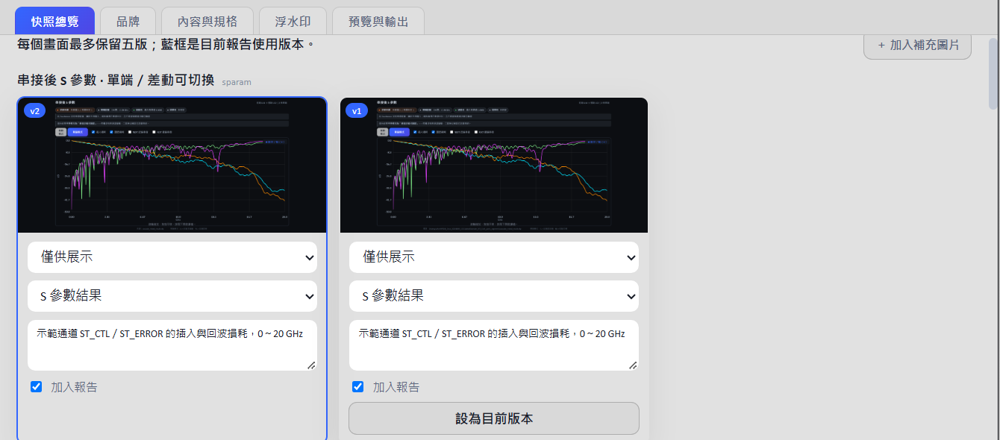
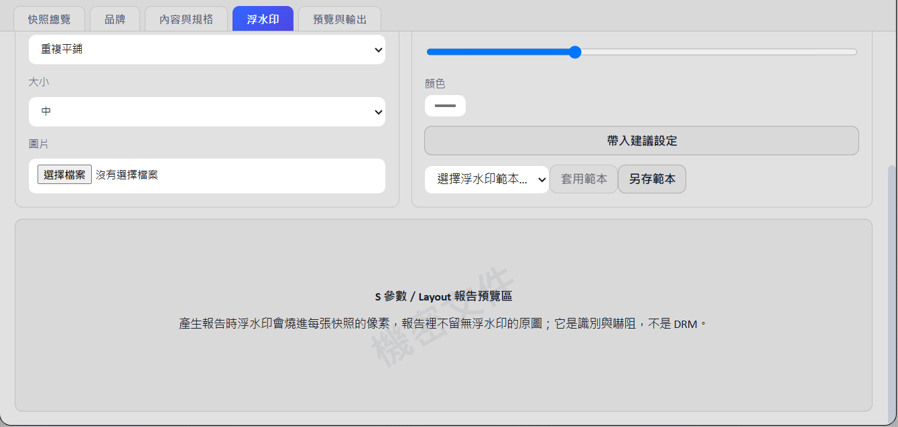
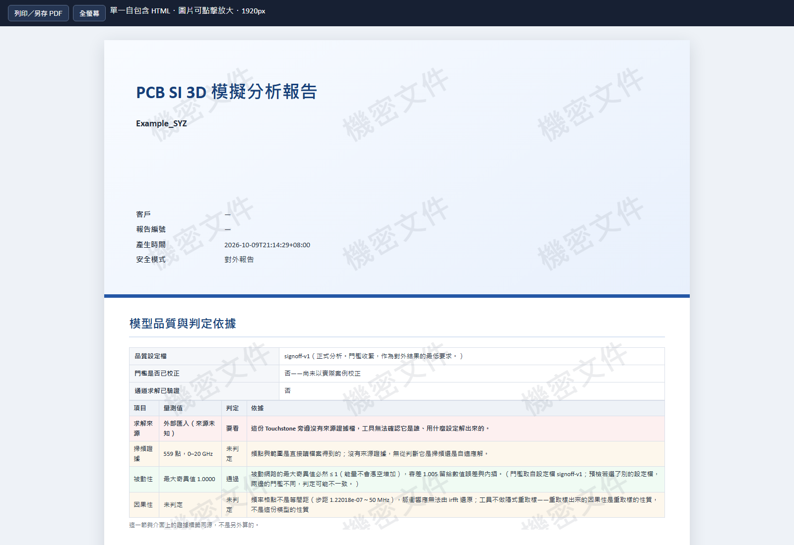

# 一鍵 HTML 報告與輸出

[回索引](../../操作說明.md)　[上一章](08-截面阻抗.md)　[下一章](10-其他工作模式.md)

更新結果快照、確認來源與結論，再輸出單一 HTML。安全模式不會替圖片抹除機密內容，交付前必須逐圖檢查。

| 前置項目 | 用途 |
|---|---|
| 完整工具包及啟動時安裝的相依套件 | 安裝見 [01 開始使用](01-開始使用.md) |
| Pillow（工具相依套件） | 將浮水印燒入圖片；由完整工具的安裝流程安裝 |
| 已載入板／通道或指定報告工作區 | 決定快照與輸出位置 |
| 瀏覽器 | 開啟 HTML；另存 PDF 用瀏覽器列印 |

## 保存結果快照

1. 在結果頁先調整縮放、圖層、曲線與圖例，只呈現這次要交付的內容。
2. 按「更新報告快照」，填工程狀態與圖說。
3. 到「檢視 → 一鍵 HTML 報告中心」，在「快照總覽」核對作用中版本、來源與章節。
4. 若顯示「可能已過期」，查原因並重拍；確需沿用時在圖說交代來源與限制。

工程狀態是使用者的判讀，不是工具自動驗收。模型、板子或設定變更後，舊快照仍可存在；看到圖片不代表來源仍是現行結果。新增版本遇到上限時，先確認最舊版用途再同意移除。

完成判據：作用中快照數量與預計圖表一致，沒有未處理的過期項目；眼圖總覽之外也核對需要交付的個別眼圖。

## 報告中心設定

| 分頁 | 必須核對 |
|---|---|
| 快照總覽 | 採用版本、工程狀態、圖說與外部補充圖 |
| 品牌 | 公司、專案、客戶與 Logo；沿用預設後重新確認 |
| 內容與規格 | 章節、分析目的、規格、結論與限制；純文字規格不會自動判定 |
| 浮水印 | 啟用、文字／圖片、角度與透明度；套用範本後仍要確認啟用 |
| 預覽與輸出 | 語言、安全模式、品質與輸出前檢查 |

浮水印產生時燒入快照像素，是識別與嚇阻，不是 DRM。範本帶入不代表已啟用。設定完成後預覽字是否可讀、有沒有遮住數值；無法正確處理浮水印的圖片先修正，不帶錯交付。

## 預覽與輸出

1. 選「對外安全模式（隱藏本機路徑）」與所需語言／品質。
2. 檢查作用中快照、過期數量、品牌與浮水印狀態，按產生報告。
3. 用介面提供的開啟／資料夾按鈕找到產出；工具視窗無法開啟時，用「說明 → 在瀏覽器開啟」重試或到已回報的輸出位置開檔。
4. 重開產出的單一 HTML，逐章檢查圖片、圖說、狀態、數值及來源；需要 PDF 時用瀏覽器列印後另查頁面裁切。

完成判據：HTML 可獨立開啟，應交圖表與文字都存在。安全模式僅隱藏可辨識的本機路徑，不保證圖中文字、客戶名稱、授權資訊或外部圖已去識別；逐張看完才可對外使用。

## 工作區與原件

工作區跟目前板檔／通道來源或指定目錄走；尚未載入來源時，先選工作區再存快照。產生快照／報告前，確認工作區、完整輸出路徑與檔名皆為 ASCII。若工具不能指定 ASCII 名稱，先停止該項輸出並列為待修，不在產生中文檔名後才改名。

| 工作區項目 | 保存內容 |
|---|---|
| `report_manifest.json` | 快照版本、品牌與報告設定 |
| `snapshots/` | 各版快照 |
| `assets/` | Logo／浮水印素材 |
| `exports/` | 已產生 HTML |

## 結果檔保存

| 結果 | 保存方式 |
|---|---|
| 各階段 `.aedb` 與變更摘要 | 原板與新輸出分開；對應 [02](02-載入與裁切.md)、[03](03-Port與求解設定.md) |
| 分段 EDB、`segments.json`、各段 `.sNp` | 保留相對位置，不能只搬索引或一個結果 |
| 串接 `.sNp` 與摘要 | 保留各段來源與埠對映，見 [05](05-排程與串接.md) |
| S 參數 Excel | 核對當下顯示曲線，不能假定含所有隱藏曲線 |
| IBIS／AMI、TDR、Q2D 結果 | 保留各次 Run 與模型／設定證據，見 [06](06-IBIS與眼圖.md)、[07](07-TDR定位.md)、[08](08-截面阻抗.md) |

報告是交付呈現，不取代原始結果與來源。回報工具問題另用[支援包](11-疑難排解.md#支援包與資料邊界)，不要把整份客戶資料上傳公開 repo。
