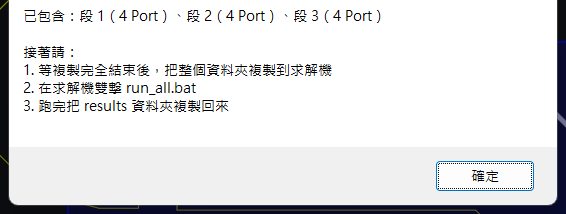

# 其他工作模式

[回索引](../../操作說明.md)　[上一章](09-報告與輸出.md)　[下一章](11-疑難排解.md)

依已有資料選入口；第一次從原板開始時用 [00 第一次跑](00-第一次跑.md)。工具安裝與套件需求見 [01 開始使用](01-開始使用.md)。

## 已有裁切通道

1. 勾「載入電路板」，取消子項「局部裁切」。
2. 確認按鈕顯示「載入檔案（不裁切）」，瀏覽通道 EDB 並載入。
3. 選訊號與參考，確認所需端點與回流都存在。
4. 需要求解時先完成 [Port 與設定](03-Port與求解設定.md)，再[整片／分段](04-分段與混合求解.md)。

此入口不會代建 Port／Setup。完成判據：通道幾何、訊號與外部端點正確；不能僅因載入成功就開始串接。

## 單一外部 Touchstone

在「電路串接」切「外部 S 參數檔」，用「加入 S 參數檔（可多選）」選檔，再按「直接檢視這個檔（不接線）」。核對埠數、頻率範圍、參考阻抗與來源。

差動自動配對依檔頭 Port 註解與命名；沒有可辨識配對時先看單端。四埠不必然代表差動，不能只看副檔名。沒有對應幾何時不能把外部通道的 TDR 當已完成 Layout 定位。

圖例／軸抽屜可選曲線、縮放、Fit All 與匯出 Excel；匯出的是當下顯示曲線。完成判據：圖例與匯出資料一致，來源埠與通道定義可追溯。

## 多檔外部串接

1. 加入各段 `.sNp`，核對頻率、參考阻抗與埠定義。
2. 按「自動建議接線」，再逐線核對；缺名稱時依實際埠表人工指定。
3. 必要時新增接線／短路群組，保留通道兩端的外部埠。
4. 按「預覽接線」，確認接法後「執行串接」。

完成判據：保留埠數、通道方向及來源摘要正確，沒有錯接或把全部埠都接成內部節點。處理頻率與阻抗的變更另外存檔，原件保留。

## 載入既有分段

勾「排程求解」，在排程面板瀏覽先前 `segments.json`。可不勾 N 段分割，但需核對載入的段數、求解器指派、EDB 與結果來源。幾何或設定已改的段重新求解；索引存在不代表舊結果仍有效。操作見 [05 排程與串接](05-排程與串接.md)。

## 遠端求解包

| 前置需求 | 用途 |
|---|---|
| 已完成分段與 `segments.json` | 打包依據 |
| 求解機安裝相容 Ansys 與有效授權 | 真正執行求解；打包不提供授權 |
| 新的 ASCII 輸出資料夾 | 避免覆寫既有工作 |

1. 勾「遠端求解包」，載入分段索引並核對逐段求解器與核心設定。
2. 指定新的輸出資料夾，按「匯出求解包」。
3. 整包複製到求解機的 ASCII 路徑，執行 `run_all.bat`，保留日誌與 `results/`。此包供求解機執行，不需另裝 Python。
4. 複製回來，在「求解完成的資料夾」指定求解包或 `results/`，按「收回結果」。

完成判據：收回的 Touchstone 通過埠數與格式驗證，對應段結果已寫入索引，失敗段沒有被當成功使用。HFSS 預設 12 cores；只有 HPC／核心錯誤才改 4，保留錯誤證據。

## S 參數工具箱與 COM

開「IBIS 模型與眼圖分析 → S 參數工具箱」，瀏覽來源檔。依需求選重正規化、換埠序、重取樣、DC 外插、去嵌入或翻面，填參數後執行；檢查產出埠序／頻率與處理摘要。

COM 需工具探測到 SPISim 批次引擎與可用標準組態。選實際適用標準，核對差動埠、頻率與輸入要求後「計算 COM（背景）」。結果以最差案例及門檻判定；引擎結束但沒有 COM 值不算通過。按鈕顯示「引擎待收尾」時，引擎結束後會自動恢復；確認沒有引擎在跑仍卡住，才按「確認引擎已結束，清除紀錄」。DC 外插是模型處理，不能冒充量測到的低頻資料。

<!-- 待拍：gui-38-com-result.png。 -->

保留處理前後檔、參數、COM 標準與結果證據；報告與其他結果整理見 [09](09-報告與輸出.md)。
