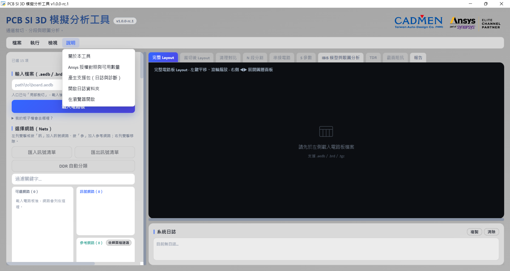
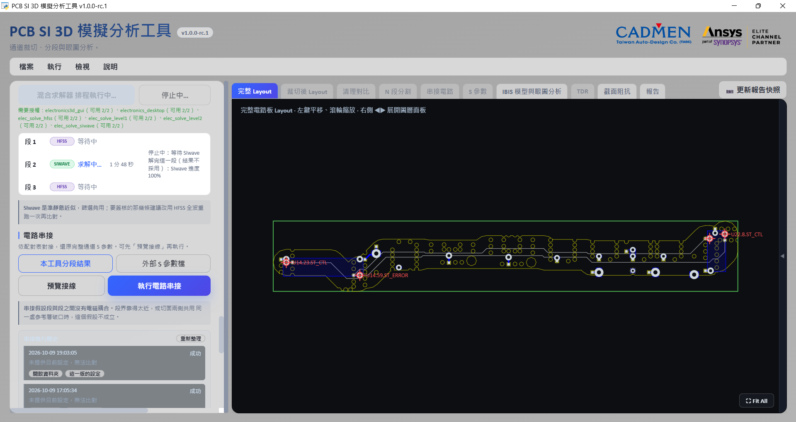

# 疑難排解與使用限制

[回索引](../../操作說明.md)　[上一章](10-其他工作模式.md)

先看當前狀態與第一個錯誤，再決定重試。求解中不要直接砍 AEDT、求解引擎或後端。

## 先確認畫面與入口

任務勾選控制顯示與前置提示，不會替你完成前一步。用選單切到對應頁；Layout 可縮放／平移與 Fit All。需要的圖表被隱藏時先查曲線／圖層開關。

## 症狀與處理

| 症狀 | 可直接做的檢查 |
|---|---|
| 按鈕灰色 | 讀按鈕旁前置提示或滑鼠提示；確認任務、來源資料、工作狀態及授權 |
| 工具視窗開不起來 | 重跑 `web_app/start.bat` 看第一個錯誤；可用 `start.bat -Browser` 檢查瀏覽器模式 |
| WebView2 問題 | 安裝 Microsoft Edge WebView2 Runtime；工具視窗用到它，瀏覽器模式不依賴桌面殼 |
| Python／套件安裝失敗 | 核對 Python 3.12 x64、網路與安裝日誌；不要隨機升級鎖定套件，需求見 [01](01-開始使用.md) |
| 401／連線失敗 | 用工具啟動流程產生的入口；關掉過期頁後重新開啟，不把 token 貼到日誌或對外訊息 |
| AEDT 版本不符 | 現行目標為 AEDT 2026.1，不能沿用「2024 以上皆可」 |
| 埠被占用 | 依啟動日誌確認實際使用的埠；先查用途，不直接終止陌生 PID |
| 裁切或載入很久 | 看階段、處理數量與日誌；頁面短暫不更新不足以證明當機 |
| 分段沒有合法切面 | 查遭否決原因，減少段數或重選位置；不可行切面不能靠忽略警告變可用 |
| Port 數異常／全反射 | 查訊號 Pin、參考、切面、埠序與外部端點；先修正再串接 |
| 結果過期 | 對照板幾何與設定，重解受影響段；不要直接沿用舊 `.sNp` |
| 待匯出 | 求解尚未轉成可用結果；依 [05](05-排程與串接.md)重試匯出，不當完成 |
| 停止中 | 看等待目前段完成的文字；SIwave 本段結果不採用，其餘段跳過，停止完成前不重開排程 |
| 沒在求解，按鈕顯示「引擎待收尾」 | 原生引擎（SPISim）結束後工具會自動清除紀錄。仍卡住時，先在工作管理員確認引擎已結束，再到 S 參數工具箱按「確認引擎已結束，清除紀錄」 |
| Layout 清理說「請先完成通道裁切」 | 先執行裁切，或用直接匯入分段模式載入通道；裁切後不必先建 Port，見 [02](02-載入與裁切.md#layout-清理選用) |
| 背鑽警告／結果不符 | 查連接層與另存 EDB；低於 4 mil 開路警告須先核對，不直接套用 |
| 眼圖閉合／無法量測 | 核對通道、資料率、模型兩側、方向與等化；用基準眼比較，不能只降速就認定原設定正確 |
| TDR 位置反向／不連續 | 查探棒端、網路、走線長度與未串入段，再判斷是否翻轉起點 |
| Q2D 結束卻沒有數值 | 查可解性、錯誤與授權；工作結束不等於實際完成求解 |
| HTML 開不起來／內容不對 | 重開產出檔，核對作用中快照、過期數量與來源，見 [09](09-報告與輸出.md) |

<!-- 條件待拍：gui-37-pending-export.png（真實觸發才拍）。 -->

## 授權、求解與停止

開「說明 → Ansys 授權對照與可用數量」，核對本功能需要的授權。能開介面不代表能求解；進度停留在「正在執行」時看求解日誌與授權錯誤，不反覆啟動工作。

HFSS 網格階段可能長時間少訊息，先看階段、日誌與活動；沒有新訊息也不能保證正常。核心預設 12；只有明確 HPC／核心錯誤才改 4，記下實際原因，不能低於 4。不要依舊文件的固定授權張數推可用量。

停止請用工具的停止流程。求解中關閉工具視窗會先確認並等待收尾；「停止中」不代表已釋放授權。不要用工作管理員強制結束。正常完成後保留使用者的 AEDT 工作環境；工具退出與 AEDT 是否關閉是不同狀態。

遇到 `EnsComEngine returned an error code`，保留原話與出錯段。不要用跨專案複製 design 代替排程解各段；先查元件／Pin／Port 與日誌。

## 產生支援包

1. 記下工具版本、重現步驟、第一個錯誤及相關段／埠。
2. 「說明 → 產生支援包（日誌與診斷）」，保存 ZIP。
3. 查 `manifest.json` 的包含／略過項目；確認實際 ZIP 可開啟。
4. 檢查日誌中的路徑、使用者／客戶名稱、token 與授權資訊，再交給支援人員。

支援包不含模型檔、EDB、Touchstone 與求解結果，仍可能含敏感診斷資訊。不要上傳公開 repo；需要附板／模型時另確認提供範圍與授權。

## 使用限制

本工具以 Windows 與 AEDT 2026.1 為目標；安裝套件需網路。來源原件保留，各階段輸出用新的 ASCII 完整路徑。混合求解器建議、清理、背鑽估算、分段串接與眼圖都有工程假設；看到成功圖不能代替來源、設定與數值驗收。功能限制依 [06](06-IBIS與眼圖.md)、[07](07-TDR定位.md)、[08](08-截面阻抗.md)逐項核對。
