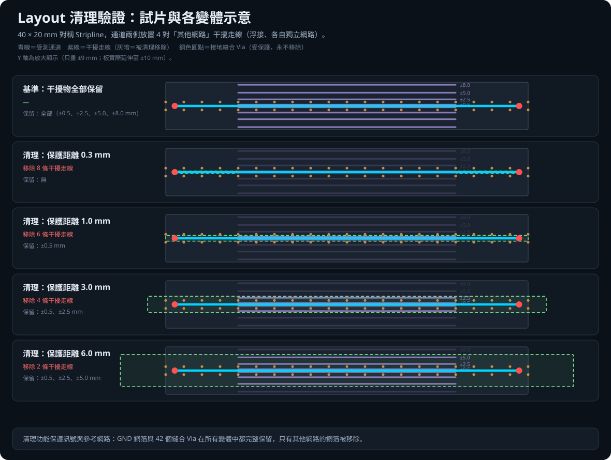
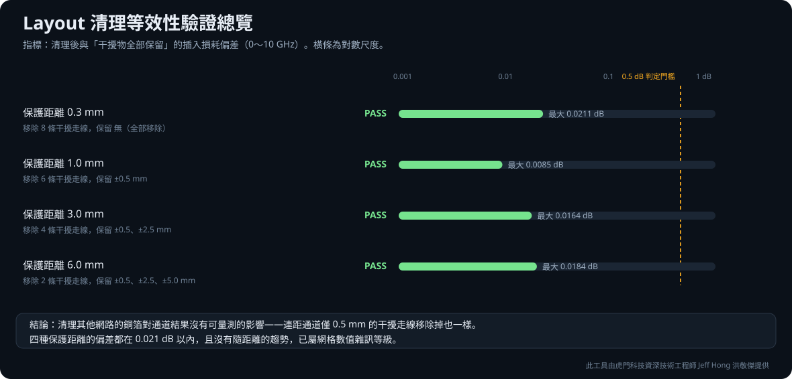

# Layout Cleanup Equivalence Validation

Choose your language／選擇語言：

- [繁體中文驗證報告](Layout清理等效性驗證報告.md)
- [English validation report](cleanup_validation_report.md)

操作步驟／How to run it：[操作說明 第 2 章〈載入電路板與裁切通道〉→ Layout 清理](../../docs/manual/02-載入與裁切.md#layout-清理)

This folder contains static evidence for the toolkit's layout-cleanup speed-up:
deleting foreign-net copper around the channel before solving. A 40 × 20 mm
stripline coupon with four pairs of floating clutter traces is compared against
its own uncleaned baseline across four protection distances.

本資料夾收錄工具「Layout 清理」加速手法的靜態驗證證據：以 40 × 20 mm Stripline
試片、通道兩側四對浮接干擾走線，對照同一片未清理的基準，掃描四種保護距離。

**Headline result／核心結果**

> Cleanup has no measurable effect: all four protection distances stay within
> **0.021 dB**, with no trend — even removing clutter 0.5 mm from the channel.
> Cleanup protects the signal and reference nets, so the return path is never
> touched.
>
> 清理對通道結果沒有可量測的影響：四種保護距離都在 **0.021 dB 以內**且無趨勢，
> 連距通道 0.5 mm 的干擾走線移除掉也一樣。清理功能保護訊號與參考網路，
> 回流路徑從頭到尾沒被動過。

## Contents／內容

| Path | Description／說明 |
|---|---|
| `results/cleanup_variants.svg` | Coupon and variant schematic／試片與變體示意 |
| `results/cleanup_validation_overview.svg` | Result overview／結果總覽 |
| `results/cleanup_validation_results.json` | Machine-readable results／機器可讀結果 |
| `results/touchstone/` | Raw Touchstone files／原始 Touchstone |

## Related／相關驗證

- [Channel cutout equivalence／通道裁切等效性](../cutout/README.md)
- [Channel segmentation method／分段切板方法](../segmentation/README.md)

Read together, the three show that **the only speed-up needing care is ground
stitching at the cut or cutout boundary**.

三份合看可見：**三項加速手法中唯一需要小心的，是切面／裁切邊界處的接地縫合狀況**。

> 此工具由虎門科技資深技術工程師 Jeff Hong 洪敬傑提供

This is Jeff Hong's personal technical portfolio. It is not an official account of
Taiwan Auto-Design Co.（TADC）and is not officially affiliated with Ansys, Inc.
Ansys, HFSS and SIwave are trademarks of Ansys, Inc.
