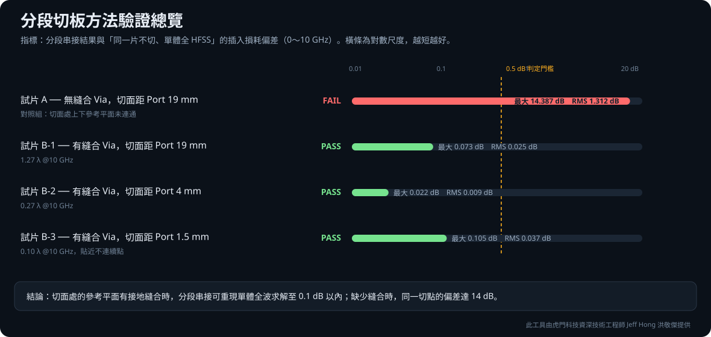
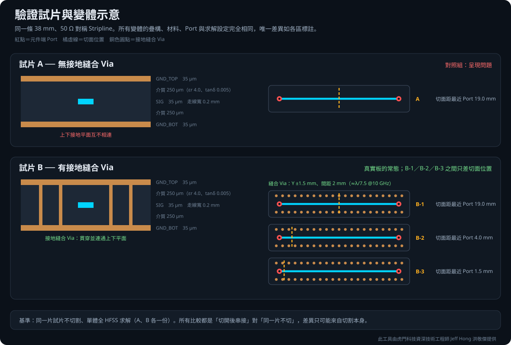
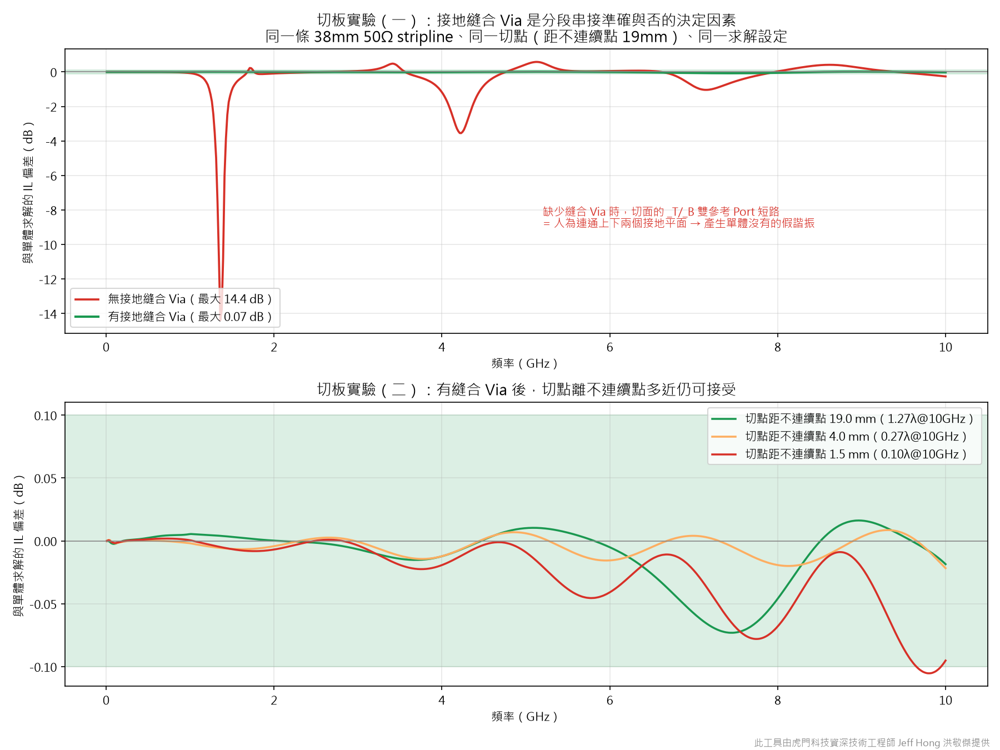
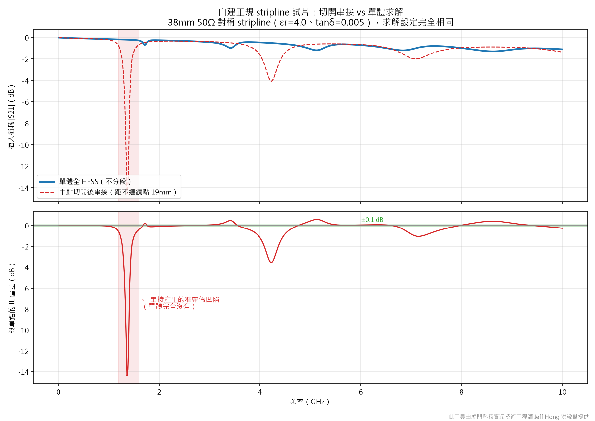

# Channel Segmentation Method Validation Report

## The short version

**Splitting a long channel into segments, solving each one, and cascading them
back together matches the one-piece solve to within 0.1 dB (0–10 GHz).**

One condition: **the reference planes must be stitched where you cut.**
Without stitching, the same cut location under identical solver settings deviates
by **14.4 dB** — the cascade grows narrowband resonances that do not exist in the
one-piece solve.

**Where you cut matters much less than you would expect.** Once stitching is
present, a cut 19 mm from a discontinuity and a cut 1.5 mm from it differ by no
more than 0.11 dB, already at mesh-noise level.

Full data and method below.

---

## Summary

This validation answers one concrete question: **when a long channel is split into
segments, solved independently, and cascaded back together, how far does the result
deviate from solving the whole channel in one piece?**

Using a purpose-built 38 mm, 50 Ω symmetric stripline coupon:

- When the reference planes **are stitched** at the cut location, the cascaded
  result reproduces the monolithic full-wave solve to within **0.1 dB
  (0–10 GHz)**, with no single frequency point exceeding 0.5 dB.
- When the reference planes **are not stitched**, the same cut location under
  identical solver settings deviates by **14.4 dB** — the cascade produces
  narrowband artificial resonances that do not exist in the monolithic solve.
- Once stitching is present, **how close the cut sits to a discontinuity barely
  matters**: 19 mm (1.27 λ), 4 mm (0.27 λ) and 1.5 mm (0.10 λ) all stay within
  0.11 dB, a spread already at mesh-noise level.

**Reference-plane stitching at the cut, not the cut angle and not the distance to
the nearest discontinuity, is what determines cascade accuracy.** This finding has
been fed back into the toolkit's cut-quality checks.

The conclusions apply to the model, bandwidth and solver settings in this report.
They are reproducible engineering evidence, not an unconditional guarantee for
every PCB stackup and structure.

---

## Method

### 1. Why a purpose-built coupon

An earlier attempt used a channel taken from a real production board, but it was
**not a valid test vehicle**: return loss above 5 GHz was only about −4 dB (nearly
total reflection) and the response was full of resonances. On such a structure any
small interface phase error is amplified into several dB of ripple, so the measured
numbers describe the vehicle's pathology rather than the method's error.

The validation therefore uses a coupon built from scratch, with every confounding
variable removed.

### 2. Coupon and variants

| Item | Specification |
|---|---|
| Structure | Symmetric stripline (solid reference plane above and below) |
| Stackup | GND_TOP 35 µm / dielectric 250 µm / SIG 35 µm / dielectric 250 µm / GND_BOT 35 µm |
| Dielectric | εr = 4.0, tanδ = 0.005 (deliberately low loss so dielectric loss does not mask the effect under test) |
| Trace | 0.2 mm wide, 38 mm long, 50 Ω target impedance |
| Reference planes | 40 × 6 mm, one above and one below |
| Terminations | SIG-layer pads with component-end ports (pin-to-layer circuit ports referenced to the planes) |
| Stitching vias (coupon B) | Two rows at Y = ±1.5 mm, 2 mm pitch (≈ λ/7.5 @10 GHz) |

Variants differ **only** in what is annotated; stackup, materials, ports and solver
settings are identical throughout:

| Variant | Stitching vias | Cut location (to nearest port) |
|---|---|---|
| Baseline | — | No cut; monolithic full HFSS solve |
| **A** | None | 19.0 mm |
| **B-1** | Present | 19.0 mm (1.27 λ @10 GHz) |
| **B-2** | Present | 4.0 mm (0.27 λ) |
| **B-3** | Present | 1.5 mm (0.10 λ) |

Coupons A and B each have their own monolithic baseline, so every comparison is
"the same coupon cut and cascaded" against "the same coupon uncut". The difference
can only come from the cut itself.

### 3. Coupon qualification (precondition)

Before comparing anything, the vehicle itself was verified (coupon B baseline):

| Frequency | Insertion loss | Return loss |
|---|---|---|
| 0.01 GHz | −0.012 dB | −54.3 dB |
| 1 GHz | −0.155 dB | −31.5 dB |
| 5 GHz | −1.062 dB | −21.0 dB |
| 10 GHz | −1.102 dB | −25.5 dB |

Return loss stays better than −14 dB across the band, insertion loss is smooth and
monotonic with no resonances, and the energy budget is fully explained by dielectric
and conductor loss (a stripline is enclosed, so there is no radiation).
**The coupon is a valid reference.**

### 4. Solver settings

Identical for every variant:

- Solver: Ansys HFSS 3D Layout 2026 R1
- Adaptive: broadband 1–5 GHz, up to 10 mesh refinement passes, Delta S 0.02
- Sweep: interpolating, 10 MHz – 10 GHz, 25 MHz step
- Cores: 4

### 5. Cut-plane ports and cascading

Because the trace is a stripline, the toolkit creates **two gap ports** at the same
cut location (one referenced to the plane above, one to the plane below) and shorts
them into a single node during cascading. Cascading is performed with scikit-rf
using the stored segment stitching information.

### 6. Pass criterion

Insertion-loss deviation between the cascaded result and the monolithic baseline
must stay within **0.5 dB** across the whole band.

---

## Results

| Variant | Stitched | Cut distance | Result | Max IL deviation | RMS IL deviation | Points over 0.5 dB |
|---|---|---|---:|---:|---:|---:|
| Coupon A | No | 19.0 mm | **FAIL** | 14.387 dB | 1.312 dB | 115 / 600 |
| Coupon B-1 | Yes | 19.0 mm | PASS | 0.073 dB | 0.025 dB | 0 / 600 |
| Coupon B-2 | Yes | 4.0 mm | PASS | **0.022 dB** | 0.009 dB | 0 / 600 |
| Coupon B-3 | Yes | 1.5 mm | PASS | 0.105 dB | 0.037 dB | 0 / 600 |

### What happens without stitching

Coupon A's cascaded result shows narrowband notches of −13.8 dB at 1.37 GHz and
−3.4 dB at 4.2 GHz that are entirely absent from the monolithic solve (the two
frequencies are roughly in a 1:3 ratio, the signature of odd-order resonance).

**Mechanism**: a stripline cut creates two reference ports at the same location,
which cascading shorts into one node. If the board has no stitching vias there,
that short **artificially connects two reference planes that were never connected**
— a path that does not exist in the monolithic model, hence the artificial
resonance.

When stitching vias are present the path already exists, the short becomes the
correct equivalent, and the artefact disappears entirely (the 1.37 GHz deviation
drops from −13.79 dB to +0.004 dB).

---

## Why this demonstrates the method works

1. **The baseline is the same coupon.** Each comparison is "cut and cascaded"
   against "uncut", not two different models, so the difference can only come from
   the cut.
2. **There is a negative control.** Coupon A shows what failure looks like, proving
   the measurement can distinguish good from bad rather than passing regardless.
3. **One variable at a time.** A and B differ only in stitching vias; B-1/B-2/B-3
   differ only in cut position. Everything else is identical.
4. **The vehicle was qualified first.** Return loss better than −14 dB and no
   resonances, so the numbers are not artefacts of a pathological structure.
5. **Raw data is published.** All Touchstone files and quantified results are
   included and can be recomputed independently.

---

## How the toolkit was improved

The findings are implemented in the cut-quality scoring:

- Collect **through-layer** vias on reference nets (single-layer pads are excluded
  because they cannot tie the planes together).
- Count ground vias within a 3 mm radius of each signal crossing and report the
  worst crossing.
- **The stitching check runs before angle and clearance.** A dual-reference
  (stripline) cut with fewer than 2 ground vias in that radius is downgraded to
  grade D with an explicit explanation of what to do about it.
- Single-reference (non-stripline) cuts are not checked — they create only one gap
  port, never short the planes together, and so cannot exhibit this failure.

---

## Raw data

- [Machine-readable JSON](results/segmentation_validation_results.json)
- [Raw Touchstone files](results/touchstone/): monolithic baseline and cascaded
  result for each variant

---

## Scope and further validation

This validation uses a single stripline coupon over a single band (0–10 GHz), with
one solve per condition and no repeatability statistics. Solver accuracy is set to
industry-standard Delta S 0.02, so the ±0.1 dB residual includes mesh numerical
noise and is not attributable to the cut alone.

Microstrip (single-reference) structures cannot exhibit the artificial-resonance
mechanism described here, but their cut error was not separately measured.
Differential pairs, multiple parallel traces (where crosstalk paths are severed by
the cut), layer-transition vias and connector models are outside this scope.
Extending the evidence to more complex real PCBs should start with differential
pairs and parallel-trace bundles.

The public repository keeps only anonymized Touchstone files and static results;
PyEDB modelling, HFSS solve orchestration and the product backend live in a
restricted version.

> This toolkit is provided by Jeff Hong, Senior Technical Engineer at Taiwan
> Auto-Design Co. (TADC).

> This repository is Jeff Hong's personal technical portfolio. It is not an
> official product of Taiwan Auto-Design Co. (TADC) or Ansys, Inc. Ansys, HFSS and
> SIwave are trademarks of Ansys, Inc.
