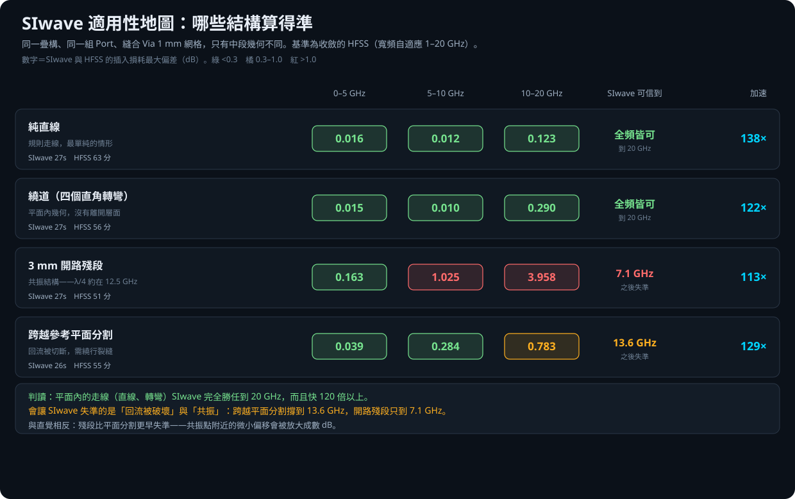

# SIwave 適用性地圖：哪些結構算得準

## 一句話結論

**決定 SIwave 準不準的不是幾何有多複雜，是回流路徑有沒有被破壞。**

工具用「複雜度評分」自動指派求解器：規則段給 SIwave、複雜段給 HFSS。
**但那個評分從來沒有被驗證過**，所以這份研究去量它。

- **平面內的走線 SIwave 完全勝任到 20 GHz，而且快 120 倍以上。**
  純直線偏差 0.123 dB，四個直角轉彎 0.290 dB。轉彎再多也沒事。
- **會讓 SIwave 失準的是回流被破壞與共振。**
  跨越參考平面分割撐到 13.6 GHz，開路殘段只到 7.1 GHz。
- **跟直覺相反：** 一般認為平面分割是 SIwave 最大的罩門，
  **實測是殘段更早失準。**

下面是完整數據與方法。

---

## 摘要

工具用「複雜度評分」自動指派求解器——規則段給 SIwave、複雜段給 HFSS——
但那個評分從未被驗證過。本研究建立一組標準結構，各自用 SIwave 與**收斂的**
HFSS 求解，量出 SIwave 的偏差，作為指派規則的實證依據。

- **平面內的走線 SIwave 完全勝任到 20 GHz，而且快 120 倍以上。**
  純直線偏差 0.123 dB、四個直角轉彎 0.290 dB。
- **會讓 SIwave 失準的是「回流被破壞」與「共振」**，不是幾何複雜度。
  跨越參考平面分割撐到 13.6 GHz，開路殘段只到 7.1 GHz。
- **與直覺相反**：一般認為平面分割是 SIwave 最大罩門，實測**殘段更早失準**。

---

## 驗證方法

### 試片

四種結構共用同一疊構、同一組 Port、同一套縫合規則，**只有中段幾何不同**：

| 結構 | 內容 | 意圖 |
|---|---|---|
| `straight` | 純直線 | 基準 |
| `bend` | 繞道，四個直角轉彎 | 平面內幾何 |
| `stub` | 3 mm 開路殘段 | 共振結構（λ/4 約在 12.5 GHz） |
| `gap` | 跨越參考平面分割（0.6 mm 裂縫） | 回流被切斷 |

疊構為 3 層金屬對稱 Stripline，介質 250 µm、εr = 4.0、tanδ = 0.005。

縫合 Via 鋪成 **1 mm 網格並自動避開走線**（間隙 0.8 mm），
四種結構套用完全相同的規則——目的是把「縫合」這個變因鎖死，
讓量到的差異只來自結構本身。

### 求解設定

- SIwave SYZ：掃頻 0.01–20 GHz／25 MHz
- HFSS：**寬頻自適應 1–20 GHz**（涵蓋整個掃頻範圍），Delta S 0.02，最多 10 passes

自適應必須涵蓋比較頻段，否則基準本身在上限附近不可信——
這一點在[自適應範圍研究](../solver_mix/自適應範圍驗證報告.md)中量化過。

### 判定指標

「SIwave 可信到」＝ SIwave 與 HFSS 的插入損耗偏差**首次超過 0.5 dB** 的頻率。

---

## 結果

| 結構 | 0–5 GHz | 5–10 GHz | 10–20 GHz | SIwave 可信到 | SIwave | HFSS | 加速 |
|---|---:|---:|---:|---:|---:|---:|---:|
| 純直線 | 0.016 | 0.012 | 0.123 | 全頻皆可 | 27 s | 63 分 | 138× |
| 繞道（四轉彎） | 0.015 | 0.010 | 0.290 | 全頻皆可 | 27 s | 56 分 | 122× |
| 3 mm 開路殘段 | 0.163 | 1.025 | **3.958** | **7.1 GHz** | 27 s | 51 分 | 113× |
| 跨越平面分割 | 0.039 | 0.284 | 0.783 | 13.6 GHz | 26 s | 55 分 | 129× |

（數字為 SIwave 與 HFSS 的插入損耗最大偏差，單位 dB。）

### 為什麼殘段比平面分割更早失準

殘段的 λ/4 共振落在約 12.5 GHz（3 mm 殘段、εr = 4）。共振點附近插入損耗
有很深的凹陷，兩個求解器只要在共振頻率上有微小偏移，凹陷處的 dB 差就會
被放大成數 dB。這不代表 SIwave「算錯」了共振本身，而是**共振結構對任何
微小差異都極度敏感**。

實務上的意義相同：**有開路殘段或 T 型分支的段落，高頻務必用 HFSS。**

---

## 對工具的意義

這是「複雜度評分自動指派求解器」第一次有實證依據。目前的評分主要看幾何
複雜度（轉彎數、Via 數量），但實測顯示該看的是**回流路徑是否完整**與
**有沒有共振結構**：

| 段落特徵 | 建議 |
|---|---|
| 只有直線與轉彎 | SIwave，全頻放心 |
| 跨越參考平面分割 | SIwave 可到約 13 GHz，更高頻改 HFSS |
| 有開路殘段／T 型分支 | SIwave 只到約 7 GHz，高頻務必 HFSS |

**轉彎數量不該提高複雜度分數。** 那會讓工具把大量 SIwave 完全能處理的
段落誤派給 HFSS，白白慢 120 倍。

---

## 過程中被實測否決的三個試片設計

值得記錄，因為每一個都是「看起來對、其實壞掉」：

1. **縫合 Via 排在 y = ±1.5 固定兩列** → bend 與 stub 的垂直段穿過 Via，
   訊號短路到地。兩個求解器都回報 S11 ≈ 0 dB、S21 < −58 dB。
2. **改成 y = ±6／±7 遠離走線** → 沒有短路，但走線附近完全沒有縫合，
   **連純直線的 SIwave／HFSS 差距都從 0.7 dB 暴增到 8.0 dB**。
   這反過來證實兩個求解器的主要分歧就在平行板模態。
3. **bend 用單一多點路徑建立** → `create_trace` 傳入 6 點路徑，產生的多邊形
   頂點完全正確，求解時卻與端點焊墊不導通（S21 隨頻率單調上升、S11 貼在
   0 dB，典型電容耦合）。拆成逐段兩點走線後，S21 由 −86.150 dB 變成 −0.019 dB。

**因此建立了固定流程**：任何新試片投入長時間 HFSS 前，先用 SIwave 解一次
（約 30 秒）檢查最低頻點——導通的線在 10 MHz 必然 S21 ≈ 0 dB、S11 很負。
這個把關在本研究擋掉三輪報廢的 HFSS 求解，每輪約 80 分鐘。

---

## 適用範圍

單一疊構、單一板寬、單端 Stripline、0–20 GHz。
**差動對、微帶線、多層 Via 轉換**不在本次範圍
（Via 轉換另見 `solver_mix` 的混合求解研究）。

結構參數固定（殘段 3 mm、裂縫 0.6 mm、轉彎 4 個），
改變這些參數會改變失準的起始頻率，本研究給的是**量級與排序**，
不是可外插的公式。

---

## 原始資料

- [機器可讀 JSON](results/solver_map_results.json)
- [匿名 Touchstone](results/touchstone/)：8 個（4 結構 × 2 求解器）
- 建模與求解編排：`build_and_run.py`

> 本 Repository 為 Jeff Hong 個人技術作品集之展示內容，非 Taiwan Auto-Design
> Co.（TADC）或 Ansys, Inc. 官方產品。Ansys、HFSS 與 SIwave 為 Ansys, Inc. 之商標。
