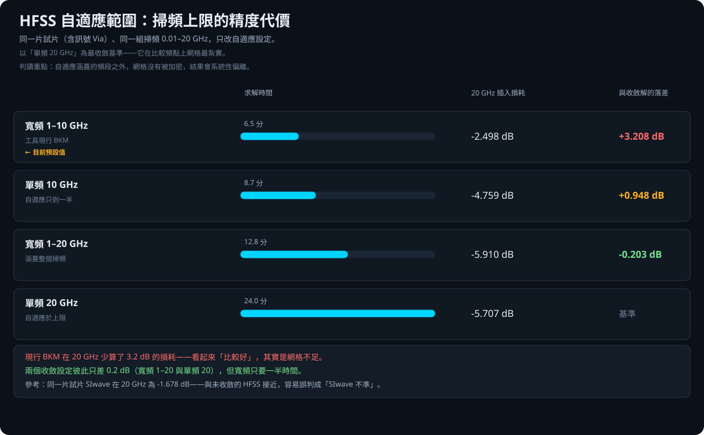

# HFSS 自適應範圍驗證報告

此工具由虎門科技資深技術工程師 Jeff Hong 洪敬傑提供

## 一句話結論

**這份驗證找出工具自己的預設值有問題：它在掃頻上限附近少算 3.2 dB 的損耗。**

網格是照著某個頻率切出來的。**工具原本只切到掃頻上限的一半**，
所以最高頻那一段的網格太粗，損耗被低估。

**結果看起來「比較好」，其實只是網格不夠。** 這種錯誤最難發現，
因為沒有人會去懷疑一個漂亮的結果。

**只有含 3D 細節（Via）的結構會爆發。** 同樣換自適應設定，
純直線段只差 0.07 dB，含 Via 的整片卻差 3.2 dB。

下面是完整數據與方法。

---

## 摘要

工具的 BKM 把 HFSS 寬頻自適應設在「1 GHz ～ 掃頻上限的一半」
（`app/solver_setup.py` 的 `broadband_range_ghz`）。本驗證量化這個設定在
掃頻上限附近的代價：

- **現行 BKM 在 20 GHz 少算 3.2 dB 的損耗**——結果看起來「比較好」，
  其實是網格不足。
- **兩個收斂設定彼此只差 0.2 dB**（寬頻 1–20 與單頻 20），
  但寬頻只要一半時間，CP 值明顯較佳。
- **這個問題只在有 3D 細節（Via）的結構上爆發**：同樣換自適應設定，
  純直線段只差 0.07 dB，含 Via 的整片卻差 3.2 dB。

---

## 驗證方法

### 試片

40 × 12 mm、5 層金屬，SIG_A／SIG_B 雙 Stripline，
中央 x = 20 mm 有訊號 Via 穿越中層參考平面 GND2（該處挖 antipad）。
介質 250 µm、εr = 4.0、tanδ = 0.005。

刻意選含 Via 的試片：Via 是需要細網格的 3D 特徵，
自適應範圍不足的影響會在這裡顯現。

### 變因

只改自適應設定，掃頻一律 0.01–20 GHz／25 MHz、4 核心：

| 代號 | 設定 |
|---|---|
| `bkm_bb_1_10` | 寬頻 1–10 GHz（**工具現行 BKM**） |
| `single_10` | 單頻 10 GHz |
| `bb_1_20` | 寬頻 1–20 GHz |
| `single_20` | 單頻 20 GHz |

### 基準

以 `single_20` 為最收斂基準——它在比較頻點（20 GHz）上網格最紮實。
`bb_1_20` 與它只差 0.2 dB，兩者互相印證，可視為已收斂。

---

## 結果

| 設定 | 求解時間 | 20 GHz 插入損耗 | 與收斂解的落差 |
|---|---:|---:|---:|
| 寬頻 1–10（現行 BKM） | 6.5 分 | −2.498 dB | **+3.208 dB** |
| 單頻 10 | 8.7 分 | −4.759 dB | +0.948 dB |
| 寬頻 1–20 | 12.8 分 | −5.910 dB | −0.203 dB |
| 單頻 20（基準） | 24.0 分 | −5.707 dB | — |

參考：同一片試片用 SIwave 求解，20 GHz 為 **−1.678 dB**。

### 一個容易誤判的陷阱

未收斂的 HFSS（−2.498 dB）與 SIwave（−1.678 dB）比較接近，
而收斂的 HFSS（−5.7 dB）離兩者都遠。若拿現行 BKM 的結果去對照 SIwave，
會誤以為「兩個求解器大致相符、收斂設定才是異常」——**方向完全相反**。

我在本研究之前就踩過這個坑：用未收斂的 HFSS 分段結果推論
「HFSS 高頻高估損耗、SIwave 才對」，那個結論站不住。

### 只有 3D 結構會受影響

同樣把自適應從 BKM 改成單頻 20 GHz：

| 對象 | 20 GHz 插入損耗變化 |
|---|---|
| 13 mm 純直線段（無 Via） | −2.377 → −2.310 dB（差 0.07 dB） |
| 含 Via 的整片 | −2.498 → −5.707 dB（差 3.21 dB） |

Via 是需要細網格的地方；規則走線在 10 GHz 自適應下已經夠準。
這讓結論更精確：**不是所有設計都要改自適應範圍，有 3D 細節的才要。**

---

## 建議

| 情境 | 建議設定 |
|---|---|
| 掃頻上限 ≤ 自適應上限的 2 倍，且結構單純 | 現行 BKM 可用 |
| 含 Via、接頭等 3D 轉換，且要看到掃頻上限 | **寬頻涵蓋整個掃頻範圍** |
| 只在意特定頻點 | 單頻自適應於該頻點 |

寬頻 1–20 相對現行 BKM 慢約 2 倍（12.8 分 vs 6.5 分），
但單頻 20 慢 3.7 倍而結果只差 0.2 dB——**寬頻涵蓋全段是 CP 值最佳解**。

`broadband_range_ghz()` 目前無條件回傳「1 ~ Fmax/2」，
建議改為可依結構複雜度或使用者需求調整；至少應在文件與 UI 提示中
說明掃頻上限附近的結果可能未收斂。

---

## 適用範圍

單一試片、單一疊構、0–20 GHz、Delta S 0.02、最多 10 passes、4 核心。
「3.2 dB」這個數字專屬於此試片；**可外推的是結論的方向**
（自適應範圍不足會在掃頻上限低估損耗，且只在 3D 特徵處顯著），
不是數值本身。

---

## 原始資料

- [機器可讀 JSON](results/adaptive_range_results.json)
- [匿名 Touchstone](results/touchstone/)：4 種自適應設定
- 求解編排：`run_adaptive_study.py`、`exp_lib.py`

> 本 Repository 為 Jeff Hong 個人技術作品集之展示內容，非 Taiwan Auto-Design
> Co.（TADC）或 Ansys, Inc. 官方產品。Ansys、HFSS 與 SIwave 為 Ansys, Inc. 之商標。
