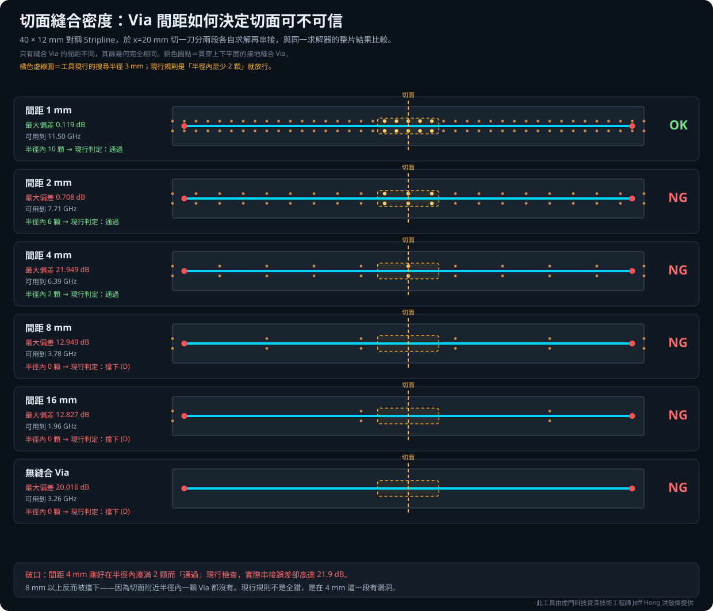
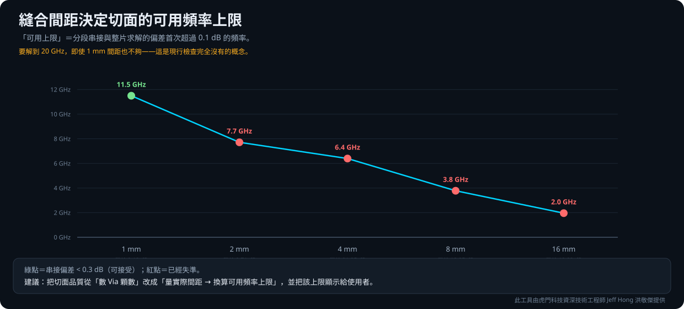

# 切面縫合密度驗證報告

此工具由虎門科技資深技術工程師 Jeff Hong 洪敬傑提供

## 一句話結論

**這份驗證是來拆自己台的：它證明工具原本的縫合檢查規則會放行誤差 21.9 dB 的切面。**

原本的規則是「切點 3 mm 內至少 2 顆縫合 Via」。那兩個數字是實作時憑工程判斷填的，
**從來沒有量測驗證過**，卻正在決定使用者的切面會不會被擋下來。

實測發現兩個問題：

- **有破口。** 縫合間距 4 mm 時，切面上剛好有一對 Via，**通過檢查**，
  但實際串接誤差 **21.9 dB**。
- **沒有頻率概念。** 同一個切面在 5 GHz 完全可信、在 20 GHz 完全不可信，
  規則卻只給一個與頻率無關的通過／不通過。

**替代規則：縫合間距要小於等於十分之一的導波波長。**
SIwave 與 HFSS 兩個求解器都驗過，對兩者都保守。

下面是完整數據與方法。

---

## 摘要

工具的切面品質檢查用兩個常數判定：**切點 3 mm 內至少 2 顆參考網路縫合 Via**
（`app/segment.py` 的 `STITCH_SEARCH_RADIUS_MM` 與 `STITCH_MIN_VIAS`）。
這兩個數字是實作時憑工程判斷填的，從未量測驗證，卻正在決定使用者的切面
會不會被評為 D 級。

本驗證固定幾何、只改縫合 Via 間距，量「分段串接」與「整片求解」的偏差：

- **現行規則有破口**：間距 4 mm 時切面上剛好有一對 Via（2 顆）而**通過檢查**，
  但實際串接誤差高達 **21.9 dB**。
- **現行規則缺少頻率概念**：同一個切面在 5 GHz 完全可信、在 20 GHz 完全不可信，
  但檢查只給一個與頻率無關的通過／不通過。
- **提出並驗證了替代規則**：縫合間距 ≤ λ/10（λ 為導波波長），
  經 SIwave 與 HFSS 雙求解器驗證，對兩者都保守。



---

## 驗證方法

### 試片

40 × 12 mm 對稱 Stripline（3 層金屬：GND_TOP／SIG／GND_BOT），
介質 250 µm、εr = 4.0、tanδ = 0.005，走線寬 0.2 mm（約 50 Ω）。
於 **x = 20 mm 切一刀**分成兩段，各自求解後串接，與同一求解器的整片結果比較。

參考平面在切面外側延伸 2 mm（等同裁切的擴張距離）——
若讓平面正好切在切面戛然而止，Stripline 會直接對空氣開口，
高頻大量輻射，量到的就不是縫合的影響。

### 變因

只改縫合 Via 間距：**1／2／4／8／16 mm，以及完全沒有**。
Via 位於走線兩側 y = ±1.5 mm，貫穿上下平面。其餘幾何完全相同。

### 求解器

主掃描用 SIwave SYZ（每次約 30 秒才掃得動這麼多組），
再用 HFSS（寬頻自適應 1–20 GHz）交叉驗證三個關鍵間距。

### 判定指標

「**可用頻率上限**」＝分段串接與整片求解的插入損耗偏差**首次超過 0.1 dB** 的頻率。

---

## 結果

### SIwave 主掃描

| 間距 | 半徑內 Via | 現行判定 | 最大偏差 | RMS | 可用上限 |
|---:|---:|---|---:|---:|---:|
| 1 mm | 10 | 通過 | 0.119 dB | 0.046 | 11.50 GHz |
| 2 mm | 6 | 通過 | 0.708 dB | 0.071 | 7.71 GHz |
| **4 mm** | **2** | **通過** ⚠ | **21.949 dB** | 2.578 | 6.39 GHz |
| 8 mm | 0 | 擋下 (D) | 12.949 dB | 2.243 | 3.78 GHz |
| 16 mm | 0 | 擋下 (D) | 12.827 dB | 1.891 | 1.96 GHz |
| 無 | 0 | 擋下 (D) | 20.016 dB | 2.720 | 3.26 GHz |

**間距 4 mm 是現行規則的破口。** 搜尋半徑 3 mm、Via 在 y = ±1.5 mm，
表示 x 方向只容許 ±2.598 mm；間距 4 mm 時切面上恰有一排（2 顆）落在範圍內，
剛好滿足「至少 2 顆」而放行——但該切面的串接誤差是 21.9 dB。

8 mm 以上反而被正確擋下，因為切面附近半徑內一顆 Via 都沒有。
**現行規則不是全錯，是在 4 mm 這一段有漏洞。**

### HFSS 交叉驗證

縫合密度掃描是用 SIwave 做的，但同一批試片上 HFSS 與 SIwave 在 20 GHz
相差約 1.7 dB，兩者對平行板模態的處理明顯不同。既然本研究量的正是
「切面的平行板模態有沒有被短路掉」，只用單一求解器下結論並不安全。

| 間距 | SIwave 上限 | HFSS 上限 | λ/10 預測 |
|---:|---:|---:|---:|
| 1 mm | 11.50 GHz | 10.41 GHz | 8.9 GHz |
| 2 mm | 7.71 GHz | 7.26 GHz | 6.9 GHz |
| 4 mm | 6.39 GHz | 5.48 GHz | 4.0 GHz |

兩個求解器**趨勢一致**，HFSS 一貫更嚴格（上限更低），
而 λ/10 預測對兩者都保守。



---

## 提出的替代規則

### 為什麼不用「最近鄰間距」

第一個想法是量交點鄰域內 Via 的最近鄰間距，但拿數據回推就發現它會失效：
縫合 Via 通常排成兩列夾著走線，**沿線間距一旦大於列距，最近鄰距離就飽和在列距上**。
實測間距 8 mm 的板子最近鄰仍是 3 mm（列距），會被誤判成安全，
但它的串接誤差是 12.9 dB。

### 改用面密度換算等效間距

```
等效間距 = sqrt(π r² / n)          n = 半徑 r 內的縫合 Via 顆數
f_limit  = c / (10 · 等效間距 · √εr)
```

要求縫合間距不超過導波波長的十分之一——這是 SI 界慣用的保守值。
顆數為 0 時直接判定不合格，不套用公式。

### 與實測對照

| 間距 | 半徑內顆數 | 等效間距 | 預測上限 | 實測（取兩求解器較低者） |
|---:|---:|---:|---:|---:|
| 1 mm | 10 | 1.68 mm | 8.9 GHz | 10.41 GHz |
| 2 mm | 6 | 2.17 mm | 6.9 GHz | 7.26 GHz |
| 4 mm | 2 | 3.76 mm | 4.0 GHz | 5.48 GHz |

三組預測都落在實測以下（保守方向）；8／16 mm 與無縫合三組半徑內
一顆都沒有，直接判定不合格，與實測的 12.9／12.8／20.0 dB 相符。

跨疊構的適用性另見[跨疊構轉移性驗證報告](../stitch_transfer/跨疊構轉移性驗證報告.md)。

---

## 建議的程式修改

已實作為純函式並附測試，**尚未啟用**（`app/segment.py`）：

| 函式 | 作用 |
|---|---|
| `effective_stitch_spacing_mm()` | 由鄰域顆數換算等效間距 |
| `stitch_frequency_limit_ghz()` | 間距 → 可信頻率上限 |
| `required_stitch_vias_for()` | 要達標還需幾顆 |
| `assess_stitch_for_frequency()` | 綜合判定與說明文字 |

`evaluate_stitch_coverage()` 新增兩個選用參數（`effective_dk`、`target_fmax_ghz`），
兩者缺一時不附加頻率資訊，`_auto_quality()` 走原本的顆數規則——
**因此目前工具行為完全不變**。測試見 `tests/test_stitch_frequency.py`。

要真正啟用還需決定：掃頻上限從哪裡取（求解設定？或讓使用者在切板頁指定
目標頻率）。這是 UI 決策，未逕行決定。

另建議把「此切面可信至 X.X GHz（局部縫合間距 Y.Y mm）」顯示給使用者——
現行只給等級與原因字串，使用者不知道**為什麼**、也不知道**要改到多密才夠**。

---

## 適用範圍

單一切面、垂直切過單一 Stripline、單一板寬（12 mm），
以「偏差首次超過 0.1 dB」為判定門檻。εr 與板厚的轉移性另有驗證，
但**斜切、多訊號同時跨越、差動對**均不在本次範圍。

縫合很密時（1 mm），限制切面精度的已經不是縫合而是切面 Port 本身
（實測可用上限 11.5 GHz 即受此限制），本規則只描述縫合這一項。

---

## 原始資料

- [機器可讀 JSON](results/stitch_density_results.json)（SIwave 主掃描）
- [HFSS 交叉驗證 JSON](results/stitch_density_hfss.json)
- [匿名 Touchstone](results/touchstone/)：27 個（6 種間距 × 整片／兩段，
  加上 HFSS 交叉驗證的 9 個）
- 建模與求解編排：`build_and_run.py`、`hfss_crosscheck.py`

> 本 Repository 為 Jeff Hong 個人技術作品集之展示內容，非 Taiwan Auto-Design
> Co.（TADC）或 Ansys, Inc. 官方產品。Ansys、HFSS 與 SIwave 為 Ansys, Inc. 之商標。
