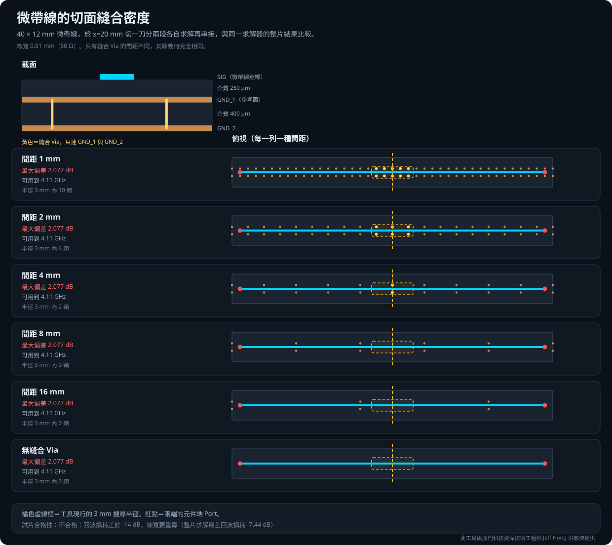
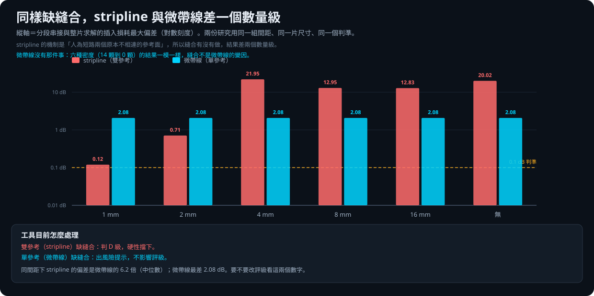

# 微帶線縫合密度驗證報告

此工具由虎門科技資深技術工程師 Jeff Hong 洪敬傑提供

## 一句話結論

**縫合密度對微帶線的分段串接完全沒有影響。** 把切面附近的接地縫合從半徑 3 mm 內
14 顆掃到 0 顆，六條偏差曲線在同一頻率上的最大散布只有 **9.8×10⁻⁴ dB**。

**真正的代價來自切開本身**，而且隨頻率上升、隨刀數累加：一片參考面完美連續的
試片切一刀，0～1 GHz 只差 0.016 dB，15～20 GHz 是 2.077 dB；切兩刀在高頻是
一刀的 2.2 倍。

這份研究**推翻了前一天自己寫的結論**。[真實板全頻對照](../segmentation/真實板全頻對照_20260817.md)
初版把偏差的根因寫成「切面缺少接地縫合」，那是推論；這份是量測。

---

## 為什麼做這一份

2026-08-17 的真實板對照量到微帶線切面偏差 1.5～2.7 dB，當時歸因給
「兩刀的半徑 3 mm 內各 0 顆跨層接地 Via」。**一片板的相關性不是因果**，
而那個歸因正在決定工具要不要對微帶線切面降級。

stripline 那條 D 級是拿四個變體、單一變因量出來的
（[切面縫合密度驗證](../stitch_density/切面縫合密度驗證報告.md)）。
微帶線要有同等強度的證據才能改評級。

## 試片：為什麼需要兩個 GND 層

**微帶線只有一個參考面，所以兩層板上「縫合密度」根本不存在變因**——
沒有第二個平面可以縫。真實板上那 15 顆是**跨層** GND Via，連通不同層的 GND 平面。

所以疊構是：

| 層 | 厚度 | 角色 |
|---|---|---|
| SIG | 35 µm | 微帶線走線（上面沒有任何平面） |
| 介質 | 250 µm | εr = 4.0、tanδ = 0.005 |
| GND_1 | 35 µm | 走線的參考面 |
| 介質 | 400 µm | |
| GND_2 | 35 µm | 讓縫合密度成為真的變因 |

走線在最上層，工具的 `_ref_layers_above_below()` 只回 below，`is_stripline` 為假，
於是只建**一個** Gap Port。實測確認過：`above=None, below='GND_1'`。
這與真實板的情形一致（微帶線在外層、參考面在下一層、更深處還有 GND 層）。

## 與 stripline 那份的可比性

刻意沿用同一組間距、同一片尺寸（40 × 12 mm）、同一刀位置（x = 20 mm）、
同一個判準，兩份可以直接並排。

唯一改的是線寬：微帶線只有下面一層介質，同樣 250 µm 要 50 Ω 得寬得多。
Hammerstad 合成式給 W/h ≈ 2.05，即 **0.51 mm**。

求解器用 SIwave，掃 0.01～20 GHz／25 MHz、4 核心。比較的是
「SIwave 串接」對「SIwave 整片」，求解器本身的偏差大致相消。

## 試片合格性：部分合格，高頻不可引用

**這一節不能省。** 線寬是解析估算，試片不合格的話量到的是試片的病理而不是切面的誤差。

以整片求解實測（TDR 反推走線中段阻抗 **47.25 Ω**，比目標低 5.5%）：

| 頻率 | 回波損耗 | 插入損耗 |
|---|---|---|
| 1 GHz | −24.01 dB | −0.102 dB |
| 5 GHz | −17.79 dB | −0.335 dB |
| 10 GHz | −23.40 dB | −0.473 dB |
| 15 GHz | −14.40 dB | −0.805 dB |
| 20 GHz | **−7.44 dB** | −1.710 dB |

**判定：10 GHz 以下合格，15 GHz 以上不合格。** 20 GHz 的回波損耗只有 −7.44 dB，
那一段的絕對數字只能當趨勢看，不能引用。

主結論（縫合無影響）不受這個限制影響，因為它是**同一片試片的兩個變體相減**：
即使試片是病態的，縫合真的有影響的話兩個變體就會不同。

## 結果一：縫合密度完全沒有影響

| 縫合間距 | 半徑 3 mm 內 | 最大偏差 |
|---|---:|---:|
| 1 mm | 14 顆 | 2.077415 dB |
| 2 mm | 6 顆 | 2.077396 dB |
| 4 mm | 2 顆 | 2.077403 dB |
| 8 mm | 2 顆 | 2.077407 dB |
| 16 mm | 2 顆 | 2.077409 dB |
| **無** | **0 顆** | 2.077397 dB |

- 六條偏差曲線在同一頻率上的**最大散布 9.8×10⁻⁴ dB**
- 最密（14 顆）與完全沒有（0 顆）的差 **1.27×10⁻⁴ dB**
- 整片求解本身也只差 1.27×10⁻⁴ dB——縫合 Via 連幾何都幾乎沒改變

同間距下 stripline 的偏差是微帶線的數倍到百倍，因為 stripline 的機制是
**人為短路兩個原本不相連的參考面**；微帶線沒有那件事。

**物理上為什麼**：微帶線的回流電流全部在 GND_1 裡，從來不需要 GND_2。
縫合 GND_1 到 GND_2 與這條通道無關。把它當變因是**問題問錯了**，
不是試片做壞了——單參考結構沒有「縫合密度」這個變因可言。

## 結果二：切開本身有代價，隨頻率與刀數增加

同一片試片、最密縫合（排除缺縫合這個可能）：

| 頻段 | 一刀（2 段） | 兩刀（3 段） | 兩刀／一刀 |
|---|---:|---:|---:|
| 0～1 GHz | 0.016 dB | 0.033 dB | 2.07 |
| 1～3 GHz | 0.035 dB | 0.034 dB | 0.95 |
| 3～5 GHz | 0.199 dB | 0.072 dB | 0.36 |
| 5～10 GHz | 0.636 dB | 0.907 dB | 1.43 |
| 10～15 GHz | 1.285 dB | 2.811 dB | 2.19 |
| 15～20 GHz | 2.077 dB | 4.926 dB | 2.37 |

高頻的比值 2.19～2.37 接近刀數比 2，**誤差隨刀數累加**。
（3～5 GHz 那格比值小於 1 是漣漪位置不同，見下節。）

## 一個量測方法上的陷阱

**「偏差首次超過 0.1 dB 的頻率」這個判準對漣漪很敏感，會非單調。**

這份實測：一刀的可用上限 4.104 GHz，兩刀 5.451 GHz——**兩刀反而「比較好」**。
那不是物理，是兩者的漣漪峰剛好落在不同位置。

用最大偏差排序才穩。**這個判準可以用來回答「大概到哪裡」，不能用來排序兩個設定
的好壞。** stripline 那份與真實板那份都用了它，讀那些數字時要記住這一點。

## 這份對工具的影響

**評級規則維持不變**：雙參考缺縫合判 D 級硬性擋下（stripline 研究支撐），
單參考只出風險提示、不動評級（這份研究支撐維持）。

**風險提示的文字改了。** 初版說機制是「回流電流要跨過切面，所以需要縫合」，
並建議「改切在有接地 Via 的位置」。**那個建議沒有任何用**，這份研究是反證。
現在改成「減少刀數或改整片求解，補接地 Via 沒有幫助」。

**還有一件更根本的沒改**：這個提示的**觸發條件本身（縫合顆數）與誤差無關**，
所以縫合密集的微帶線切面不會出提示，卻有一模一樣的誤差——那是假的安心。
該把觸發條件換成「單參考切面＋目標頻率」，跟縫合脫鉤。那會改變提示出現的時機，
屬於行為變更，記在 `HANDOFF.md` 待辦。

## 限制

- **試片在 15 GHz 以上不合格**（回波損耗 −7.44 dB @ 20 GHz），那一段只能當趨勢。
- 合格頻段（≤10 GHz）內，真實板仍比同刀數的試片差 2～3 倍。
  **真實板另有因素，只是可以確定那不是縫合顆數。** 候選是參考面本身的不連續
  （antipad、其他網路把平面挖破）、換層 Via、鄰近走線；未驗證。
- 單一試片、單一疊構、單一線寬。εr 與板厚的轉移性未驗證。
- 只用 SIwave，未用 HFSS 抽驗。stripline 那份觀察到同一個切面
  SIwave 偏差 21.9 dB、HFSS 只有 2.1 dB，**求解器之間的量級可能差很多。**
- 每組條件各一次求解，未做重複性統計。

## 原始資料

- [六種縫合密度的結果](results/microstrip_stitch_results.json)
- [一刀對兩刀的對照](results/twocut_control.json)
- 建模與求解編排：`build_and_run.py`、`twocut_control.py`；圖表：`make_figures.py`

公開 Repository 只保留靜態結果與報告；PyEDB 建模與求解編排位於受限版本。

## 操作步驟

見[操作說明 第 4 章〈分段與混合求解〉](../../docs/manual/04-分段與混合求解.md)。
