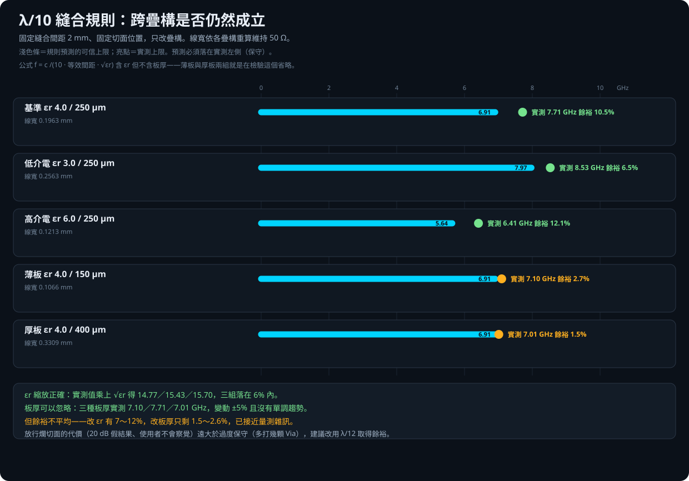

# λ/10 縫合規則的跨疊構轉移性驗證報告

此工具由虎門科技資深技術工程師 Jeff Hong 洪敬傑提供

## 摘要

[切面縫合密度驗證](../stitch_density/切面縫合密度驗證報告.md)在單一疊構
（εr = 4.0、介質 250 µm）上得到「縫合間距 ≤ λ/10」的規則。但校準只來自
一種疊構，本驗證檢查它能不能推廣：

- **εr 縮放正確**：公式含 √εr 項，改變介電常數時預測自動跟上。
  把實測值乘上 √εr 得 14.77／15.43／15.70，三組落在 6% 內。
- **板厚可以忽略**：公式完全沒有板厚項，而三種板厚的實測上限
  變動僅 ±5% 且**沒有單調趨勢**——這個省略是安全的。
- **五組全部保守**，但**餘裕不平均**：改 εr 有 7～12%，
  改板厚只剩 1.5～2.6%，已接近量測雜訊。

---

## 驗證方法

固定縫合間距 **2 mm**——那是縫合密度研究中預測（6.9 GHz）與實測（7.71 GHz）
最貼近的一點，變化最容易看出來。固定切面位置 x = 20 mm、固定板尺寸，
只改疊構。

**線寬依各疊構重算維持約 50 Ω**，否則阻抗失配的反射會混進偏差裡，
量到的就不是縫合造成的差異。採 Wadell 對稱 stripline 近似式以二分法求解；
基準疊構算出 0.1963 mm，與縫合密度研究實際使用的 0.2 mm 幾乎一致，
可作為公式正確性的佐證。

| 疊構 | εr | 單層介質 | 50 Ω 線寬 | 檢驗什麼 |
|---|---:|---:|---:|---|
| 基準 | 4.0 | 250 µm | 0.1963 mm | 與縫合密度研究對齊 |
| 低介電 | 3.0 | 250 µm | 0.2563 mm | εr 縮放 |
| 高介電 | 6.0 | 250 µm | 0.1213 mm | εr 縮放 |
| 薄板 | 4.0 | 150 µm | 0.1066 mm | 板厚是否該入公式 |
| 厚板 | 4.0 | 400 µm | 0.3309 mm | 板厚是否該入公式 |

求解器為 SIwave SYZ（0.01–20 GHz／25 MHz）。
判定指標同前：分段串接與整片求解的插入損耗偏差首次超過 0.1 dB 的頻率。

---

## 結果

| 疊構 | 預測上限 | 實測上限 | 餘裕 |
|---|---:|---:|---:|
| 基準 εr 4.0／250 µm | 6.91 GHz | 7.71 GHz | 10.5% |
| 低介電 εr 3.0／250 µm | 7.97 GHz | 8.53 GHz | 6.5% |
| 高介電 εr 6.0／250 µm | 5.64 GHz | 6.41 GHz | 12.1% |
| 薄板 εr 4.0／150 µm | 6.91 GHz | 7.10 GHz | **2.7%** |
| 厚板 εr 4.0／400 µm | 6.91 GHz | 7.01 GHz | **1.5%** |

### εr 縮放

若 √εr 的縮放正確，「實測上限 × √εr」應為常數：

| εr | 實測 | × √εr |
|---:|---:|---:|
| 3.0 | 8.53 GHz | 14.77 |
| 4.0 | 7.71 GHz | 15.43 |
| 6.0 | 6.41 GHz | 15.70 |

三組落在 6% 內，**公式裡的 √εr 項確實抓對了物理**。

### 板厚

公式對三種板厚給出**完全相同**的預測（6.91 GHz），
而實測為 7.10／7.71／7.01 GHz——變動 ±5%，且中間的 250 µm 反而最高，
**沒有單調趨勢**。因此把板厚排除在公式外是合理的：
它的影響小於量測散布。

---

## 建議：改用 λ/12

五組都保守，數據支持 λ/10。但**餘裕分布不均**——改變板厚時只剩 1.5～2.6%，
已在量測雜訊等級。換一個沒測過的疊構，就可能翻到樂觀那一側。

考量**失敗代價高度不對稱**：

| 方向 | 後果 |
|---|---|
| 放行不合格的切面 | 產生 20 dB 等級的假結果，**使用者不會察覺** |
| 過度保守 | 使用者多打幾顆縫合 Via，或改切在別處 |

因此建議把 `STITCH_WAVELENGTH_FRACTION` 從 10.0 改為 **12.0**。
對最差的那一組（厚板）餘裕由 1.5% 提升到約 18%，
代價是會把一些其實可用的切面判為不足。

這是產品決策而非技術結論，兩個選項的數據都在此，由使用者決定。

---

## 適用範圍

εr 涵蓋 3.0～6.0、單層介質 150～400 µm、固定縫合間距 2 mm、
單端對稱 Stripline、SIwave 求解、0–20 GHz。

**未涵蓋**：εr 超出此範圍（高頻板材可低至 3.0 以下）、
非對稱 Stripline、微帶線、差動對，以及其他縫合間距下的轉移性
（本研究只固定在 2 mm 這一點驗證縮放，不同間距的轉移性未逐一驗證）。

各疊構只求解一次，未做重複性統計；1.5～2.7% 的餘裕差異
與量測散布同量級，不應過度解讀個別數字。

---

## 原始資料

- [機器可讀 JSON](results/stitch_transfer_results.json)
- [匿名 Touchstone](results/touchstone/)：15 個（5 疊構 × 整片／兩段）
- 建模與求解編排：`build_and_run.py`

> 本 Repository 為 Jeff Hong 個人技術作品集之展示內容，非 Taiwan Auto-Design
> Co.（TADC）或 Ansys, Inc. 官方產品。Ansys、HFSS 與 SIwave 為 Ansys, Inc. 之商標。
