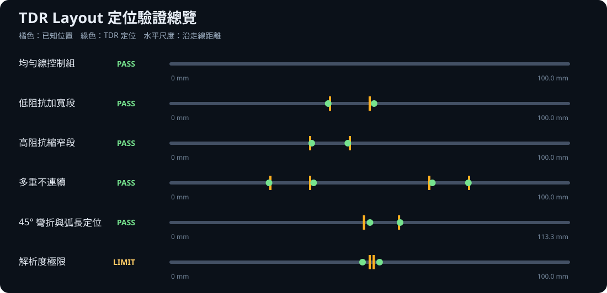

# TDR Group-Delay Localization Validation Report

## Summary

This validation answers one focused question：**can the propagation velocity inferred from S21 group delay convert TDR time into the correct distance along a PCB layout trace？**

Across six anonymized SIwave cases：

- All five resolvable cases passed, with no failed case.
- Mean absolute localization error was **0.66 mm**.
- Maximum absolute error was **1.71 mm**, observed in the 45-degree bend case.
- The uniform-line control produced no significant internal false positive.
- A 1 mm feature was below the approximately 1.54 mm spatial resolution and was correctly labeled `LIMIT` rather than treated as a precise two-edge detection.

These results support group delay as the primary distance-conversion method for the toolkit's TDR-to-layout workflow within the tested models, bandwidth, and solver settings. They are reproducible engineering evidence, not an unconditional accuracy guarantee for every PCB stackup.



## Method

### 1. Geometry with known locations

PyEDB generated simplified microstrip models with a 0.35 mm baseline trace, a 0.2 mm FR4 dielectric, a continuous ground reference, and Gap Ports at both ends. Every discontinuity boundary was known before solving, so position error could be measured directly.

The cases cover a uniform control, a widened low-impedance section, a narrowed high-impedance section, multiple discontinuities, 45-degree bends with arc-length mapping, and a feature shorter than the available TDR resolution.

### 2. SIwave frequency-domain solve

- Solver：Ansys SIwave SYZ 2026 R1.
- Sweep：0.1 to 20 GHz, 0.1 GHz linear step, 200 frequency points.
- TDR rise time：`Tr = 0.35 / f_max = 17.5 ps`.
- DC was extrapolated during time-domain conversion rather than solved directly at 0 Hz.

### 3. Group-delay distance conversion

The unwrapped S21 phase determines group delay and effective propagation velocity：

```text
τ = −dφ / dω
v = L / τ
d = v × t / 2
```

`L` is the accumulated centerline length of the actual routed trace, `v` is inferred from the solved channel phase delay, and `t` is the TDR round-trip time. The factor of two accounts for travel to the discontinuity and back to the probe.

The 45-degree bend case uses routed arc length rather than the straight XY distance between endpoints.

### 4. Acceptance rule

The localization tolerance is：

```text
max（2.0 mm，1.5 × TDR spatial resolution）
```

Spatial resolution is `v × Tr / 2`. Two boundaries closer than this resolution must be labeled `LIMIT`; the workflow must not claim that they are reliably resolved.

## Results

| Case | Expected behavior | Result | Resolution | Maximum error |
|---|---|---:|---:|---:|
| Uniform control | No internal discontinuity false positive | PASS | 1.54 mm | None |
| Widened low-Z section | Locate 40／50 mm boundaries | PASS | 1.55 mm | 1.10 mm |
| Narrowed high-Z section | Locate 35／45 mm boundaries | PASS | 1.55 mm | 0.51 mm |
| Multiple sections | Locate 25／35／65／75 mm | PASS | 1.55 mm | 0.88 mm |
| 45-degree bend and arc length | Locate routed 55／65 mm boundaries | PASS | 1.58 mm | 1.71 mm |
| Resolution limit | Do not claim 50／51 mm as resolved | LIMIT | 1.54 mm | Excluded |

Detailed evidence：

- [Self-contained HTML report](results/TDR_定位驗證報告.html)
- [Machine-readable JSON](results/tdr_validation_results.json)
- [Anonymized Touchstone datasets](results/touchstone/)

## Why the evidence is meaningful

1. **The expected positions are independent**：geometry boundaries were known before analysis.
2. **Both impedance directions are covered**：widened and narrowed sections test opposite reflection polarities.
3. **Multiple peaks are tested**：four known boundaries were paired one-to-one within tolerance.
4. **A non-straight route is included**：the bend case supports routed arc-length mapping.
5. **Controls and physical limits are explicit**：the uniform line did not create false positives, and the sub-resolution case was not presented as a precise result.

## Scope and next validation steps

The present evidence demonstrates usefulness for the tested single-ended microstrip models. Future coverage should include stripline with dual reference planes, layer-changing vias, differential pairs, connector/package models, dispersive materials, and sweep-bandwidth sensitivity.

The public repository contains anonymized Touchstone data and static evidence only. PyEDB model generation, SIwave solver orchestration, and the product backend remain in the restricted implementation repository.

> This repository is Jeff Hong's personal technical portfolio. It is not an official product of Taiwan Auto-Design Co.（TADC）or Ansys, Inc. Ansys and SIwave are trademarks of Ansys, Inc.
