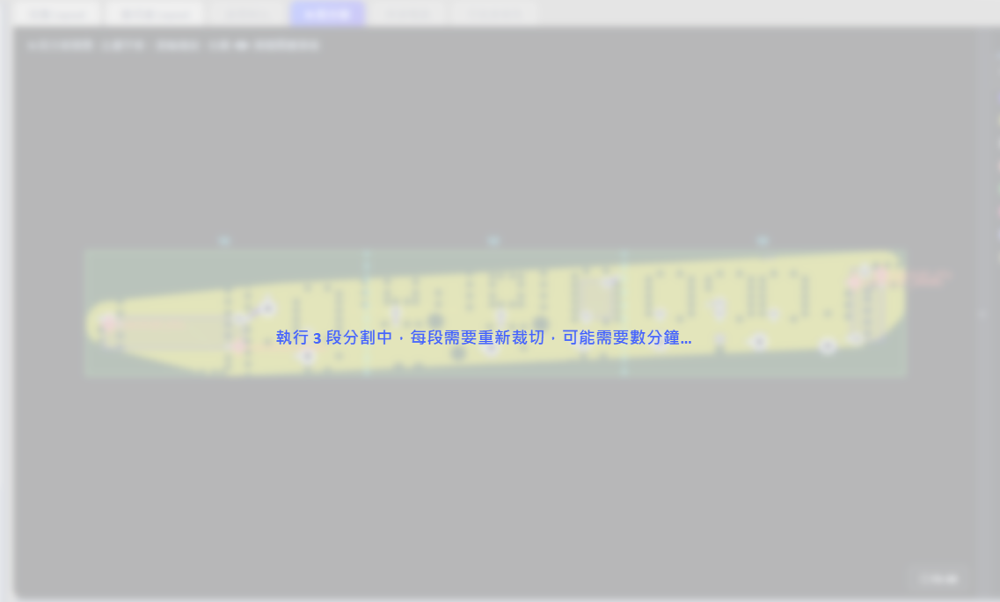
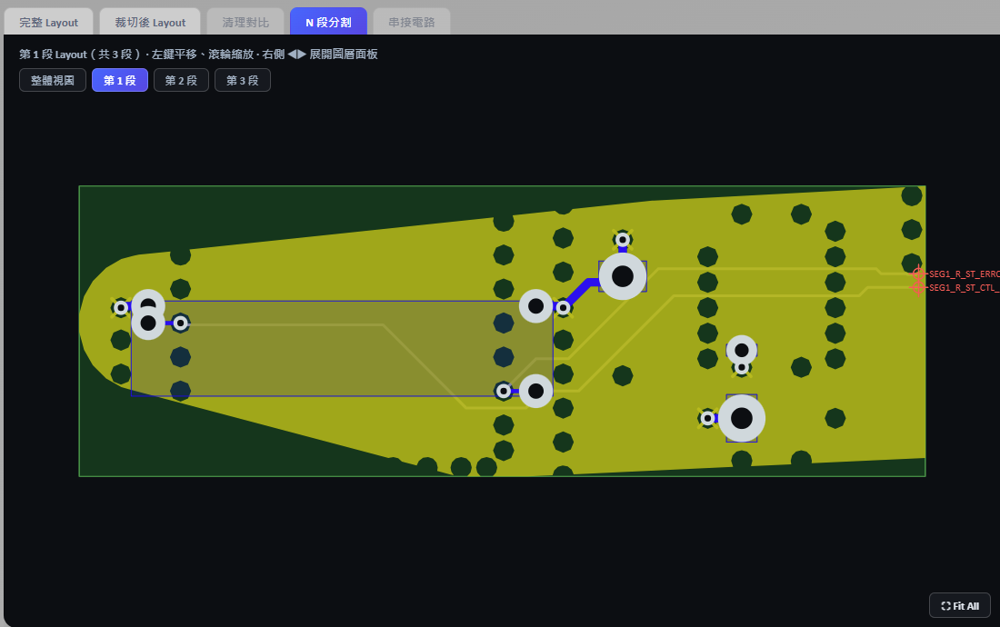
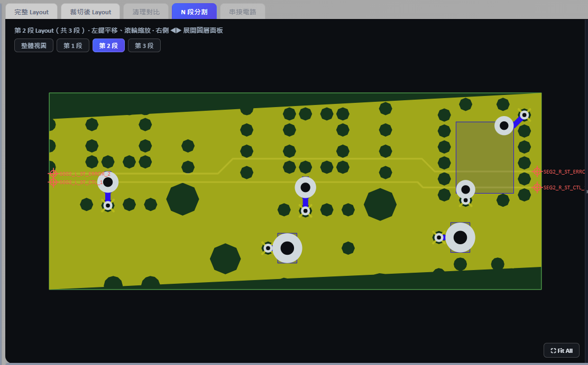
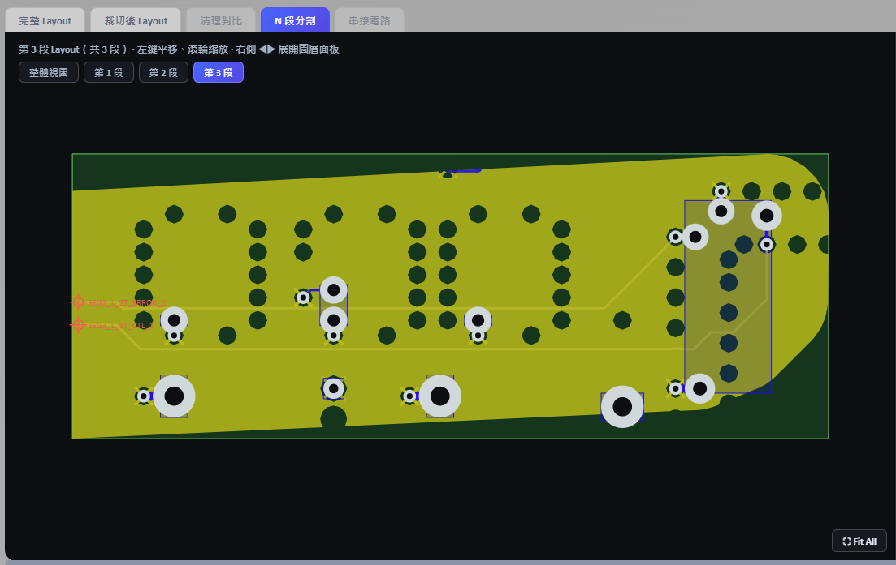
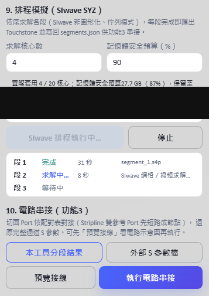
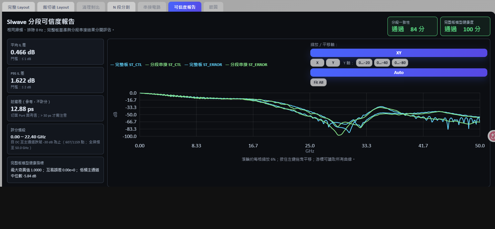

# PCB SI 3D 模擬分析工具－操作說明

> 此工具由虎門科技資深技術工程師 Jeff Hong 洪敬傑提供

> **文件範圍說明**：本文件描述的是**完整版**（含 FastAPI 後端、PyEDB／PyAEDT 整合與 `start.bat` 一鍵啟動）的操作流程，作為功能預覽與工作流程說明。完整版目前收錄於私人 Repository，透過 TADC 技術合作提供；本公開 Repository（`public-showcase`）僅包含前端原始碼與展示畫面，並不包含可直接執行的後端。詳見 [README.md](README.md)。

本工具以 **Ansys HFSS 3D Layout** 為求解環境，將 PCB／封裝通道的匯入、訊號選取、Layout 裁切、Port 建立、Layout 清理、N 段分割、排程求解、Touchstone 匯出及 S 參數電路串接整合在同一個操作介面。

## 目錄

- [功能總覽](#功能總覽)
- [使用前準備](#使用前準備)
- [下載與啟動](#下載與啟動)
- [標準操作流程](#標準操作流程)
- [直接匯入既有通道進行分段](#直接匯入既有通道進行分段)
- [使用外部 Touchstone 檔案串接](#使用外部-touchstone-檔案串接)
- [輸出檔案說明](#輸出檔案說明)
- [介面檢視操作](#介面檢視操作)
- [常見問題](#常見問題)
- [使用限制與建議](#使用限制與建議)

## 功能總覽

| 階段 | 功能 | 目前行為 |
|---|---|---|
| 功能 1 | 通道裁切與元件端 Port 建立 | 依訊號 Net 建立 ConvexHull 或 Bounding 範圍，另存裁切後 EDB，並建立 Coax／Circuit Port、HFSS Setup 與 Sweep。 |
| Layout 清理 | 移除通道電磁影響範圍外的銅箔、走線與 Via | 提供固定保護距離及 Stackup 電磁範圍兩種模式；先分析與預覽，確認後才另存清理。 |
| 功能 2 | N 段分割 | 取通道較長的軸向為主方向，於等分位置附近搜尋垂直於該軸的直線切面，輸出 N 個分段 EDB 及 `segments.json`。 |
| 排程模擬 | 依序求解所有分段 | 每段使用獨立的非圖形化 SIwave 工作階段，求解前檢查網表連通性，完成後匯出 Touchstone。 |
| 功能 3 | S 參數電路串接 | 依 `segments.json` 自動對接切面 Port；Stripline 的上下參考 Port 會先短路成同一節點。 |
| 可信度驗證 | 分段串接結果與完整板基準比對 | 求解完整板基準後，在有效頻段內比較插入損耗，並列出延遲差供判讀。 |
| 眼圖 | QuickEye 眼圖 | 直接以串接後 Touchstone 背景求解，於「眼圖」分頁顯示眼高與眼寬。 |
| 外部串接 | 串接其他來源的 Touchstone | 可載入多個 `.sNp`，自動建議或手動指定接線與短路群組。 |

## 使用前準備

### 系統與商用軟體

| 名稱 | 需求 | 用途 |
|---|---|---|
| 作業系統 | 64 位元 Windows 10／11 | 啟動腳本、AEDT 與本機 Web 介面。 |
| Ansys Electronics Desktop | **目前程式固定使用 2026.1** | EDB 讀寫、HFSS 3D Layout Design Validation、求解與 Touchstone 匯出。 |
| Ansys License | 須具備可用的 AEDT／HFSS 3D Layout 授權 | 沒有可用授權時，排程求解無法開始。 |
| Python | 3.10～3.12，64 位元 | 執行 FastAPI、PyEDB、PyAEDT 與 S 參數串接。 |
| Node.js | 18 以上，僅開發者需要 | 一般使用者直接使用已建置的前端，不需要安裝 Node.js；只有修改前端原始碼時才需要。 |
| uv | 選用 | 加速建立 Python 虛擬環境及安裝套件；未安裝時啟動腳本會自動回退至 `venv`／`pip`。 |

> 目前後端的 EDB 與排程版本均固定為 `2026.1`。若電腦未安裝 AEDT 2026.1，只安裝其他版本時，需要先修改程式中的版本設定才能使用。

### 啟動時自動安裝的 Python 套件

鎖版套件清單位於 `web_app/backend/requirements.lock.txt`。啟動器會使用已驗證的直接相依版本，避免套件自動升級造成 API 不相容。

| 套件 | 用途 |
|---|---|
| `fastapi` | 後端 Web API。 |
| `uvicorn[standard]` | ASGI 伺服器。 |
| `websockets` | 即時傳送系統日誌。 |
| `pyedb` | EDB 匯入、裁切、Port、Setup、清理及分段處理。 |
| `pyaedt` | 啟動 AEDT、求解 HFSS 3D Layout 及匯出 Touchstone。 |
| `pydantic` | 前後端資料契約驗證。 |
| `scikit-rf` | Touchstone 讀取、網路串接及 S 參數計算。 |

### 前端開發套件

套件清單位於 `web_app/frontend/package.json`。GitHub Source ZIP 已包含 `web_app/frontend/dist`，一般使用者不會安裝以下套件；只有修改與重新建置前端時才需要。

| 套件 | 用途 |
|---|---|
| `react`／`react-dom` | 操作介面。 |
| `allotment` | 可調整大小的分割面板。 |
| `vite`／`typescript` | 前端開發伺服器與建置。 |

首次啟動時需要網路連線下載 Python 套件。套件只會安裝在 `web_app/backend/.venv`，不會安裝至系統全域環境。若找不到 64 位元 Python 3.10～3.12，啟動器會嘗試透過 WinGet 以使用者範圍並存安裝 Python 3.12，不會移除或降級既有 Python。

## 下載與啟動

1. 從 GitHub 下載 Repository，解壓縮至本機資料夾。
2. 確認 AEDT 2026.1 與 64 位元 Python 3.10～3.12 已安裝；一般使用者不需要 Node.js。
3. 進入 `web_app` 資料夾，雙擊 `start.bat`。
4. 首次啟動會建立虛擬環境並下載套件，所需時間依網路速度而定。
5. 本機服務完成載入後，瀏覽器會自動開啟 `http://127.0.0.1:8020`。

啟動後會使用以下本機埠：

| 服務 | 位址 |
|---|---|
| 工具介面與後端 | `http://127.0.0.1:8020` |
| 後端 API 文件 | `http://127.0.0.1:8020/docs` |

### 正常關閉工具

1. 若 AEDT 正在排程求解，先在介面按「停止」，待目前 AEDT 程序終止。
2. 回到啟動工具的 PowerShell 視窗按 `Ctrl+C`。
3. uvicorn 結束時會一併釋放 EDB 工作階段。

只關閉瀏覽器不會停止本機服務，因此下次啟動時可能出現 8020 埠已被占用。

## 標準操作流程

### 1．載入電路板

支援的輸入格式如下：

- EDB 資料夾：`.aedb`。
- Cadence Allegro：`.brd`。
- ODB++ 壓縮檔：`.tgz`。

操作方式：

1. 在「1．輸入檔案」輸入路徑，或按「瀏覽…」選取檔案。
2. 不勾選「直接匯入分段」。
3. 按「載入電路板」。
4. 等待 Net、元件及 2D Layout 預覽擷取完成。

大型板會使用快速預覽模式降低瀏覽器負擔，但實際 EDB 不會因此被簡化。

### 2．選擇訊號與參考網路

1. 左側清單雙擊 Net，或按「訊」，加入訊號網路。
2. 按「參」，將 GND／VSS 等加入參考網路。
3. 右側已選清單可雙擊移除。
4. 可在過濾欄輸入關鍵字縮小清單。

#### 匯入／匯出訊號清單

- 「匯出訊號清單」會下載 `selected_signal_nets.txt`，每行一個 Net。
- 「匯入訊號清單」支援 UTF-8 文字檔；空白行與 `#` 開頭的註解會忽略。
- 匯入比對不分大小寫，但成功後會改用目前 EDB 中的正式 Net 名稱。
- 建議每個專案保留一份訊號清單，避免重複手動選取。

### 3．設定裁切範圍

1. 設定「向外擴張距離（mm）」。
2. 選擇裁切形狀：
   - **凸包（ConvexHull）**：沿通道外形形成較緊密的裁切範圍，通常可保留較少無關 Layout。
   - **矩形（Bounding Box）**：以通道外接矩形裁切，幾何較保守。
3. 在完整 Layout 檢查橘色虛線範圍是否包含訊號通道、端點元件與必要的參考平面。


ConvexHull 會先執行唯讀預檢。只有預檢明確失敗或外框無效時，才會回退為 Bounding；系統日誌及介面會顯示實際採用的裁切形狀。

### 4．設定元件端 Port

1. 選擇 Port 類型：
   - **Coax**：建議選項，適合元件 Pin 到參考導體的同軸型 Port。
   - **Circuit**：建立電路埠。
2. 工具會列出與所選訊號 Net 相連的候選元件。
3. 按「建議端點（最多 2 個）」自動選擇通道兩端元件，再人工確認。
4. 不要將所有候選元件全部勾選；大型 BGA 若選錯元件，可能建立大量不必要的 Port。

Port 建立時會檢查 Reference。若元件端為 Solder Ball／BGA，工具會依訊號 Pin 所在層尋找適合的參考層；沒有 Reference 的 Port 不應進入後續分段與求解。

### 5．設定 HFSS 3D Layout 求解條件

可設定：

- Sweep Type：`Interpolating`、`Discrete` 或 `Fast`。
- 工作頻率（Solution Frequency）。
- 多段式 Frequency Sweep。
- Interpolating Sweep 的 Error Tolerance。
- Max Refinement Per Pass。
- Min Converged Passes。
- Max Passes。
- Max Delta S。

介面預設值如下：

| 設定 | 預設值 |
|---|---|
| Sweep Type | `Interpolating` |
| Sweep 1 | `0 Hz～1 Hz`，Linear Count，2 Points |
| Sweep 2 | `1 Hz～100 MHz`，Log Scale，20 Samples |
| Sweep 3 | `100 MHz～50 GHz`，Linear Step，0.05 GHz |
| Solution Frequency | 25 GHz |
| Error Tolerance | 0.1% |
| Max Refinement Per Pass | 15% |
| Min Converged Passes | 2 |
| Max Passes | 20 |
| Max Delta S | 0.02 |

這些是工具預設值，不代表適合所有板材、線寬、頻寬與精度需求。正式模擬前請依專案規格確認。

### 6．執行裁切並建立 Port

1. 指定新的 `.aedb` 輸出路徑。
2. 按「執行裁切並建立 Port」。
3. 工具依序執行裁切、重新開啟輸出 EDB、完整性檢查、Port 建立、Setup／Sweep 建立及預覽擷取。
4. 完成後切換至「裁切後 Layout」確認結果。


安全行為：

- 原始 EDB 不會被覆寫。
- 裁切結果若缺少訊號幾何或參考平面，會被判定失敗。
- 原有 Simulation Setup 會從輸出副本移除，再建立 `HFSS_Setup_1` 與 `Sweep_1`。
- 按「停止裁切工作」後，工具會在 PyEDB 返回安全檢查點時停止，並嘗試重新載入原始 EDB；不是所有 PyEDB 呼叫都能立即中斷。

### 7．選用：清理 Layout

清理功能用於移除電磁影響範圍外的非目標銅箔、走線與 Via，以降低後續分段及求解負擔。訊號 Net、參考 Net、元件 Pin、Port 與 Stackup 會保留。

#### 第一級：固定距離保守清理

- 以所選訊號幾何為中心，使用固定保護距離。
- 適合希望以容易理解的幾何距離保守清理時使用。

#### 第二級：依電磁影響範圍判斷

- 依訊號層到最近參考層的高度 `h` 及目標隔離度，逐層計算保護半徑。
- 參考 Net 仍完整保留。
- Stackup 或參考層資訊不足時，會自動回退至第一級。

沒有特別設定需求時，可按「帶入建議設定」：

- 自動選擇第二級。
- 最小保護距離：0.2 mm。
- 目標隔離度：40 dB。

建議流程：

1. 按「1）分析與紅框預覽」。
2. 檢查候選移除數量及紅框位置。
3. 確認輸出為新的 `.aedb` 路徑。
4. 按「2）另存並執行…清理」。
5. 在「清理對比」頁籤使用「差異高亮」、「並排」、「清理前」或「清理後」檢視。
6. 差異高亮中，紅色代表被移除的銅箔／走線，橘色代表被移除的 Via；可依種類、Layer 及差異密集區過濾。

清理完成後會輸出 JSON 報告，並顯示清理前後的 Primitive、Padstack 及 EDB 容量。

### 8．執行 N 段分割

1. 設定分段數 `N`，介面允許 2～10 段。
2. 按「1）分析切割位置」。
3. 工具取訊號通道較長的軸向（X 或 Y）為主方向，於等分位置附近搜尋垂直於該軸的直線切面，使切面盡量垂直穿過走線並避開 Via 與銅箔。
4. 檢查每個切面的交點數、最差角度、最近障礙距離及是否合法。
5. 指定分段輸出資料夾。
6. 所有切面均確認後，按「2）執行 N 段分割」。

預設啟用「每切面自動最佳化」：依各切面的走線寬度、參考層高度、障礙距離與最差角度個別評級。

- A：角度與局部淨空均優良。
- B：符合標準自動條件。
- C：已放寬條件，建議人工複核。
- D：角度或淨空偏低，或切面穿過訊號銅箔，執行前需確認。

角度以 15°／30°／45° 分級，局部淨空依 3 倍線寬與 2 倍參考層高度計算；Stackup 資料不足時自動退回線寬與最低值。A～C 級視為合法。關閉自動最佳化時，改用介面上的垂直度容差（預設 30°）與淨空門檻，且不合法的位置仍可確認後執行。


執行期間會顯示進度；每一段都要重新裁切一次，通常需要數分鐘：



分段過程會：

- 依主方向的軸向位置決定各段範圍，避免相鄰分段互相重疊。
- 走線重建成一段一個「兩點 Path」。多頂點 Path 會讓 SIwave 在轉角產生原板不存在的弦線元件；兩條訊號的斜段若靠得近，弦線會跨接兩個網路而造成短路。
- 清除繼承而來但不屬於該段的 Port。
- 在切面訊號端點建立 Gap Port。
- Stripline 同時建立上、下參考 Port，並將短路關係寫入 `segments.json`。
- 檢查切面是否完整穿過每條訊號、Port 是否有 Reference、Port 數量是否一致，以及訊號幾何是否越界。
- 任一安全檢查失敗時拒絕輸出該段。

分段完成後，可保留整體切割視圖，也可切換檢查每一段的實際 Layout：







### 9．排程模擬與 Touchstone 匯出

分段完成後，`segments.json` 路徑會自動帶入。

1. 確認每一段 Layout 及切面 Port。
2. 按「開始排程模擬」。
3. 工具依序為每一段啟動全新的非圖形化 SIwave（`siwave_ng`）。
4. 完成後立即匯出 Touchstone，並將檔案路徑寫回 `segments.json`。
5. 介面會顯示各段「等待中、求解中、完成、失敗、已跳過」狀態及耗時。



每段使用獨立工作階段，可避免長時間共用同一 Desktop 所造成的記憶體累積與後續分段崩潰。單一分段失敗時，排程會釋放該工作階段，記錄錯誤後繼續下一段。

**網表連通性閘門**：SIwave 會在求解前先寫出 `.net` 網表。工具一偵測到該檔穩定就檢查連通性——若不同訊號網路落在同一導通區塊（代表被短路），會立刻終止該段，不必等整段掃頻跑完才發現 S 參數不可信。日誌會列出最短導通路徑與可疑的長距離元件。採用 Touchstone 前還有一次後備檢查。

按「停止」會終止目前分段對應的程序，尚未開始的分段標記為已跳過。

排程會拒絕下列資料：

- 找不到 `segments.json` 或分段 EDB。
- 舊版 `segments.json` 缺少 Port／幾何安全驗證欄位。
- 分段存在無 Reference Port、幾何違規或 Port 數量不一致。

### 10．預覽並執行電路串接

在「本工具分段結果」模式：

1. N 段分割完成後，即可按「預覽接線」；此時不需要等待求解或 Touchstone。
2. 檢查各分段方塊、切面連線及 Stripline 短路節點。
3. 所有分段求解完成後，按「執行電路串接」。
4. 工具依 `segments.json` 的 `cut_pairs` 對接相鄰分段。
5. Stripline 上、下參考 Port 先短路成同一節點，再進行跨段連接。
6. 完成後輸出串接後 Touchstone，並可選擇 Port A／Port B 加入 S 參數曲線。


圖中的虛線框代表尚未解算的分段；黃色節點代表需要短路的 Stripline 上、下參考 Port。

### 11．選用：分段可信度驗證

用來回答「分段串接的結果，和直接求解完整板是否一致」。工具會另外求解一次未分段的完整板作為基準，再與串接結果比對。此功能僅在 SIwave 求解模式提供。

1. 確認主通道 Port 配對；工具會依 Port 名稱自動建議，並標示配對信心。
2. 需要時可調整判定門檻與評分頻段下限。
3. 按「完整板 SIwave 求解」。完整板求解需要數分鐘，過程於背景進行，可切換到其他分頁。


完成後於「可信度報告」分頁顯示：



**評分只在有效頻段內進行**：自 DC 起算，直到完整板主通道的插入損耗首次跌破「評分頻段下限」（預設 −30 dB）為止。通道衰減到止帶之後，兩者的差異其實是雜訊而非分段誤差，納入計分只會量到雜訊。報告會標示實際採用的頻段與點數。

計分項目：

- **平均 IL 差**（預設門檻 ≤ 1 dB）
- **P95 IL 差**（預設門檻 ≤ 2 dB）

參考項目（不計分）：

- **延遲差**：分段會在每個切面插入 Gap Port，每個埠都帶有無法完全去嵌的不連續性，實測約 2.5 ps／埠。四個內部埠合計約 10～12 ps 屬正常；超過 30 ps 才需要檢查分段是否有問題。
- **完整板模型健康指標**：最大奇異值、互易誤差與低頻主通道中位數，用來確認基準本身可信。

相位差與矩陣 NRMSE 不列入計分。兩者都會被上述固有延遲主導——實測扣掉延遲後相位殘差僅 9～10°，若直接計分會把方法的固有代價誤判成分段缺陷。

### 12．選用：眼圖（QuickEye）

直接以串接後的 Touchstone 求解眼圖，不需要先輸出 Circuit 專案。

1. 確認模式（單端／差動）、資料速率與 Port 配對。
2. 資料速率預設 1 Gbps；Tr／Tf 依 `Tr = 0.2 × UI` 隨速率自動更新，也可自行覆寫。
3. 按「執行眼圖」。求解於背景進行，完成後自動切到「眼圖」分頁。


眼圖分頁顯示 AEDT 產出的眼圖，以及**眼高**與**眼寬**兩項量測。眼圖完全閉合時 AEDT 算不出這兩個值，會顯示「眼圖閉合，無法量測」——那是有效結論，不是錯誤。

Circuit 專案與眼圖圖片會保留在 Touchstone 同層的 `eye_results` 資料夾，結果異常時可用 AEDT 開啟檢查。

眼圖求解與分段排程、可信度驗證互斥，一次只會有一個 AEDT 工作執行，避免記憶體疊加。

**關於 Tr／Tf 的取法**：`Tr = 0.35 / BW` 是「已知系統 −3dB 頻寬、推算其上升時間」的換算式；而這裡的 Tr／Tf 是發送端驅動器的邊緣速率，屬元件規格。若把 BW 代成 Nyquist，會得到 70% UI，遠慢於真實驅動器，訊號在發送端就先被濾過一輪，眼圖閉合將混入驅動器因素而無法歸因於通道。因此採業界慣用的 UI 比例。

## 直接匯入既有通道進行分段

如果輸入檔案已經是裁切後的通道，不需要再次執行功能 1：

1. 在步驟 1 勾選「直接匯入分段（跳過裁切，直接進行 N 段分割）」。
2. 載入 `.aedb`、`.brd` 或 `.tgz`。
3. 選擇訊號 Net 與參考 Net。
4. 可先執行 Layout 清理，或直接進入 N 段分割。

注意事項：

- 直接匯入模式不會重新建立元件端 Port 或 HFSS Setup。
- 若後續要排程求解，來源 EDB 應已具有正確的元件端 Port 與 HFSS Setup；否則請使用完整功能 1 流程。
- 直接匯入模式仍會在 N 段分割時建立切面 Port 及安全驗證資料。

## 使用外部 Touchstone 檔案串接

不經由本工具分段取得的 S 參數，也可在「外部 S 參數檔」模式串接：

1. 按「加入 S 參數檔（可多選）」載入至少兩個 Touchstone 檔案。
2. 工具解析每個檔案的 Port 數及 Port 名稱。
3. 按「自動建議接線」：
   - 若 Port 名稱符合 `SEGk_R/L_net_i[_T/B]` 慣例，會自動配對相鄰分段。
   - 同一分段的 `T/B` Port 會建議為短路群組。
   - 一般檔案則嘗試配對相鄰檔案中的完全同名 Port。
4. 自動建議不足時，使用「新增接線」逐一選擇兩端 Port。
5. Stripline 或其他需要共節點的 Port，使用「新增短路群組」。
6. 先按「預覽接線」確認，再按「執行串接」。

串接前請確認所有 Touchstone：

- 頻率範圍及頻點相容。
- 參考阻抗及 Port 定義一致。
- Port 名稱可辨識；若檔頭沒有 Port 名稱，工具只能以 `Port1`、`Port2` 等替代。

## 輸出檔案說明

| 輸出 | 說明 |
|---|---|
| `*_Cutout.aedb` | 功能 1 的裁切、元件端 Port、HFSS Setup 與 Sweep 結果。 |
| 清理後 `.aedb` | 使用者指定的新 EDB；原檔不覆寫。 |
| `*_cleanup_report.json` | Layout 清理條件、候選、刪除數量與安全保留資訊。 |
| `segment_1.aedb`～`segment_N.aedb` | N 段實際 Layout 與切面 Port。 |
| `segments.json` | 分段路徑、Port、短路群組、切面配對、安全驗證及 Touchstone 路徑。 |
| `segment_1.sNp`～`segment_N.sNp` | 各段排程求解後輸出的 Touchstone；副檔名依 Port 數決定。 |
| `cascade_result.sNp` | 完整通道串接結果；副檔名依最終 Port 數決定。 |

建議保留 `segments.json` 與所有分段 EDB／Touchstone 的相對位置，不要只移動單一檔案。

## 介面檢視操作

- Layout 區左鍵拖曳：平移。
- 滑鼠滾輪：縮放。
- 「Fit All」：重新縮放至全部 Layout。
- 右側箭頭：展開／收合 Layer 面板。
- Layer、Components、Nets 頁籤：控制顯示項目。
- 「完整 Layout」：原始輸入板。
- 「裁切後 Layout」：功能 1 或清理後目前工作檔。
- 「清理對比」：清理前後及差異高亮。
- 「N 段分割」：整體切割位置或各段 Layout。
- 「串接電路」：分段及 Port 接線示意。
- 「可信度報告」：左側指標、右側 S 參數曲線；完整板與分段串接同圖對照。
- 「眼圖」：QuickEye 眼圖與眼高、眼寬。
- 底部系統日誌：顯示 PyEDB、Port、Setup、分段、排程、串接與眼圖訊息，可複製或清除。

## 常見問題

### 啟動時顯示 8020 埠已被占用

先查出實際占用程序：

```powershell
Get-NetTCPConnection -State Listen -LocalPort 8020 |
  Select-Object LocalPort, OwningProcess
```

確認 PID 確實是先前啟動的本工具後，再停止：

```powershell
Stop-Process -Id <PID>
```

不要在未確認程序用途前直接終止 PID。

### 後端在 60 秒內沒有就緒

檢查後端 PowerShell 視窗中的第一個錯誤，常見原因包括：

- AEDT 2026.1 或 Ansys Python API 不可用。
- Python 版本不支援。
- 套件下載失敗。
- EDB RPC／AEDT 殘留程序占用資源。
- 8020 埠已被其他程序使用。

### 按鈕呈灰色

| 按鈕 | 啟用條件 |
|---|---|
| 執行裁切並建立 Port | 已選擇至少一個訊號 Net 及一個參考 Net。 |
| Layout 清理 | 已完成裁切，或以直接匯入分段模式載入通道。 |
| 執行清理 | 已完成清理候選分析、候選數大於 0，且指定新的輸出路徑。 |
| 執行 N 段分割 | 已完成切割位置分析。 |
| 開始排程模擬 | 已有有效的 `segments.json`，且目前沒有排程執行中。 |
| 執行電路串接 | 本工具模式需所有分段已有 Touchstone；外部模式需至少一組接線。 |

### 大型板裁切或 Port 建立很久

大型 EDB 需要讀取大量 Primitive、Padstack、元件及 Stackup。ConvexHull 預檢、正式裁切、重新開啟 EDB、Reference 搜尋與預覽擷取都可能需要數分鐘至數十分鐘。請觀察載入遮罩的階段、進度、處理數量及系統日誌，不要只依瀏覽器是否更新判斷當機。

### 選擇 ConvexHull，結果卻是矩形

查看系統日誌中的：

- 要求外框。
- ConvexHull 預檢結果。
- 實際外框。
- 回退原因。

只有 ConvexHull 預檢失敗時才會改用 Bounding；介面會顯示「上次實際裁切形狀」。

### 分段分析顯示切割位置不合法

不合法通常代表切面靠近 Via／Padstack，未完整穿過走線束，或切面與走線角度不佳。不要直接忽略警告執行；建議調整分段數、清理 Layout 或重新選取真正的通道訊號 Net 後再分析。

### 排程顯示 Port 數量異常或 Design Validation 失敗

先停止排程，檢查各段 Layout 及 `segments.json`。新版流程會在分段輸出前檢查：

- 每一條切面訊號是否都有 Port。
- 每個 Port 是否有 Reference。
- 繼承 Port 與切面 Port 數量是否一致。
- 訊號幾何是否位於正確分段。

若 `segments.json` 是舊版工具產生，排程會拒絕求解；請使用目前版本重新執行 N 段分割。

### 模擬結果接近全反射

優先檢查：

1. 元件端 Port 是否位於正確訊號 Pin。
2. Solder Ball／BGA Port 是否有正確 Reference。
3. Stripline 是否建立上下兩個參考 Port，且串接時被短路成同一節點。
4. 切面 Port 是否垂直於走線、沒有切到 Via／Pad。
5. 每段的參考平面在切面附近是否完整。
6. Touchstone Port 順序、命名及接線是否正確。

若排程日誌出現「訊號短路」而中止該段，代表 SIwave 網表把兩條訊號併進同一導通區塊，日誌會列出可疑的長距離元件；此時 S 參數必然不可信，應先解決該問題再求解。

### 可信度報告顯示不通過

先看報告標示的評分頻段是否合理。若通道衰減很快、有效頻段只剩很低的一段，可調整「評分頻段下限」。

延遲差不列入計分：約 10～12 ps 屬正常（四個切面 Gap Port 的固有不連續性）。若遠超過 30 ps，才需要回頭檢查分段切面與 Port。

若插入損耗兩項確實超標，通常代表分段幾何或切面 Port 有問題，而非門檻太嚴。

### 眼圖完全閉合

先確認這是不是通道本身的物理結果，而不是設定問題：把資料速率降到 1～2 Gbps 再跑一次。若低速率下眼圖張開，表示設定正確，閉合是通道在該速率下的真實表現。

判斷可用速率的依據是通道的插入損耗：Nyquist 頻率（資料速率的一半）處若已衰減超過約 10 dB，無等化下大多無法開眼。本工具目前不提供 CTLE／FFE 等化模擬。

### 眼高、眼寬顯示「眼圖閉合，無法量測」

眼圖完全閉合時 AEDT 算不出眼高與眼寬，回傳 NaN。工具如實標示而不填 0，避免誤讀成「有量到但為零」。處理方式同上一項。

## 使用限制與建議

- 本工具目前以 Windows 與 AEDT 2026.1 為目標環境。
- EDB、AEDT 與 Touchstone 處理皆在本機進行；套件安裝階段需要網路。
- 排程採依序求解，不會同時啟動多個 HFSS 3D Layout 求解，以控制授權及記憶體需求。
- Layout 清理屬於幾何／電磁影響範圍判斷，不能取代工程驗證。正式專案應比較清理前後的 S 參數，確認誤差符合需求。
- 分段串接的準確性取決於 Port 定義、參考結構、切面品質及各段頻率資料的一致性。
- 執行裁切、清理與分段前，建議備份原始 EDB；所有輸出請使用新路徑。
- 請勿將客戶 EDB、AEDT 專案、授權資訊或含機密路徑的日誌提交至公開 GitHub Repository。

---

此工具由虎門科技資深技術工程師 Jeff Hong 洪敬傑提供
