# PCB SI 3D 模擬分析工具－操作說明

> 此工具由虎門科技資深技術工程師 Jeff Hong 洪敬傑提供

> **文件範圍說明**：本文件描述的是**完整版**（含 FastAPI 後端、PyEDB／PyAEDT 整合與 `start.bat` 一鍵啟動）的操作流程，作為功能預覽與工作流程說明。完整版目前收錄於私人 Repository，透過 TADC 技術合作提供；本公開 Repository（`public-showcase`）僅包含前端原始碼與展示畫面，並不包含可直接執行的後端。詳見 [README.md](README.md)。

本工具以 **Ansys HFSS 3D Layout** 與 **SIwave** 為求解環境，將 PCB／封裝通道的匯入、訊號選取、Layout 裁切、Port 建立、疊構更換、背鑽、Layout 清理、N 段分割、混合求解排程、Touchstone 匯出及 S 參數電路串接整合在同一個操作介面。

## 目錄

- [功能總覽](#功能總覽)
- [使用前準備](#使用前準備)
- [下載與啟動](#下載與啟動)
- [入口介面：選擇這次要用的項目](#入口介面選擇這次要用的項目)
- [標準操作流程](#標準操作流程)
- [直接匯入既有通道進行分段](#直接匯入既有通道進行分段)
- [使用外部 Touchstone 檔案串接](#使用外部-touchstone-檔案串接)
- [一鍵 HTML 報告](#一鍵-html-報告)
- [輸出檔案說明](#輸出檔案說明)
- [介面檢視操作](#介面檢視操作)
- [常見問題](#常見問題)
- [使用限制與建議](#使用限制與建議)

## 功能總覽

| 階段 | 功能 | 目前行為 |
|---|---|---|
| 通道裁切 | 裁切與元件端 Port 建立 | 依訊號 Net 建立 ConvexHull 或 Bounding 範圍，另存裁切後 EDB，並建立 Coax／Circuit Port、HFSS Setup 與 Sweep。 |
| Port／求解器單獨設定 | 對「已裁切好」的檔案補建 Port 與 Setup | 不需重跑裁切；已經是通道的 EDB 可直接建立元件端 Port、HFSS Setup 與 Sweep。 |
| 疊構更換 | 以外部疊構檔換掉現有 Stackup | 支援 Ansys Control `.xml`、`.csv` 與 `.json`；先比對差異，會刪層時要求確認後才另存。 |
| 背鑽 | 訊號 Via 殘樁移除 | 以連通性判斷實際訊號進出層，計算殘樁長度與共振頻率，依「保留殘樁」目標推導鑽深後另存。 |
| Layout 清理 | 移除通道電磁影響範圍外的銅箔、走線與 Via | 提供固定保護距離及 Stackup 電磁範圍兩種模式；先分析與預覽，確認後才另存清理。 |
| N 段分割 | 切成 N 段並建立切面 Port | 取通道較長的軸向為主方向，於等分位置附近搜尋垂直於該軸的直線切面，輸出 N 個分段 EDB 及 `segments.json`。 |
| 排程模擬 | 依序求解所有分段 | 可整批或**逐段**指定 HFSS 3D Layout／SIwave；每段使用獨立工作階段，求解前檢查網表連通性，完成後匯出 Touchstone。 |
| 電路串接 | S 參數電路串接 | 依 `segments.json` 自動對接切面 Port；Stripline 的上下參考 Port 會先短路成同一節點。 |
| S 參數檢視 | 串接結果的頻率響應 | 由 Port 名稱自動判斷兩端與差動配對，可切換單端／差動，並顯示 IL、RL、NEXT、FEXT。 |
| 眼圖 | QuickEye 眼圖 | 直接以串接後 Touchstone 背景求解，於「眼圖」分頁顯示眼高與眼寬。 |
| 外部串接 | 串接其他來源的 Touchstone | 可載入多個 `.sNp`，自動建議或手動指定接線與短路群組。 |
| 遠端求解包 | 把分段打包到別台機器求解 | 求解機只需裝 AEDT，不需要 Python；HPC 授權自動退避，跑完把 `results` 收回即可。 |
| 一鍵 HTML 報告 | 把各結果畫面存成快照並產出報告 | 在任一結果分頁按「更新報告快照」即保存目前畫面；報告中心可加入公司品牌、浮水印、驗收規格與結論，輸出單一自包含 HTML。 |

## 使用前準備

### 系統與商用軟體

| 名稱 | 需求 | 用途 |
|---|---|---|
| 作業系統 | 64 位元 Windows 10／11 | 啟動腳本、AEDT 與本機 Web 介面。 |
| Ansys Electronics Desktop | **只支援 2026.1** | EDB 讀寫、HFSS 3D Layout Design Validation、SIwave 求解與 Touchstone 匯出。 |
| Ansys License | 須具備可用的 AEDT／HFSS 3D Layout 授權 | 沒有可用授權時，排程求解無法開始。 |
| Python | 3.10 或 3.12，64 位元 | 執行 FastAPI、PyEDB、PyAEDT 與 S 參數串接；兩個版本皆有實測紀錄。 |
| Node.js | 18 以上，僅開發者需要 | 一般使用者直接使用已建置的前端，不需要安裝 Node.js；只有修改前端原始碼時才需要。 |
| uv | 選用 | 加速建立 Python 虛擬環境及安裝套件；未安裝時啟動腳本會自動回退至 `venv`／`pip`。 |

> **只支援 AEDT 2026.1。** 更舊的版本會讓 pyedb 改用未經驗證的 .NET 後端，
> 因此在程式層直接擋下。詳見〈對齊 AEDT 版本〉。

### 對齊 AEDT 版本

求解不一定發生在自己的電腦上。**用新版 AEDT 產生的 EDB，拿到只有舊版的求解機
上跑，`siwave_ng` 不會失敗——它會照樣跑完，但疊構被誤讀、介電層可能被丟掉，
S 參數不可信卻沒有任何錯誤訊息。** 這是最難察覺的一種失敗。

求解包會記下產生它的版本，並在求解機上比對：版本較舊時會停下來要求確認，
同時印出「這包需要哪一版」與「本機最新只有哪一版」。**遇到這個提示請回答 N。**

### 為什麼只支援 2026.1

**本工具目前只支援 AEDT 2026.1。** 這不是我們挑的界線，是 pyedb 的：版本低於
2026.1 時，pyedb 會從 gRPC 後端改用 **.NET 後端**（需要 pythonnet，且與 gRPC
是兩套獨立實作）。

實測比對過兩邊的 API——工具用到的頂層成員與子模組都存在、簽章也幾乎一致，
**表面是相容的**。但過去踩到的雷全在行為層，例如 gRPC 的 `cutout` 簽章接受
`ConvexHull`、實跑卻只有 `Bounding` 能用。這種「不報錯但結果不同」是最難察覺
的失敗，而本工具的自動測試刻意不碰 EDB（為了可離線執行），換後端時測試會全
綠卻毫無保障。

因此把界線寫進程式：指定 2026.1 以前的版本會**當場被拒絕並說明原因**，不會
一路走到載入 EDB 才丟出看不懂的 `Failed to initialize Dlls`。

> **求解機只有舊版時，正確做法是在求解機補裝相同版本，不要把來源端降版。**
> 降版換來的是一條未經驗證的路徑，而問題本來就出在求解機那一端。

未來 AEDT 出新版並納入支援後，介面上的版本選單會自動出現（只有一個可用版本
時不顯示，一個選項的下拉沒有意義）。

若真的需要支援舊版，那是一個要獨立驗證的專案：安裝 pythonnet、從裁切開始逐步
比對結果、把差異記錄下來——不該夾在其他工作裡順手打開。

**環境變數**（可固定版本，但一樣只接受支援清單內的版本）：

```powershell
$env:PCBSI_AEDT_VERSION = "2026.1"
```

`2026R1`、`26.1`、`v261`、`261` 等寫法都接受。**指到不支援的版本會直接報錯**，
不會靜默退回預設值——退回會讓人以為已經切換，實際卻用了別的版本產生 EDB。

兩件務必注意的事：

- **這個版本會用於整條流程**：匯入、裁切、分段、求解、Touchstone 匯出。
- **那台電腦必須真的裝了 AEDT 2026.1。** 只設環境變數而沒有對應的安裝，
  會在載入電路板時才失敗。

### 啟動時自動安裝的 Python 套件

鎖版套件清單位於 `web_app/backend/requirements.lock.txt`。啟動器會使用已驗證的直接相依版本，避免套件自動升級造成 API 不相容。

| 套件 | 用途 |
|---|---|
| `fastapi` | 後端 Web API。 |
| `uvicorn[standard]` | ASGI 伺服器。 |
| `websockets` | 即時傳送系統日誌。 |
| `pyedb` | EDB 匯入、裁切、Port、Setup、疊構、背鑽、清理及分段處理。 |
| `pyaedt` | 啟動 AEDT、求解 HFSS 3D Layout 及匯出 Touchstone。 |
| `pydantic` | 前後端資料契約驗證。 |
| `scikit-rf` | Touchstone 讀取、網路串接、混合模式轉換及 S 參數計算。 |

### 前端開發套件

套件清單位於 `web_app/frontend/package.json`。GitHub Source ZIP 已包含 `web_app/frontend/dist`，一般使用者不會安裝以下套件；只有修改與重新建置前端時才需要。

| 套件 | 用途 |
|---|---|
| `react`／`react-dom` | 操作介面。 |
| `allotment` | 可調整大小的分割面板。 |
| `vite`／`typescript` | 前端開發伺服器與建置。 |

首次啟動時需要網路連線下載 Python 套件。套件只會安裝在完整版本的專案專用 `.venv`，不會安裝至系統全域環境。若找不到已驗證的 64 位元 Python 3.10 或 3.12，完整版本啟動器會嘗試透過 WinGet 以使用者範圍並存安裝 Python 3.12，不會移除或降級既有 Python。

## 下載與啟動

1. 從 GitHub 下載 Repository，解壓縮至本機資料夾。
2. 確認 AEDT 2026.1 與已驗證的 64 位元 Python 3.10 或 3.12 已安裝；一般使用者不需要 Node.js。
3. 進入 `web_app` 資料夾，雙擊 `start.bat`。
4. 首次啟動會建立虛擬環境並下載套件，所需時間依網路速度而定。
5. 本機服務完成載入後，瀏覽器會自動開啟 `http://127.0.0.1:8020`。

啟動後會使用以下本機埠：

| 服務 | 位址 |
|---|---|
| 工具介面與後端 | `http://127.0.0.1:8020` |
| 後端 API 文件 | `http://127.0.0.1:8020/docs` |

### 正常關閉工具

1. 若 AEDT 正在排程求解，先在介面按「停止」，待目前 AEDT 程序終止。
2. 回到啟動工具的 PowerShell 視窗按 `Ctrl+C`。
3. uvicorn 結束時會一併釋放 EDB 工作階段。

只關閉瀏覽器不會停止本機服務，因此下次啟動時可能出現 8020 埠已被占用。

## 入口介面：選擇這次要用的項目

工具開啟時會先顯示入口畫面，勾選這次要做的事；主畫面只會顯示對應的面板與檢視
分頁，其餘一律隱藏。功能累積得多之後，一次攤開全部反而不容易找到要用的東西。

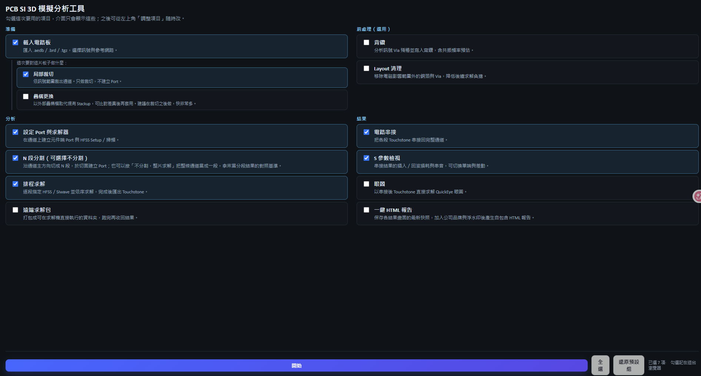


清單分四組（☑ 為首次啟動的預設）：

| 組別 | 項目 |
|---|---|
| 準備 | ☑ 載入電路板（子項：☑ 局部裁切　☐ 設定 Port 與求解器） |
| 前處理 | ☐ 疊構更換　☐ 背鑽　☐ Layout 清理 |
| 分段與求解 | ☑ N 段分割　☑ 排程求解　☐ 遠端求解包 |
| 結果 | ☑ 電路串接　☑ S 參數檢視　☐ 眼圖　☐ 一鍵 HTML 報告 |

**「載入電路板」是父項目，兩個子項只在它勾選時出現。** 取消勾選「載入電路板」＝
這次不載入板子，只能用「外部 S 參數檔」做串接與檢視。兩個子項是各自獨立的步驟：

- **局部裁切**：依訊號範圍裁出通道，**只做裁切，不建立 Port**。
- **設定 Port 與求解器**：在目前的通道上建立元件端 Port 並套用 HFSS Setup／掃頻，
  **不執行裁切**。

因此三種常見組合都成立：

| 勾選 | 行為 |
|---|---|
| 局部裁切 ＋ 設定 Port | 一次做完，等同舊版的「執行裁切並建立 Port」 |
| 只勾局部裁切 | 只裁出通道；之後要求解前記得回來補 Port |
| 只勾設定 Port | 檔案已是裁切好的通道，只補元件端 Port 與 Setup |

兩個子項都不勾時，工具視為「檔案本身已經是分段就緒的通道」，直接進入 N 段分割
——不需要另外再勾一個「直接匯入分段」，那個選項已經移除。

操作要點：

- 進入主畫面後，左上角的**「調整項目」**可隨時回到入口重新勾選。
- **調整勾選不會影響任何工作進度**——已載入的板子、選好的 Net、分段結果都保留，
  純粹是顯示切換。
- 勾選會記在這台瀏覽器（localStorage），下次開啟自動帶出；換瀏覽器或清除快取後
  會回到預設組。
- 只有「全選」與「還原預設組」兩個快速鈕，沒有具名的組合範本。
- 一項都沒勾時「開始」不能按。

**相依只提示、不阻擋**：例如勾了「電路串接」卻沒勾「N 段分割」，入口下方會列出
缺少的前置，但仍可繼續——因為電路串接另有「外部 S 參數檔」模式，直接載入既有的
`.sNp` 就能跑，不需要分段、也不需要載入電路板。工具不會替你把前置項目自動勾上，
那樣反而會把你不想要的面板塞回畫面。

**被隱藏但仍在執行的工作**（例如把「排程求解」取消勾選但求解仍在跑）會在畫面
最上方保留一條進度列，點一下可回到入口重新顯示。HFSS 動輒數十分鐘，藏起來又
沒有任何提示會變成黑箱。

> 本文件的章節名稱與介面上的面板標題一致。介面不再使用步驟編號——顯示範圍
> 既然可以自訂，固定編號就對不上實際畫面。

## 標準操作流程

### 載入電路板

支援的輸入格式如下：

- EDB 資料夾：`.aedb`。
- Cadence Allegro：`.brd`。
- ODB++ 壓縮檔：`.tgz`。

操作方式：

1. 在「輸入檔案」輸入路徑，或按「瀏覽…」選取檔案。
2. 按「載入電路板」。
3. 等待 Net、元件及 2D Layout 預覽擷取完成。

大型板會使用快速預覽模式降低瀏覽器負擔，但實際 EDB 不會因此被簡化。

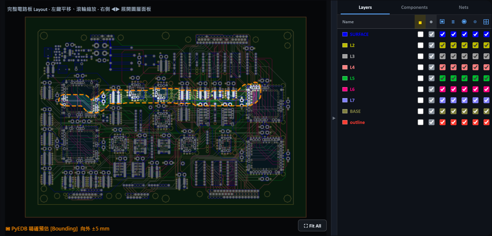

右側面板可切換 Layers、Components、Nets 三個分頁；每一層可個別控制顯示、
填色與線框。左鍵拖曳平移、滾輪縮放，右下角「Fit All」還原完整範圍。

### 選擇訊號與參考網路

1. 左側清單雙擊 Net，或按「訊」，加入訊號網路。
2. 按「參」，將 GND／VSS 等加入參考網路。
3. 右側已選清單可雙擊移除。
4. 可在過濾欄輸入關鍵字縮小清單。

#### 匯入／匯出訊號清單

- 「匯出訊號清單」會下載 `selected_signal_nets.txt`，每行一個 Net。
- 「匯入訊號清單」支援 UTF-8 文字檔；空白行與 `#` 開頭的註解會忽略。
- 匯入比對不分大小寫，但成功後會改用目前 EDB 中的正式 Net 名稱。
- 建議每個專案保留一份訊號清單，避免重複手動選取。

### 設定裁切範圍

1. 設定「向外擴張距離（mm）」。
2. 選擇裁切形狀：

   | 形狀 | 外框怎麼來 | 適用 |
   |---|---|---|
   | **貼合走線（Conforming）（預設）** | 每個訊號 primitive 各自向外擴張所設距離，再聯集起來 | 外框沿著走線轉彎，**真正只向外擴張所設距離**。斜向、L 形、彎折通道請用這個 |
   | 凸包（ConvexHull） | 取訊號幾何的凸包再向外擴張 | 通道接近直線時與貼合外框差異不大 |
   | 矩形（Bounding Box） | 訊號外接矩形再向外擴張 | 最保守、範圍最大 |

3. 按「分析精確裁切外框」。工具會唯讀呼叫與正式裁切相同的 PyEDB 外框演算法，完成後在完整 Layout 上畫出橘色虛線外框。
4. 檢查該範圍是否包含訊號通道、端點元件與必要的參考平面，再執行正式裁切。

外框只在按下分析後才會出現，畫面上顯示的就是真正會裁的範圍。

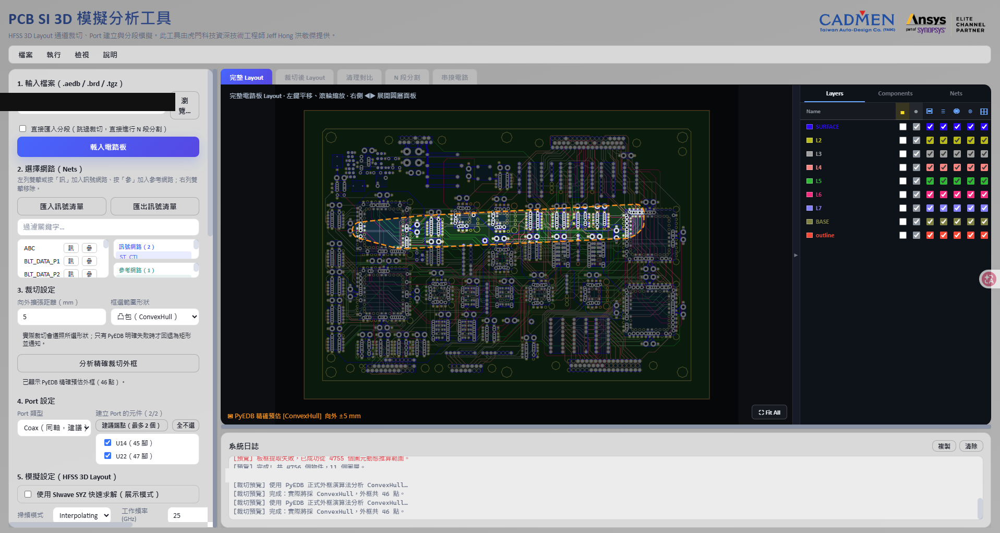

#### 為什麼預設不是凸包

**凸包依定義是凸的**：通道只要是斜向或有彎折，內側就必然被一條直線弦切過。那條弦與實際走線之間的空白區會被整片包進裁切範圍，連帶把大量無關的 Via 與銅箔一起帶進來——不是擴張距離設太大，是這個形狀本身做不到貼合。改用貼合外框即可，擴張距離不必動。

實測一片 230 MB 的板子、斜向通道、向外擴張 5 mm：貼合外框 3,331.7 mm²，凸包 6,979.9 mm²——**凸包多包了 52.3% 的面積**。

貼合外框的做法是各段走線先各自向外長出所設距離，再把重疊的部分聯集成一塊。因此**通道各段必須連得起來**；若擴張後仍是分離的數塊，PyEDB 會逐步加大擴張量嘗試合併，最終仍失敗時只會回傳面積最大的那一塊——等於安靜地把通道的一部分排除掉。工具會在預檢時逐點確認外框真的包住全部訊號幾何，發現漏掉就自動改用凸包並在介面說明；此時若仍想要貼合外框，請把擴張距離加大到讓各段連成一片。

預檢成功時，介面會顯示「貼合外框比凸包少包 N% 的面積」，可用來判斷這次值不值得換。

三種形狀都會先執行唯讀預檢。只有預檢明確失敗或外框無效時才會回退（貼合→凸包→矩形）；系統日誌及介面會顯示實際採用的裁切形狀。

### 設定元件端 Port

1. 選擇 Port 類型：
   - **Coax**：建議選項，適合元件 Pin 到參考導體的同軸型 Port。
   - **Circuit**：建立電路埠。
2. 工具會列出與所選訊號 Net 相連的候選元件。
3. 按「建議端點（最多 2 個）」自動選擇通道兩端元件，再人工確認。
4. 不要將所有候選元件全部勾選；大型 BGA 若選錯元件，可能建立大量不必要的 Port。

Port 建立時會檢查 Reference。若元件端為 Solder Ball／BGA，工具會依訊號 Pin 所在層尋找適合的參考層；沒有 Reference 的 Port 不應進入後續分段與求解。

**負端落點修正**：元件端 Port 的負端若落在參考銅箔的任意位置，SIwave 在建立網表時可能把該節點視為無效而整個排除，症狀是輸出的 Touchstone Port 數比預期少。工具會把負端吸附到鄰近參考 Via 的中心（搜尋半徑 1 mm），使負端落在明確的導通結構上。此修正經 A／B 實測驗證：同一片板未修正時輸出 `s8p`，修正後輸出 `s12p`。

### 設定求解條件（HFSS 3D Layout）

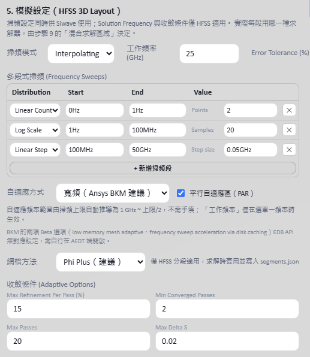

掃頻設定同時供 SIwave 使用；Solution Frequency、自適應方式、網格方法與收斂條件僅 HFSS 適用。實際每段用哪一種求解器，由「排程求解」 的「混合求解區域」決定。

可設定：

- Sweep Type：`Interpolating`、`Discrete` 或 `Fast`。
- 多段式 Frequency Sweep。
- Interpolating Sweep 的 Error Tolerance。
- **自適應方式**與**平行自適應區（PAR）**。
- **網格方法**：`Phi Plus`、`Phi` 或 `Classic`。
- Max Refinement Per Pass、Min Converged Passes、Max Passes、Max Delta S。

#### 自適應方式（依 Ansys BKM）

網格是在「自適應頻率」下產生的。若自適應頻率遠低於掃頻上限，高頻段的網格相對過粗，會產生**數值反射**——曲線看起來像有嚴重反射，實際上是網格不足造成的假象。

實測比較：同一片板、同樣 16 個 Port、同樣頻率格點，以 10 GHz 單點自適應掃到 50 GHz 時，HFSS 與 SIwave 的**耗損幾乎相同**（25 GHz 時 0.269 對 0.271），但**反射差了兩個數量級**（0.42 對 0.006），且分歧起點正好落在自適應頻率上。

因此工具依 Ansys 原廠 BKM 提供三種模式：

| 模式 | 行為 |
|---|---|
| **寬頻（Ansys BKM 建議）** | **預設值**。自適應頻率範圍自動推導為 `1 GHz ～ 掃頻上限／2`，不需手填。 |
| 多頻（3 點） | 在同一範圍內取 3 個頻率同時自適應。 |
| 單一頻率 | 只在「工作頻率」自適應；此時才需要填工作頻率。 |

其他依 BKM 套用的設定：

- **平行自適應區（PAR）**：預設啟用。
- **Airbox padding**：裁切件採 XY `0`、上下 `0.5` 倍。
- **Max Refinement Per Pass 15%** 與 **Phi／Phi Plus 網格**已是既有預設。

> BKM 的兩項 Beta 選項（low memory mesh adaptive、frequency sweep acceleration via disk caching）屬 AEDT 端旗標，EDB API 沒有對應設定，需要時請自行在 AEDT 介面開啟。

介面預設值如下：

| 設定 | 預設值 |
|---|---|
| Sweep Type | `Interpolating` |
| Sweep 1 | `0 Hz～1 Hz`，Linear Count，2 Points |
| Sweep 2 | `1 Hz～100 MHz`，Log Scale，20 Samples |
| Sweep 3 | `100 MHz～50 GHz`，Linear Step，0.05 GHz |
| 自適應方式 | 寬頻（`1 GHz～25 GHz`，由掃頻上限 50 GHz 推導） |
| 平行自適應區（PAR） | 啟用 |
| 網格方法 | `Phi Plus` |
| Solution Frequency | 25 GHz（僅單一頻率模式使用） |
| Error Tolerance | 0.1% |
| Max Refinement Per Pass | 15% |
| Min Converged Passes | 2 |
| Max Passes | 20 |
| Max Delta S | 0.02 |

這些是工具預設值，不代表適合所有板材、線寬、頻寬與精度需求。正式模擬前請依專案規格確認。

### 執行裁切（並建立 Port）

面板標題與按鈕會依入口的勾選變動：同時勾了「局部裁切」與「設定 Port 與求解器」時
顯示**「執行裁切並建立 Port」**，只勾「局部裁切」時顯示**「執行裁切」**。

1. 指定新的 `.aedb` 輸出路徑。
2. 按「執行裁切並建立 Port」（或「執行裁切」）。
3. 工具依序執行裁切、重新開啟輸出 EDB、完整性檢查；若這次要建 Port，接著執行 Port 建立與 Setup／Sweep 建立，最後擷取預覽。
4. 完成後切換至「裁切後 Layout」確認結果。

> 只做裁切時，輸出的通道**還沒有元件端 Port 與 Setup**，面板上會直接提示。之後要
> 排程求解前，請用〈設定 Port 與求解器〉補上——不必為此重跑一次裁切。

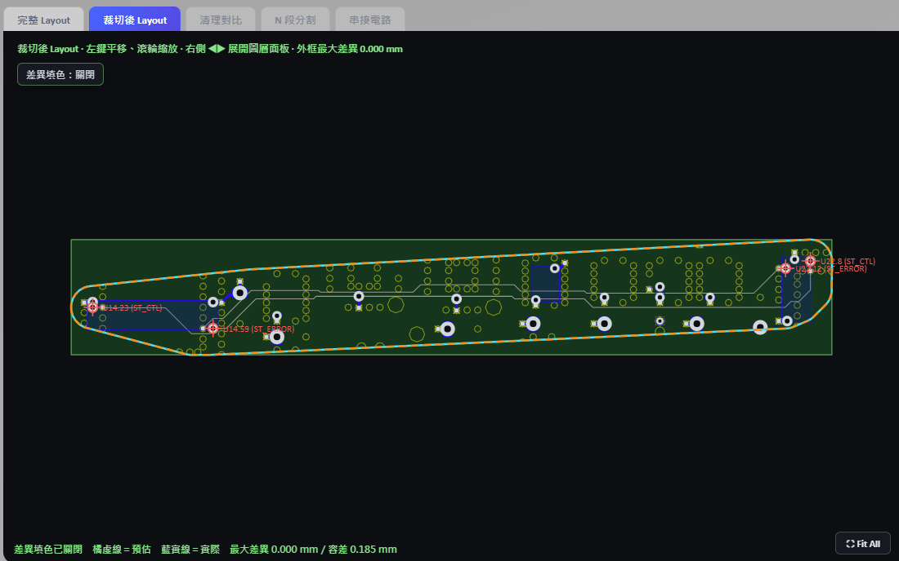

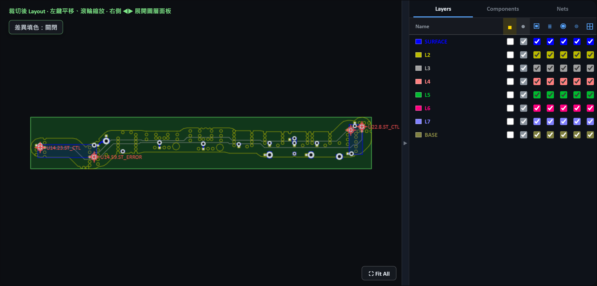

左上角的「差異填色」可切換，開啟時會把裁切前後的差異區域標示出來，
方便確認有沒有把該留的銅箔一起切掉。

安全行為：

- 原始 EDB 不會被覆寫。
- 裁切結果若缺少訊號幾何或參考平面，會被判定失敗。
- 原有 Simulation Setup 會從輸出副本移除，再建立 `HFSS_Setup_1` 與 `Sweep_1`。
- 按「停止裁切工作」後，工具會在 PyEDB 返回安全檢查點時停止，並嘗試重新載入原始 EDB；不是所有 PyEDB 呼叫都能立即中斷。

### 設定 Port 與求解器

在目前的通道上建立元件端 Port 並套用求解器設定，**不執行裁切**：

1. 載入通道 `.aedb`——可以是別人裁切好的檔案，也可以是上一步只做了裁切的輸出。
2. 選好訊號 Net 與參考 Net。
3. 在「設定元件端 Port」 選 Port 類型並勾選端點元件，在「設定求解條件」 設好掃頻與自適應方式。
4. 按 **「建立 Port 與求解器設定」**。

工具會在原檔上補建元件端 Port、`HFSS_Setup_1` 與 `Sweep_1`，不做任何裁切。適用情境：

- 通道是別人切好的，或由其他流程產生。
- 上一步只勾了「局部裁切」，現在補建 Port。
- 只是想換掃頻範圍、自適應方式或網格方法，重設一次 Setup。
- 前一次裁切結果要沿用，但 Port 想重選。

> 沒有元件端 Port 的通道無法進入排程求解，串接時也會因為找不到外部 Port 而失敗。若載入已裁切檔後直接分段，記得先在此建立 Port。

### 疊構更換

用外部疊構檔取代目前 EDB 的 Stackup，常用於「同一塊 Layout 換板材、換銅厚、換介電層厚度」的對照分析。

支援格式：

| 格式 | 說明 |
|---|---|
| `.xml` | Ansys Control XML（`http://www.ansys.com/control`），即 AEDT 疊構匯出格式。 |
| `.csv` | 逐層的層名、類型、厚度與材料。 |
| `.json` | 工具自身匯出的疊構快照。 |

操作方式：

1. 按「匯出目前疊構」，取得一份可編輯的基準檔（選用）。
2. 指定疊構檔路徑。
3. 按 **「1）分析疊構差異」**。工具列出：
   - **新增**、**移除**、**變更**的層，以及厚度前後值。
   - **材料變更**：介電常數與 `dielectric_loss_tangent` 的前後值。
4. 確認輸出為新的 `.aedb` 路徑。
5. 按 **「2）套用疊構並另存」**。

安全行為：

- 差異分析是唯讀的，不會改到來源 EDB。
- **若新疊構會刪掉現有層**，介面會以紅字標示並要求明確確認才能套用——刪層會連帶讓該層上的走線與參考平面消失。
- 完成後輸出 `*_stackup_change_report.json`，記錄套用前後的逐層與材料狀態。

### 背鑽

移除訊號 Via 上用不到的那一段孔銅（殘樁）。殘樁是一段開路短截線，在**四分之一波長**對應的頻率會造成深陷波；把殘樁縮短就把陷波推到工作頻寬以外。

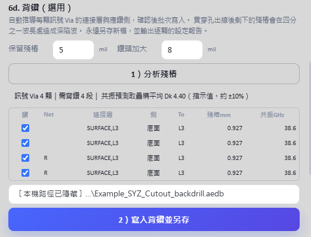

1. 設定 **保留殘樁**（預設 5 mil）與 **鑽頭加大**（預設 8 mil，即鑽頭 = 原孔徑 + 8 mil）。
2. 按 **「1）分析殘樁」**。
3. 檢查表格：每顆訊號 Via 的**連接層**、背鑽側、鑽至哪一層、殘樁長度與**預測共振頻率**。
4. 勾選要背鑽的 Via（預設全選）。
5. 指定輸出 `.aedb`，按 **「2）寫入背鑽並另存」**。

#### 連通性判斷

殘樁長度取決於「訊號實際從哪一層進、哪一層出」，而不是 Via 的起訖層。工具以兩個條件判定某一層是否真的有連接：

- 該層有屬於同一 Net 的走線，其**到 Via 中心的最短距離**落在孔半徑加上容差之內；距離用**點到線段**計算，不是只比對頂點。
- 該層有屬於同一 Net 的元件焊墊落在同一半徑內。

第二條是必要的：BGA 焊墊屬於 padstack 而非 modeler primitive，幾何掃描看不到；少了它，元件所在層會被誤判成殘樁起點，算出一整段不存在的假殘樁。第一條若只比對頂點也會出錯——實測有走線的最近頂點距 Via 中心 251 µm、但最近**邊**只有 4.9 µm，只看頂點會漏掉 3 個真正連通的層，進而算出 2.353 mm 的假底部殘樁，若照著鑽會**把訊號切斷**。

#### 共振頻率

以背鑽後殘樁長度 `L` 與疊構平均 Dk 推算四分之一波長共振點。介面顯示的 Dk 為指示值（約 ±10%），共振頻率同屬估計值，用於判斷「陷波有沒有被推出工作頻寬」，不作為規格依據。

安全行為：

- 分析為唯讀；來源 EDB 不會被修改。
- 鑽孔孔徑讀自 padstack **定義**而非 instance——instance 上讀到的是 0，會讓「原孔 + 增量」退化成只有增量，鑽頭與原孔同徑而鑽不乾淨孔壁鍍銅。
- 寫入後會**讀回驗證**每顆 Via 的背鑽側與深度，並輸出 `*_backdrill_report.json`。

### Layout 清理

清理功能用於移除電磁影響範圍外的非目標銅箔、走線與 Via，以降低後續分段及求解負擔。訊號 Net、參考 Net、元件 Pin、Port 與 Stackup 會保留。

#### 第一級：固定距離保守清理

- 以所選訊號幾何為中心，使用固定保護距離。
- 適合希望以容易理解的幾何距離保守清理時使用。

#### 第二級：依電磁影響範圍判斷

- 依訊號層到最近參考層的高度 `h` 及目標隔離度，逐層計算保護半徑。
- 參考 Net 仍完整保留。
- Stackup 或參考層資訊不足時，會自動回退至第一級。

沒有特別設定需求時，可按「帶入建議設定」：

- 自動選擇第二級。
- 最小保護距離：0.2 mm。
- 目標隔離度：40 dB。

建議流程：

1. 按「1）分析與紅框預覽」。
2. 檢查候選移除數量及紅框位置。
3. 確認輸出為新的 `.aedb` 路徑。
4. 按「2）另存並執行…清理」。
5. 在「清理對比」頁籤使用「差異高亮」、「並排」、「清理前」或「清理後」檢視。
6. 差異高亮中，紅色代表被移除的銅箔／走線，橘色代表被移除的 Via；可依種類、Layer 及差異密集區過濾。

清理完成後會輸出 JSON 報告，並顯示清理前後的 Primitive、Padstack 及 EDB 容量。

### N 段分割

1. 設定分段數 `N`，介面允許 2～10 段。
2. 選擇「可接受評分」：`A 級以上`、`B 級以上`（預設）或 `C 級以上`。
3. 按「1）分析切割位置」。
4. 工具取訊號通道較長的軸向（X 或 Y）為主方向，只採用達到該評分的切點，並在這些切點中**把最大的那一段壓到最小**。
5. 檢查各段長度、最大／最小倍數，以及每個切面的交點數、最差角度、最近障礙距離。
6. 指定分段輸出資料夾。
7. 所有切面均確認後，按「2）執行 N 段分割」。

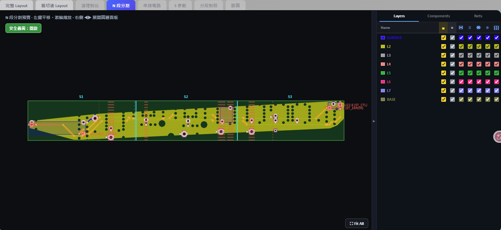

#### 為什麼是「可接受評分」而不是角度與淨空

切面的垂直度與淨空**本來就內含在評級定義裡**，因此介面不提供「垂直度容差」與「建議淨空」兩個欄位——填寫它們需要先知道這片板的線寬與疊構，實務上無從判斷。改為直接選擇這次可以接受的評分等級：

| 門檻 | 條件 | 適用時機 |
|---|---|---|
| A 級以上 | 角度 ≤15° 且局部淨空達 100% | 要求最嚴，可用的切點最少 |
| **B 級以上（預設）** | 角度 ≤30° 且局部淨空達 75% | 不需人工複核的底線 |
| C 級以上 | 角度 ≤45° 且局部淨空達 50% | 最容易平分，但**切點建議人工複核** |

局部淨空依 3 倍線寬與 2 倍參考層高度計算，下限固定 0.2 mm；Stackup 資料不足時自動退回線寬與最低值。D、F 級不開放批次放行。

#### 為什麼要盡量平分

分段是**逐段依序求解**的，總時間與單段失敗的記憶體風險都由**最大的那一段**決定。若工具一味追求最高評級，很可能切出「一段極小、一段極大」的結果，幾乎沒有加速效果。因此挑選規則是：**先用評分門檻篩掉不能用的切點，再在可用的切點中最小化最大段**；評級只在幾乎不影響平衡的範圍內用來決定同水準時挑哪一個。

分析完成後會顯示各段長度與「最大／最小」倍數，並附上 A／B／C 三個門檻的對照，讓「放寬一級值不值得」一眼可判斷：

- **門檻無解**時不會自動降級，而是明確告知「以 B 級為門檻找不到可行的切點組合；放寬到 C 級可行，最大段 30.9 mm」，由你決定是否放寬。求解動輒數十分鐘，靜默降級等發現時已經跑完。
- **最大段超過最小段 3 倍**時會警示，並附上放寬一級能改善到多少倍。
- 連 C 級都無解時，切面會放在理想等分位置並標記不合法，僅供判斷問題出在哪一刀，不可執行。

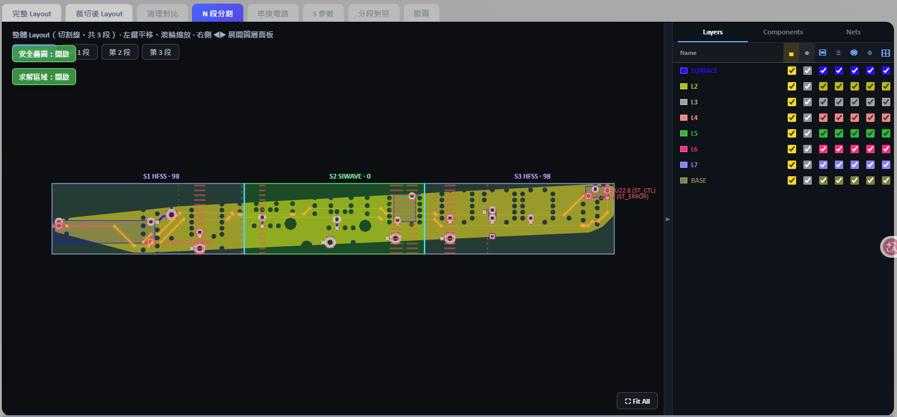

#### 切板顏色與輔助圖層

「N 段分割」畫面把切面安全判斷與求解策略直接疊加在完整 Layout 上。**安全疊圖**與**求解區域**可分別關閉，方便使用者在判讀風險後回到沒有遮罩的走線畫面。

| 顏色／線型 | 意義與操作判斷 |
|---|---|
| 橘色發光走線 | 斜向走線或轉角風險帶，切面應優先避開。 |
| 紅色半透明區 | Via、Pad、元件或訊號銅箔等硬性禁切障礙。 |
| 淡紅虛線 | 已分析但遭拒絕的候選切面。 |
| 青色實線 | 最後採用且通過檢查的切面。 |
| 紅色虛線 | 被標記為不合法的選定切面，執行前需人工確認。 |
| 灰色虛線 | 未考慮障礙物時的理想等分位置。 |
| 綠色區域／標籤 | 指定使用 SIwave 的 Segment。 |
| 紫色區域／標籤 | 指定使用 HFSS 3D Layout 的 Segment。 |

安全疊圖只在**板框範圍內**繪製。參考 Via 的紅色障礙區數量有上限，超過時只保留最靠近候選切面的部分，避免整片板被紅色蓋住而看不出真正的風險點。

執行期間會顯示進度；每一段都要重新裁切一次，通常需要數分鐘。分段數越多總時間越長（上限為 10 段）。

分段過程會：

- 依主方向的軸向位置決定各段範圍，避免相鄰分段互相重疊。
- 走線重建成一段一個「兩點 Path」。多頂點 Path 會讓 SIwave 在轉角產生原板不存在的弦線元件；兩條訊號的斜段若靠得近，弦線會跨接兩個網路而造成短路。
- **展開圓弧走線**：EDB 的 Path 以「弧高」編碼圓弧，直接讀頂點會得到退化的中心線。工具會把圓弧段細分成多個點再重建，避免產生零長度或自我重疊的 Path。
- 清除繼承而來但不屬於該段的 Port。
- 在切面訊號端點建立 Gap Port。
- Stripline 同時建立上、下參考 Port，並將短路關係寫入 `segments.json`。
- 檢查切面是否完整穿過每條訊號、Port 是否有 Reference、Port 數量是否一致，以及訊號幾何是否越界。
- 任一安全檢查失敗時拒絕輸出該段。

分段完成後，可保留整體切割視圖，也可切換檢查每一段的實際 Layout。
左上角的「整體視圖／第 1 段／第 2 段／…」按鈕就是切換入口：

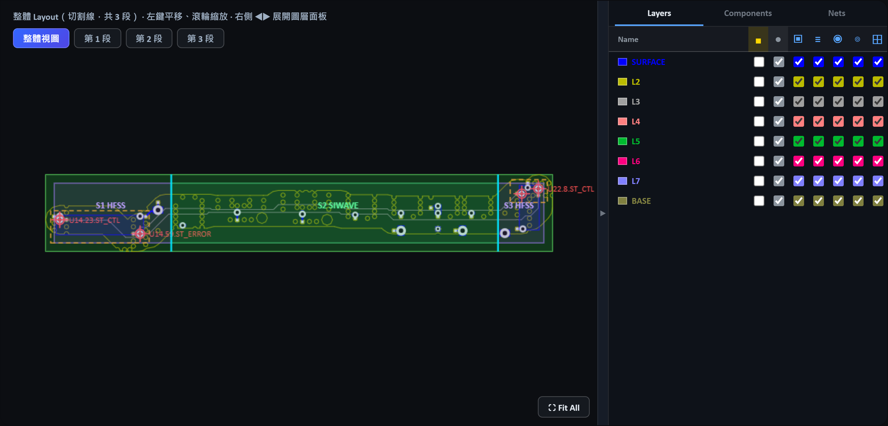

整體視圖上的青色直線是切割位置，各段標籤直接寫出該段要用的求解器，
不必回到混合求解面板對照。

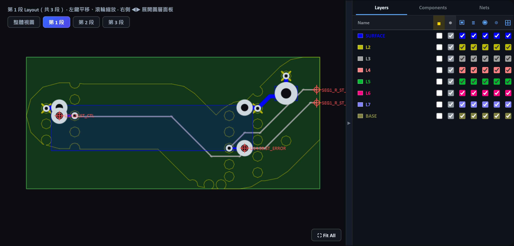

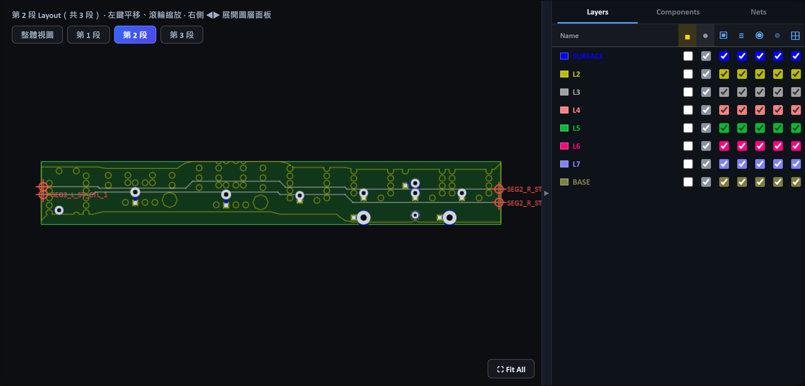

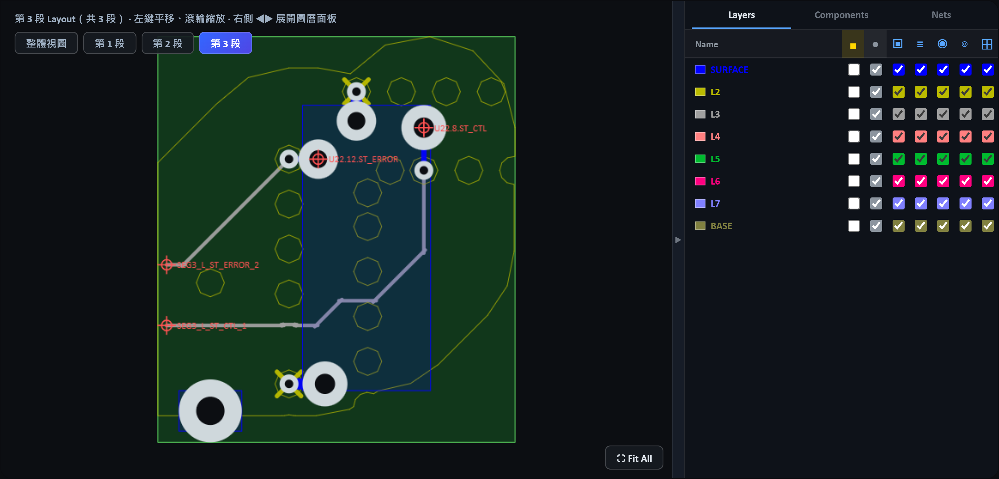

中間段的左右兩側都有切面 Port（`SEG2_L_*` 與 `SEG2_R_*`），頭尾兩段則是
一側切面 Port、一側元件端 Port。串接時就是靠這組命名自動對接。

### 不分割，整片求解

分段是為了讓大通道分頭求解。但有兩種情況會想要整片解：**拿來當分段結果的
對照基準**，或**通道本來就小到不必切**。

在「N 段分割」面板按 **「不分割，整片求解」** 即可，不需要先分析切割位置。

- 整條通道當成「第 1 段」寫進 `segments.json`，並複製一份 `segment_1.aedb`。
- **不會建立任何切面 Port**，Port 完全來自〈設定 Port 與求解器〉建立的元件端
  Port。因此執行前必須已經有 Port，否則會直接擋下。
- 之後的排程求解、遠端求解包、S 參數與眼圖都照常使用——下游看到的就是一份
  只有一段的正常 `segments.json`。
- 串接階段是直通：只有一段就沒有切面，也沒有接線，那一段的 Touchstone 本身
  即為完整通道的結果。仍然會走完整的驗證與匯出流程，讓單段與多段的輸出格式
  一致。

> 想比較「分段串接」與「整片求解」的差異時，兩邊要用同一組求解設定與同一個
> 求解器，否則差異會混入求解器本身的落差而無法歸因。

### 排程求解與 Touchstone 匯出

分段完成後，`segments.json` 路徑會自動帶入。

1. 確認每一段 Layout 及切面 Port。
2. 可整批選擇 HFSS 3D Layout 或 SIwave，也可依每段複雜度使用「混合求解區域」逐段指定。
3. 按「開始排程模擬」，工具依序為每一段啟動獨立求解程序。
4. 完成後立即匯出 Touchstone，並將檔案路徑寫回 `segments.json`。
5. 介面會顯示各段「等待中、求解中、完成、失敗、已跳過」狀態及耗時。

#### 混合求解區域（逐段指定求解器）

每個 Segment 是一個獨立的求解區域，可個別指定求解器。工具會依該段的實際結構給建議，並附上複雜度、信心與判斷原因：

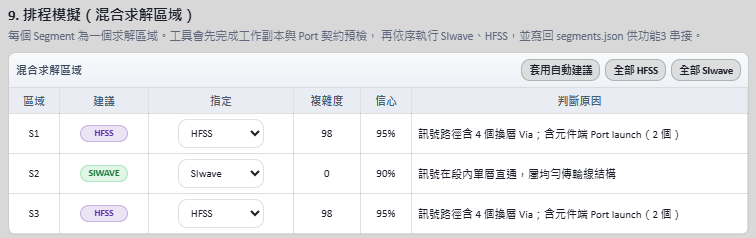

建議標準是**訊號導向**的——只看訊號路徑本身會不會產生 SIwave 平面波近似處理不好的三維效應：

- 訊號路徑上的**換層 Via** 數量。
- 是否含**元件端 Port launch**。
- 是否有明顯的參考不連續或跨越分割平面。

單純「板子層數多」或「附近參考 Via 密集」不會把一段推向 HFSS——那些不在訊號路徑上，SIwave 處理得很好。實務上像圖中 S2「訊號在段內單層直通、屬地勻傳輸線結構」這種段，用 SIwave 就足夠，把求解時間留給真正需要 HFSS 的 S1／S3。

指定結果會直接疊在「N 段分割」的 Layout 上，綠色為 SIwave、紫色為 HFSS，標籤同時顯示複雜度分數（見「N 段分割」 的〈切板顏色與輔助圖層〉附圖）。

也可用「套用自動建議」、「全部 HFSS」、「全部 SIwave」快速切換。若把某段從建議改成另一個求解器，介面會顯示警示但**不會阻擋**——是否接受該段的近似誤差由使用者決定。

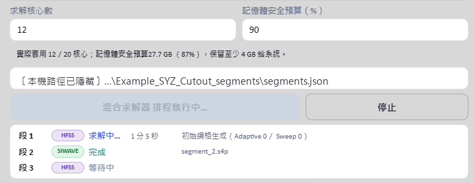

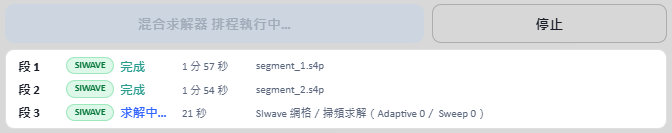

各段狀態與耗時會在執行期間持續更新，不必等整批跑完。完成的段會直接列出產出的
`.sNp` 檔名，求解中的段顯示目前階段與已耗時間。

每段使用獨立工作階段，可避免長時間共用同一 Desktop 所造成的記憶體累積與後續分段崩潰。單一分段失敗時，排程會釋放該工作階段，記錄錯誤後繼續下一段。

**網表連通性閘門**：SIwave 會在求解前先寫出 `.net` 網表。工具一偵測到該檔穩定就檢查連通性——若不同訊號網路落在同一導通區塊（代表被短路），會立刻終止該段，不必等整段掃頻跑完才發現 S 參數不可信。日誌會列出最短導通路徑與可疑的長距離元件。採用 Touchstone 前還有一次後備檢查。

按「停止」會終止目前分段對應的程序，尚未開始的分段標記為已跳過。

排程會拒絕下列資料：

- 找不到 `segments.json` 或分段 EDB。
- 舊版 `segments.json` 缺少 Port／幾何安全驗證欄位。
- 分段存在無 Reference Port、幾何違規或 Port 數量不一致。

### 遠端求解包（求解機不需安裝 Python）

本機跑不動、或想把長時間求解丟到工作站時，在入口勾選 **☐ 遠端求解包**，
就能把整批分段打包成一個資料夾，複製到求解機雙擊執行。

**求解機只需要裝 Ansys Electronics Desktop**（任何版本皆可，腳本會自行尋找），
不需要 Python，也不需要跟來源電腦同版本。

1. 完成 N 段分割（或指向既有的 `segments.json`）。
2. 在「遠端求解包」欄位指定一個**新的空資料夾**，按「匯出求解包」。
3. 把整個資料夾複製到求解機——**等複製完全結束再執行**，包內的 `ready.flag`
   就是給你確認用的。
4. 在求解機雙擊 `run_all.bat`。
5. 跑完把 `results` 資料夾複製回來，在「求解完的資料夾」欄位指定它，按「收回結果」。

收回時會驗證 Port 數、頻點與格式，通過才寫入 `segments.json`；之後串接與眼圖
都能直接使用。

**核心數**：用你在求解設定填的值，**不會被本機核心數夾住**——包是要拿去別台跑的。
SIwave 段寫進 `.exec` 的 `SetNumCpus`，HFSS 段以 `ansysedt` 的 `-batchoptions` 傳入。

**HPC 授權不必事先設定**。SIwave 段先試 Pack，取不到足夠授權會自動改用
Workgroup 重試；HFSS 段一律用 `HPCLicenseType=Auto`，讓 AEDT 自己挑當下拿得到的
授權。同一包在兩種機器上都跑得完，不必為此重新打包。

> 實測寫死 `Pack` 反而會讓 AEDT 落到 Parametric（訊息寫「the 4 cores included
> with HPC Parametric context」）而只拿到 4 核，所以這個值不開放選擇。

**怎麼確認真的拿到你要的核心數**：核心數不會出現在 AEDT 訊息裡。要看授權——
HFSS 求解本身內含 4 核，超出的每一核吃一張 `anshpc`：

```
12 核  →  8 張 anshpc          36 核  →  32 張 anshpc
```

用 Ansys License Management Center 看 `anshpc` 的用量最準；求解跑完後，Profile
也會記下 `HPC Type` 與 `Cores`。**打包前先確認求解機的授權夠用**，否則 AEDT 會
默默降級成拿得到的核心數。

**HFSS 段有兩個同名的 log，別看錯**：

| 位置 | 內容 |
|---|---|
| 包**根目錄**的 `segment_N_hfss.log` | AEDT 自己的訊息：版本、警告、授權不足、網格階段耗時。 |
| `logs` 底下的 `segment_N_hfss.log` | 本工具寫的進度：開到哪個 design、Port 數對不對。 |

授權不足時求解包會直接寫出「這台機器只有 N 核可用，但要求了 M 核」與建議值，
不會只丟一句「找不到 Touchstone」讓人對著幾何和 Port 找一個不在那裡的問題。

> **HFSS 段的網格階段幾乎是單執行緒的**，實測有效核心數約 1。這段期間 log 不會
> 增長、CPU 也只吃一顆，看起來像當掉——那是正常的，核心數要進到矩陣求解才展開。
> 大型分段停在這裡數十分鐘並不罕見，先別急著中斷。

### 電路串接

在「本工具分段結果」模式：

1. N 段分割完成後，即可按「預覽接線」；此時不需要等待求解或 Touchstone。
2. 檢查各分段方塊、切面連線及 Stripline 短路節點。
3. 所有分段求解完成後，按「執行電路串接」。
4. 工具依 `segments.json` 的 `cut_pairs` 對接相鄰分段。
5. Stripline 上、下參考 Port 先短路成同一節點，再進行跨段連接。
6. 完成後輸出串接後 Touchstone。

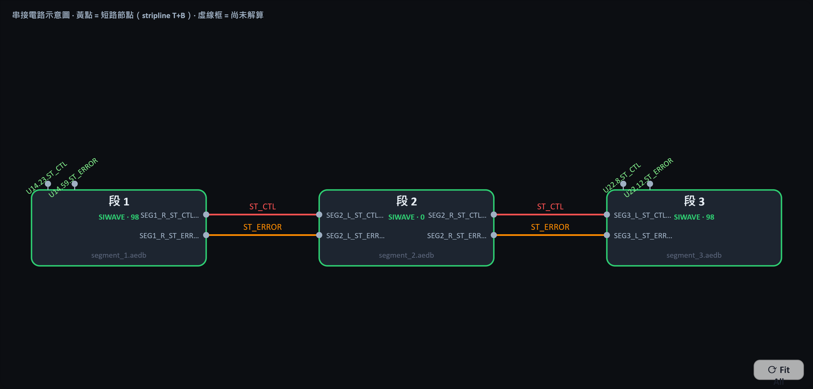

圖中的虛線框代表尚未解算的分段；黃色節點代表需要短路的 Stripline 上、下參考 Port。
每個分段方塊上會標出該段實際使用的求解器與 Port 數（例如 `SIWAVE · 98`），
方塊底下是來源 `.aedb` 檔名；段與段之間的連線標的是對接的網路名稱。
頭尾兩段向外伸出的節點就是最終通道的外部 Port，標籤即元件端 Port 名稱。

**外部 Port 預檢**：串接前會先確認頭尾兩段有可對外的元件端 Port。若通道沒有經過裁切流程（或〈設定 Port 與求解器〉）建立元件端 Port，所有 Port 都會在串接時被內部對接掉，最終網路的外部 Port 數為零。這種情況現在會在串接前就明確擋下並說明原因，不會等到 scikit-rf 內部拋出索引型別錯誤才失敗。

### S 參數檢視

串接完成後切到「S 參數」分頁，直接看串接後通道的頻率響應。工具由 **Port 名稱自動判斷**哪些是近端、哪些是遠端，以及哪些 Port 構成差動對，不需要手動指定配對。

- **模式**：可切換**單端模式**與**差動模式**。
  - 單端：IL 為近端至遠端，RL 為近端反射。
  - 差動：以 scikit-rf 做混合模式轉換，`Sdd21` 為差模插入損耗、`Sdd11` 為差模回波損耗。
- **曲線**：可分別開關**插入損耗**、**回波損耗**、**NEXT 近端串音**、**FEXT 遠端串音**。串音曲線只在辨識出兩組以上獨立通道時才會有內容。

量測數值置於上方橫列，下方為全寬圖表。

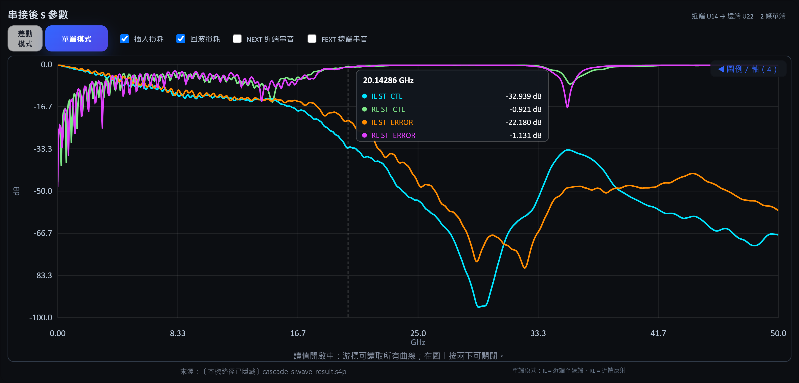

在圖上點一下開啟游標，該頻率的每一條曲線數值會一併列出；再連按兩下關閉。
右上角顯示目前的通道方向與 Port 組成（例如「近端 U14 → 遠端 U22｜2 條單端」），
圖下方會標出資料來源的 Touchstone，方便回溯是哪一次串接的結果。

### 眼圖（QuickEye）

直接以串接後的 Touchstone 求解眼圖，不需要先輸出 Circuit 專案。

1. 確認模式（單端／差動）、資料速率與 Port 配對。
2. 資料速率預設 1 Gbps；Tr／Tf 依 `Tr = 0.2 × UI` 隨速率自動更新，也可自行覆寫。
3. 按「執行眼圖」。求解於背景進行，完成後自動切到「眼圖」分頁。

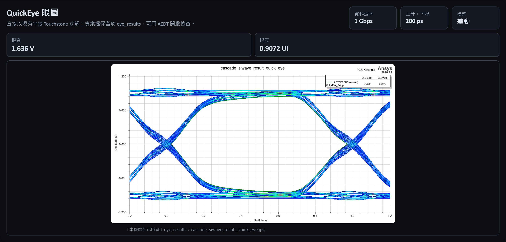

眼圖分頁顯示 AEDT 產出的眼圖，以及**眼高**與**眼寬**兩項量測。眼圖完全閉合時 AEDT 算不出這兩個值，會顯示「眼圖閉合，無法量測」——那是有效結論，不是錯誤。

右上角三個方塊是這次求解實際用的條件（資料速率、上升／下降時間、單端或差動），
截圖進報告時不必另外註記。

Circuit 專案與眼圖圖片會保留在 Touchstone 同層的 `eye_results` 資料夾，結果異常時可用 AEDT 開啟檢查。

眼圖求解與分段排程、完整板對照互斥，一次只會有一個 AEDT 工作執行，避免記憶體疊加。

**關於 Tr／Tf 的取法**：`Tr = 0.35 / BW` 是「已知系統 −3dB 頻寬、推算其上升時間」的換算式；而這裡的 Tr／Tf 是發送端驅動器的邊緣速率，屬元件規格。若把 BW 代成 Nyquist，會得到 70% UI，遠慢於真實驅動器，訊號在發送端就先被濾過一輪，眼圖閉合將混入驅動器因素而無法歸因於通道。因此採業界慣用的 UI 比例。

## 直接匯入既有通道進行分段

如果輸入檔案已經是裁切後的通道，不需要再跑一次裁切：

1. 在入口畫面勾選「載入電路板」，但**兩個子項都不勾**。
2. 載入 `.aedb`、`.brd` 或 `.tgz`。
3. 選擇訊號 Net 與參考 Net。
4. 需要時用〈設定 Port 與求解器〉建立元件端 Port 與 Setup、用〈疊構更換〉或〈背鑽〉調整，再執行 Layout 清理或直接進入 N 段分割。

> 舊版在「載入電路板」面板上另有一個「直接匯入分段」勾選框，現已移除——入口畫面
> 已經表達了同一件事，兩處各勾一次是重複的。

注意事項：

- 這個模式**本身**不會建立元件端 Port 或 HFSS Setup；需要時請勾入口的「設定 Port 與求解器」。
- 若後續要排程求解與串接，來源 EDB 必須具有正確的元件端 Port 與 HFSS Setup，否則串接會因為沒有外部 Port 而失敗。
- 這個模式仍會在 N 段分割時建立切面 Port 及安全驗證資料。

## 使用外部 Touchstone 檔案串接

不經由本工具分段取得的 S 參數，也可在「外部 S 參數檔」模式串接：

1. 按「加入 S 參數檔（可多選）」載入至少兩個 Touchstone 檔案。
2. 工具解析每個檔案的 Port 數及 Port 名稱。
3. 按「自動建議接線」：
   - 若 Port 名稱符合 `SEGk_R/L_net_i[_T/B]` 慣例，會自動配對相鄰分段。
   - 同一分段的 `T/B` Port 會建議為短路群組。
   - 一般檔案則嘗試配對相鄰檔案中的完全同名 Port。
4. 自動建議不足時，使用「新增接線」逐一選擇兩端 Port。
5. Stripline 或其他需要共節點的 Port，使用「新增短路群組」。
6. 先按「預覽接線」確認，再按「執行串接」。

串接前請確認所有 Touchstone：

- 頻率範圍及頻點相容。
- 參考阻抗及 Port 定義一致。
- Port 名稱可辨識；若檔頭沒有 Port 名稱，工具只能以 `Port1`、`Port2` 等替代。
- 至少有兩個 Port 不會被接線用掉，否則串接後沒有外部 Port。

## 一鍵 HTML 報告

把分析過程中各個結果畫面存成快照，加上公司品牌與結論，輸出成**單一自包含
HTML**——圖片全部以 data URI 內嵌，寄出去只有一個檔，對方不必解壓縮、不必連網、
不必安裝任何東西就能開。

在入口畫面的「結果」組勾選 **☐ 一鍵 HTML 報告**（預設不勾）即可啟用。

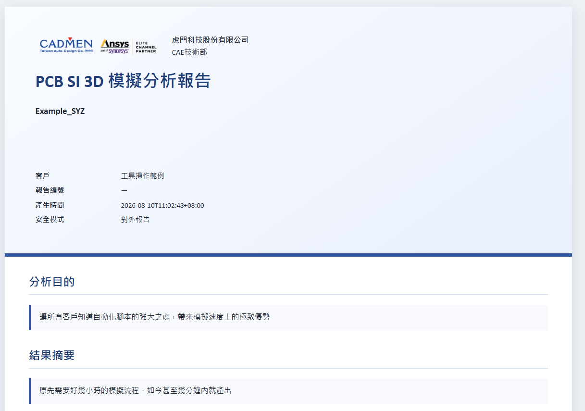

封面帶公司名稱、部門與 Logo，並列出客戶、報告編號、產生時間與安全模式；
下方接著是你在報告中心填的分析目的與結果摘要。


### 保存快照

勾選後，各結果分頁的分頁列右側會出現 **📷 更新報告快照**。它擷取的是**目前這個
分頁的畫面**，包含你現在的縮放、平移、圖層開關與曲線選擇——所以先把畫面調成想
呈現的樣子，再按快照。

| 目前分頁 | 存成的快照類別 |
|---|---|
| 完整 Layout | `full`（章節：原始電路板與目標通道） |
| 裁切後 Layout | `cut`（章節：裁切後 Layout） |
| 清理前後對比 | `cleanup`（章節：Layout 清理比較） |
| 分段（整體視圖） | `segments`（章節：N 段分割） |
| 分段（第 N 段） | `segments-N`，各段獨立保存 |
| 串接電路 | `schematic`（章節：電路串接） |
| S 參數 | `sparam`（章節：S 參數結果） |
| 眼圖 | `eye`（章節：眼圖結果） |

按下後只需要填兩個欄位：

- **工程狀態**：僅供展示／通過／注意／失敗。報告裡會以標籤呈現，是給讀者的判讀
  結論，不是工具自己算出來的——工具不會替你判定合格與否。
- **圖說／工程備註**：這張圖要證明什麼。可以先留空，稍後在報告中心補。

> **解析度固定為最高品質（3840 px 級）**，沒有選項。報告裡的圖是拿來看細節的，
> 沒有人會刻意要低解析度的版本；多一個選項只是多一個選錯、事後才發現要重拍的
> 機會。

**同一個畫面最多保留 5 個版本。** 第 6 次會先問你是否移除最舊的那一版。多版本的
用意是「改了設計再拍一次，兩版留著對照」，報告只會採用你指定的那一版（預設是最新
的一版）。

**來源資料變更時，相關快照會自動標記為「過期」。** 例如重新載入完整板、重跑裁切、
重新分段或重新串接，對應類別的快照就會被打上過期標記與原因。快照本身不會被刪除
——報告中心會把它標出來，讓你決定是重拍還是照舊採用。

### 報告裡的每張圖長什麼樣

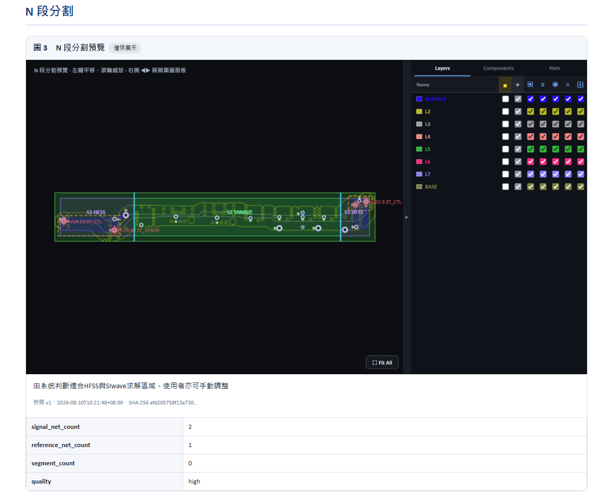

每張圖都會自動編號（圖 1、圖 2…）並附上：

- **工程狀態標籤** —— 你在存快照時選的「僅供展示／通過／注意／失敗」。
- **圖說** —— 你寫的那段工程備註。
- **可稽核資訊** —— 快照版本、產生時間，以及該張圖的 **SHA-256**。
  同一張圖有沒有被換過，比對雜湊就知道，不必憑印象。
- **來源資料表** —— 訊號網路數、參考網路數、分段數、快照品質等，
  隨快照一起記下來，事後不必回頭猜這張圖是在什麼設定下拍的。

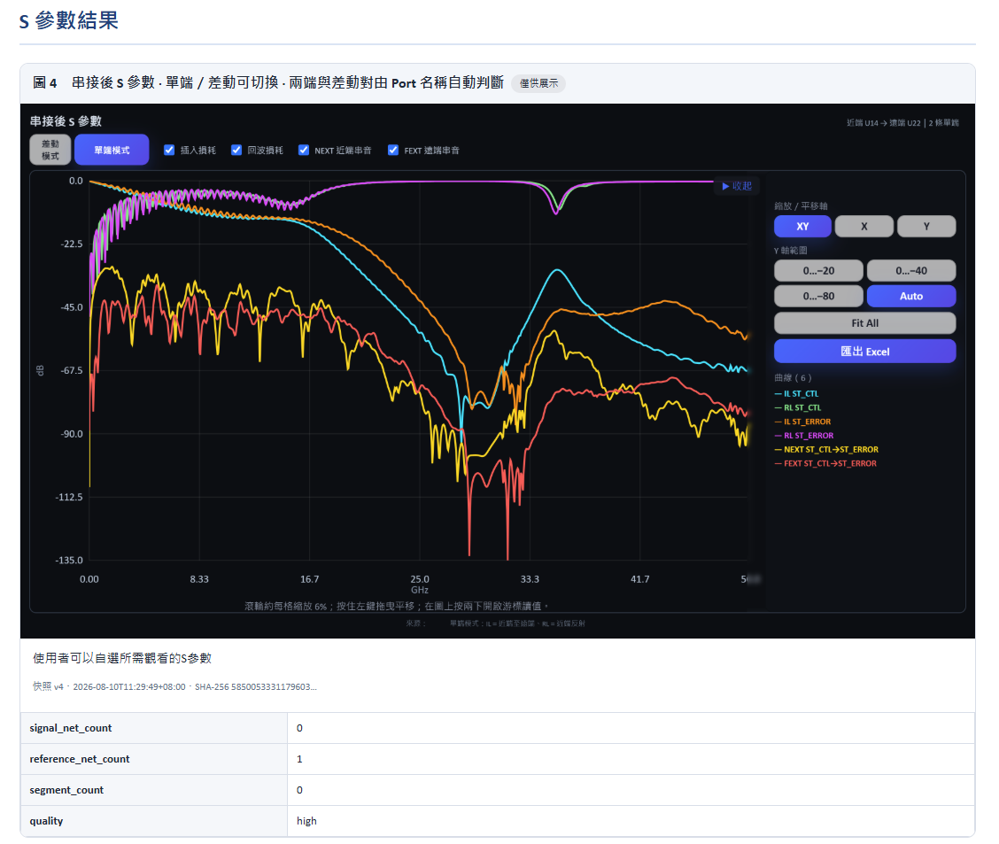

圖是「畫面當下的樣子」，所以勾了哪幾條曲線、Y 軸範圍設多少、游標開著沒有，
全部照實呈現。這也是為什麼要先把畫面調成想呈現的樣子再按快照。

注意這張圖下方的「來源」是空的 —— 因為報告以**對外報告**模式產生，
本機路徑被自動隱藏了。改用內部工程報告模式就會完整保留。

### 報告工作區放在哪

工作區跟著案子走，不會落到家目錄：

```
輸入是 …\MyBoard.aedb        →   …\MyBoard_report_workspace\
在欄位指定目錄 …\jobs\        →   …\jobs\report_workspace\
```

快照動輒上百 MB，放家目錄一來占系統碟，二來換一片板子做另一份報告時兩份會混在
同一個目錄裡。放在板子旁邊則是「一個案子一個資料夾」，備份與交付都跟著案子走。

工作區結構：

| 項目 | 內容 |
|---|---|
| `report_manifest.json` | 快照清單、版本、章節、品牌與設定；工作區的索引。 |
| `snapshots` | 各版本快照圖，檔名為 `<類別>_v<版本>_<8碼>.png`。 |
| `assets` | 公司 Logo、浮水印圖片等。 |
| `exports` | 產生出來的 HTML 報告。 |

### 報告中心

從功能表「檢視 → 一鍵 HTML 報告中心」，或分頁列的「報告」進入。

**快照管理**：依類別分組列出所有版本，可切換要採用哪一版、改章節歸屬、改工程狀態
與圖說，或取消勾選「加入報告」把某一版排除。

**品牌**：公司名稱、部門、專案名稱、對象名稱、報告編號與公司 Logo。可存成預設值，
下一個案子直接沿用。

**報告章節**：勾選要出現哪些章節，順序固定如下——原始電路板與目標通道、裁切後
Layout、Layout 清理比較、N 段分割、求解狀態與設定、電路串接、S 參數結果、眼圖
結果、模擬結果、補充證據。沒有對應快照的章節會自動略過。

**驗收規格**：頻率範圍、插入損耗門檻、回波損耗門檻、眼高／眼寬門檻。純文字欄位，
會原樣列在報告的驗收規格表中（例如「≥ −12 dB @ 28 GHz」）。工具**不會**拿它去自動
比對數據判定通過與否。

**文字段落**：分析目的、摘要、結論、建議事項。

**語言**：繁體中文、英文，或雙語對照。

**安全模式**：
- **對外報告**（預設）：報告中出現的本機路徑會被替換成「已隱藏本機路徑」。
- **內部工程報告**：完整保留路徑，方便自己人回溯檔案位置。

**浮水印**：可選文字、圖片或兩者；可套用到全部、只有圖片，或指定章節；可調整
透明度、角度、大小與排列（平鋪／置中）。

### 產生報告

按「產生 HTML 報告」，預設輸出到工作區的 `exports`，檔名為：

```
<專案名稱>_分析報告_<YYYYMMDD>_<HHMM>.html
```

也可以自行指定輸出路徑。報告產生後會記錄 SHA-256，並附在工作區的匯出清單裡。

報告本身內建「列印／另存 PDF」與「全螢幕」兩個按鈕，圖片可點擊放大。要交 PDF 的
話用瀏覽器列印即可，不需要另外的轉檔工具。

> 報告工作區會裝入實際的分析內容，**不應該提交進版本庫**；本專案的 CI 也直接
> 禁止追蹤 `report_workspace` 與 `report_manifest.json`。

## 輸出檔案說明

| 輸出 | 說明 |
|---|---|
| `*_Cutout.aedb` | 裁切流程的、元件端 Port、HFSS Setup 與 Sweep 結果。 |
| `*_stackup.aedb` | 疊構更換後的新 EDB；原檔不覆寫。 |
| `*_stackup_change_report.json` | 疊構更換前後的逐層與材料狀態。 |
| `*_backdrill.aedb` | 寫入背鑽後的新 EDB；原檔不覆寫。 |
| `*_backdrill_report.json` | 每顆 Via 的連接層、背鑽側、鑽深、殘樁長度、共振頻率及讀回驗證結果。 |
| 清理後 `.aedb` | 使用者指定的新 EDB；原檔不覆寫。 |
| `*_cleanup_report.json` | Layout 清理條件、候選、刪除數量與安全保留資訊。 |
| `segment_1.aedb`～`segment_N.aedb` | N 段實際 Layout 與切面 Port。 |
| `segments.json` | 分段路徑、Port、短路群組、切面配對、逐段求解器、安全驗證及 Touchstone 路徑。 |
| `segment_1.sNp`～`segment_N.sNp` | 各段排程求解後輸出的 Touchstone；副檔名依 Port 數決定。 |
| `cascade_result.sNp` | 完整通道串接結果；副檔名依最終 Port 數決定。 |
| `*_report_workspace` | 報告工作區：`report_manifest.json` 索引、各版本快照、品牌素材與產出的 HTML。 |
| `*_分析報告_*.html` | 單一自包含 HTML 報告；圖片以 data URI 內嵌，可直接寄送。 |

建議保留 `segments.json` 與所有分段 EDB／Touchstone 的相對位置，不要只移動單一檔案。

## 介面檢視操作

- Layout 區左鍵拖曳：平移。
- 滑鼠滾輪：縮放。
- 「Fit All」：重新縮放至全部 Layout。
- 右側箭頭：展開／收合 Layer 面板。
- Layer、Components、Nets 頁籤：控制顯示項目。
- 「完整 Layout」：原始輸入板。
- 「裁切後 Layout」：裁切、疊構更換、背鑽或清理後目前的工作檔。
- 「清理對比」：清理前後及差異高亮。
- 「N 段分割」：整體切割位置或各段 Layout；「安全疊圖」與「求解區域」可分別開關。
- 「串接電路」：分段及 Port 接線示意。
- 「S 參數」：串接後通道的 IL／RL／NEXT／FEXT，可切換單端與差動。
- 「眼圖」：QuickEye 眼圖與眼高、眼寬。
- 底部系統日誌：顯示 PyEDB、Port、Setup、疊構、背鑽、分段、排程、串接與眼圖訊息，可複製或清除。

## 常見問題

### 啟動時顯示 8020 埠已被占用

先查出實際占用程序：

```powershell
Get-NetTCPConnection -State Listen -LocalPort 8020 |
  Select-Object LocalPort, OwningProcess
```

確認 PID 確實是先前啟動的本工具後，再停止：

```powershell
Stop-Process -Id <PID>
```

不要在未確認程序用途前直接終止 PID。

### 後端在 60 秒內沒有就緒

檢查後端 PowerShell 視窗中的第一個錯誤，常見原因包括：

- AEDT 2026.1 或 Ansys Python API 不可用。
- Python 版本不支援。
- 套件下載失敗。
- EDB RPC／AEDT 殘留程序占用資源。
- 8020 埠已被其他程序使用。

### 按鈕呈灰色

| 按鈕 | 啟用條件 |
|---|---|
| 執行裁切（並建立 Port） | 已選擇至少一個訊號 Net 及一個參考 Net。 |
| 建立 Port 與求解器設定 | 已載入 EDB、已選訊號與參考 Net，且已勾選端點元件。 |
| 套用疊構並另存 | 已完成疊構差異分析，且指定新的輸出路徑；會刪層時需先確認。 |
| 寫入背鑽並另存 | 已完成殘樁分析、至少勾選一顆 Via，且指定新的輸出路徑。 |
| Layout 清理 | 已完成裁切，或直接載入既有通道。 |
| 執行清理 | 已完成清理候選分析、候選數大於 0，且指定新的輸出路徑。 |
| 執行 N 段分割 | 已完成切割位置分析。 |
| 開始排程模擬 | 已有有效的 `segments.json`，且目前沒有排程執行中。 |
| 執行電路串接 | 本工具模式需所有分段已有 Touchstone；外部模式需至少一組接線。 |

### 大型板裁切或 Port 建立很久

大型 EDB 需要讀取大量 Primitive、Padstack、元件及 Stackup。ConvexHull 預檢、正式裁切、重新開啟 EDB、Reference 搜尋與預覽擷取都可能需要數分鐘至數十分鐘。請觀察載入遮罩的階段、進度、處理數量及系統日誌，不要只依瀏覽器是否更新判斷當機。

### 裁切範圍包進太多無關的 Via 與銅箔

先確認「框選範圍形狀」是不是**凸包（ConvexHull）**。凸包對斜向或彎折通道一定會多包一塊——內側被一條直線弦切過，弦與走線之間的空白全部進來。改選**貼合走線（Conforming）**即可，擴張距離不用動。

### 選了貼合走線，實際卻變成凸包

代表預檢發現貼合外框沒有包住全部訊號幾何。原因是通道各段在擴張後仍未連成一片，PyEDB 的聯集只回傳了面積最大的那一塊。做法：把「向外擴張距離」加大，直到各段連起來；日誌會列出落在外框之外的頂點座標範圍，可據此判斷是哪一段脫節。

也要確認選取的訊號 Net 是否包含了與主通道完全分離的網路——那種情況本來就不該用同一個裁切範圍。

### 選擇某個外框形狀，結果卻是別的

查看系統日誌中的：

- 要求外框。
- 預檢結果（含貼合外框的訊號覆蓋檢查）。
- 實際外框。
- 回退原因。

回退順序是貼合→凸包→矩形，只有預檢明確失敗或外框無效時才會發生；介面會顯示「上次實際裁切形狀」。

### 分段分析顯示切割位置不合法

不合法通常代表切面靠近 Via／Padstack，未完整穿過走線束，或切面與走線角度不佳。不要直接忽略警告執行；建議調整分段數、清理 Layout 或重新選取真正的通道訊號 Net 後再分析。

### 排程顯示 Port 數量異常或 Design Validation 失敗

先停止排程，檢查各段 Layout 及 `segments.json`。新版流程會在分段輸出前檢查：

- 每一條切面訊號是否都有 Port。
- 每個 Port 是否有 Reference。
- 繼承 Port 與切面 Port 數量是否一致。
- 訊號幾何是否位於正確分段。

若 `segments.json` 是舊版工具產生，排程會拒絕求解；請使用目前版本重新執行 N 段分割。

### 電路串接失敗，訊息提到索引型別

代表串接後的網路沒有剩下任何外部 Port——通道頭尾沒有元件端 Port，所有 Port 都被內部對接掉了。原因通常是這份 EDB 沒有經過裁切流程，或是載入既有通道後沒有建立元件端 Port。用〈**設定 Port 與求解器**〉補建元件端 Port 後再分段與串接即可。目前版本會在串接前就擋下並說明原因。

### HFSS 求解結果在高頻反射異常大

先確認**自適應方式**。若使用單一頻率自適應而該頻率低於掃頻上限，高頻網格會相對過粗而產生數值反射，看起來像嚴重的阻抗不連續。判別方法是同時看耗損：若 HFSS 與 SIwave 的耗損接近、只有反射差很多，那就是網格問題而非物理現象。改用**寬頻（Ansys BKM 建議）**模式重跑即可。

### 背鑽分析算出的殘樁明顯太長

檢查該顆 Via 的「連接層」欄位是否漏掉了實際有走線或焊墊的層。若通道尚未包含元件（例如只匯入了裁切後的走線段），BGA 焊墊不存在，工具就無從得知訊號由該層進入。此時請確認來源 EDB 含有元件，或手動取消勾選該顆 Via。**不要在連接層明顯不對的情況下直接寫入背鑽**——鑽過頭會把訊號切斷。

### 疊構更換後走線或參考平面消失

新疊構刪掉了原本存在的層。差異分析會把「移除」的層列出並要求確認；若已經套用，請用原始 EDB 重新開始，並修改疊構檔保留該層。

### 模擬結果接近全反射

優先檢查：

1. 元件端 Port 是否位於正確訊號 Pin。
2. Solder Ball／BGA Port 是否有正確 Reference，且負端落在參考 Via 中心。
3. Stripline 是否建立上下兩個參考 Port，且串接時被短路成同一節點。
4. 切面 Port 是否垂直於走線、沒有切到 Via／Pad。
5. 每段的參考平面在切面附近是否完整。
6. Touchstone Port 順序、命名及接線是否正確。

若排程日誌出現「訊號短路」而中止該段，代表 SIwave 網表把兩條訊號併進同一導通區塊，日誌會列出可疑的長距離元件；此時 S 參數必然不可信，應先解決該問題再求解。

### 眼圖完全閉合

先確認這是不是通道本身的物理結果，而不是設定問題：把資料速率降到 1～2 Gbps 再跑一次。若低速率下眼圖張開，表示設定正確，閉合是通道在該速率下的真實表現。

判斷可用速率的依據是通道的插入損耗：Nyquist 頻率（資料速率的一半）處若已衰減超過約 10 dB，無等化下大多無法開眼。本工具目前不提供 CTLE／FFE 等化模擬。

### 眼高、眼寬顯示「眼圖閉合，無法量測」

眼圖完全閉合時 AEDT 算不出眼高與眼寬，回傳 NaN。工具如實標示而不填 0，避免誤讀成「有量到但為零」。處理方式同上一項。

## 使用限制與建議

- 本工具目前以 Windows 與 AEDT 2026.1 為目標環境。
- EDB、AEDT 與 Touchstone 處理皆在本機進行；套件安裝階段需要網路。
- 排程採依序求解，不會同時啟動多個求解程序，以控制授權及記憶體需求。
- 混合求解的建議只看訊號路徑的三維效應，屬工程判斷輔助，不是驗證結論；覆寫建議不會被阻擋，誤差由使用者評估。
- 背鑽的共振頻率與介電常數為指示值（Dk 約 ±10%），不作為規格依據；寫入前務必確認「連接層」判斷正確。
- Layout 清理屬於幾何／電磁影響範圍判斷，不能取代工程驗證。正式專案應比較清理前後的 S 參數，確認誤差符合需求。
- 分段串接的準確性取決於 Port 定義、參考結構、切面品質及各段頻率資料的一致性。
- 執行裁切、疊構更換、背鑽、清理與分段前，建議備份原始 EDB；所有輸出請使用新路徑。
- 請勿將客戶 EDB、AEDT 專案、授權資訊或含機密路徑的日誌提交至公開 GitHub Repository。

---

此工具由虎門科技資深技術工程師 Jeff Hong 洪敬傑提供
